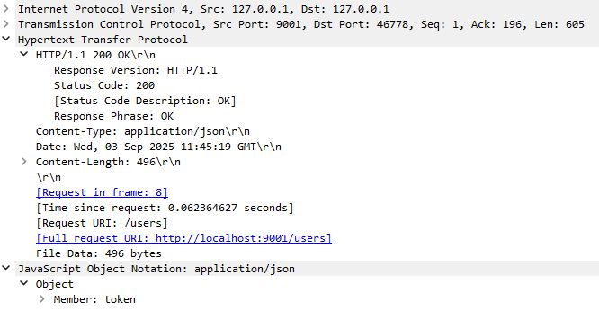
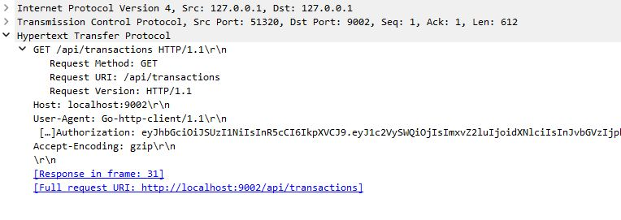

# 12.1. Домашнее задание к занятию «Архитектура современных веб-сервисов». - Андрей Смирнов.

Пришлите ответы на вопросы в личном кабинете на сайте [netology.ru](https://netology.ru).

## Задание «Карта взаимодействия»

### Описание

Вам попало в руки приложение, состоящее из нескольких сервисов, и клиент к нему. Ваша задача — используя Wireshark, построить карту взаимодействия между сервисами в рамках запросов, которые отправляет клиент. Нужно проанализировать ответы.

В каталоге [assets](assets) даны 4 сервера (`server-1/4`) под платформы:

1. *.bin — Linux.
2. *.exe — Windows.
3. i*.bin — macOS.

А также клиент к ним (`client`):

1. *.bin — Linux.
2. *.exe — Windows.
3. i*.bin — macOS.

### Этапы выполнения

1. Скачайте серверы для вашей платформы. Не забудьте проверить любые скачиваемые файлы через VirusTotal.
2. Скачайте каталоги с ключами **[`keys1`](assets/keys1)** и **[`keys2`](assets/keys2)** и разместите их в том же каталоге, что и скачанные в п.1 серверы.
3. Запустите по порядку серверы от 1 до 4. Они стартуют на портах 9001–9004 соответственно.
4. Запустите Wireshark в режиме отслеживания loopback (`Loopback: lo`).
5. Запустите клиента, проверяя, что клиент выводит ответ в том виде, как показано ниже. Часть данных может отличаться.


```json
{
  "transactions": [
    {
      "id": 1,
      "userId": 999,
      "category": "auto",
      "amount": 1000000,
      "created": 1613389415
    }
  ],
  "categoryStats": {
    "auto": 1000000
  }
}
```

**Примечание**. Вы не сможете скачать сами каталоги, если не умеете пользоваться Git, поэтому аккуратно скачайте файлы ключей и положите их в соответствующие каталоги, которые создаёте на своём компьютере. У вас должна получиться структура:

- keys1/
  - public.key
  - private.key
- keys2/
  - public.key
- client-x64.bin (либо другой для вашей платформы)
- server1-x64.bin (либо другой для вашей платформы)
- server2-x64.bin (либо другой для вашей платформы)
- server3-x64.bin (либо другой для вашей платформы)
- server4-x64.bin (либо другой для вашей платформы)

Серверы и клиенты запускайте из командной строки.

### Решение задания

В качестве решения пришлите в формате ниже ответы на вопросы:
1. Каким образом проходит путь запросов от клиента: на какой сервис и через какие сервисы?
2. Какие запросы делаются на каждом этапе, и какие ответы на них приходят?

### Формат ответа

Обратите внимание: это формат, а не пример реального взаимодействия из вашего задания.

```text
1. Client --> Server 4 (запрос):

GET http://localhost:9004/authenticate
Content-Type: application/json

{
  "login": "root",
  "password": "secret"
}

2. Server 4 --> Server 3 (запрос):

GET http://localhost:9003/authenticate
Content-Type: application/json

{
  "login": "root",
  "password": "secret"
}

3. Server 3 --> Server 4 (ответ):

200 OK
Content-Type: application/json

{
  "transactions": [
    {
      "id": 1,
      "userId": 999,
      "category": "auto",
      "amount": 1000000,
      "created": 1613389415
    }
  ],
  "categoryStats": {
    "auto": 1000000
  }
}

3. Server 4 --> Client (ответ):

200 OK
Content-Type: application/json

{
  "transactions": [
    {
      "id": 1,
      "userId": 999,
      "category": "auto",
      "amount": 1000000,
      "created": 1613389415
    }
  ],
  "categoryStats": {
    "auto": 1000000
  }
}
```

----


### Ответ:

Результат запуска сервисов и клиента:


[Файл с дампом](./assets/12_1/12-1.pcapng)


Описание взаимодействия:

Клиент обращается на первый сервис с портом 9001, который проводит авторизацию (метод PUT/users, данные login=user, password=111111) и выдает токен:

Запрос клиента:


Ответ с токеном:





С полученным токеном клиент обращается на второй сервис (порт 9002), который видимо выполняет роль api-шлюза (метод GET /api/transactions HTTP/1.1). Он проверяет токен и перенаправляет запрос далее (на сервер 9003). По итогу пользователь получет ответ, содержащий обработанные данные.

Запрос пользователя:




Ответ с данными:


Сервер с портом 9003 скорее всего представляет собой некий обработчик он получает запрос от сервиса с портом 9002 (метод GET /api/transactions HTTP/1.1), запрашивает данные у сервиса с портом 9004, обрабатывает их и возвращает статистику по категориям. 


Запрос от сервиса с портом 9002:


Ответ со статистикой:


Сервис с портом 9004 похоже хранит и предоставляет обработчику с портом 9003 данные (метод GET /api/transactions HTTP/1.1) в виде списка транзакций.


Запрос от сервиса с портом 9003:


Ответ со списком транзакций:


То есть полная схема взаимодействия будет выглядеть так:

клиент --> сервис с портом 9001 (Аутентификация)

клиент --> api-шлюз с портом 9002 (Запрос с токеном)

api-шлюз с портом 9002 --> обработчик с портом 9003 (Запрос статистики)

обработчик с портом 9003 --> сервис с данными, порт 9004 (Запрос сырых данных)

сервис с данными, порт 9004 --> обработчик с портом 9003 (Возврат транзакций)

обработчик с портом 9003 --> api-шлюз 9002 (Возврат статистики)

api-шлюз с портом 9002 --> клиент (Итоговый ответ)


----


## Задание «Токен»

Это необязательное задание. Его невыполнение не влияет на получение зачёта по домашнему заданию.

### Задача

В рамках того же проекта из каталога [assets](assets) вам даны ключи. Они находятся в каталогах [`keys1`](assets/keys1) и [`keys2`](assets/keys2) соответственно. Ключи предназначены для `server1` и `server2` соответственно.

Используя полученную вами в первом задании схему взаимодействия, запросы и ответы на каждом этапе, попробуйте предположить, для чего используются эти ключи.

<details>
<summary>Несколько подсказок</summary>

1. Попробуйте сравнить содержимое каталогов `keys1` и `keys2`.
2. Попытайтесь подменить один или несколько ключей и посмотреть, на что это повлияет. Не забудьте перезапустить тот сервис, для которого вы поменяли ключ.
3. Возможно, часть передаваемых данных закодирована каким-то алгоритмом. Попробуйте декодировать её и посмотреть, есть ли данные, которые указывают на то, как использовались ключи.
</details>

### Решение задания

В качестве решения пришлите информацию:
1. Для чего и на каком этапе используется, если используется, каждый ключ из каталога `keys1`.
2. Для чего и на каком этапе используется, если используется, ключ из каталога `keys2`.
