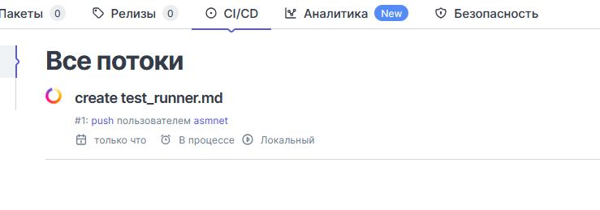
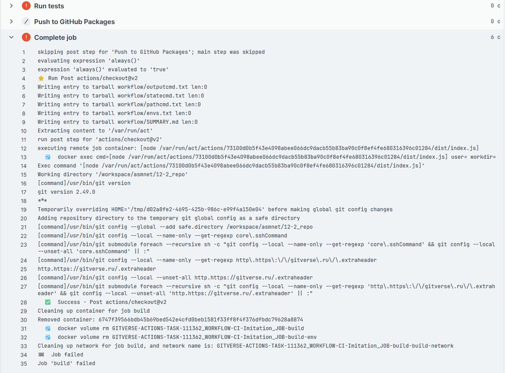

# 12.2. Домашнее задание к занятию «DevSecOps и AppSec. Часть 2». - Андрей Смирнов.

**Примерное время выполнения задания — 120 минут.**

Задавать вопросы можно через личный кабинет или на доске вопросов на сайте.

## Описание

Домашнее задание — лабораторная работа, в которой вы по инструкциям выполните действия.

Обратите внимание, что домашнее задание является необязательным. Его выполнение не повлияет на получение зачёта по модулю.

## Работа с GitVerse
В этом задании применяется сервис GitVerse — платформа для хостинга Git-репозиториев, контроля версий кода и совместной разработки, являющаяся одним из популярных решений для поддержки DevOps и DevSecOps.

Вы будете использовать заранее подготовленные материалы для упрощения настройки и развёртывания исследуемого приложения.

При выполнении задания вы получите навыки работы с инструментарием DevSecOps, которые будут полезны для вашего профессионального развития.

В данной работе предполагается самостоятельная и последующая работа с документацией.

### Этапы выполнения

**1. Создание учётной записи GitVerse**

1. Перейдите на домашнюю страницу [GitVerse](https://gitverse.ru/) и нажмите на **Войти** или **Начать работу**:

2. Нажмите на **Войти**:

3. Нажмите на **Зарегистрироваться**:

4. Введите свой email, нажмите на **Подтвердить** (отправить письмо с кодом) и следуйте дальнейшим инструкциям для заведения учётной записи: 

В качестве способа Дополнительной защиты выберите двухфакторную аутентификацию (по одноразовому коду).

6. Далее выберите предпочтительный почтовый ящик для получения уведомлений от сервера и имя пользователя.


----
**2. Создание репозитория с нуля**

При необходимости можно создать репозиторий с нуля, для этого необходимо нажать на кнопку **Добавить**, **Новый репозиторий**


Обязательной информацией для создания репозитория является имя, а также видимость: публичный,приватный. Однако рекомендуется также инициализировать репозиторий с файлами README (отображает информацию на странице репозитория, формат md) и .gitignore (перечисляются файлы, которые гит должен игнорировать — как правило системные и служебные файлы, используемые в работе)

----

**3. Импорт учебного проекта**

Для добавления учебного проекта в ваш репозиторий необходимо:

1. На верхней панели элементов нажмите на **+ Добавить**, **Импорт репозитория**


2. Затем выберите сервис, из которого добавляется репозиторий (github)
3. В поле **URL для импорта** укажите адрес:  `https://github.com/netology-code/ib-devsecops-app.git`(при необходимости обновите ссылку)
4. В поле **Название репозитория** задайте имя репозитория. Остальные поля опциональны и не требует заполнения.
5. Далее нажмите на кнопку **Импортировать репозиторий** — в вашем Git-аккаунте появится копия учебного проекта.


Учебный проект состоит из типового приложения nodejs и конфигурационных файлов, задающих процесс сборки.

----
### Процесс разработки ПО (CI/CD)
Процесс разработки ПО состоит из
процессов интеграции ПО (Continuous Integration, CI) и процессов развёртывания ПО (Continuous Deployment, CD) (подробнее см. [здесь](https://ru.wikipedia.org/wiki/CI/CD)). 
Задачи, связанные с исполнением процессов разработки решаются с помощью раннеров
[**подробнее о раннерах!**](https://gitverse.ru/docs/knowledge-base/actions/runners/)

**4. Подключение локального раннера**

Скачать подходящий для платформы раннер можно по следующей ссылке: [**скачать**](https://gitverse.ru/docs/knowledge-base/actions/runners/#%D1%81%D1%81%D1%8B%D0%BB%D0%BA%D0%B8-%D0%B4%D0%BB%D1%8F-%D1%81%D0%BA%D0%B0%D1%87%D0%B8%D0%B2%D0%B0%D0%BD%D0%B8%D1%8F).

Для подключения раннера необходимо его связать с проектом — зарегистрировать. Для этого необходимо открыть настройки проекта (кнопка **Настройки**)


Выбрать вкладку Раннеры. Нажать на кнопку **Добавить раннер** и скопировать **сгенерированный токен**, который используется для подключения раннера к проекту.


Скачав бинарный файл раннера, сделайте его исполняемым и проверьте работу (проверка его работы выполняется запуском приложения раннера с ключом **-version**). 

Аргумент **register** вызывает интерактивный режим регистрации раннера, который интерактивно запросит требуемую для работы раннера информацию


Откройте вновь настройки проекта, на вкладке раннеры появится ваш раннер (в неактивном режиме)


Для того, чтобы раннер работал в «активном режиме», т.е. постоянно, получая инструкции от сервера, используется аргумент **daemon**.

----

**5. Построение пайплайна**

1. Пайплайн — это набор инструкций.

Пайплайн описывается в специальных конфигурационных файлах на языке разметки yaml, размещаемых в каталоге **.gitverse/workflows/**.

Для учебного проекта заданы две стадии: **build** и **deploy**, которые описаны в файле ci.yaml:

```
name: Study
on:
  workflow_dispatch:
  push:
    branches:
      - main
  pull_request:
    branches:
      - main
stages:
    - build-stage
    - deploy-stage

build:
    stage: build-stage
    script:
        - npm install
    artifacts:
        untracked: false
        when: on_success
        paths:
            - node_modules
            - package-lock.json

deploy:
    stage: deploy-stage 
    image: node
    script:
        - chmod +x deploy.sh
        - bash deploy.sh`
```        
На этапе **build** выполняется сборка и установка вашего приложения (команда **npm install**). 

На этапе **deploy** выполняется запуск вашего приложения c помощью следующего sh-скрипта:

```  
#! /bin/bash
# Ищем и останавливаем работающий процесс npm, проверяя файл, в котором записан номер процесса, когда процесс npm уже работает

if [ -f pidfile.txt ]; then
  PID=$(cat pidfile.txt)
  kill $PID
  rm pidfile.txt
else
  echo "pidfile.txt not found. No process to stop."
fi

# Запускаем процесс npm в фоновом режиме, сохраняя номер этого процесса в файл pidfile.txt
npm start > /dev/null 2>&1 & 
PID=$!
echo "Started npm start with PID: $PID"
echo $PID > pidfile.txt

# Далее можно добавлять команды для раннера, при необходимости

# При отсутствии проблем скрипт завершится с успехом	
exit 0
```  

**Важные указания при выполнении работы:**

1) Для работы локального раннера необходимо наличие установленного докер окружения и работы службы докера в фоне. Подробнее см. [здесь](https://gitverse.ru/docs/actions-conf/runners-uc/#%D1%83%D1%81%D1%82%D0%B0%D0%BD%D0%BE%D0%B2%D0%BA%D0%B0-docker-ubuntu).

2) Для демонстрации пайплайна можно воспользоваться преимуществами gitverse и использовать облачный раннер, запускать который не требуется (Подробнее см. [здесь](https://gitverse.ru/docs/actions-conf/cloud-runners-uc/)). В случае использования облачного раннера допускается использовать сборку произвольного проекта.

3) При отправке задания на проверку ответьте своими словами на следующие вопросы — это поможет закрепить изученный материал:
	- что такое раннер и для чего он используется?
	- каким образом можно управлять раннером?
	- перечислите возможные меры безопасности по управлению раннером?


----


### Ответ:

	- что такое раннер и для чего он используется?

Раннер — это специальная программа, которая подключается к системе CI/CD (в данном случае gitverse) и выполняет задания, описанные в файле .gitlab-ci.yml.


	- каким образом можно управлять раннером?

Управлять можно через настройки gitverse и команды на сервере. Раннер можно зарегистрировать (связать с проектом с помощью специальной команды и токена); назначить теги (например, тест, продакшн и т.п.); запускать, останавливать, перезапускать и выбирать режим запуска с помощью команд на машине, где он установлен.


	- перечислите возможные меры безопасности по управлению раннером?

Так как раннер выполняет любой код из проекта, необходимо обеспечить его безопасность, в этом могут помочь следующие меры:
1. Желательно использовать раннер на отдельном сервере, где нет других важных сервисов.
2. Запускать раннер лучше от пользователя с ограниченными правами, а не от рута.
3. Желательно разделять раннеры для продакшена и тестовой среды (например, с помощью тегов).
4. Наилучшем решением будет запуск раннера в отдельном контейнере Docker.
5. На хостовой машине с раннером необходимо грамотно настроить фаервол.


Демонстрация gitverse и раннера.


Регистрация раннера на хосте:


Запуск раннера:


Пуш после комита:




Все было сконфигурировано в соотвествии с мануалами, но похоже в самом проекте допущены ошибки. Сборка падает на этапе запуска тестов, скриншоты с ошибками:




