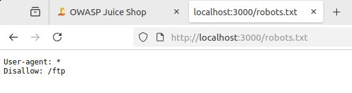

#12 Домашнее задание к занятию «OWASP Web. Часть 1». - Андрей Смирнов.

Пришлите ответы на вопросы в личном кабинете на сайте [netology.ru](https://netology.ru).

## Общая вводная

Вы рассмотрите проект [OWASP Juice Shop](https://owasp.org/www-project-juice-shop/), входящий в [Vulnerable Web Applications Directory](https://owasp.org/www-project-vulnerable-web-applications-directory/).

Для запуска иcпользуйте `docker-compose.yml`:

```yaml
version: '3.7'
services:
  shop:
    image: bkimminich/juice-shop
    ports:
      - 3000:3000
```

Приложение запустится на порту 3000. Вам нужно открыть `localhost:3000` в браузере и выбрать русский язык.


В боковой панели выберете «Помогите начать работу».


## Задание SQLi

### Этапы выполнения

1. Перейдите на страницу логина.


2. Используя ваши знания об SQLi, попробуйте войти в систему.

Часто при работе с СУБД возникают ошибки из-за некорректно составленных SQL-запросов, превышения лимита подключений, проблем с фиксацией транзакций и т. д. Эти ошибки пробрасываются из СУБД в само приложение, которое логгирует их, то есть записывает в лог-файл. Это позволяет программистам проводить анализ случившегося и быстрее исправлять ошибки. Часто для удобства на этапе разработки эти сообщения выводятся не только в лог-файл, но и дублируются в ответе, возвращаемом сервером по HTTP. Так они могут просачиваться в Production, если кто-то забыл отключить эту функцию.

То же самое будет происходить при подборе данных для SQLi — возникнет ошибка, которая может просочиться к вам в виде HTTP-ответа. Тогда вы не вслепую будете подбирать данные. Откройте инструменты разработчика браузера (`F12`) и внимательно посмотрите на то, какие ответы на ваш запрос возвращает сервер при нажатии на кнопку «Войти в систему».

Проанализируйте, под каким пользователем вам удалось войти, ваши предположения о том, почему удалось войти именно под этим пользователем.

<details>
<summary>Подсказка</summary>

Для этого нужно:
1. Проверить хранилища — Cookie, LocalStorage, SessionStorage — на предмет хранения аутентификационной информации.
2. Посмотреть на данные, передаваемые в запросах — Headers.
3. Посмотреть на данные, возвращаемые в ответах после аутентификации.
</details>

### Решение задания

В качестве решения пришлите:
1. Использованные для ввода данные.
2. Под каким пользователем вам удалось войти.
3. Ваши предположения, почему удалось войти именно под этим пользователем.
4. Где хранится аутентификационная информация, что она из себя представляет и как передаётся в каждом запросе.


----


### Ответ:

	- Использованные для ввода данные.

Для входа использовалась конструкция `' OR '1'='1' --`


	- Под каким пользователем вам удалось войти. 

Войти удалось по учетной записью `admin@juice-sh.op`


	- Ваши предположения, почему удалось войти именно под этим пользователем.

Как правило, при использовании подобной конструкции вход осуществляется под учетной записью администратора, поскольку она первая в таблице.


	- Где хранится аутентификационная информация, что она из себя представляет и как передаётся в каждом запросе.

В Cookie и LocalStorage хранится аутентификационная информация в виде JWT-токена. Браузер автоматически включает токен в заголовок Cookiе в каждом запросе, так же токен дублируется в заголовке Authorization.


Скриншоты дополняющие ответы:


----


## Задание robots.txt

Прочитайте информацию о файле [`robots.txt`](https://developers.google.com/search/docs/advanced/robots/intro?hl=ru) и [его описание](https://developers.google.com/search/docs/advanced/robots/robots_txt?hl=ru).

Почитайте статьи на тему корректной настройки robots.txt и использование robots.txt при тестировании безопасности сайта:
* [OWASP WSTG How To Test](https://owasp.org/www-project-web-security-testing-guide/latest/4-Web_Application_Security_Testing/01-Information_Gathering/03-Review_Webserver_Metafiles_for_Information_Leakage).
* [robots.txt в рамках CTF](https://kmb.cybber.ru/web/robots/main.html)
* [Как настраивать robots.txt для сайтов](https://www.calltouch.ru/blog/pravilnaya-nastrojka-robots-txt-podrobnoe-rukovodstvo/)
  
### Этапы выполнения

Проанализируйте целевой сервис на предмет корректности использования `robots.txt`.

### Решение задания

Пришлите ваш вывод, корректно ли используется `robots.txt`. Если нет, то почему и к каким последствиям это ведёт.


----


### Ответ:

Файл `robots.txt` содержит всего 2 строчки: 
`User-agent: *`
`Disallow: /ftp`


С точки зрения синтаксиса - файл корректен. Директива `User-agent: *` применяется к поисковым роботам, а `Disallow: /ftp` - запрещает роботам индексировать содержимое директории /ftp.
Однако с точки зрения безопасности, указание `Disallow: /ftp` фактически сообщает о наличии директории `/ftp`, которая может подвергнуться атаке. Так делать не стоит, тем более, что данная папка не защищена паролем.





----


## Задание «Взлом администратора»

После успешной эксплуатации SQL-инъекции вы войдёте от имени администратора магазина. Чтобы узнать почту пользователя, обратите внимание на запрос `http://localhost:3000/rest/user/whoami`. В ответе получите почтовый ящик администратора. Попробуйте проверить на прочность систему — подобрать пароль администратора.

### Этапы выполнения 

Чтобы подобрать пароль, нужен инструмент для выполнения большого количества запросов. Конечно, можно написать скрипт, но рекомендуется использовать прокси Zed Attack Proxy или Burp Suite. 

1. Перейдите на страницу логина.


2. Введите почту администратора и случайный пароль. Получите запрос для аутентификации.

3. Отправьте запрос в Intruder ([Burp](https://portswigger.net/burp/documentation/desktop/tools/intruder)) или «Запуск Фаззинга» (ZAP). Выберите в качестве перебираемого параметра пароль. Используйте [списки с самыми популярными паролями](https://github.com/danielmiessler/SecLists/blob/master/Passwords/Common-Credentials/100k-most-used-passwords-NCSC.txt).
Запустите перебор, найдите искомый пароль.

### Решение задания

Пришлите пароль, который стоял у администратора. Объясните, какие меры позволили бы защититься от атаки.


----


### Ответ:


Пароль администратора `admin123` был подобран с помощью Fuzz в ZAP. Как видно пароль крайне простой для подбора. В качестве мер защиты от подбора пароля желательно применить следующее:

1. Запрет простых паролей (длина минимум 12 символов, включая цифры и спецсимволы)
2. Двухфакторная авторизация (с подтверждением по смс или e-mail)
3. Блокировка аккаута после 10 неудачных попыток входа
4. Применение капчи после неудачной попытки входа
5. Настройка мониторинга событий неудачных попыток входа 

Скриншот из ZAP (что необычно, утилита продолжила подбор паролей несмотря на удачную попытку практически в самом начале атаки):

