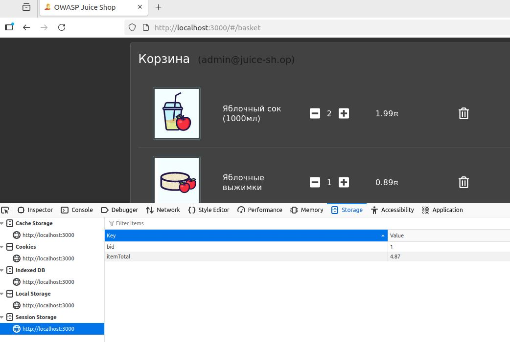

# 12.5. Домашнее задание к занятию «OWASP Web. Часть 2». - Андрей Смирнов.

Пришлите ответы на вопросы в личном кабинете на сайте [netology.ru](https://netology.ru).

## Описание

Вы рассмотрите проект [OWASP Juice Shop](https://owasp.org/www-project-juice-shop/), входящих в [Vulnerable Web Applications Directory](https://owasp.org/www-project-vulnerable-web-applications-directory/).

Для запуска используйте `docker-compose.yml`:

```yaml
version: '3.7'
services:
  shop:
    image: bkimminich/juice-shop
    ports:
      - 3000:3000
```

Приложение запустится на порту 3000, вам нужно открыть `localhost:3000`.

## Задание «Поиск»

В качестве Cheat Sheet, содержащего примеры возможного вода для проверки подверженности XSS, используйте [XSS Cheat Sheet](https://owasp.org/www-community/xss-filter-evasion-cheatsheet) от OWASP.

### Этапы выполнения

1. Проверьте поле поиска на сайте на подверженность XSS.
2. Проанализируйте, возможно ли ссылку, полученную в результате ввода в строку поиска, передать другому человеку, чтобы получить Reflected XSS. 

### Решение задания

В качестве решения пришлите:
1. Использованные данные для ввода.
2. Пункт из XSS Cheat Sheet, в котором содержится пример для проверки подверженности поля поиска XSS.

Вы, конечно, можете загуглить готовое решение, но это будет не так интересно и продуктивно.


----


### Ответ:


Данный сайт (строка поиска) подвержен XSS. Передать ссылку для получения Reflected XSS так же возможно. Одним из самых простых и действенных методов для этого в XSS Cheat Sheet является пункт `On Error Alert`.  

Т.е., когда в поле поиска вводится: `</img>`

Итоговая ссылка получается `http://localhost:3000/#/search?q=%3CIMG%20SRC%3D%2F%20onerror%3D%22alert(String.fromCharCode(88,83,83))%22%3E%3C%2Fimg%3E`


Демонстрация срабатывания алерта при вводе в строку поиска:


Демонстрация работоспособности итоговой ссылки:


----


## Задание «Чужая корзина»

Найдите IDOR в корзине. Посмотрите, что лежит в чужих корзинах. 

### Этапы выполнения

1. Положите что-то в свою корзину. 
2. Откройте саму корзину и инструменты разработчика. 
3. Проанализируйте, что лежит в куках и локальном хранилище. Попробуйте изменить данные, обновите страницу. 


### Решение задания

В качестве решения пришлите:
1. Наименование параметра, который отвечает за открываемую корзину.
2. Ваши рекомендации по исправлению этой незначительной уязвимости.


----


### Ответ:


За открываемую корзину отвечает параметр `bid` в `Session Storage`, который очевидно является идентификатором конкретной корзины. Я авторизовался под учетной записью `admin@juice-sh.op` и мой `bid` (скорее всего сокращение от basket identifier) имел значение `1`. Я изменил его сначала на 3, потом на 5 и получил содержимое чужих корзин (скорее всего пользователей под номерами 3 и 5), демонстрация на скриншотах ниже.





Для исправления данной уязвимости я бы добавил дополнительную проверку прав доступа к корзине на стороне сервера. Например, сопоставив id клиента на основе JWT-токена и id корзины и предоставив доступ при совпадении этих данных и отказе в противном случае. Такой подход должен обеспечить защиту от перебора bid. 

----