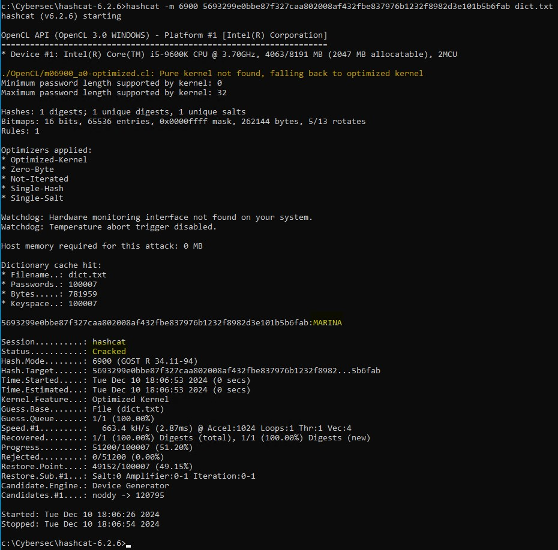
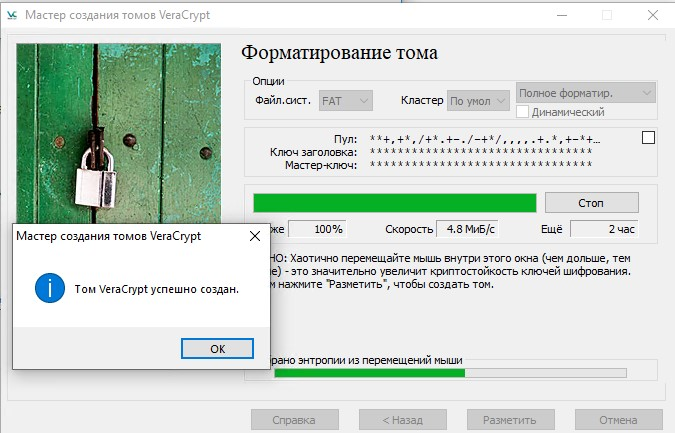
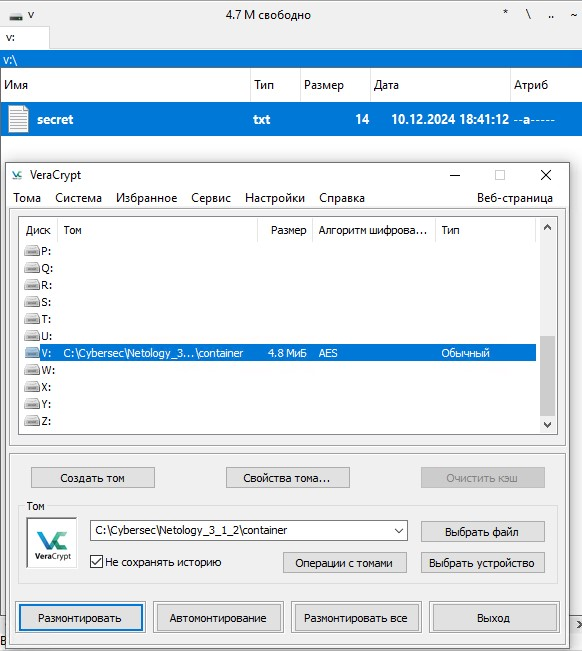

# Домашнее задание к занятию «3.1. Теоретические основы криптографии, симметричные криптосистемы». - Андрей Смирнов.

## Задача №1 - HashCat

### Задание

Каким-то образом у вас оказался хэш пароля. Вот такой: `5693299e0bbe87f327caa802008af432fbe837976b1232f8982d3e101b5b6fab`.

Что нужно сделать: вам нужно попробовать по длине хэша угадать его тип (это будет один из тех, что упоминался на лекции, как минимум, в табличке в конце лекции).
В качестве ответа пришлите название функции хэширования и "угаданный" пароль.

-----

### Ответ:

Поскольку исходный хэш имеет длину 64 символа или 256 бит, то область поиска алгоритма значительно сужается. Необходимо проверить только алгоритмы с длинной хэша 256 бит. Я начал проверку таких алгоритмов: `SHA2-256` - не подошел, `GOST R 34.11-2012 (Streebog) 256-bit, big-endian` - так же не подошел, и, наконец, алгоритм `GOST R 34.11-94` дал положительный результат - пароль `MARINA`.
Использовалась команда `hashcat -m 17400 5693299e0bbe87f327caa802008af432fbe837976b1232f8982d3e101b5b6fab dict.txt`, где dict.txt - файл словаря с 100000 популярных паролей. 

Успешный результат:

Т.е. использован алгоритм хэширования `GOST R 34.11-94`, а заданный пароль `MARINA`

-----

## Задача №2 - VeraCrypt

### Результаты

Отправьте контейнер и пароль к нему в ЛК пользователя:

-----

### Ответ:

Создание тома:

Успешное монтирование:

Файл с контейнером:

[контейнер](https://github.com/Git4Soul/Git4Soul-Netology-SIB-50-HW/blob/1f746e880e8fd4fbc2c63f996bc8cbafc0aad012/assets/container)

Пароль к контейнеру: `SkUT49IZsrvtSY7qMN@y`

-----

