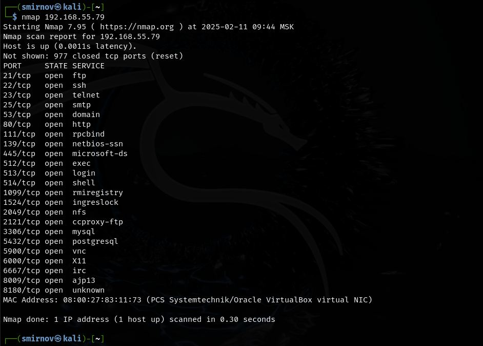
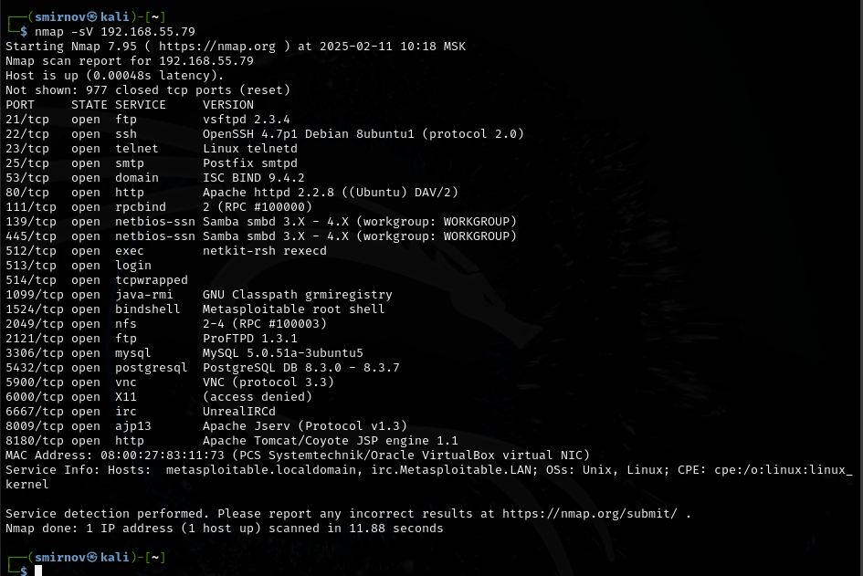

# Домашнее задание к занятию 5.10. «Атаки». - Андрей Смирнов.

В качестве результата пришлите ответы на вопросы в личном кабинете студента на сайте [netology.ru](https://netology.ru).

## Metasploitable

Скачайте и установите на виртуальную машину Metasploitable: https://sourceforge.net/projects/metasploitable/

Это типовая ОС для экспериментов в области информационно безопасности, с которой следует начать при анализе уязвимостей.

Просканируйте эту VM, используя nmap.

Попробуйте найти уязвимости, которым подвержена данная виртуальная машина.

Сами уязвимости можно поискать на сайте https://www.exploit-db.com/.

Для этого нужно в поиске ввести название сетевой службы, обнаруженной на атакуемой машине, и выбрать подходящие по версии уязвимости.

Ответьте на следующие вопросы:

1. Какие сетевые службы в ней разрешены?
1. Какие уязвимости были вами обнаружены (список со ссылками - достаточно 3х уязвимостей)

Пришлите ответы на вопросы в ЛК студента.


---

### Ответ:
Результат запуска NMAP:




Результат запуска NMAP для определения версий ПО:




Список сетевых служб:

```bash
PORT     STATE SERVICE
21/tcp   open  ftp
22/tcp   open  ssh
23/tcp   open  telnet
25/tcp   open  smtp
53/tcp   open  domain
80/tcp   open  http
111/tcp  open  rpcbind
139/tcp  open  netbios-ssn
445/tcp  open  microsoft-ds
512/tcp  open  exec
513/tcp  open  login
514/tcp  open  shell
1099/tcp open  rmiregistry
1524/tcp open  ingreslock
2049/tcp open  nfs
2121/tcp open  ccproxy-ftp
3306/tcp open  mysql
5432/tcp open  postgresql
5900/tcp open  vnc
6000/tcp open  X11
6667/tcp open  irc
8009/tcp open  ajp13
8180/tcp open  unknown
```


Список уязвимостей:

vsftpd 2.3.4    vsftpd 2.3.4 - Backdoor Command Execution
https://www.exploit-db.com/exploits/49757


BIND 9.4.2      BIND 9.4.1-9.4.2 - Remote DNS Cache Poisoning (Metasploit)
https://www.exploit-db.com/exploits/6122


MySQL 5.0.51a-3ubuntu5  MySQL 5.0.x - IF Query Handling Remote Denial of Service, MySQL 5.0.x - Single Row SubSelect Remote Denial of Service
https://www.exploit-db.com/exploits/30020
https://www.exploit-db.com/exploits/29724

---


## SYN, FIN, Xmas, UDP

Проведите сканирование Metasploitable в режимах SYN, FIN, Xmas, UDP, запишите сеансы сканирования в Wireshark.

Ответьте в свободной форме на следующие вопросы:
1. Чем отличаются эти режимы сканирования с точки зрения сетевого трафика?
1. Как отвечает сервер?

Пришлите ответы на вопросы в ЛК студента.


---

### Ответ:

SYN сканирование:
nmap -sS 192.168.55.79

Nmap отправляет пакеты TCP с установкой флага SYN (Synchronize) без завершения соединения (не завершает установку соединения, как при полном 3-х шаговом TCP-установлении).
Если порт открыт, сервер отправляет в ответ пакет с установленным флагом SYN/ACK (Synchronize/Acknowledge), что указывает на то, что сервер готов установить соединение.
Nmap затем отправляет RST (Reset) пакет для сброса соединения без завершения его установки. Это называется "незавершенным" или "полуоткрытым" сканированием.


------


FIN сканирование:
nmap -sA 192.168.55.79

Nmap отправляет пакеты TCP с установкой флага FIN (Finish) без предварительного установления соединения.
Если порт закрыт, сервер отправит пакет RST в ответ, что указывает на то, что порт закрыт.
Если порт открыт, сервер может либо игнорировать пакет, либо отправить RST, что также указывает на закрытый порт.


------


Xmas сканирование:
nmap -sX 192.168.55.79

Nmap отправляет пакеты TCP с установкой флагов FIN, PSH (Push) и URG (Urgent) без установления соединения.
Если порт закрыт, сервер отправит пакет RST в ответ.
Если порт открыт, сервер может либо игнорировать пакет, либо отправить RST, что также указывает на закрытый порт.

------


UDP сканирование:
nmap -sU 192.168.55.79

Nmap отправляет пакеты UDP на указанные порты.
Если порт закрыт, сервер обычно отправляет пакет ICMP (например, "Destination Unreachable") в ответ.
Если порт открыт, сервер либо отправляет ответное сообщение, если соответствующий сервис настроен для обработки UDP-запросов, либо игнорирует запрос.

------
