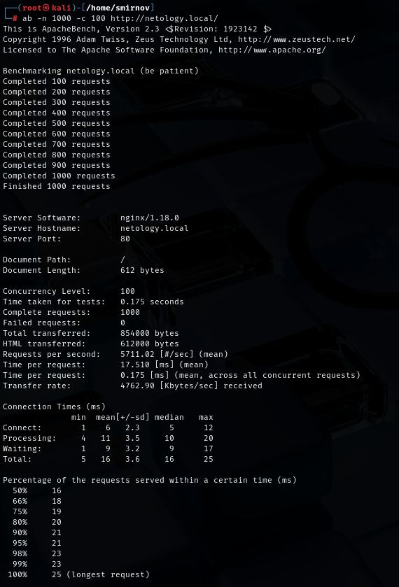
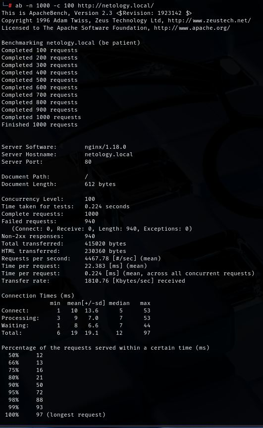
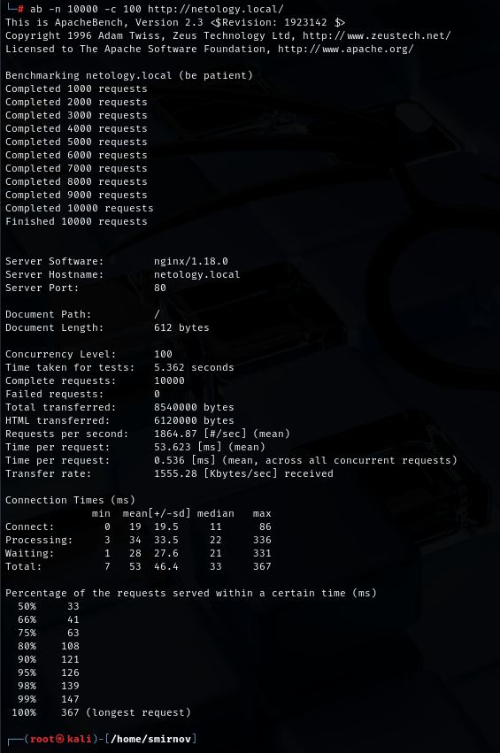
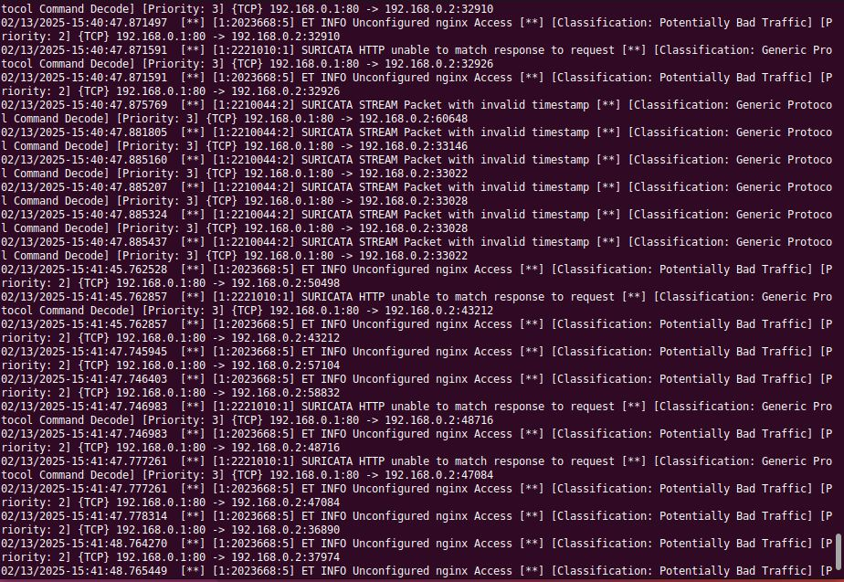
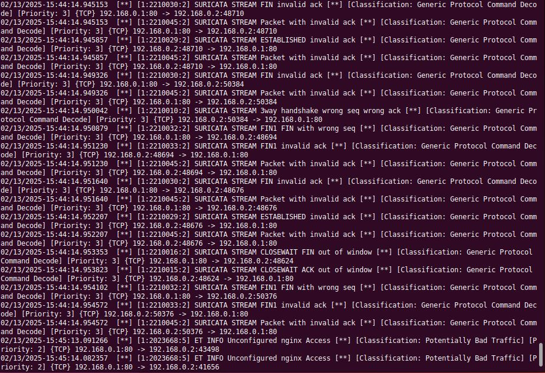
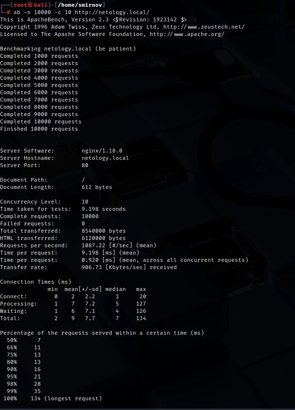
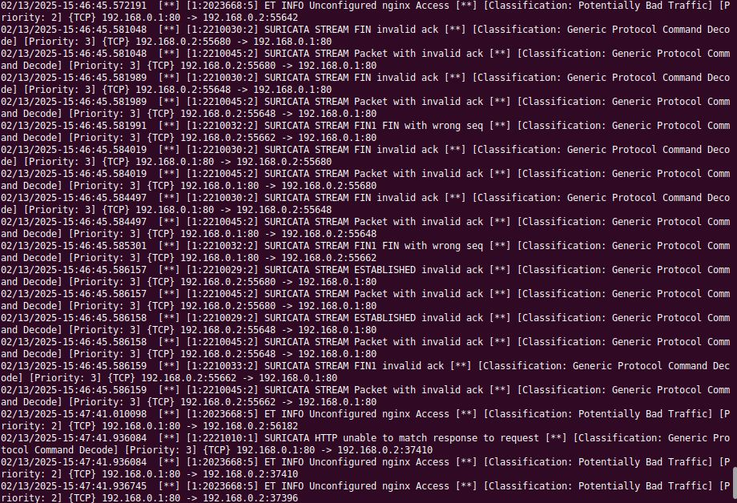

# Домашнее задание к занятию 5.11. «Организация безопасности сети». - Андрей Смирнов.

В качестве результата пришлите ответы на вопросы в личном кабинете студента на сайте [netology.ru](https://netology.ru).

## Rate Limit

### Вводная

Сервер nginx достаточно часто используется не только как веб-сервер, но и как reverse proxy. Что это значит? Это значит, что его ставят перед тяжёлыми веб-приложениями и позволяют ему решать следующие задачи:
1. Отдавать "статику" (статичные файлы, с чем он справляется достаточно хорошо)
1. Проксировать запросы на Upstream сервера (т.е. запрос приходит на nginx, nginx его отправляет дальше на сервер с приложением)

Зачем нужна вторая функция? nginx может взять на себя задачи по работе с медленными клиентами, кэшированию и т.д.

А кроме того, может служить программным балансировщиком нагрузки и лимитировать поток входящих запросов (именно это нас и будет интересовать).

Что мы хотим сделать? Мы хотим научиться с помощью nginx ограничивать поток входящих запросов с одного ip-адреса.

### Описание выполнения

У вас должно быть две виртуальные машины:
* Ubuntu с nginx (192.168.0.1)
* Kali (192.168.0.2)

У вас уже должен быть настроенный nginx, если вдруг так случилось, что его нет, то вернуться [к соответствующему уроку](../07_internet).

### Без лимита

#### Ubuntu

1\. Удостоверяетесь, что сервис nginx запущен, порт 80 открыт.

2\. Если вы не устанавливали nginx, то:
```shell script
sudo apt update
sudo apt install nginx
```

3\. Редактируете конфигурацию `sudo mcedit /etc/nginx/sites-enabled/default`, чтобы она выглядела следующим образом:


4\. Сохраняете изменения

5\. Проверяете корректность конфигурации `sudo nginx -t`

6\. Применяете конфигурацию `sudo nginx -s reload`


#### Kali

Для генерации запросов мы будем использовать утилиту [Apache Benchmarks](https://httpd.apache.org/docs/2.4/programs/ab.html).

```shell script
ab --help
```

Если у вас выводится сообщение о том, что программа не найдена (`bash: ab command not found`), то установите её:
```shell script
sudo apt update
sudo apt install apache2-utils
```

Далее сделаем 1000 запросов по 100 запросов одновременно:
```shell script
ab -n 1000 -c 100 http://netology.local/
``` 

Удостоверяемся, что все запросы проходят:


### Rate Limit

#### Ubuntu

Меняем настройки nginx:

```shell script
sudo mcedit /etc/nginx/sites-enabled/default.conf
```

Редактируем конфигурацию, чтобы она выглядела следующим образом:


<details>
<summary>Описание значений</summary>

```text
limit_req_zone $binary_remote_addr zone=limit:10m rate=50r/s
```
Создание зоны по ограничению количества запросов:
* `$binary_remote_addr` - на основании ip-адреса запрашивающего
* `zone=limit:10m` - зона с именем limit и памятью 10 мегабайт (информация о 16 000 адресах занимает примерно 1 мегабайт)
* `rate=50r/s` - 50 запросов в секунду

```text
limit_req zone=limit burst=50 nodelay
```

* `limit_req zone=limit` - включение лимита для определённого сервера.
* `burst=50` - по умолчанию, 50 запросов в секунду значит, что нельзя делать запросы чаще чем раз в 20ms, т.е. если запросы будут приходить чаще, то nginx будет откидывать их с ошибкой 503. `burst` позволяет указать количество запросов, которые допустимы в рамках окна, установленного `rate`, при этом первый будет обслужен, а остальные будут дожидаться установленного лимита по времени (те, кто вышел за пределы 50, получат 503)
* `nodelay` - позволяет не ждать положенного лимита, а отправлять запрос сразу, если это позволяют установленные лимиты
</details>

Тестируем конфигурацию и применяем изменения:
```shell script
sudo nginx -t
sudo nginx -s reload
```

#### Kali

Ещё раз делаем 1000 запросов по 100 запросов одновременно:
```shell script
ab -n 1000 -c 100 http://netology.local/
``` 

Удостоверяемся, что часть из них завершается с ошибкой:


### Fail2Ban (необязательная часть)

Конечно же, можно пойти дальше и "блочить" IP, в этом нам поможет Fail2Ban, который мы рассмотрели на лекции

#### Ubuntu

```shell script
sudo apt update
sudo apt install fail2ban
```

Удостоверяемся, что сервис запущен:
```shell script
systemctl status fail2ban
```


```shell script
sudo cp /etc/fail2ban/jail.conf /etc/fail2ban/jail.local
sudo mcedit /etc/fail2ban/jail.local
```

Спускаетесь до записи `[nginx-limit-req]` и включаете её добавлением строки `enabled = true`:


Сохраняете файл и применяете конфигурацию:
```shell script
sudo fail2ban-server reload
sudo fail2ban-server status
```


#### Kali

Убедитесь, что после пары запусков `ab` вас "забанят":


Удостоверяемся, что адрес Kali действительно забанен:

```shell script
sudo zgrep 'Ban' /var/log/fail2ban.log
```

### Результат

Пришлите следующие скриншоты:
1. Скриншот с запросами `ab` до включения limit_req на nginx
1. Скриншот с запросами `ab` после включения limit_req на nginx
1. Скриншот с запросами `ab` после включения fail2ban (не обязательно)


---

### Ответ:

1. Скриншот с запросами `ab` до включения limit_req на nginx:
   



2. Скриншот с запросами `ab` после включения limit_req на nginx:




3. Скриншот с запросами `ab` после включения fail2ban (не обязательно):


---


## Suricata*

**Важно**: эта задача не обязательная, её (не)выполнение не влияет на получение зачёта по ДЗ.

### Вводная

Мы уже посмотрели, как настраивать Suricata на лекции. Сейчас стоит задача выяснить, как она по умолчанию реагирует на попытки DoS'а (например, с помощью `ab`).

### Задача

1. Настройте suricata согласно материалам из лекций
1. Отключите fail2ban, если он у вас был включен
1. Уберите из nginx rate limit
1. Проведите с машины с Kali с помощью ab в трёх вариантах (последовательно):
    1. 10_000 запросов по 100 одновременно
    1. 10_000 запросов по 1000 одновременно
    1. 10_000 запросов по 10 одновременно

В качестве ответа пришлите описание реакции Suricata на подобное воздействие (п.4) в ЛК студента Нетологии.

<details>
<summary>Описание выполнения</summary>

У вас должно быть две виртуальные машины:
* Ubuntu с nginx (192.168.0.1)
* Kali (192.168.0.2)

У вас уже должен быть настроенный nginx, если вдруг так случилось, что его нет, то вернуться [к соответствующему уроку](../07_internet).

#### Ubuntu

1\. Удостоверяетесь, что сервис nginx запущен, порт 80 открыт.

2\. Если вы не устанавливали nginx, то:
```shell script
sudo apt update
sudo apt install nginx
```

3\. Редактируете конфигурацию `sudo mcedit /etc/nginx/sites-enabled/default`, чтобы она выглядела следующим образом:


4\. Сохраняете изменения

5\. Проверяете корректность конфигурации `sudo nginx -t`

6\. Применяете конфигурацию `sudo nginx -s reload`

7\. Отключаете fail2ban с помощью команды `sudo systemctl stop fail2ban` (чтобы отключить полностью и он не запускался после перезагрузки машины, нужно дополнительно ввести команду `sudo systemctl disable fail2ban`)

8\. Устанавливаете suricata с помощью следующих команд:

```shell script
sudo apt install software-properties-common
sudo add-apt-repository ppa:oisf/suricata-stable
sudo apt update
sudo apt install suricata
sudo suricata-update
```

Примечание*: suricata-update скачивает набор правил от [ET Labs](https://rules.emergingthreats.net).

9\. Проверяете, что сервис запустился после установки

```shell script
sudo systemctl status suricata
```

10\. Меняете значение `EXTERNAL_NET` в `/etc/suricata/suricata.yaml` на `"any"`:


11\. Перезапускаете suricata:

```shell script
sudo systemctl restart suricata
```

12\. Смотрим доступные сетевые интерфейсы:

```shell script
ip addr show
```

Выбираем тот, на который у вас настроен ip 192.168.0.1 (в примере `enp0s8`):


13\. Запускаем suricata на выбранном интерфейсе:

```shell script
sudo suricata -c /etc/suricata/suricata.yaml -i enp0s8
```

14\. В другой консоли запускаете просмотр лога:

```shell script
sudo tail /var/log/suricata/fast.log
```


#### Kali

Для генерации запросов мы будем использовать утилиту [Apache Benchmarks](https://httpd.apache.org/docs/2.4/programs/ab.html).

```shell script
ab --help
```

Если у вас выводится сообщение о том, что программа не найдена (`bash: ab command not found`), то установите её:
```shell script
sudo apt update
sudo apt install ab
```

Далее делаем 10_000 запросов по 100 одновременно:
```shell script
ab -n 10000 -c 100 http://netology.local/
``` 

Далее делаем 10_000 запросов по 1000 одновременно:
```shell script
ab -n 10000 -c 1000 http://netology.local/
``` 

Далее делаем 10_000 запросов по 10 одновременно:
```shell script
ab -n 10000 -c 10 http://netology.local/
``` 

Опишите поведение suricata (сообщения, появляющиеся в log-файле) после:
1. 10_000 запросов по 100
1. 10_000 запросов по 1000
1. 10_000 запросов по 10

Ответ пришлите в свободной форме в ЛК студента Нетологии.

</details>


---

### Ответ:

1. 10_000 запросов по 100:
   



Лог suricata (10_000 запросов по 100):




2. 10_000 запросов по 1000:
   


Лог suricata (10_000 запросов по 10):




3. 10_000 запросов по 1000:
   



Лог suricata (10_000 запросов по 10):




---


## Suricata Rules*

**Важно**: эта задача не обязательная, её (не)выполнение не влияет на получение зачёта по ДЗ.

Если вы ставили nginx по умолчанию, так, как описано в ДЗ, то в логах suricata обнаружите запись:
```text
ET INFO Unconfigured nginx Access
```

Правила, которые мы использовали в предыдущем ДЗ, располагаются в файле `/var/lib/suricata/rules/suricata.rules`.

Найдите, среди правил правило, которое отвечает за эту строку и кратко опишите:
1. На основании чего происходит срабатывание данного правила
1. Ваше предположение о том, на что оно направлено

Ответ пришлите в свободной форме в ЛК студента Нетологии.

---

### Ответ:


Само правило:
   


1. Это правило направлено на обнаружение доступа к веб-серверам nginx со стандартными настройками (Т.е. когда сервер имеет заголовок nginx и содержит в теле ответа строку Welcome to nginx!). 
2. Предположу, что оно помогает выявить серверы, которые могут быть уязвимыми из-за использования дефолтной конфигурации. Это может быть полезно для предотвращения потенциальных атак.


---
