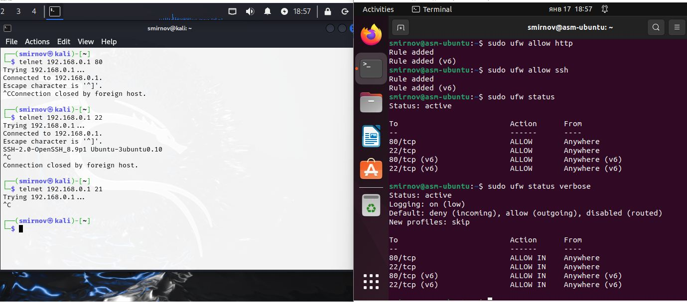
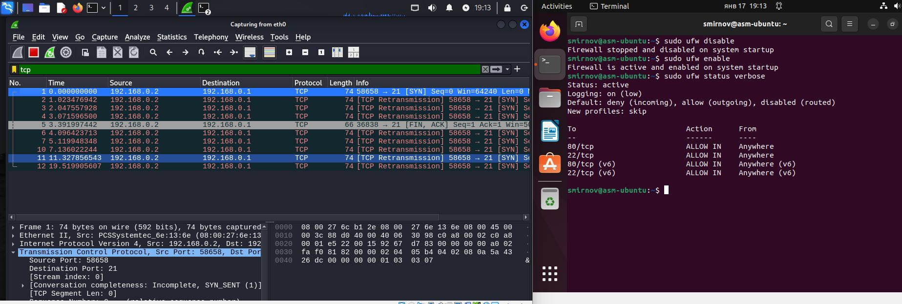

# Домашнее задание к занятию 5.4. «Протоколы транспортного уровня: TCP, UDP». - Андрей Смирнов.

В качестве результата пришлите ответы на вопросы в личном кабинете студента на сайте [netology.ru](https://netology.ru).

**Важно**: убедитесь, что вы предварительно:
1. [Установили VirtualBox](../virtualbox/virtualbox.md)
1. Ознакомились с дополнительным видео по работе с виртуальными машинами (в личном кабинете Нетологии)
1. [Ознакомились с руководством по работе в терминале](../terminal/terminal.md) 

**Важно**: в вашем личном кабинете выложены видео-уроки, демонстрирующие работу с системой виртуализации VirtualBox и ОС Linux. Убедитесь, что вы их посмотрели перед выполнением ДЗ.

## Задание Firewall

Firewall (межсетевой экран) - это устройство или программный продукт (есть разные исполнения), которое просматривает входящий и исходящий трафик и на основании определённых правил безопасности принимает решения о том, пропустить данный трафик (к сети, хосту или приложениям хоста) или нет.

Рекомендуем вам ознакомиться с методическими документами ФСТЭК, посвящённым [межсетевым экранам](https://fstec.ru/dokumenty/vse-dokumenty/informatsionnye-i-analiticheskie-materialy/informatsionnoe-soobshchenie-fstek-rossii-ot-12-sentyabrya-2016-g-n-240-24-4278).

В рамках данной лабораторной работы сделаем базовые настройки МЭ для Linux.

Для выполнения этого ДЗ потребуются две виртуальные машины: Ubuntu и Kali

Для установки на машине с Kali выполните следующие команды:
```shell script
sudo apt update
sudo apt install telnet
```

Запустим виртуальную машину Ubuntu и установим следующие программы:
* nginx - веб-сервер (возможность публикации веб-страниц)
* openssh-server - сервер ssh (Secure Shell - возможность управления с использованием интерпретатора команд на удалённом сервере)
* vsftpd - сервер ftp (File Transfer Protocol - протокол передачи файлов)

Для установки на машине с Ubuntu выполните следующие команды:
```shell script
sudo apt update
sudo apt install nginx openssh-server vsftpd telnet
```

Установленные приложения запустятся после установки сразу в виде сервисов и откроют следующие порты:
- nginx откроет порт 80
- openssh-server откроет порт 22
- vsftpd откроет порт 21

По умолчанию в режиме NAT каждая VM работает изолированно. Поэтому нам необходимо внести некоторые изменения.

1\. Настройте виртуальные машины согласнов видео (Ubuntu - 192.168.0.1, Kali - 192.168.0.2)

2\. Проверьте, что всё работает, с помощью утилиты ping (обе VM должны быть запущены)

3\. Запустите виртуальную машину Kali

4\. Проверьте доступность сервисов, для этого воспользуйтесь программой `telnet`

<details>
<summary>О программе telnet</summary>

Программа telnet является одним из самых простых средств проверки доступности сервисов на удаленном хосте.

Проверка производится следующим образом:

`telnet \<адрес\> \<порт\>`

У нас адрес уже известен - это адрес Ubuntu (192.168.0.1)

Если появится сообщение: `telnet: Unable to connect to remote host: Connection refused` или долго "висит": `Trying XXX.XXX.XXX.XXX` значит, на данном порту сервис недоступен.

Примечание: для выхода из сеанса telnet, нужно:
1. Нажать `Ctrl` и `]` на клавиатуре, после этого приглашение изменит свой вид на telnet>
2. Ввести `q` и нажать `Enter` на клавиатуре

Перейдите в терминал Kali и выполните следующие проверки:

1\. Проверка порта 80:

```
kali@kali:~$ telnet 192.168.0.1 80
Trying 192.168.0.1...
Connected to 192.168.0.1.
```

2\. Проверка порта 22

```shell script
kali@kali:~$ telnet 192.168.0.1 22
```

Во время этой проверки может быть задан вопрос о ключах:

```shell script
The authenticity of host '192.168.0.1 (192.168.0.1)' can't be established.
ECDSA key fingerprint is SHA256: ----------------------------------------------.
Are you sure you want to continue connecting (yes/no/[fingerprint])? yes
```

В этом случае нужно набрать слово `yes`

3\. Проверка порта 21:

```shell script
kali@kali:~$ telnet 192.168.0.1 21
Trying 192.168.0.1...
Connected to 192.168.0.1.
Escape character is '^]'.
220 (vsFTPd 3.0.3)
```

Если все проверки завершились успешно, значит все сервисы запущены.
</details>

Нам поступила задача закрыть FTP для доступа из сети, оставив открытыми только 80 и 22 порты. Для этого воспользуемся [МЭ, входящим в состав Ubuntu](https://help.ubuntu.com/community/UFW) и закроем доступ.

1\. Перейдите в Ubuntu:

2\. Введите команду:

```shell script
ubuntu@ubuntu:~$ sudo ufw status verbose
Status: inactive
# это означает, что МЭ выключен
```

Напоминаем, что документацию вы можете почитать прямо в консоли с помощью команды `man ufw` (выход с помощью клавиши `q`, навигация с помощью стрелок или пробела).

3\. Включите МЭ:

```shell script
ubuntu@ubuntu:~$ sudo ufw enable
Firewall is active and enabled on system startup
```

(для отключения нужно ввести команду: `sudo ufw disable`)

4\. Теперь МЭ работает, чтобы убедиться в этом, перейдите в Kali и повторите запросы telnet:

```shell script
telnet 192.168.0.1 80

telnet 192.168.0.1 22

telnet 192.168.0.1 21
```

На все ваши попытки должен быть получен следующий ответ:

```shell script
Trying 192.168.0.1...
```

Т.е. соединение не устанавливается.

5\. Перейдите в Ubuntu и выполните следующие команды:

```shell script
# разрешение http (порт 80)
ubuntu@ubuntu:~$ sudo ufw allow http
Rule added
Rule added (v6)

# разрешение ssh (порт 22)
ubuntu@ubuntu:~$ sudo ufw allow ssh
Rule added
Rule added (v6)
```

6\. Вернитесь в Kali и проверьте команды telnet:

```shell script
kali@kali:~$ telnet 192.168.0.1 80
Trying 192.168.0.1...
Connected to 192.168.0.1.
Escape character is '^]'.
^]
telnet> q
Connection closed.

kali@kali:~$ telnet 192.168.0.1 22
Trying 192.168.0.1...
Connected to 192.168.0.1.
Escape character is '^]'.
SSH-2.0-OpenSSH_7.6p1 Ubuntu-4ubuntu0.3
^]
telnet> q
Connection closed.
```

Попытка подключения к 21 порту закончится безуспешно.

Таким образом, мы познакомились с базовой работой МЭ, позволяющей открывать доступ к определённым портам. По умолчанию применяется правило "всё, что явно не разрешено - запрещено".

В качестве результата работы пришлите вывод команды `sudo ufw status verbose`.

На [странице документации](https://help.ubuntu.com/community/UFW) вы можете прочитать примеры расширенного синтаксиса настройки правил, позволяющих вам разрешать доступ с определённых ip, подсетей и т.д.

-----


### Ответ:

Скриншот с результатом задания:



-----

## Задание Wireshark

Откройте в Kali Wireshark и проследите, как происходит процесс соединения при отключенном МЭ и при включенном (на 21 порт не стоит `allow`).

В качестве ответа опишите разницу в процессе установления соединения (или попытках установления соединения) при отключенном МЭ и при включенном МЭ (на 21 порт не стоит `allow`).

-----


### Ответ:

Результат с отключенным фаерволом:


Результат с включенным фаерволом (21 порт закрыт):



Как видно из скриншотов выше - при отключенном фаерволе все 3 стадии установления TCP-соединения проходят успешно. На это указывает наличие пакетов с заголовками SYN, SYN-ACK, ACK - этапы трехстороннего рукопожатия при установлении TCP-соединения. 
При включенном фаерволе (закрытом порту 21) мы видим лишь безуспешные попытки машины с kali linux (192.168.0.2) достучаться до 21 порта машины Ubuntu (192.168.0.1). Kali постоянно отправляет SYN-пакеты, но фаервол на Ubuntu их отбрасывает и сервис не отвечает пакетом SYN-ACK. В результате соединение не устанавливается (трехстороннее рукопожатие при установлении соединения не проходит).

