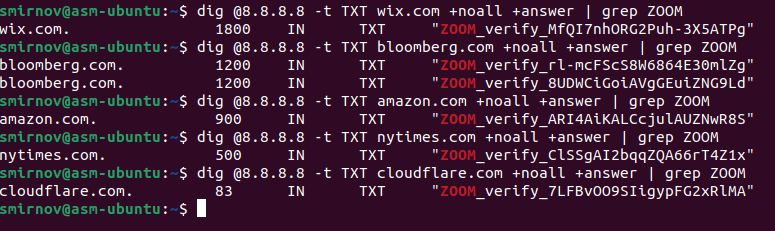
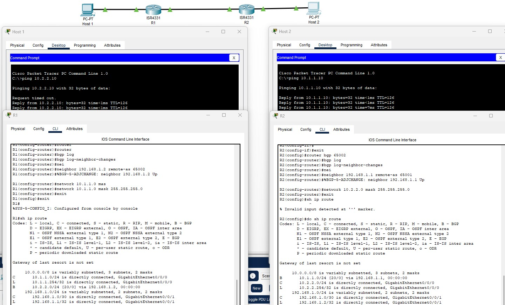

# Домашнее задание к занятию 5.7. «Работа сети Интернет (часть 1): BGP, DNS». - Андрей Смирнов.

В качестве результата пришлите ответы на вопросы в личном кабинете студента на сайте [netology.ru](https://netology.ru).

## Zoom

На любой Linux-машине (можете использовать Kali) с помощью утилиты dig найдите 5 компаний (доменов), которые скорее всего используют Zoom для своей работы.

В качестве результата необходимо отправить:
1. Описание (своими словами) как вы производили поиск
1. Список из 5 доменов
1. Скриншоты вывода dig для каждого домена

-----

### Ответ:

Скриншоты вывода команды dig:

-----

## BGP

Создайте в Cisco Packet Tracer следующую топологию:

Настройте сетевую схему, используя следующие параметры:

1. Host1: 
    * IP: 10.1.1.10/24
    * Default route : 10.1.1.254
1. R1
    * IP gi0/0/0: 10.1.1.254/24
    * IP gi0/0/1: 192.168.1.1/30
    * BGP AS 65001
1. R2
    * IP gi0/0/0: 10.2.2.254/24
    * IP gi0/0/1: 192.168.1.2/30
    * BGP AS 65002
1. Host2
    * IP 10.2.2.10/24
    * Default route: 10.2.2.254
    
Запустите ping между Host1 и Host2 (он должен быть успешен).

### Инструменты/ дополнительные материалы, которые пригодятся для выполнения задания

1. [Настройка BGP и практика](https://linkmeup.gitbook.io/sdsm/8.-bgp-i-ip-sla/2.-bgp/2.-nastroika-bgp-i-praktika/0.-nastroika-bgp)
2. [bgp configuration lab](https://linuxtiwary.com/2018/02/19/bgp-routing-configuration-lab-using-packet-tracer/)

В качестве результата пришлите сконфигурированную топологию в формате .pkt

-----

### Ответ:

pkt-файл:  [`BGP.pkt`](assets/5_7/BGP.pkt)

Пинги до хостов и таблицы маршрутизации:

-----

## Internet*

**Важно**: эта задача является необязательной. Её (не)выполнение не влияет на получение зачёта по ДЗ.

Хост А успешно пингует Хост Б, но пинг между Хост А и Интернетом не работает. 

Опишите своими словами, что настроено неправильно:

В качестве результата пришлите ответ, что именно неправильно настроено в сетевой схеме.

-----

### Ответ:

В данной схеме некорректно настроена маршрутизация на роутере R2. Чтобы на хосте А был доступен Интернет, на роутере R2 дефолт гейтвей должен быть в сторону Интернета (т.е. сети 10.3.3.4/30, точнее via 10.3.3.5), а не интерефейса R1 из стыковочной сети 10.3.3.0. Логичнее на R2 анонсировать в iBGP роутеру R1 сеть 172.16.1.0/24, а с роутера R1 - роутеру R2 сеть 192.168.1.0/24 (либо настройки R1 вообще не трогать, а просто прописать статик на R2 192.168.1.0 255.255.255.0 via 10.3.3.2 и дефолт в Интернет)     
а дефолт прописать в Интернет, т.е. 0.0.0.0 0.0.0.0 via 10.3.3.5.
-----
