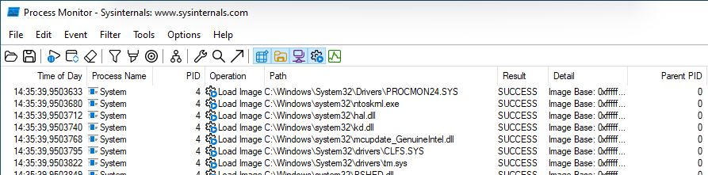
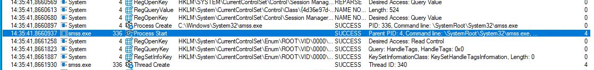
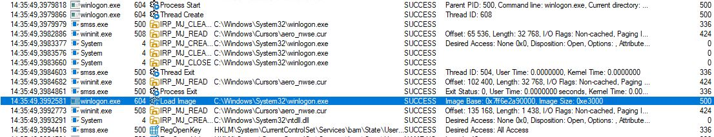
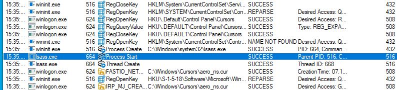
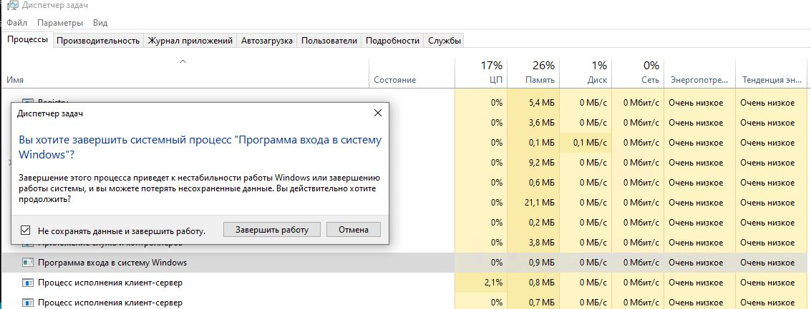

# 7.1. Домашнее задание к занятию «ОС Windows (часть 1)». - Андрей Смирнов.

В качестве результата пришлите ответы на вопросы в личном кабинете студента на сайте [netology.ru](https://netology.ru).

**Важно**: если Windows 10 в виртуалке работает крайне медленно, то вы можете выполнить ДЗ на своей хостовой ОС (если у вас Windows 10).

## Задача Procmon

### Легенда

На лекции мы рассмотрели процесс загрузки ОС Windows. Ваша задача с помощью Process Explorer восстановить весь процесс загрузки (включая процедуру входа) на чистой ОС.

### Задача

Скачайте установочный [ISO-файл от Microsoft](https://www.microsoft.com/ru-ru/evalcenter/download-windows-10-enterprise).

Для Windows

##### Шаг 1. Перейдите [по ссылке](https://www.microsoft.com/ru-ru/software-download/windows10ISO) и скачайте средство создания носителя

##### Шаг 2. Запустите скачанный файл

##### Шаг 3. Согласитесь с условиями лицензии

##### Шаг 4. Выберите опцию Create Installation Media for another PC

##### Шаг 5. Оставьте рекомендуемые параметры для языка, архитектуры и редакции

##### Шаг 6. Выберите ISO file в качестве media

##### Шаг 7. Выберите каталог для сохранения ISO файла

##### Шаг 8. Дождитесь завершения загрузки

##### Шаг 9. Используйте полученный ISO для установки ОС в виртуальной машине

Установите в виртуальную машину данную версию Windows. На экранах, где вас попросят ввести активационный код или учётную запись Microsoft, нажимайте пропуск.

Не устанавливайте никаких дополнений.

Скачайте в установленную Windows [Sysinternals Process Monitor](https://docs.microsoft.com/en-us/sysinternals/downloads/procmon):

#### Выполнение

Пошаговое выполнение

##### Шаг 1. Скачайте и распакуйте архив

#### Шаг 2. Запустите файл Procmon.exe:

#### Шаг 3. Предоставьте права на выполнение приложению:

#### Шаг 4. Зайдите в меню `Options` и выберите опцию `Enable Boot Loggin`:

#### Шаг 5. Не включайте Thread Profiling Events:

#### Шаг 6. Перезагрузите виртуальную машину:

#### Шаг 7. Снова запустите файл Procmon.exe:

#### Шаг 8. Согласитесь с сохранением лога (журнала) загрузки:

#### Шаг 9. Сохраните лог в предлагаемом расположении:

#### Шаг 10. Зайдите в меню `Filter` и выберите опцию `Enable Advanced Output`:

#### Шаг 11. Кликните правой кнопкой мыши на строке заголовков колонок и выберите `Select Columns`:

#### Шаг 12. Установите флажок напротив `Parent PID` (это идентификатор родительского процесса, создавшего текущий)

#### Шаг 13. Двигаясь по лог-файлу ответьте на вопросы из задания

**Важно**: `Ctrl + F` работает для поиска

### Результат

В качестве результата пришлите ответы на следующие вопросы:
1. Какой процесс отображается в логе первым? Какой у него PID?
1. Какой "драйвер" загружается первым? Что это за драйвер (ответьте своими словами)?
1. Какой PID у родительского процесса для smss.exe (не у самого smss.exe, а у того, кто его создал)?
1. Какой процесс является родительским для процесса winlogon.exe? Где расположен файл winlogon.exe? 
1. Какой процесс является родительским для процесса lsass.exe?
1. Что будет если в таск менеджере (taskmgr.exe) завершить работу следующего процесса:

-----

### Ответ:

1. В логе первым отображается процесс с именем System, который имеет PID 4:

  
2. Первым загружается драйвер PROCMON24.SYS, необходимый для работы программы Process Monitor. Полагаю он используется для логирования событий во время загрузки операционной системы, которую я включил после запуска программы согласно инструкции по выполнению ДЗ (`Enable Boot Loggin`).  

3. У родительского процесса для smss.exe PID - 4 (имя родительского процесса system):

4. Для winlogon.exe родительским процессом является процесс smss.exe, его PID - 500. Файл winlogon.exe находится в папке  C:\Windows\System32\ .

5. Для lsass.exeродительским процессом является процесс wininit.exe, его PID - 516.

6. Если в таск менеджере завершить работу процесса winlogon.xe - операционная система завершит текущий сеанс пользователя (разлогинит его), при этом данные в открытых приложениях могут быть потеряны.

-----

