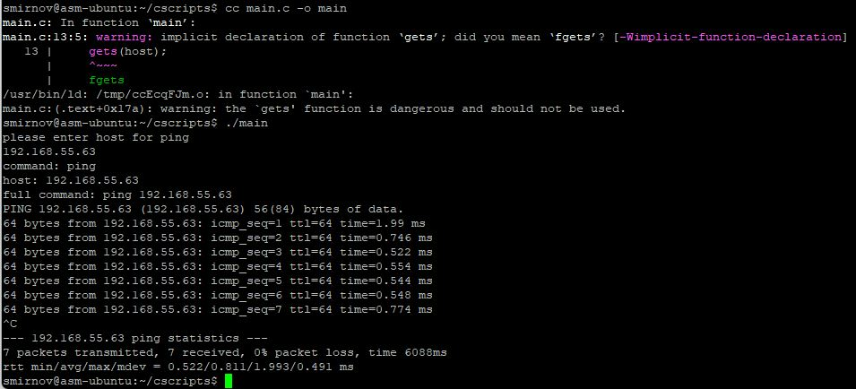
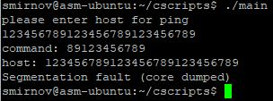
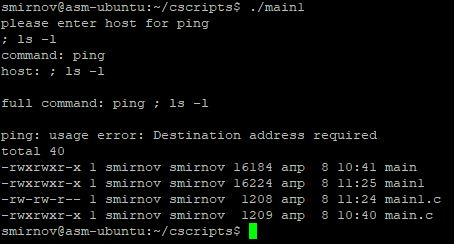

# 7.10. Домашнее задание к занятию «Язык С и программные уязвимости». - Андрей Смирнов.

В качестве результата пришлите ответы на вопросы в личном кабинете студента на сайте [netology.ru](https://netology.ru).

## Задание 1

**Важно**: выполняйте данную задачу на ОС Linux (Ubuntu или Kali)

### Легенда

У вас есть следующий код:
```c
#include <stdio.h>
#include <string.h>
#include <stdlib.h>

int main() {
    /* выделяем буфер из 255 символов + \0 для хранения команды */
    char command[256] = {'p', 'i', 'n', 'g', ' ', '\0'};
    /* буфер для хранения хоста, который нужно пропинговать */
    char host[16];

    printf("please enter host for ping\n");
    /* получаем от пользователя имя хоста - нужно ввести в консоли, например, ya.ru и нажать Enter */
    gets(host);

    /* отладочный вывод - печатаем команду */
    printf("command: %s\n", command);
    /* отладочный вывод - печатаем хост */
    printf("host: %s\n", host);

    /* добавляем к команде хост, при этом \0 в команде заменяется на первый символ из host */
    strcat(command, host);

    /* отладочный вывод - печатаем полную команду */
    printf("full command: %s\n", command);

    /* выполняем команду */
    system(command);

    return 0;
}
```

*Важно*: строки, которые начинаются с `/*` и заканчиваются `*/` - это комментарии (пояснения к коду программы), вы можете их не печатать.

### Задача

По аналогии с лекцией установите необходимые зависимости (`apt update && apt install gcc`) и скомпилируйте данную программу (`cc main.c -o main`) - не обращайте внимание на предупреждения, если они будут.

Далее:
1\. Запустите её (`./main`), вы увидите приглашение вида:


2\. Введите адрес хоста, который необходимо пропинговать и убедитесь, что пинг работает:


3\. Завершите работу приложения с помощью сочетания клавиш Ctrl + C

Творческая часть: попробуйте подобрать данные (по аналогии с лекцией) так, чтобы:
1. Приложение "упало" (вы получили сообщение segmentation fault или другое, свидетельствующее об ошибке)
1. Вам удалось выполнить вместо `ping` другую команду

<details>
<summary>Подсказка</summary>

Начните вводить по одному символу, пока не увидите, что команда `ping` вдруг заменилась на нужную вам (см. вывод `printf("full command: %s\n", command);`).
</details>

### Результаты

В качестве результата пришлите ответы на следующие вопросы:
1. Какое предупреждение (`Warning`) было выведено при компиляции? По желанию: проведите доп.исследование на предмет сути предупреждения (с чем оно связано, какие риски от использования одной из функций в программе и что это за функция).
1. Ввод, приводящий к падению приложения
1. Ввод, приводящий к выполнению другой команды (не `ping`) с помощью переполнения 

В качестве результата пришлите ответы на вопросы в личном кабинете студента на сайте [netology.ru](https://netology.ru).


----

### Ответ:


1. При компиляции было выведено предупреждение о том, что функция `gets()` небезопасна и следует использовать `fgets()`. В текущем виде программа может вылетать с ошибкой или стать уязвимой для взлома:





2. Если ввести слишком длинную строку, например, `123456789123456789123456789` программа завершит работу с ошибкой `Segmentation fault` :





3. Код данной программы уязвим к переполнению буфера (buffer overflow) в функции `gets()`. С помощью нулевого байта (Ctrl+@) и переполнения буфера мы можем выполнить любую другую команду, например посмотреть файлы - `ls -la`, для этого достаточно набрать следующий текст вместо адреса хоста `ls -la ^@12345678`:


----


## Задание 2

**Важно**: выполняйте данную задачу на ОС Linux (Ubuntu или Kali)

### Легенда

Программисты прислали вам якобы "исправленный" вариант программы `ping`:
```c
#include <stdio.h>
#include <string.h>
#include <stdlib.h>

int main() {
    /* выделяем буфер из 24 символов для хранения команды */
    char command[24] = "ping ";
    /* буфер для хранения хоста, который нужно пропинговать */
    char host[16];

    printf("please enter host for ping\n");
    /* получаем от пользователя имя хоста */
    /* нужно ввести в консоли, например, ya.ru и нажать Enter */
    fgets(host, sizeof(host), stdin);

    /* отладочный вывод - печатаем команду */
    printf("command: %s\n", command);
    /* отладочный вывод - печатаем хост */
    printf("host: %s\n", host);

    /* добавляем к команде хост, при этом \0 в команде заменяется на первый символ из host */
    strcat(command, host);

    /* отладочный вывод - печатаем полную команду */
    printf("full command: %s\n", command);

    /* выполняем команду */
    system(command);

    return 0;
}
```

### Задача

Проведите повторный анализ и посмотрите:
1. Можно ли реализовать переполнение?
1. Можно ли выполнить произвольную команду (если да, то как)?
1. Если ответ на п.2 - да, то можно ли получить shell (т.е. запустить `sh` и `bash` и продолжить работу с интерпретатором команд в интерактивном режиме)?

### Результаты

В качестве результата пришлите ответы на вопросы, указанные в задании (раздел Задача).

В качестве результата пришлите ответы на вопросы в личном кабинете студента на сайте [netology.ru](https://netology.ru).


----

### Ответ:


1. Классическое переполнение буфера именно для хоста не получится, т.к. функция `fgets()` от этого защищена и читает только первые 15 символов, однако из-за особенностей `system()` возможно реализовать инъекцию других команд (это будет видно в следующих двух ответах): 


2. `system()` позволяет реализовать инъекцию других команд используя `;`. Мы можем выполнить любую команду написав ее после `;`, главное помнить об ощем ограничении длинны ввода в 15 символов, например, так можно выполнить команду `dir` - `; dir`. По факту выполнится 2 команды - `ping` ошибкой и `dir` :





3. Используя инъекцию других команд можно выполнить любую команду, в том числе получить shell и продолжить работу с интерпретатором команд в интерактивном режиме. Действуем аналогично, завершаем пинг и запускаем шелл `; /bin/sh` :


----
