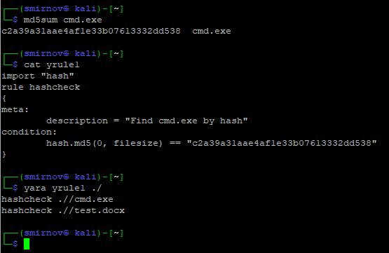
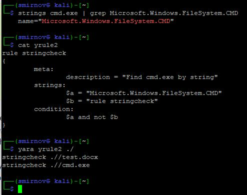
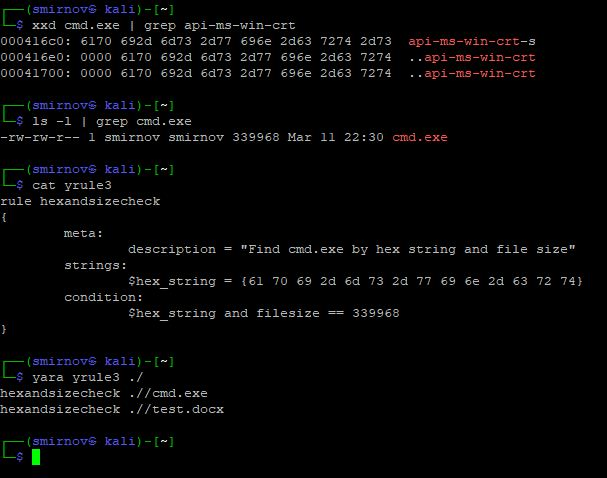

# 7.11. Домашнее задание к занятию «Статический и динамический анализ». - Андрей Смирнов.

В качестве результата пришлите ответы на вопросы в личном кабинете студента на сайте [netology.ru](https://netology.ru).

## Задание 1

Создайте три правила Yara для определения файла **cmd.exe**.
В итоге у вас должны получится три отдельных файла, по которым должен определяться только файл **cmd.exe**.


----

### Ответ:

Для тестирования правил я скопировал файл **cmd.exe** с машины под управлением ОС Windows на VM с Kali linux, а так же сделал копию данного файла изменив его название и расширение на **test.docx**


1. Правило по поиску **cmd.exe** через размер (хэш) файла:


```
import "hash"
rule hashcheck
{
meta:
	description = "Find cmd.exe by hash"
condition:
	hash.md5(0, filesize) == "c2a39a31aae4af1e33b07613332dd538"
}
```


Результат работы правила:





----


2. Правило по поиску **cmd.exe** через нахождение строки `Microsoft.Windows.FileSystem.CMD`:

```
rule stringcheck
{
	meta:
		description = "Find cmd.exe by string"
	strings:
		$a = "Microsoft.Windows.FileSystem.CMD"
		$b = "rule stringcheck"
	condition:
		$a and not $b
}
```


Результат работы правила:





----


3. Правило по поиску **cmd.exe** через нахождение строки `api-ms-win-crt` в HEX-коде, с указанием размера искомого файла (339968 байт):


```
rule hexandsizecheck
{
	meta:
		description = "Find cmd.exe by hex string and file size"
	strings:
		$hex_string = {61 70 69 2d 6d 73 2d 77 69 6e 2d 63 72 74}
	condition:
		$hex_string and filesize == 339968
}
```


Результат работы правила:





----

