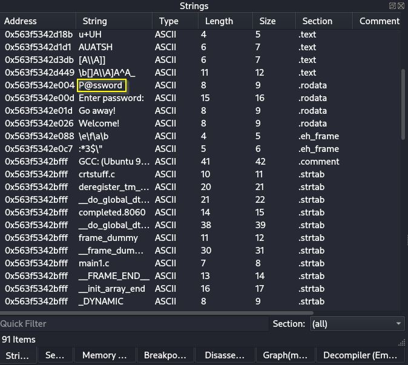
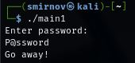
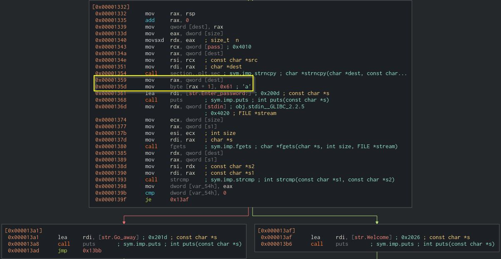
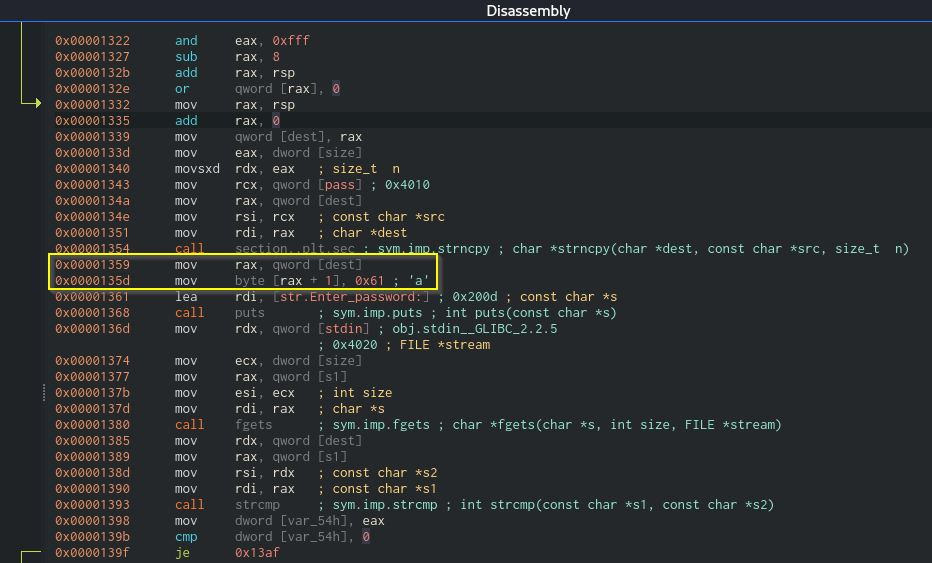
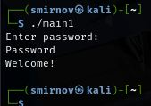

# 7.12. Домашнее задание к занятию «Реверс-инжиниринг». - Андрей Смирнов.

В качестве результата пришлите ответы на вопросы в личном кабинете студента на сайте [netology.ru](https://netology.ru).

## Задание 1

Чем отличается декомпиляция от дизассемблирования?

*Напишите ответ в свободной форме.*

----

### Ответ:

Декомпиляция — преобразование машинного кода в примерный высокоуровневый код (например, Python, C++, Java и т.п.). Этого достаточно для понимания логики, но преобразование происходит не точно (теряются имена переменных и прочие нюансы). 

Дизассемблирование — перевод машинного кода в ассемблерный код (низкоуровневые инструкции процессора). Это даёт точное представление о работе программы, но гораздо сложнее для анализа (необходимо глубокое знание ассемблера).

----

## Задание 2* (необязательное)

Найдите пароль, который требует программа [main1](../00_Code/main1).
(При вводе правильного пароля будет вывед текст "Welcome!")

----

### Ответ:

Для поиска пароля я сначала посмотрел секцию strings в Cutter. В принципе можно было просто выполнить команду `strings main1`, но я заранее установил Cutter и решил работать в нем. Там я обнаружил потенциальный пароль `P@ssword` :

Однако при проверке пароль `P@ssword` не подошел:

Пришлось дальше разбираться в структуре программы с помощью Cutter. В секции Graph я нашел операцию сравнения введенного пароля с эталоном:

Мое внимание привлека секция кода выделенная желтым - там в исходном пароле перед операцией сравнения заменялся второй символ на `а`, я нашел данную секцию в разделе Disassembly исходный пароль `pass` содержался в статической строке памяти с адресом `0x4010`. Я пробовал считать её в режиме debug выставляя брекпоинт на 0x00001343, но безуспешно (видимо не хватило навыков владения ПО Cutter). Однако тут так же было видно, что второй символ исходного пароля заменяется на `a`.

Я вновь попытался подобрать пароль заменив в нем второй символ на `a` , т.е. попытался использовать `Password` . В этот раз все получилось, пароль подошел. Таким образом данная программа ожидает пароль `Password` .

----