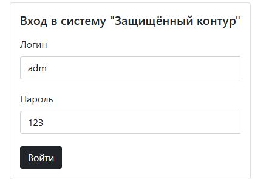
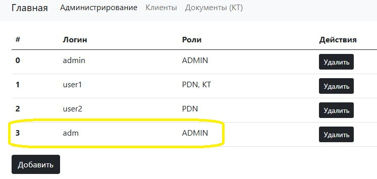

# 7.13. Итоговая работа по модулю "Защищённый контур" (Профессия Специалист по информационной безопасности) - Андрей Смирнов.

## Легенда

Компания Х использует корпоративное сетевое приложение "Защищённый контур", позволяющее "безопасно" обмениваться корпоративной информацией (в том числе хранить персональные данные клиентов и информацию, отнесённую к коммерческой тайне). Вам предстоит проанализировать само приложение на уязвимости, а также настройки ОС на серверах, где это приложение функционирует.

Компания разработчик поставляет уже настроенный сервер в виде [OVA](https://drive.google.com/file/d/1YMAQjcHKimoWVMCAr7G7-ZgNk1cvBaFU/view?usp=sharing) (md5 = 5935192d257a003b85584a84dec83367), который (по их заверениям) вполне безопасен и может использоваться "из коробки" (т.е. достаточно импортировать в среду виртуализации и можно запускать в боевой среде).

По информации, полученной от разработчика, цитата: "приложение содержит механизмы безопасности и может использоваться при построении ИСПД до 4 УЗ включительно и систем, обрабатывающих коммерческую тайну".

Документация на приложение разработчиком не предоставлена, поскольку, цитата: "интерфейс интуитивно понятный, обучающих материалов для пользователей не требуется".

Исходные коды так же не предоставлены.

Вас, как специалиста, попросили выполнить анализ данного приложения с точки зрения его реальной защищённости.

## Техническая информация

Цитата:
```
Логин/пароль пользователя в ОС OVA - system/system (после первого запуска необходимо сменить пароль).

Все файлы приложения располагаются в каталоге /opt/sk

Приложение предназначено для работы в ОС Linux x86_64

Приложение настроено в качестве сервиса systemd - sk.service

Приложение запускается на порту 8888 и использует протокол HTTP для своей работы, взаимодействие с приложением осуществляется через веб-интерфейс (посредством веб-браузера с хоста)

При импорте настроек виртуального образа в гипервизор, отличный от Virtual Box, может потребоваться дополнительная настройка сетевого интерфейса виртуального образа с помощью утилиты ip

При первом старте в приложении регистрируется пользователь с логином admin, пароль генерируется автоматически и записывается в файл /opt/sk/password.txt
```

## Задача

Подготовьте отчёт о:
1. Найденных несоответствиях системы требованиям нормативных документов*
1. Найденных "слабостях" (которые могут привести к уязвимостям) и предложение по необходимым мерам для их устранения (если такие меры возможно принять).

Формат отчёта - свободный, но обязательно должен включать указанные выше два пункта.

Примечание*: в части документов нужно:
1. ПДн: реализация мер по обеспечению безопасности в части ИАФ, УПД
1. КТ: "разрешение или запрет доступа к информации, составляющей коммерческую тайну" посредством механизмов разграничения доступа, встроенных в приложение (механизмы ОС и сторонних сервисов рассматривать не нужно)

**Важно**: вы можете использовать любые техники из пройденных на предыдущих курсах: от сканирования портов, подбора паролей, анализа бинарных (исполняемых) файлов до попыток "уронить" приложение, выполнить произвольный код и т.д.

**Важно**: если в части документации нужно рассматривать только само приложение, то в части поиска слабостей вы можете рассматривать и окружение приложения (ОС и сервисы).

<details>
<summary>Подсказка 1</summary>

Попробуйте пройтись по [CWE TOP 25 2020](https://cwe.mitre.org/top25/archive/2020/2020_cwe_top25.html), не обращая внимания на то, что мы ещё не прходили (SQL, CSRF, XML и т.д.).
</details>

<details>
<summary>Подсказка 2</summary>

Перечень мер защиты, которые необходимо реализовать приведён в [21 приказе ФСТЭК России](https://fstec.ru/dokumenty/vse-dokumenty/prikazy/prikaz-fstek-rossii-ot-18-fevralya-2013-g-n-21)
</details>


## Критерии сдачи

1. Подготовлен отчёт
1. Найдено не менее 2х слабостей системы, ведущих к реальным уязвимостям, которые вы проэксплуатировали (т.е. нужно: слабость -> уязвимость -> описание процесса эксплуатации -> полученный результат).


-----


### Отчёт по приложению "Защищённый контур":

 1. Найдены следующие несоответствия системы требованиям нормативных документов:
   
  - Несоответствие пункту 5.1.1 приказа ФСТЭК №21 (необходимость документации по защите информации). 
    Разработчик не предоставил документацию, что противоречит требованиям к эксплуатации ИСПДн (должны быть описаны меры защиты, настройки, политики доступа). 

  - Несоответствие пункту 5.1.2 приказа ФСТЭК №21 (необходимость криптографической защиты при передаче). 
    Приложение использует незашифрованный протокол HTTP, что позволяет перехватывать данные (логины, пароли, персональные данные). 

  - Несоответствие пункту 5.1.4 приказа ФСТЭК №21 (защита от несанкционированного доступа к учетным данным).
    Пароль администратора хранится в файле `/opt/sk/password.txt`  в открытом виде без шифрования. К тому же сам файл доступен для чтения любому пользователю.

    


    При авторизации в приложении вводимый пароль не скрывается, а так же нет политик безопасности для паролей, т.е. система позволяет использовать пароли вида `123`.
    
    


  - Несоответствие пункту 5.1.5 приказа ФСТЭК №21 (регистрация событий безопасности).
    Нет логов доступа к документам, содержащим коммерческую тайну, что не позволит отследить источник утечки.

  - Несоответствие статье №10 98-ФЗ (необходимость контроля доступа к КТ).
    По заявлению разработчика, приложение должно обеспечивать разграничение доступа для КТ, но на деле это не так. Например, пользователь adm с административным доступом имеет возможность просматривать ПДн и скачивать документы с КТ.

    

    

    


 2. Уязвимости приложения:
   
   - Пароль в открытом виде в файле (`/opt/sk/password.txt`). Необходимо использовать хэширование и ограничить доступ к файлу.
  
   - Отсутствие защиты от перебора пароля. Необходимо добавить механизм защиты вроде CAPTCHA с блокировкой после нескольких неудачных попыток авторизации. Так же необходимо скрывать вводимый пароль.
  
   - HTTP вместо HTTPS (порт 8888). Необходимо внедрить HTTPS, настроить сертификаты, а HTTP отключить. Это поможет защититься от перехвата данных и атак типа man in the middle.
  
   - Отсутствие журналирования. Необходимо настроить логирование действий пользователей в приложении, а так же сбор и хранение этих логов.
   
   - Некорректная настройка разграничения прав. В предыдущем разделе я уже указал что администратор может просматривать ПДн и скачивать документы с КТ, т.е. спокойно эксплуатировать данную уязвимость.


 3. Уязвимости сервисов и ОС:  
   
   - Стандартный пароль `system/system`. Необходимо настроить обязательную смену пароля при первом входе.
  
   - Открытый порт №21 с устаревшим vsftpd 3.0.3, который содержит эксплоит Remote Denial of Service (CVE-2021-41310) https://www.exploit-db.com/exploits/49719 . Эксплоит направлен на отказ в обслуживании. 
   Необходимо либо обновить версию ftp-сервера и ограничить с помощью фаервола доступ к данному порту с опрделенных узлов, либо удалить данное ПО.


    


   - Открытый порт №22 с устаревшим OpenSSH 7.6p1, который содержит эксплоит Username Enumeration (CVE-2018-15473) https://www.exploit-db.com/exploits/45233 . Данный эксплоит позволяет злоумышленнику определить существующие имена пользователей на сервере SSH, используя особенность в обработке неверных аутентификационных запросов. 
   Необходимо обновить ПО до последней версии, ограничить с помощью фаервола доступ к данному порту с опрделенных узлов, а так же настроить fail2ban.


1. Реализация атаки:
   
   Поскольку в исходной системе нет fail2ban и не настроен фаервол, можно используя уязвимость OpenSSH 7.6p1 подобрать имя пользователя системы `system` , а затем устроить атаку на ssh с перебором паролей по словарю (исключительно в демонстрационных целях). Для этого использовалось ПО hydra, пароль был быстро подобран (я предварительно сменил его на `pass123` для ускорения процесса):

   


Таким образом, в ходе составления данного отчета был выявлен ряд критических несоответствий приложения требованиям нормативных документов. Так же были проэксплуатированы 2 уязвимости, одна в приложении где пользователь только с административными правами может просматривать ПДн и скачивать документы с КТ, а вторая - с брутфорсом SSH. Без устранения всех перечисленных недостатков использование данного приложения в ИСПДн и для КТ недопустимо.


-----