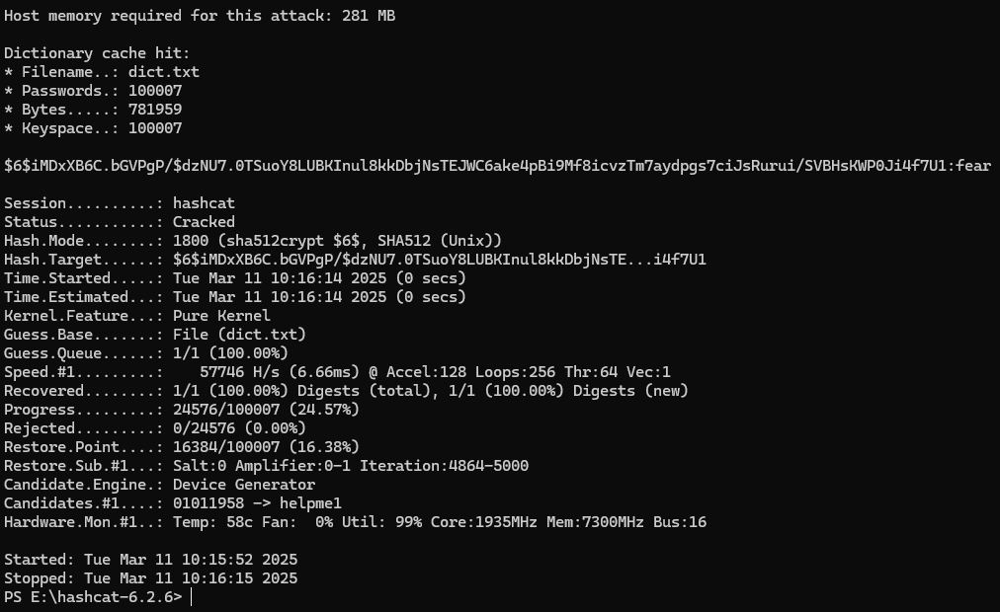

# 7.3. Домашнее задание к занятию «ОС Linux (часть 1)». - Андрей Смирнов.

В качестве результата пришлите ответы на вопросы в личном кабинете студента на сайте [netology.ru](https://netology.ru).

## Задача /etc/shadow

### Легенда

На лекции мы рассмотрели работу файл /etc/shadow. Подберите с помощью Hashcat пароль пользователя по хэшу из `/etc/shadow`

### Задача

У вас есть фрагмент записи из файла `/etc/shadow`: `hackme:$6$iMDxXB6C.bGVPgP/$dzNU7.0TSuoY8LUBKInul8kkDbjNsTEJWC6ake4pBi9Mf8icvzTm7aydpgs7ciJsRurui/SVBHsKWP0Ji4f7U1:...`.

Подберите пароль к данной учётной записи.

### Выполнение

<details>
<summary>Пошаговое выполнение</summary>

В качестве примера мы рассмотрим пользователя с паролем `password`.

В файле `/etc/shadow` запись для данного пользователя будет вида: `hackme:$6$LXtFFs9lpTMP9OB8$Pt8bV28JD2GWQ3vHUa9cLiAOv/KLUrLBPEuzIjOLtGKi2Q81HYQ3TXPa61KJzu0uEbUqtCVnCEXATcUvS77by1:...`

Начиная с первого символа `$` до второго символа `$` (`6` в примере) идёт информация об алгоритме хэширования:
* `$1$` - MD5
* `$2a$` - Blowfish
* `$2y$` - Blowfish
* `$5$` - SHA-256
* `$6$` - SHA-512

Со второго `$` до следующего `$` идёт соль (в примере `LXtFFs9lpTMP9OB8`). Что за соль? Поскольку для популярных паролей уже сосчитаны хэши и вы можете за секунду их подобрать на CrackStation или любом другом ресурсе, то пароли "солят" - хэшируют не сам пароль, а соль + пароль. Таким образом, предвычисленные таблицы уже не помогут. Соль должна быть случайной для каждого пароля и хранится вместе с паролем.

С последнего `$` и до `:` идёт сам хэш (от "солённого" пароля: `Pt8bV28JD2GWQ3vHUa9cLiAOv/KLUrLBPEuzIjOLtGKi2Q81HYQ3TXPa61KJzu0uEbUqtCVnCEXATcUvS77by1`).

Проверить это достаточно легко:

```shell script
openssl passwd -6 -salt LXtFFs9lpTMP9OB8 password
# где 6 - тип алгоритма
$6$LXtFFs9lpTMP9OB8$Pt8bV28JD2GWQ3vHUa9cLiAOv/KLUrLBPEuzIjOLtGKi2Q81HYQ3TXPa61KJzu0uEbUqtCVnCEXATcUvS77by1
```

Теперь, когда вы знаете алгоритм, для вас не составит труда с помощью hashcat подобрать пароль по словарю для задания (в качестве аргумента hashcat передавайте строку `$6$LXtFFs9lpTMP9OB8$Pt8bV28JD2GWQ3vHUa9cLiAOv/KLUrLBPEuzIjOLtGKi2Q81HYQ3TXPa61KJzu0uEbUqtCVnCEXATcUvS77by1`)

Подсказка: ищите в hashcat тип хеша для которого в скобках написано `Unix`.
</details>


-----


### Ответ:


Поскольку в исходном хэше используется  `SHA-512`  (об этом говорит `6` между первыми двумя `$`), то область поиска алгоритма значительно сужается. Необходимо проверить только алгоритмы с длинной хэша 512 бит. Я посмотрел в справке hashcat наиболее подходящие и решил их проверить: `19200 | QNX /etc/shadow (SHA512)` - не подошел, а вот `1800 | sha512crypt $6$, SHA512 (Unix)` -  дал положительный результат - пароль `fear`.

Использовалась команда `.\hashcat.exe -m 1800 '$6$iMDxXB6C.bGVPgP/$dzNU7.0TSuoY8LUBKInul8kkDbjNsTEJWC6ake4pBi9Mf8icvzTm7aydpgs7ciJsRurui/SVBHsKWP0Ji4f7U1' dict.txt`, где dict.txt - файл словаря с 100000 популярных паролей, так же пришлось взять передаваемый аргумент в кавычки из=за наличия сепаратора `/` (иначе hashcat выдвавал ошибку `Separator unmatched`). 

Успешный результат:


Т.е. использован алгоритм хэширования `sha512crypt $6$, SHA512 (Unix)`, а заданный пароль `fear`


-----