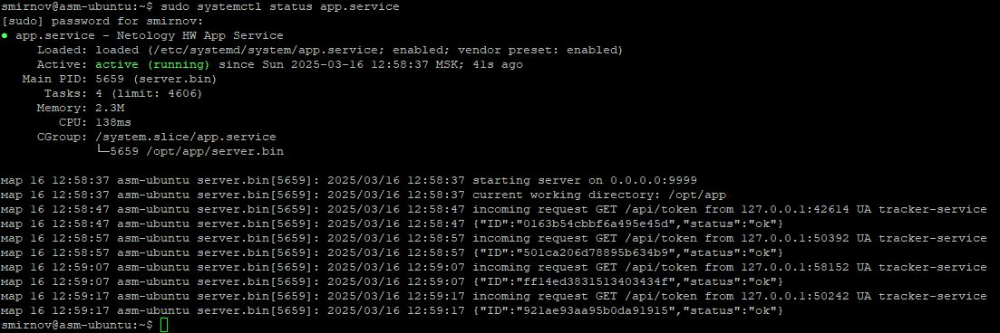
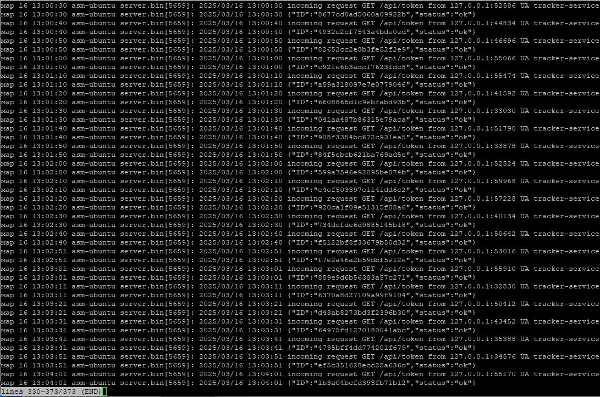
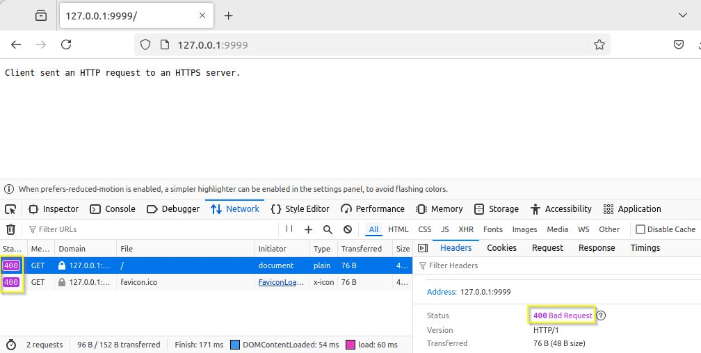
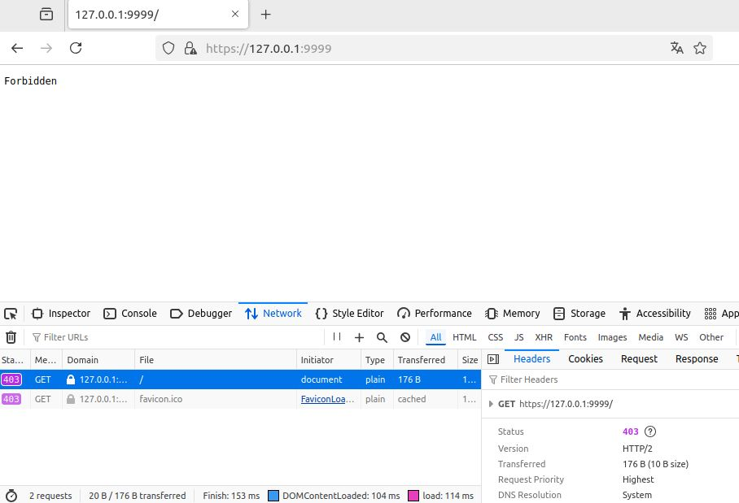

# 7.4. Домашнее задание к занятию «ОС Linux (часть 2)». - Андрей Смирнов.

В качестве результата пришлите ответы на вопросы в личном кабинете студента на сайте [netology.ru](https://netology.ru).

## Задача SystemCtl & JournalCtl

### Легенда

На лекции мы рассмотрели работу с Systemd и Journald. В это ДЗ вам необходимо будет закрепить данные навыки, зарегистрировав предлагаемый вам сервер в качестве сервиса Systemd и проанализировав его логи с помощью JournalCtl.

### Задача

Скачайте:
1. [Исполняемый файл сервера](assets/server.bin)
1. [Сертификат](assets/certificate.pem) и [приватный ключ](assets/key.pem)

Настройте запуск сервера (используйте виртуальную машину с ОС Ubuntu) при старте системы с рабочим каталогом `/opt/app` (сертификаты должны располагаться в нём же).

С помощью `journalctl` отследите, лог приложения (не менее 2х минут) и пришлите:
1. Скриншот, либо содержимое файла `app.service`
1. Ответы на вопросы:
    1. На каком IP и порту запускается сервис
    1. Кто (IP и порт) шлёт запросы на этот сервис и на какой путь
    1. Какие ответы (формат) получает клиент из п.ii получает в ответ на свои запросы
    1. Какой ответ (HTTP статус код) получите вы, если пошлёте из браузера запрос на этот же адрес (сертификат самоподписанный, поэтому вам необходимо принять его)

### Выполнение

<details>
<summary>Пошаговое выполнение</summary>

1. Исполняемый файл сервера поместите в каталог `/opt/app` (при необходимости создайте его командой `sudo mkdir -p /opt/app`)
1. Установите права на исполнение на файл сервера командой: `sudo chmod +x /opt/app/server.bin`
1. Разместите сертификаты в каталоге `/opt/app` (необходимо их скопировать в этот каталог)
1. Настройте сервис Systemd под именем `app.service` (файл `/etc/systemd/system/app.service`) таким образом, чтобы:
    * сервис запускался при старте системы (после `network.target` и `auditd.service`)
    * сервис перезапускался при ошибке (`on-failure`)
    * рабочий каталог сервиса был равен `/opt/app`
1. Запустите сервис командой `sudo systemctl start app.service`
1. Удостоверьтесь, что сервис запустился командой `sudo systemctl status app.service`
1. Подождите несколько минут
1. Посмотрите журналы сервиса командой `sudo journalctl -u app.service`
1. Включите сервис в "автозагрузку" командой `sudo systemctl enable app.service`
1. Удостоверьтесь, что после перезагрузки ОС сервис автоматически запускается с помощью команды `sudo systemctl status app.service`
</details>

<details>
<summary>Подсказка (общий вид файла app.service)</summary>

```
[Unit]
Description=...
After=...

[Service]
ExecStart=...

[Install]
WantedBy=...
```
</details>


-----


### Ответ:

1. Синтаксис файла app.service следующий:

```
[Unit]
Description=Netology HW App Service
After=network.target auditd.service

[Service]
ExecStart=/opt/app/server.bin
WorkingDirectory=/opt/app
Restart=on-failure

[Install]
WantedBy=multi-user.target
Alias=app.service
```

2. Сервис запускается на ip-адресе `0.0.0.0` (все интерфейсы) и порту `9999`:



3. Localhost `127.0.0.1` со свободных портов шлет запросы на это сервис по пути `/api/token` , пример запроса: `incoming request GET /api/token from 127.0.0.1:35864 UA tracker-service` :



4. Клиент получает ответы вида `{"ID":"6370a8d27109a99f9104","status":"ok"}`

5. Если отправить запрос по `http` на `127.0.0.1:9999`, ответ с кодом `400` , если же отправить по `https` - получим `403`  :







-----