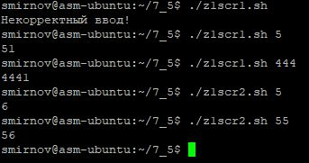
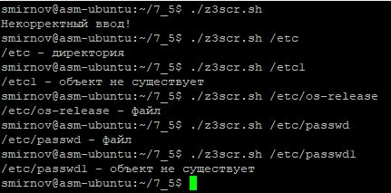
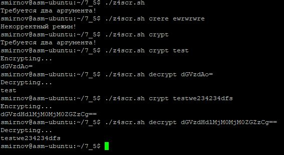

# 7.5. Домашнее задание к занятию «Использование командных оболочек 1. Bash». - Андрей Смирнов.

В качестве результата пришлите ответы на вопросы в личном кабинете студента на сайте [netology.ru](https://netology.ru/).

**Важно**: перед отправкой переименуйте ваш скрипт в `script.txt` (система отправки файлов Netology блокирует файлы с расширением `.sh`).


## Задание 1

Напишите два скрипта, каждый из которых принимает один параметр и:

- первый - прибавляет к параметру единицу как строку.

  **Например:**  

  **user@user:~$ ./test_1.sh 5**  

  **51**  

- второй - прибавляет к параметру единицу как число.

  **Например:**  

  **user@user:~$ ./test_2.sh 5**  

  **6**  


-----


### Ответ:

Скрипт №1:

```bash script
#!/bin/bash

if [ -n "$1" ]; then
    echo $1"1"
else
    echo "Некорректный ввод!"
fi  
```


Скрипт №2:

```bash script
#!/bin/bash

if [ -n "$1" ]; then
    echo $(($1+1))
else
    echo "Некорректный ввод!"
fi 
```

Результат работы скриптов:




-----


## Задание 2

Напишите скрипт, который выводит содержимое каталога и подсчитывает в нём количество файлов.

**Например:**  

**user@user:~$ ./test_dir.sh  
admin_scripts**  
**...**  
**Videos**
**Total: 22**  


----


### Ответ:

Скрипт:

```bash script
#!/bin/bash

fcount=0

ls -l

fcount=$(stat -c '%F %s' * | grep 'file' | wc -l)
echo "В этой папке всего - $fcount файлов."
```


Результат работы скрипта:


----


## Задание 3

Напишите скрипт, который принимает один параметр и определяет, какой объект передан этим параметром (файл, каталог или не существующий). 

**Например:**

**user@user:~$ ./test.sh /etc**  
**/etc - dir**  
**user@user:~$ ./test.sh /etc/passwd**  
**/etc/passwd - file**  
**user@user:~$ ./test.sh /etc/passwd1**  
**/etc/passwd1 - not exist**  


----


### Ответ:

Скрипт:

```bash script
#!/bin/bash

if [ -n "$1" ]; then
  if [ -d "$1" ]; then
    echo "$1 - директория"
  elif [ -f "$1" ]; then
    echo "$1 - файл"
  else
    echo "$1 - объект не существует"
  fi     
else
    echo "Некорректный ввод!"
fi
```


Результат работы скрипта:




----


## Задание 4* (необязательное)

### Легенда

Пользователи в нашей компании начали пересылать друг другу некие "секретные" сообщения. Т.к. доступа к средствам криптографии у них нет, для "шифрования" они используют преобразование строк в формат [Base64](https://ru.wikipedia.org/wiki/Base64).

### Задача

Написать скрипт для Bash, который:

1. принимает на входе два аргумента. Первый - режим преобразования, второй - строка;
2. если первый параметр равен `crypt` - преобразует второй параметр в строку Base64;
3. если первый параметр равен `decrypt` - преобразует второй параметр в текст;
4. если первый параметр равен любой другой строке - выйти из скрипта с ненулевым кодом возврата и сообщить об этом пользователю;
5. если количество параметров скрипта не равно двум - выйти из скрипта с ненулевым кодом возврата выдать сообщение пользователю и завершить работу.

Пример работы:

```
$ ./script.sh crypt test
Encrypting...
dGVzdAo=
$ ./script.sh decrypt dGVzdAo=
Decrypting...
test
```

**Важно**: если вы работаете на Windows, вам достаточно Cygwin (не обязательно делать ДЗ в виртуалке).

### Реализация

<details open="" style="box-sizing: border-box; display: block; margin-bottom: 0px !important; margin-top: 0px;"><summary style="box-sizing: border-box; display: list-item; cursor: pointer;">Подсказки</summary><p style="box-sizing: border-box; margin-bottom: 16px; margin-top: 0px;">1. Для работы со строками можно использовать стандартную утилиту base64:</p><p style="box-sizing: border-box; margin-bottom: 16px; margin-top: 0px;"><code style="box-sizing: border-box; font-family: ui-monospace, SFMono-Regular, &quot;SF Mono&quot;, Consolas, &quot;Liberation Mono&quot;, Menlo, monospace; font-size: 13.6px; background-color: var(--color-markdown-code-bg); border-radius: 6px; margin: 0px; padding: 0.2em 0.4em;">base64 &lt;строка&gt;</code><span>&nbsp;</span>- преобразование в формат base64</p><p style="box-sizing: border-box; margin-bottom: 16px; margin-top: 0px;"><code style="box-sizing: border-box; font-family: ui-monospace, SFMono-Regular, &quot;SF Mono&quot;, Consolas, &quot;Liberation Mono&quot;, Menlo, monospace; font-size: 13.6px; background-color: var(--color-markdown-code-bg); border-radius: 6px; margin: 0px; padding: 0.2em 0.4em;">base64 -d &lt;строка&gt;</code><span>&nbsp;</span>- преобразование в текст</p><p style="box-sizing: border-box; margin-bottom: 16px; margin-top: 0px;">2. Для выхода их скрипта можно использовать команду<span>&nbsp;</span><code style="box-sizing: border-box; font-family: ui-monospace, SFMono-Regular, &quot;SF Mono&quot;, Consolas, &quot;Liberation Mono&quot;, Menlo, monospace; font-size: 13.6px; background-color: var(--color-markdown-code-bg); border-radius: 6px; margin: 0px; padding: 0.2em 0.4em;">exit</code>:</p><div class="highlight highlight-source-shell position-relative" style="box-sizing: border-box; position: relative !important; margin-bottom: 16px;"><pre style="box-sizing: border-box; font-family: ui-monospace, SFMono-Regular, &quot;SF Mono&quot;, Consolas, &quot;Liberation Mono&quot;, Menlo, monospace; font-size: 13.6px; margin-bottom: 0px; margin-top: 0px; overflow-wrap: normal; background-color: var(--color-bg-tertiary); border-radius: 6px; line-height: 1.45; overflow: auto; padding: 16px; word-break: normal;"><span class="pl-c1" style="box-sizing: border-box; color: var(--color-prettylights-syntax-constant);">exit</span></pre></div><p style="box-sizing: border-box; margin-bottom: 16px; margin-top: 0px;">Завершит выполнение скрипта ровно в той точке, в которой была вызвана с кодом 0 (0 означает успешное выполнение)</p><div class="highlight highlight-source-shell position-relative" style="box-sizing: border-box; position: relative !important; margin-bottom: 16px;"><pre style="box-sizing: border-box; font-family: ui-monospace, SFMono-Regular, &quot;SF Mono&quot;, Consolas, &quot;Liberation Mono&quot;, Menlo, monospace; font-size: 13.6px; margin-bottom: 0px; margin-top: 0px; overflow-wrap: normal; background-color: var(--color-bg-tertiary); border-radius: 6px; line-height: 1.45; overflow: auto; padding: 16px; word-break: normal;"><span class="pl-c1" style="box-sizing: border-box; color: var(--color-prettylights-syntax-constant);">exit</span> 1</pre></div><p style="box-sizing: border-box; margin-bottom: 16px; margin-top: 0px;">Завершит выполнение скрипта ровно в той точке, в которой была вызвана с кодом 1 (любой ненулевой код свидетельствует об ошибке)</p><p style="box-sizing: border-box; margin-bottom: 16px; margin-top: 0px;">Посмотреть код завершения можно сразу после вызова:</p><div class="highlight highlight-source-shell position-relative" style="box-sizing: border-box; position: relative !important; margin-bottom: 16px;"><pre style="box-sizing: border-box; font-family: ui-monospace, SFMono-Regular, &quot;SF Mono&quot;, Consolas, &quot;Liberation Mono&quot;, Menlo, monospace; font-size: 13.6px; margin-bottom: 0px; margin-top: 0px; overflow-wrap: normal; background-color: var(--color-bg-tertiary); border-radius: 6px; line-height: 1.45; overflow: auto; padding: 16px; word-break: normal;">$ ./script.sh
$ <span class="pl-c1" style="box-sizing: border-box; color: var(--color-prettylights-syntax-constant);">echo</span> <span class="pl-smi" style="box-sizing: border-box; color: var(--color-prettylights-syntax-storage-modifier-import);">$?</span> <span class="pl-c" style="box-sizing: border-box; color: var(--color-prettylights-syntax-comment);"><span class="pl-c" style="box-sizing: border-box; color: var(--color-prettylights-syntax-comment);">#</span> напечатает код завершения</span></pre></div><p style="box-sizing: border-box; margin-bottom: 16px; margin-top: 0px;">3. Для передачи строки в команды можно использовать каналы (такое вы уже делали на курсе по сетям):</p><div class="highlight highlight-source-shell position-relative" style="box-sizing: border-box; position: relative !important; margin-bottom: 16px;"><pre style="box-sizing: border-box; font-family: ui-monospace, SFMono-Regular, &quot;SF Mono&quot;, Consolas, &quot;Liberation Mono&quot;, Menlo, monospace; font-size: 13.6px; margin-bottom: 0px; margin-top: 0px; overflow-wrap: normal; background-color: var(--color-bg-tertiary); border-radius: 6px; line-height: 1.45; overflow: auto; padding: 16px; word-break: normal;"><span class="pl-c1" style="box-sizing: border-box; color: var(--color-prettylights-syntax-constant);">echo</span> Привет <span class="pl-k" style="box-sizing: border-box; color: var(--color-prettylights-syntax-keyword);">|</span> base64</pre></div><p style="box-sizing: border-box; margin-bottom: 16px; margin-top: 0px;"><strong style="box-sizing: border-box; font-weight: 600;">Важно</strong>: не забудьте дать скрипту права на исполнение (команда<span>&nbsp;</span><code style="box-sizing: border-box; font-family: ui-monospace, SFMono-Regular, &quot;SF Mono&quot;, Consolas, &quot;Liberation Mono&quot;, Menlo, monospace; font-size: 13.6px; background-color: var(--color-markdown-code-bg); border-radius: 6px; margin: 0px; padding: 0.2em 0.4em;">chmod +x ./script.sh</code>)</p></details>


----


### Ответ:

Скрипт:

```bash script
#!/bin/bash

if [ "$#" -ne 2 ]; then
    echo "Требуется два аргумента!"
    exit 1
fi

if [ "$1" = "crypt" ]; then
    echo "Encrypting..."
    echo "$2" | base64
elif [ "$1" = "decrypt" ]; then
    echo "Decrypting..."
    echo "$2" | base64 --decode
else
    echo "Некорректный режим!"
    exit 2
fi
```


Результат работы скрипта:




----
