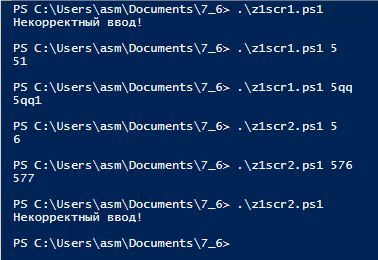
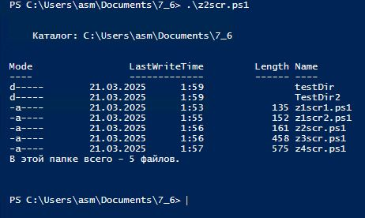
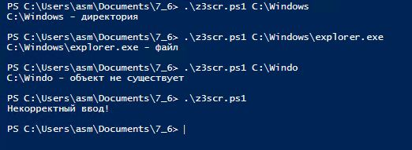
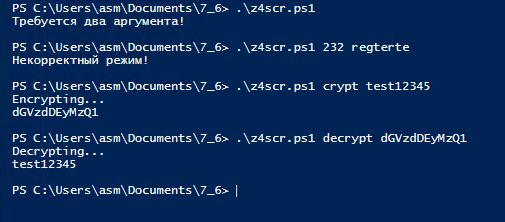

# 7.6. Домашнее задание к занятию «Использование командных оболочек 2. PowerShell». - Андрей Смирнов.

В качестве результата пришлите ответы на вопросы в личном кабинете студента на сайте [netology.ru](https://netology.ru/).

**Важно**: перед отправкой переименуйте ваш скрипт в `script.txt` (система отправки файлов Netology блокирует файлы с расширением `.ps1`).


## Задание 1

Напишите два скрипта, каждый из которых принимает один параметр и:

- первый - прибавляет к параметру единицу как строку.

  **Например:**

  **./test_1.ps1 5**

  **51**

- второй - прибавляет к параметру единицу как число.

  **Например:**

  **./test_2.ps1 5**

  **6**


----


### Ответ:

Скрипт №1:

```powershell script
if ($args.Count -gt 0) {
    Write-Host ($args[0].ToString() + "1")
} else {
    Write-Host "Некорректный ввод!"
}
```


----


Скрипт №2:

```powershell script
if ($args.Count -gt 0) {
    $number = [int]$args[0]
    Write-Host ($number + 1)
} else {
    Write-Host "Некорректный ввод!"
}
```

Результат работы скриптов:




----


## Задание 2

Напишите скрипт, который выводит содержимое каталога и подсчитывает в нём количество файлов.

**Например:**

**./test_dir.ps1**  
**admin_scripts**  
**...**  
**Videos**  
**Total: 22**  

----


### Ответ:

Скрипт:

```powershell script
$fcount = 0

Get-ChildItem

$fcount = (Get-ChildItem -File | Measure-Object).Count
Write-Host "В этой папке всего - $fcount файлов."
```


Результат работы скрипта:




----


## Задание 3

Напишите скрипт, который принимает один параметр и определяет, какой объект передан этим параметром (файл, каталог или не существующий). 

**Например:**

**./test.ps1 c:\windows**  
**c:\windows - dir**  
**./test.ps1 c:\pagefile.sys**  
**c:\pagefile.sys - file**  
**user@user:~$./test.ps1 c:\windows1**  
**c:\windows1 - not exist**  

----


### Ответ:

Скрипт:

```powershell script
if ($args.Count -gt 0) {
    $path = $args[0]

    if (Test-Path $path) {
        if (Test-Path $path -PathType Container) {
            Write-Host "$path - директория"
        }
        elseif (Test-Path $path -PathType Leaf) {
            Write-Host "$path - файл"
        }
    } else {
        Write-Host "$path - объект не существует"
    }
} else {
    Write-Host "Некорректный ввод!"
}
```


Результат работы скрипта:




----


## Задание 4* (необязательное)

### Легенда

Пользователи в нашей компании начали пересылать друг другу некие "секретные" сообщения. Т.к. доступа к средствам криптографии у них нет, для "шифрования" они используют преобразование строк в формат [Base64](https://ru.wikipedia.org/wiki/Base64).

### Задача

Написать скрипт, который:

1. принимает на входе два аргумента. Первый - режим преобразования, второй - строка;
2. если первый параметр равен `crypt` - преобразует второй параметр в строку Base64;
3. если первый параметр равен `decrypt` - преобразует второй параметр в текст;
4. если первый параметр равен любой другой строке - выйти из скрипта с ненулевым кодом возврата и сообщить об этом пользователю;
5. если количество параметров скрипта не равно двум - выйти из скрипта с ненулевым кодом возврата выдать сообщение пользователю и завершить работу.

Пример работы:

```
$ ./script.ps1 crypt test
Encrypting...
dGVzdAo=
$ ./script.ps1 decrypt dGVzdAo=
Decrypting...
test
```

Подсказки
Для работы со строками можно использовать следующие команды:

<pre>[Convert]::ToBase64String([Text.Encoding]::UTF8.GetBytes(<строка>))</pre> - преобразование в формат base64

<pre>[Text.Encoding]::Utf8.GetString([Convert]::FromBase64String(<строка>))</pre> - преобразование в текст


----


### Ответ:

Скрипт:

```powershell script
if ($args.Count -ne 2) {
    Write-Host "Требуется два аргумента!"
    exit 1
}

$action = $args[0]
$phrase = $args[1]

if ($action -eq "crypt") {
    Write-Host "Encrypting..."
    $bytes = [System.Text.Encoding]::UTF8.GetBytes($phrase)
    [System.Convert]::ToBase64String($bytes)
} elseif ($action -eq "decrypt") {
    Write-Host "Decrypting..."
    $bytes = [System.Convert]::FromBase64String($phrase)
    [System.Text.Encoding]::UTF8.GetString($bytes)
} else {
    Write-Host "Некорректный режим!"
    exit 2
}
```


Результат работы скрипта:




----
