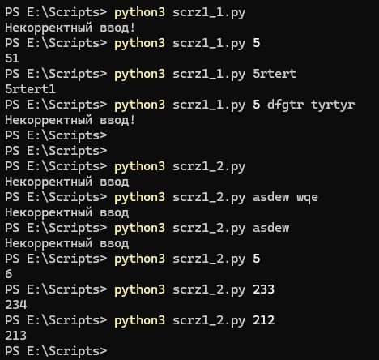

# 7.7. Домашнее задание к занятию «Язык Python. Основы.» - Андрей Смирнов.

В качестве результата пришлите ответы на вопросы в личном кабинете студента на сайте [netology.ru](https://netology.ru/).

**Важно**: перед отправкой переименуйте ваш скрипт в `script.txt` (система отправки файлов Netology блокирует файлы с расширением `.py`).


## Задание 1

Напишите два скрипта, каждый из которых принимает один параметр и:

- первый - прибавляет к параметру единицу как строку.

  **Например:**

  **./python3 test_1.py 5**

  **51**

- второй - прибавляет к параметру единицу как число.

  **Например:**

  **./python3 test_2.py 5**

  **6**


----


### Ответ:

Скрипт №1:

```python
import sys

if len(sys.argv)==2:
    print(str(sys.argv[1]) + "1")
else:
    print("Некорректный ввод!")
```


----


Скрипт №2:

```python
import sys

if len(sys.argv) != 2:
    print("Некорректный ввод")
    sys.exit(1)
else:
    try:
        num = int(sys.argv[1])
        print(num + 1)
    except ValueError:
        print("Некорректный ввод")
```

Результат работы скриптов:




## Задание 2

Напишите скрипт, который выводит содержимое каталога и подсчитывает в нём количество файлов.

**Например:**

**./test_dir.py**  
**admin_scripts**  
**...**  
**Videos**  
**Total: 22**  


----


### Ответ:

Скрипт:

```python
import sys
import os

numf = 0

if len(sys.argv) != 2:
    print("Нужно указать один параметр")
    sys.exit(1)
else:
    path = sys.argv[1]

if os.path.isdir(path):
    flist = os.listdir(path)
    for f in flist:
        print(f)
        fpath = os.path.join(path, f)
        if os.path.isfile(fpath):
            numf += 1
    print("Количество файлов в данной директории:", str(numf) )
elif os.path.isfile(path):
    print("Это файл, а не директория")
else:
    print("Нет такой директории")
```


Результат работы скрипта:


----


## Задание 3

Напишите скрипт, который принимает один параметр и определяет, какой объект передан этим параметром (файл, каталог или не существующий). 

**Например:**

**./test.py \windows**  
**c:\windows - dir**  
**./test.py c:\pagefile.sys**  
**c:\pagefile.sys - file**  
**user@user:~$ c:\windows1**  
**c:\windows1 - not exist**  


----


### Ответ:

Скрипт:

```python
import sys
import os

if len(sys.argv) == 2:
    path = sys.argv[1]
    if os.path.isdir(path) and len(sys.argv)==2:
        print(path, "- это директория")
    elif os.path.isfile(path):
        print(path, "- это файл")
    else:
        print(path, "- нет такого объекта")
else:
    print("Нужно указать один параметр")
```


Результат работы скрипта:


----


## Задание 4* (необязательное)

### Легенда

Пользователи в нашей компании начали пересылать друг другу некие "секретные" сообщения. Т.к. доступа к средствам криптографии у них нет, для "шифрования" они используют преобразование строк в формат [Base64](https://ru.wikipedia.org/wiki/Base64).

### Задача

Написать скрипт, который:

1. принимает на входе два аргумента. Первый - режим преобразования, второй - строка;
2. если первый параметр равен `crypt` - преобразует второй параметр в строку Base64;
3. если первый параметр равен `decrypt` - преобразует второй параметр в текст;
4. если первый параметр равен любой другой строке - выйти из скрипта с ненулевым кодом возврата и сообщить об этом пользователю;
5. если количество параметров скрипта не равно двум - выйти из скрипта с ненулевым кодом возврата выдать сообщение пользователю и завершить работу.

Пример работы:

```
$ ./script.py crypt test
Encrypting...
dGVzdAo=
$ ./script.py decrypt dGVzdAo=
Decrypting...
test
```

Подсказки
Для работы с base64 в языке Python сначала нужно перевести строку в ASCII:

<pre>text_bytes = text.encode('ascii')</pre>

После работы с base64, нужно выполнить обратное преобразование:
<pre>text_bytes = text.decode('ascii')</pre>

Сама конвертация в/из base64 выполняет функциями:
<pre>base64.b64encode(<строка>) и base64.b64decode(<строка>)</pre>


----


### Ответ:

Скрипт:

```python
import sys
import base64

if len(sys.argv) != 3:
    print("Нужно указать два параметра")
    sys.exit(1)
else:
    action = sys.argv[1]
    phrase = sys.argv[2]

    if action == "crypt":
        print("Encrypting...")
        bytes_data = phrase.encode('utf-8')
        print(base64.b64encode(bytes_data).decode('utf-8'))
    elif action == "decrypt":
        print("Decrypting...")
        bytes_data = base64.b64decode(phrase)
        print(bytes_data.decode('utf-8'))
    else:
        print("Некорректный режим")
```


Результат работы скрипта:


----

