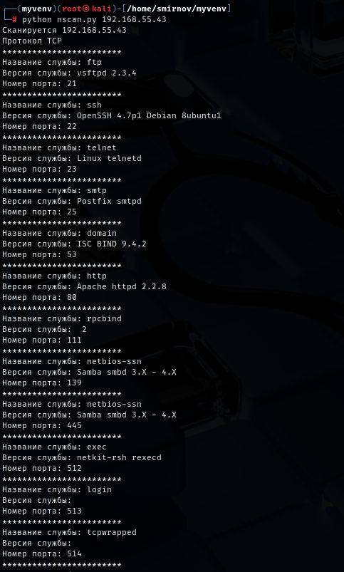
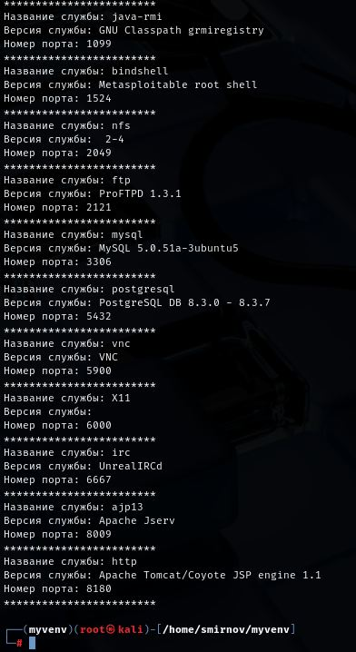

# 7.8. Домашнее задание к занятию «Язык Python в информационной безопасности» - Андрей Смирнов.

В качестве результата пришлите ответы на вопросы в личном кабинете студента на сайте [netology.ru](https://netology.ru/).

**Важно**: перед отправкой переименуйте ваш скрипт в `script.txt` (система отправки файлов Netology блокирует файлы с расширением `.py`).


## Задание 1

Просканируйте с помошью Python ВМ Metasploitable. Определите установленные службы (нужно вывести название и версию службы, номер порта.)

----


### Ответ:

Скрипт:

```python
import nmap
import sys

if len(sys.argv) < 2:
    print("Надо указать ip-адрес")
    sys.exit(1)

ip = sys.argv[1]
nscn = nmap.PortScanner()

print("Сканируется", ip)
nscn.scan(hosts=ip, arguments='-sV')

if ip not in nscn.all_hosts():
    print(ip, "недоступен")
    sys.exit(0)

for proto in nscn[ip].all_protocols():
    print("Протокол", proto.upper())
    print("************************")

    for port in sorted(nscn[ip][proto].keys()):
        service = nscn[ip][proto][port]
        print("Название службы:", service['name'])
        print("Версия службы:", service['product'], service['version'])
        print("Номер порта:", port)
        print("************************")
```


Результат работы скрипта:







----


## Задание 2* (необязательное)

Данное задание не является обязательным, т.к. может потребоваться дополнительное оборудование.

Попробуйте повторить сканирование Wi-Fi, приведенное в лекции.

*Помните, что атаковать чужие устройства, - наказуемое законом дияние. Поэтому, все работы должны проводится на вашем оборудовании или с письменного согласия владельца!*


## Обратите внимание
Если при установки пакета у вас появилось сообщение `error: externally managed environment`, самым простым решением будет указать дополнительный параметр, приведенный в самой ошибке: `--break-system-packages`. Альтернативными вариантами будет использование `pipx` или создание отдельного окружения.

Подробнее [по ссылке](https://stackoverflow.com/questions/75608323/how-do-i-solve-error-externally-managed-environment-every-time-i-use-pip-3)
