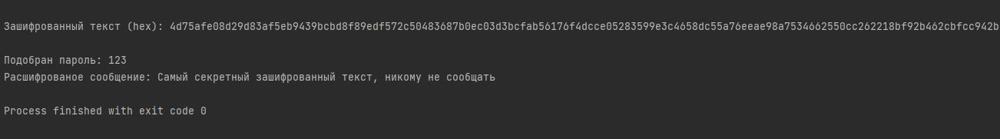

# 7.9. Домашнее задание к занятию «Язык программирования Python. Криптография.» - Андрей Смирнов.

В качестве результата пришлите ответы на вопросы в личном кабинете студента на сайте [netology.ru](https://netology.ru/).

**Важно**: перед отправкой переименуйте ваш скрипт в `script.txt` (система отправки файлов Netology блокирует файлы с расширением `.py`).


## Задание 1

Реализуйте атаку грубой силой на текст, зашифрованный AES. В качестве пароля возьмите трёхзначное число.


Примечание: вместо **pip install *cryptodome*** сейчас лучше использовать **pip install *pycryptodome***, - это обновлённый пакет криптографии для Python. Более подробую информацию можно посмотреть вот здесь: [Installation pycryptodome](https://pycryptodome.readthedocs.io/en/latest/src/installation.html?highlight=Cryptodome#compiling-in-linux-ubuntu)


----


### Ответ:

Скрипт:

```python
from Crypto.Cipher import AES
from Crypto.Util.Padding import pad, unpad
from Crypto import Random
import hashlib

text = "Самый секретный зашифрованный текст, никому не сообщать"
pswd = "123"

def encrypt(plaintext, password):
    key = hashlib.sha256(password.encode()).digest()
    iv = Random.new().read(AES.block_size)
    cipher = AES.new(key, AES.MODE_CBC, iv)
    return iv + cipher.encrypt(pad(plaintext.encode(), AES.block_size))


def decrypt(ciphertext, password):
    key = hashlib.sha256(password.encode()).digest()
    iv = ciphertext[:AES.block_size]
    cipher = AES.new(key, AES.MODE_CBC, iv)
    return unpad(cipher.decrypt(ciphertext[AES.block_size:]), AES.block_size)


def bforce(ciphertext):
    iv = ciphertext[:16]
    encrypted = ciphertext[16:]

    for num in range(1000):
        password = f"{num:03d}"
        try:
            decrypted = decrypt(ciphertext, password)
            print(f"\nПодобран пароль: {password}")
            print("Расшифрованое сообщение:", decrypted.decode())
            return
        except:
            continue
    print("\nНе удалось подобрать пароль")

encrypted_data = encrypt(text, pswd)
print("\nЗашифрованный текст (hex):", encrypted_data.hex())

bforce(encrypted_data)
```

Результат работы скрипта:




----