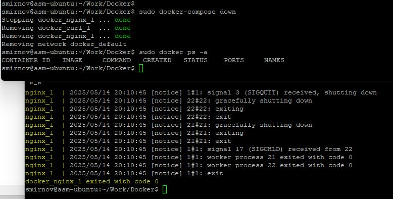

# 8.1. Домашнее задание к занятию «Контейнеризация (Docker)». - Андрей Смирнов.

### Цель задания

Docker - это инструмент, который помогает упаковать приложения в специальные контейнеры. Это своего рода коробка, в которой есть все необходимое для запуска приложения: код приложения, его зависимости, библиотеки и настройки.

Docker предоставляет среду для управления и изоляции приложений. Таким образом контейнеры могут быть запущены в изолированных средах. С Docker можно создавать и тестировать различные среды. Это позволяет специалистам по ИБ проводить тестирование на проникновение и оценивать безопасность приложений в контролируемой среде, не затрагивая реальные рабочие системы.

В этом домашнем задании вы выполните несколько практических задач, которые помогут вам освоить работу с образами и контейнерами Docker на базовом уровне. Для того, чтобы вы не отвлекались на поиск и повторение теории, в этом задании мы подготовили подробный алгоритм под каждую задачу. Вам достаточно перейти по соответствующей ссылке к заданию.

В результате выполнения задания вы сможете:

1. Устанавливать и настраивать базовые компоненты Docker.
2. Выполнять базовые приёмы работы с образами и контейнерами.
3. Работать с командами bash и сравнивать результаты из контейнера с результатами команд в основной системе.
4. Собирать преднастроенные образы Docker с помощью конфигурационного файла Dockerfile.
5. Запускать контейнер с автоматическим выполнением преднастроенного сценария.
6. Запускать подготовленную связку контейнеров с помощью конфигурационного файла docker-compose.yml.

-----

### Инструкция к заданию

1. Настройте работу компонентов Docker на виртуальной машине (рекомендации размещены по [ссылке](https://github.com/netology-code/ibdev-homeworks/blob/master/01_docker_new/instr_linux.md))
2. Выполните задания.
3. В качестве результата отправьте ответы на вопросы в личном кабинете студента на сайте [netology.ru](https://netology.ru).
4. Любые вопросы по решению задач задавайте в чате учебной группы.

------

## Задание 1. Образы и контейнеры Docker

### Описание задания

Необходимо установить базовые компоненты Docker. Выполните загрузку готового образа из общедоступного репозитория, запустите контейнер на основе загруженного образа, реализуйсте базовые операции с контейнерами и образами.

Выполните задание, руководствуясь подробной [инструкцией](https://github.com/netology-code/ibdev-homeworks/blob/master/01_docker_new/task/docker.md).

### Результат выполненного задания

В качестве результата работы вам необходимо предоставить отчёт, включающий следующие скриншоты с вашими текстовыми комментариями:
- скриншот вывода результатов команды `ifconfig` (на Kali Linux) или `ip a` (на Ubuntu);
- скриншот вывода результатов команды `sudo docker pull bash`;
- скриншот вывода результатов команды `sudo docker run -it bash`;
- скриншот вывода результатов команды `sudo docker stop names`;
- скриншот вывода результатов команды `sudo docker rm names`;
- скриншот вывода результатов команды `sudo docker rmi repository`;
- скриншот вывода результатов команды `sudo docker ps -a`;
- скриншот вывода результатов команды `sudo docker image ls`.

----

### Ответ:

1. Cкриншот вывода результатов команды `ip a` (вывод настроек сетевых интерфейсов в Ubuntu):

2. Cкриншот вывода результатов команды `sudo docker pull bash` (загрузка образа с именем bash из репозитория Docker HUB):

3. Cкриншот вывода результатов команды `sudo docker run -it bash` (запуск контейнера на базе образа bash в интерактивном режиме командой):

4. Cкриншот вывода результатов команды `sudo docker stop names`, данная команда останавливает контейнер, вместо `names` указываем имя контейнера:

5. Cкриншот вывода результатов команды `sudo docker rm names`, данная команда удаляет неактивный контейнер, вместо `names` указываем имя контейнера:

6. Cкриншот вывода результатов команды `sudo docker rmi repository`, данная команда выдает ошибку `Error response from daemon: No such image: repository:latest`, для удаления образа надо указать его имя:

7. Cкриншот вывода результатов команды `sudo docker ps -a` . Вывод пустой, поскольку ранее контейнер был удален:

8. Cкриншот вывода результатов команды `sudo docker image ls` . Вывод пустой, поскольку ранее образы были удалены:

----

## Задание 2. Bash в Docker

### Описание задания

Необходимо выполнить работу с контейнером Docker в интерактивном режиме и предоставить объективные доказательства присутствия в контейнере.

Выполните задание, руководствуясь подробной [инструкцией](https://github.com/netology-code/ibdev-homeworks/blob/master/01_docker_new/task/bash.md).

### Результат выполненного задания

В качестве результата работы вам необходимо предоставить отчёт, включающий следующие скриншоты с вашими текстовыми комментариями:
- скриншот вывода результатов команды `sudo docker run –rm -it bash`;
- скриншот вывода результатов команды `whoami` и `cat /etc/*release*` (в контейнере);
- скриншот вывода результатов команды `ls -la /` (в контейнере);
- скриншот вывода результатов команды `whoami` и `cat /etc/*release*` (в основной системе);
- скриншот вывода результатов команды `ls -la /` (в основной системе).

----

### Ответ:

1. Cкриншот вывода результатов команды `sudo docker run –rm -it bash`:

2. Cкриншот вывода результатов команд `whoami` и `cat /etc/*release*` (в контейнере):

3. Cкриншот вывода результатов команды `ls -la /` (в контейнере):

4. Cкриншот вывода результатов команды `whoami` и `cat /etc/*release*` (в основной системе):

5. Cкриншот вывода результатов команды `ls -la /` (в основной системе):

----

## Задание 3. Dockerfile

### Описание задания

Вы запустили контейнер на основе готового образа из общедоступного репозитория Docker HUB и вручную выполнили отдельные команды для решения простых задач. Далее необходимо подготовить образ, который будет содержать заложенные директивы. Они будут автоматически выполнены при запуске контейнера. Директивы прописываются в специальном конфигурационном файле Dockerfile.

В этом задании вы:
- подготовите файл скрипта с командами, которые планируется автоматически выполнить в контейнере bash;
- подготовите конфигурационный файл Dockerfile с директивами для сборки преднастроенного образа;
- выполните сборку образа, который будет включать преднастроенный сценарий для контейнера;
- запустите контейнер на основе преднастроенного образа и получите результаты выполнения команд после автоматического запуска скрипта;
- запустите вручную этот скрипт в командной оболочке основной системы Kali Linux;
- сравните полученные результаты из контейнера и основной системы.

Выполните задание, руководствуясь подробной [инструкцией](https://github.com/netology-code/ibdev-homeworks/blob/master/01_docker_new/task/dockerfile.md).

### Результат выполненного задания

В качестве результата работы вам необходимо предоставить отчёт, включающий следующие скриншоты с вашими текстовыми комментариями:
- скриншот вывода содержимого файла скрипта `cat my_bash_1.sh` (необходимо указывать назначенное вами имя скрипта);
- скриншот вывода содержимого файла Dockerfile `cat Dockerfile`;
- скриншот результатов сборки образа `sudo docker build -t image_bash_1 .` (необходимо указывать назначенное вами имя образа);
- скриншот результатов запуска контейнера `sudo docker run –rm image_bash_1` (необходимо указывать назначенное вами имя образа);
- скриншот результатов запуска скрипта в основной системе `./my_bash_1.sh` (необходимо указывать назначенное вами имя скрипта).

**Важно**: вы можете доработать скрипт и Dockerfile, но на предоставленных скриншотах обязательно должны присутствовать: характерные отличительные признаки контейнера и основной системы, ваше Ф.И.О., дата и время.

----

### Ответ:

1. Cкриншот вывода содержимого файла скрипта `cat asm_bash.sh`:

2. Cкриншот вывода содержимого файла Dockerfile `cat Dockerfile`:

3. Cкриншот результатов сборки образа `sudo docker build -t asm_bash_1 .`:

4. Cкриншот результатов запуска контейнера `sudo docker run –-rm asm_bash_1`:

5. Cкриншот результатов запуска скрипта в основной системе `./asm_bash.sh`:

----

## Задание 4. Docker-compose

### Описание задания

Необходимо реализовать запуск подготовленной связки контейнеров с использованием конфигурационного файла docker-compose.yml.

До сих пор вы взаимодействовали с одиночным контейнером, как обособленным элементов для решения своих задач. Теперь вам предстоит поработать с более сложной технологией контейнеризации - запуском подготовленной связки контейнеров (не менее двух). Это отдельные программные сервисы, которые взаимодействуют между собой в рамках единой задачи. 

В этом задании вы:
- загрузите из общедоступного репозитория Docker HUB два готовых образа;
- подготовите два файла, необходимые для реализации проекта: index.html и docker-compose.yml;
- запустите связку из двух контейнеров;
- отработайте базовые команды для управления связкой контейнеров;
- замените в одном из контейнеров исходный файл HTML своим подготовленным экземпляром;
- проведёте анализ полученных результатов.

Выполните задание, руководствуясь подробной [инструкцией](https://github.com/netology-code/ibdev-homeworks/blob/master/01_docker_new/task/dockercompose.md).

### Результат выполненного задания

В качестве результата работы вам необходимо предоставить отчёт, включающий следующие скриншоты с вашими текстовыми комментариями:
- скриншот вывода содержимого подготовленного вами файла `index.html`, содержащий ваше Ф.И.О.;
- скриншот вывода содержимого подготовленного вами файла `docker-compose.yml`;
- скриншот результатов запуска подготовленной вами связки контейнеров;
- скриншот первоначальной титульной страницы Nginx при подключении браузером к контейнеру;
- скриншот запуска связки контейнеров после замены файла `index.html` в контейнере, содержащий ваше Ф.И.О.;
- скриншот вашего варианта титульной страницы Nginx при подключении браузером к контейнеру, содержащий ваше Ф.И.О.;
- скриншот вывода результатов команды остановки связки контейнеров.

**Важно**: вы можете подготовить свой вариант титульной страницы в формате HTML, но он обязательно должен содержать ваше Ф.И.О., а также добавить дополнительные директивы в конфигурационный файл `docker-compose.yml` и дополнительные сервисы, взаимодействующие с Nginx.

----

### Ответ:

1. Cкриншот вывода содержимого файла `index.html`:

1. Cкриншот вывода содержимого файла `docker-compose.yml`:

1. Cкриншот результатов запуска подготовленной связки контейнеров:

4. Cкриншот первоначальной титульной страницы Nginx при подключении браузером к контейнеру:

5. Cкриншот запуска связки контейнеров после замены файла `index.html` в контейнере, содержащий Ф.И.О.:

6. Cкриншот варианта титульной страницы Nginx при подключении браузером к контейнеру, содержащий Ф.И.О.:

7. Cкриншот вывода результатов команды остановки связки контейнеров (оба терминала):

----
