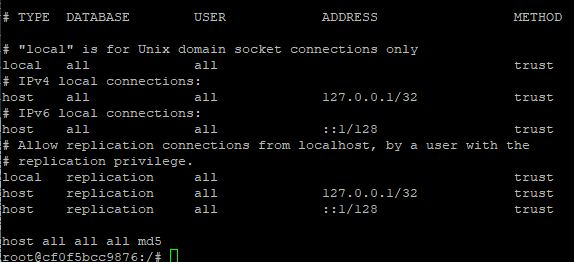
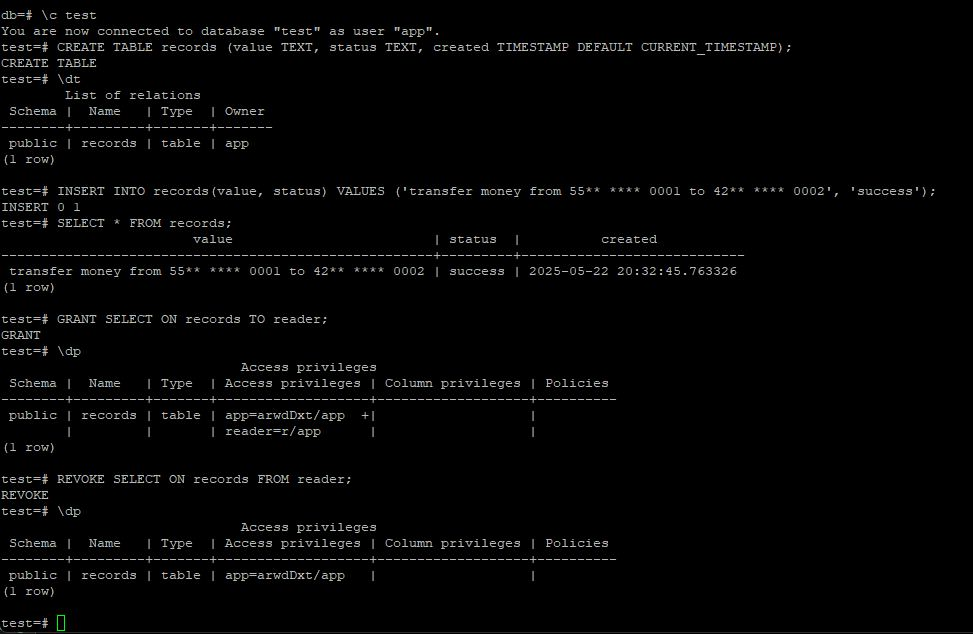
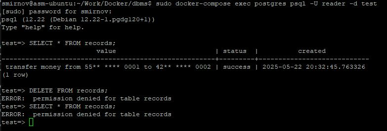

# 8.4. Домашнее задание к занятию «Системы хранения данных (СУБД)». - Андрей Смирнов.

В качестве результата отправьте ответы на вопросы в личном кабинете студента на сайте [netology.ru](https://netology.ru).

## Описание

Эти домашние задания — лабораторные работы, в которых вы по инструкциям выполните действия.

## Задание «PostgreSQL Authentication»

Вы посмотрите, как настроена по умолчанию аутентификация в Docker образе PostgreSQL v12.

В качестве целевой конфигурации используйте файл `docker-compose.yml`:

```yaml
version: '3.7'
services:
  postgres:
    image: postgres:12
    ports:
      - 5432:5432
    environment:
      - POSTGRES_DB=db
      - POSTGRES_USER=app
      - POSTGRES_PASSWORD=pass
```

### Этапы выполнения

Изучите разделы документации, касающиеся [аутентификации пользователей PostgreSQL v12](https://postgrespro.ru/docs/postgrespro/12/client-authentication):
1. [Файл pg_hba.conf](https://postgrespro.ru/docs/postgrespro/12/auth-pg-hba-conf).
2. [Аутентификация Trust](https://postgrespro.ru/docs/postgrespro/12/auth-trust).
3. [Аутентификация Password](https://postgrespro.ru/docs/postgrespro/12/auth-password).

**Важно**. Все команды нужно выполнять в каталоге, в котором расположен ваш файл `docker-compose.yml`.
   
Используйте информацию для запуска контейнера и подключения к нему:
1. Запустите контейнер командой `docker-compose up`.
2. Для помещения shell (bash) в контейнер используйте команду `docker-compose exec postgres /bin/bash`.
3. Для получения доступа к psql (оболочке выполнения запросов) используйте команду `docker-compose exec postgres psql -U app -d db`. От имени пользователя app подключайтесь к базе db.

#### Часть 1. Настройки по умолчанию.

Изучите файл `/var/lib/postgresql/data/pg_hba.conf` и ответьте на вопросы, используя команду получения shell.
1. Какие методы аутентификации используются для подключения по TCP/IP с адресов 127.0.0.1/32 и ::1/128?
2. Какие методы аутентификации используются для подключения по TCP/IP со всех остальных адресов, кроме указанных в предыдущем пункте по протоколу?

Изучите настройки ролей, хранящихся в БД и ответьте на вопросы.
1. Верно ли утверждение: пароль роли `app` хранится в виде `функция_хеширования password` (пароль хранится в поле `rolpassword`)? Если неверно, то дайте описание алгоритма, который используется для хранения хеша.
2. Какое значение имеют поля `rolsuper`, `rolcreaterole`, `rolcreatedb`, `rolbypassrls` с указанием назначения данных столбцов? `t` будет означать «да», `f` — «нет». См. https://postgrespro.ru/docs/postgresql/12/catalog-pg-authid. 

Используйте команду получения psql, в котором выполните команду `select * from pg_authid;`:
```postgresql
db=# select * from pg_authid;
 oid  |          rolname          | rolsuper | rolinherit | rolcreaterole | rolcreatedb | rolcanlogin | rolreplication | rolbypassrls | rolconnlimit |             rolpassword             | rolvaliduntil 
------+---------------------------+----------+------------+---------------+-------------+-------------+----------------+--------------+--------------+-------------------------------------+---------------
 3373 | pg_monitor                | f        | t          | f             | f           | f           | f              | f            |           -1 |                                     | 
 3374 | pg_read_all_settings      | f        | t          | f             | f           | f           | f              | f            |           -1 |                                     | 
 3375 | pg_read_all_stats         | f        | t          | f             | f           | f           | f              | f            |           -1 |                                     | 
 3377 | pg_stat_scan_tables       | f        | t          | f             | f           | f           | f              | f            |           -1 |                                     | 
 4569 | pg_read_server_files      | f        | t          | f             | f           | f           | f              | f            |           -1 |                                     | 
 4570 | pg_write_server_files     | f        | t          | f             | f           | f           | f              | f            |           -1 |                                     | 
 4571 | pg_execute_server_program | f        | t          | f             | f           | f           | f              | f            |           -1 |                                     | 
 4200 | pg_signal_backend         | f        | t          | f             | f           | f           | f              | f            |           -1 |                                     | 
   xx | app                       | x        | x          | x             | x           | x           | x              | x            |            x | xxxxxxxxxxxxxxxxxxxxxxxxxxxxxxxxxxx | xxxxxxxxxxxxx
(9 rows)
```

#### Часть 2. Изменение метода аутентификации.

1. Остановите контейнер, нажав `Ctrl + C` в консоли, в которой у вас была запущена команда `docker-compose up`.
2. Изучите [документацию на образ Docker](https://hub.docker.com/_/postgres) и измените метод аутентификации на `reject`. Вам понадобится отредактировать `docker-compose.yml`.
3. Удалите существующий контейнер, запустив команду `docker-compose rm`. 
4. Запустите новый контейнер, выполнив команду `docker-compose up`.
5. Подключитесь с помощью `psql` и выполните команду `select * from pg_authid;`.

Ответьте на вопрос: почему значения полей `rolcanlogin` и `rolpassword` для роли `app` не изменились, и вы по-прежнему можете подключиться с помощью `psql` без указания пароля, хотя в `pg_hba.conf` для `host all all all` указано `reject`?

<details>
<summary>Подсказка.</summary>

Подумайте о том, что:
1. Вы запускаете `psql`, который расположен внутри контейнера.
2. `pg_hba.conf` обрабатывается сверху вниз до первого совпадения.
</details>

### Результаты выполнения задания

Пришлите в личном кабинете студента ответы на вопросы, указанные в разделе **«Выполнение»**:
1. Какие методы аутентификации используются для подключения по TCP/IP с адресов 127.0.0.1/32 и ::1/128?
2. Какие методы аутентификации используются для подключения по TCP/IP со всех остальных адресов, кроме указанных в предыдущем пункте по протоколу?
3. Верно ли утверждение: пароль роли `app` хранится в виде `функция_хеширования password` (пароль хранится в поле `rolpassword`)? Если не верно, то приведите описание алгоритма, который используется для хранения хеша.
4. Какое значение имеют поля `rolsuper`, `rolcreaterole`, `rolcreatedb`, `rolbypassrls` с указанием назначения данных столбцов? `t` будет означать «да», `f` — «нет». См. https://postgrespro.ru/docs/postgresql/12/catalog-pg-authid.
5. Почему значения полей `rolcanlogin` и `rolpassword` для роли `app` не изменились, и вы по-прежнему можете подключиться с помощью `psql` без указания пароля, хотя в `pg_hba.conf` для `host all all all` указано `reject`?


----


### Ответ:

Содержимое файла `/var/lib/postgresql/data/pg_hba.conf`:




Настройки ролей (результат выполнения команды `select * from pg_authid;`):


1. Для подключения по TCP/IP с адресов 127.0.0.1/32 и ::1/128 используется метод аутентификации trust (доверительная аутентификация), т.е. подключения с localhost (как IPv4, так и IPv6) не требуют пароля и автоматически считаются доверенными.

2. Для подключений с любых других адресов (не 127.0.0.1/32 или ::1/128) требуется аутентификация по паролю, переданному в хешированном виде с использованием алгоритма MD5.

3. Данное утверждение неверно. Помимо пароля там фигурирует имя пользователя. Т.е. формат записи следующий `функция хеширования+хэш(пароль+логин)`. Т.е. в данном случае `md5+MD5(pass+app)`.

4. Для роли `app` все эти поля имеют значение `t`, т.е. `true`, что означает наличие соответствующих прав. Для остальных ролей - `f`, т.е. `false`, что означает отсутствие соответствующих прав.

5. Для изменения метода аутентификации на `reject` я добавил строчку `- POSTGRES_HOST_AUTH_METHOD=reject`, т.е. `docker-compose.yml` приобрел следующий вид:

```yaml
version: '3.7'
services:
  postgres:
    image: postgres:12
    ports:
      - 5432:5432
    environment:
      - POSTGRES_HOST_AUTH_METHOD=reject
      - POSTGRES_DB=db
      - POSTGRES_USER=app
      - POSTGRES_PASSWORD=pass
```

Содержимое файла `/var/lib/postgresql/data/pg_hba.conf` изменилось, вместо `host all all all md5` теперь `host all all all reject`:


Однако настройки ролей остались те же:


Значения полей `rolcanlogin` и `rolpassword` для роли `app` не изменились и подключение проходит, поскольку в `pg_hba.conf` раньше отрабатывает (находится выше) строка выделенная желтым, которая разрешает подключение без пароля с локальных адресов, т.е. в том числе и для нас, так как подключения выполняется из контейнера.  

----


## Задание «CIS PostgreSQL Benchmarks»

Изучите [CIS Benchmarks](https://www.cisecurity.org/cis-benchmarks/) на СУБД PostgreSQL v12, а именно `Ensure login via "host" TCP/IP Socket is configured correctly`.

Пришлите в личном кабинете студента ответы на вопросы.
1. Какие методы **не рекомендуется** использовать для удалённых подключений?
2. Какие методы **рекомендуется** использовать для удалённых подключений?


----


### Ответ:


1. Для удалённых подключений не рекомендуется использовать медоты `trust`(подключение без пароля), `password`(пароль при передаче не шифруется) и `md5`(устаревший хеш MD5 уязвим к brute-force).

2. Для удалённых подключений рекомендуется использовать медоты `scram-sha-256`(устойчивый к перебору алгоритм) и `cert` (аутентификация по SSL-сертификатам).


----


## Задание «PostgreSQL ПРД»

Вы изучите механизмы управления пользователями и ПРД, реализованные в СУБД PostgreSQL.

Как целевую конфигурацию используйте файл `docker-compose.yml`:

```yaml
version: '3.7'
services:
  postgres:
    image: postgres:12
    ports:
      - 5432:5432
    environment:
      - POSTGRES_DB=db
      - POSTGRES_USER=app
      - POSTGRES_PASSWORD=pass
```

### Этапы выполнения

Изучите разделы документации по управлению пользователями и ПРД:
1. [Роли](https://postgrespro.ru/docs/postgresql/12/user-manag).
2. [Система прав](https://postgrespro.ru/docs/postgresql/12/ddl-priv).

**Важно**. Все команды нужно выполнять в каталоге, в котором расположен ваш файл `docker-compose.yml`.

Используйте информацию для запуска контейнера и подключения к нему:
1. Запустите контейнер командой `docker-compose up`.
2. Для получения shell (bash) в контейнер используйте команду `docker-compose exec postgres /bin/bash`.
3. Для получения доступа к psql (оболочке выполнения запросов) используйте команду `docker-compose exec postgres psql -U app -d db`. От имени пользователя app подключайтесь к базе db.

PostgreSQL хранит информацию о ролях и ПРД в системной базе данных. Дальше вы будете использовать ключевые слова SQL:
* `CREATE` — создание;
* `DROP` — изменение;
* `SELECT` — выборка данных;
* `INSERT` — вставка данных;
* `DELETE` — удаление данных;
* `GRANT` — предоставление прав;
* `REVOKE` — отзыв прав.

В простом случае есть разделение на структуры, вроде БД, или таблицы и данные, вроде строк в таблице. БД и таблицы создаются или удаляются с помощью запросов `CREATE` или `DROP`, а вот данные можно вставлять или удалять с помощью запросов `INSERT` или `DELETE`.

Так как сама СУБД хранит информацию о структурах в системных БД, то запросы типа `CREATE` или `DROP` находят своё отражение в виде строк в таблицах системных БД.

#### Часть 1. Подготовка данных.

В оболочке psql выполните команды:
1\. `SELECT * FROM pg_roles;` — отображает существующие в системе роли.

```postgresql
db=# SELECT * FROM pg_roles;
          rolname          | rolsuper | rolinherit | rolcreaterole | rolcreatedb | rolcanlogin | rolreplication | rolconnlimit | rolpassword | rolvaliduntil | rolbypassrls | rolconfig | oid  
---------------------------+----------+------------+---------------+-------------+-------------+----------------+--------------+-------------+---------------+--------------+-----------+------
 pg_signal_backend         | f        | t          | f             | f           | f           | f              |           -1 | ********    |               | f            |           | 4200
 pg_read_server_files      | f        | t          | f             | f           | f           | f              |           -1 | ********    |               | f            |           | 4569
 app                       | t        | t          | t             | t           | t           | t              |           -1 | ********    |               | t            |           |   10
 pg_write_server_files     | f        | t          | f             | f           | f           | f              |           -1 | ********    |               | f            |           | 4570
 pg_execute_server_program | f        | t          | f             | f           | f           | f              |           -1 | ********    |               | f            |           | 4571
 pg_read_all_stats         | f        | t          | f             | f           | f           | f              |           -1 | ********    |               | f            |           | 3375
 pg_monitor                | f        | t          | f             | f           | f           | f              |           -1 | ********    |               | f            |           | 3373
 pg_read_all_settings      | f        | t          | f             | f           | f           | f              |           -1 | ********    |               | f            |           | 3374
 pg_stat_scan_tables       | f        | t          | f             | f           | f           | f              |           -1 | ********    |               | f            |           | 3377
(9 rows)
```

2\. Создайте новую роль `reader` с правом входа `CREATE ROLE reader LOGIN PASSWORD 'secret';`.

```postgresql

db=# CREATE ROLE reader LOGIN PASSWORD 'secret';
CREATE ROLE
db=# SELECT * FROM pg_roles;
          rolname          | rolsuper | rolinherit | rolcreaterole | rolcreatedb | rolcanlogin | rolreplication | rolconnlimit | rolpassword | rolvaliduntil | rolbypassrls | rolconfig |  oid  
---------------------------+----------+------------+---------------+-------------+-------------+----------------+--------------+-------------+---------------+--------------+-----------+-------
 pg_signal_backend         | f        | t          | f             | f           | f           | f              |           -1 | ********    |               | f            |           |  4200
 pg_read_server_files      | f        | t          | f             | f           | f           | f              |           -1 | ********    |               | f            |           |  4569
 app                       | t        | t          | t             | t           | t           | t              |           -1 | ********    |               | t            |           |    10
 pg_write_server_files     | f        | t          | f             | f           | f           | f              |           -1 | ********    |               | f            |           |  4570
 pg_execute_server_program | f        | t          | f             | f           | f           | f              |           -1 | ********    |               | f            |           |  4571
 pg_read_all_stats         | f        | t          | f             | f           | f           | f              |           -1 | ********    |               | f            |           |  3375
 pg_monitor                | f        | t          | f             | f           | f           | f              |           -1 | ********    |               | f            |           |  3373
 pg_read_all_settings      | f        | t          | f             | f           | f           | f              |           -1 | ********    |               | f            |           |  3374
 pg_stat_scan_tables       | f        | t          | f             | f           | f           | f              |           -1 | ********    |               | f            |           |  3377
 reader                    | f        | t          | f             | f           | t           | f              |           -1 | ********    |               | f            |           | 16385
(10 rows)
```

3\. Проверьте существующие базы данных и их владельцев `SELECT * FROM pg_database;`.

```postgresql
db=# SELECT * FROM pg_database;
  oid  |  datname  | datdba | encoding | datcollate |  datctype  | datistemplate | datallowconn | datconnlimit | datlastsysoid | datfrozenxid | datminmxid | dattablespace |        datacl        
-------+-----------+--------+----------+------------+------------+---------------+--------------+--------------+---------------+--------------+------------+---------------+----------------------
 13408 | postgres  |     10 |        6 | en_US.utf8 | en_US.utf8 | f             | t            |           -1 |         13407 |          480 |          1 |          1663 | 
 16384 | db        |     10 |        6 | en_US.utf8 | en_US.utf8 | f             | t            |           -1 |         13407 |          480 |          1 |          1663 | 
     1 | template1 |     10 |        6 | en_US.utf8 | en_US.utf8 | t             | t            |           -1 |         13407 |          480 |          1 |          1663 | {=c/app,app=CTc/app}
 13407 | template0 |     10 |        6 | en_US.utf8 | en_US.utf8 | t             | f            |           -1 |         13407 |          480 |          1 |          1663 | {=c/app,app=CTc/app}
(4 rows)
```

Поле `datdba` содержит `oid` роли-владельца БД. В нашем случае — `app`.

<details>
<summary>Более удобные команды оболочки psql.</summary>

Оболочка psql содержит встроенные команды, содержащие упрощённый и более удобный вывод.
```postgresql
db=# \l
List of databases
   Name    | Owner | Encoding |  Collate   |   Ctype    | Access privileges 
-----------+-------+----------+------------+------------+-------------------
 db        | app   | UTF8     | en_US.utf8 | en_US.utf8 | 
 postgres  | app   | UTF8     | en_US.utf8 | en_US.utf8 | 
 template0 | app   | UTF8     | en_US.utf8 | en_US.utf8 | =c/app           +
           |       |          |            |            | app=CTc/app
 template1 | app   | UTF8     | en_US.utf8 | en_US.utf8 | =c/app           +
           |       |          |            |            | app=CTc/app
(4 rows)

db=# \du
List of roles
 Role name |                         Attributes                         | Member of 
-----------+------------------------------------------------------------+-----------
 app       | Superuser, Create role, Create DB, Replication, Bypass RLS | {}
 reader    |                                                            | {}
```
</details>

4\. Создайте тестовую базу данных `test` `CREATE DATABASE test;`.

```postgresql
db=# CREATE DATABASE test;
CREATE DATABASE

db=# \l
List of databases
   Name    | Owner | Encoding |  Collate   |   Ctype    | Access privileges 
-----------+-------+----------+------------+------------+-------------------
 db        | app   | UTF8     | en_US.utf8 | en_US.utf8 | 
 postgres  | app   | UTF8     | en_US.utf8 | en_US.utf8 | 
 template0 | app   | UTF8     | en_US.utf8 | en_US.utf8 | =c/app           +
           |       |          |            |            | app=CTc/app
 template1 | app   | UTF8     | en_US.utf8 | en_US.utf8 | =c/app           +
           |       |          |            |            | app=CTc/app
 test      | app   | UTF8     | en_US.utf8 | en_US.utf8 | 
(5 rows)
```

5\. Подключитесь к созданной БД для создания таблиц в ней.
```postgresql
db=# \c test
You are now connected to database "test" as user "app".
```

После этого строка приглашения сменится с `db=#` на `test=#`, т. е. отображается БД, к которой вы подключены в данный момент.

6\. Создайте таблицу `records` в вашей тестовой БД `CREATE TABLE records (value TEXT, status TEXT, created TIMESTAMP DEFAULT CURRENT_TIMESTAMP);`.
```postgresql
test=# CREATE TABLE records (value TEXT, status TEXT, created TIMESTAMP DEFAULT CURRENT_TIMESTAMP);
CREATE TABLE
test=# \dt
        List of relations
 Schema |  Name   | Type  | Owner 
--------+---------+-------+-------
 public | records | table | app
(1 row)
```

Команда `\dt` показывает таблицы, существующие в той БД, к которой вы подключены.

С помощью SQL это можно сделать так (будут выведены все таблицы):
```postgresql
test=# select * from pg_tables;
     schemaname     |        tablename        | tableowner | tablespace | hasindexes | hasrules | hastriggers | rowsecurity 
--------------------+-------------------------+------------+------------+------------+----------+-------------+-------------
 public             | records                 | app        |            | f          | f        | f           | f
 pg_catalog         | pg_statistic            | app        |            | t          | f        | f           | f
 ...                | ...                     | ...        |            | ...        | ...      | ...         | ...
```

7\. Вставьте запись в таблицу `INSERT INTO records(value, status) VALUES ('transfer money from 55** **** 0001 to 42** **** 0002', 'success');`.

```postgresql
test=# INSERT INTO records(value, status) VALUES ('transfer money from 55** **** 0001 to 42** **** 0002', 'success');
INSERT 0 1
  
test=# SELECT * FROM records;                                                                                       
                        value                         | status  |          created           
------------------------------------------------------+---------+----------------------------
 transfer money from 55** **** 0001 to 42** **** 0002 | success | 2021-01-25 07:08:41.966631
(1 row)
```

8\. Дайте роли `reader` права на чтение содержимого таблицы `records` `GRANT SELECT ON records TO reader;`.
```postgresql
test=# GRANT SELECT ON records TO reader;
GRANT
```

9\. Посмотрите предоставленные права (команда `\dp`).
```postgresql
test-# \dp
                              Access privileges
 Schema |  Name   | Type  | Access privileges | Column privileges | Policies 
--------+---------+-------+-------------------+-------------------+----------
 public | records | table | app=arwdDxt/app  +|                   | 
        |         |       | reader=r/app      |                   | 
(1 row)
```

#### Часть 2. Проверка ПРД.

**Важно**. Откройте новую консоль, то есть окно терминала, в каталоге с файлом `docker-compose.yml` и все команды выполняйте там:

1\. Получите psql для пользователя `reader`: `docker-compose exec postgres psql -U reader -d test`.

2\. Выполните запрос на чтение.
```postgresql
test=> SELECT * FROM records;
                        value                         | status  |          created           
------------------------------------------------------+---------+----------------------------
 transfer money from 55** **** 0001 to 42** **** 0002 | success | 2021-01-25 07:08:41.966631
(1 row)
```

3\. Проверьте, что остальные действия запрещены.
```postgresql
test=> DELETE FROM records;
ERROR:  ???
```

4\. Заберите у роли `reader` права на чтение. Нужно выполнять в первой консоли от имени пользователя `app`.
```postgresql
test=# REVOKE SELECT ON records FROM reader;
REVOKE

test=# \dp
Access privileges
 Schema |  Name   | Type  | Access privileges | Column privileges | Policies 
--------+---------+-------+-------------------+-------------------+----------
 public | records | table | app=arwdDxt/app   |                   | 
(1 row)
```

5\. Выполните запрос на чтение аналогично п. 2 от имени пользователя `reader`.
```postgresql
test=> SELECT * FROM records;
ERROR:  ???
```

### Результаты выполнения задания

Отправьте в личном кабинете студента сообщение, которое отображается вместо `???` в результате выполнения запросов с недостаточными правами доступа: `ERROR:  ???`.


----


### Ответ:


Результат подготовительного этапа в первой конcоли:




Результат выполнения команд во второй конcоли:




Мы получаем ошибку `ERROR:  permission denied for table records`, т.е. искомое сообщение: `permission denied for table records`. это логично, поскольку мы отобрали права на чтение у пользователя `reader`.


----


## Дополнительные материалы

К этим материалам вы вернётесь во время обучения курса, но уже сейчас можете их почитать:
1. [Row-Level Security](https://postgrespro.ru/docs/postgresql/12/ddl-rowsecurity).
12. [Шифрование данных](https://postgrespro.ru/docs/postgresql/12/encryption-options).
