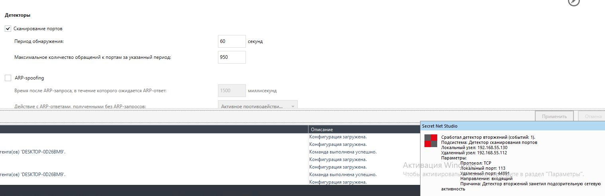
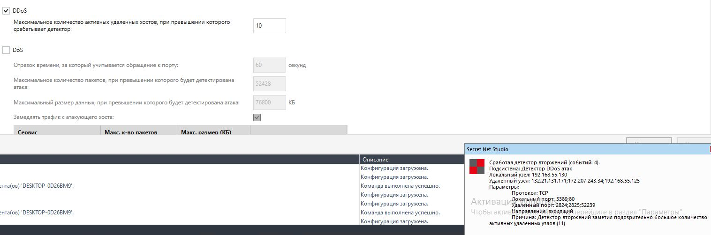
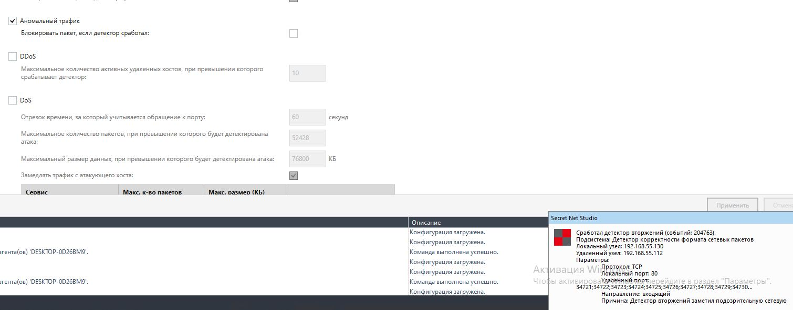

# 9.3. Домашнее задание к занятию «IDS/IPS». - Андрей Смирнов.

## Цель задания

Настройка IDS/IPS требует определённых навыков и умений. Недостаточно просто включить IDS/IPS, они требуют тонкой настройки. В ходе выполнения задания вы научитесь подбирать оптимальные настройки, используя различные техники сканирования (атак).

В результате выполнения этого задания вы научитесь:

1. проводить сканирование (атаки) хоста,
2. настраивать параметры IDS/IPS таким образом, чтобы они предотвращали вторжения.

------

## Чек-лист готовности к домашнему заданию

1. Изучены материалы лекции «IDS/IPS» с личном кабинете.
2. Установлена виртуальная машина Windows 10 с Secret Net Studio.
3. Установлена виртуальная машина Kali Linux.
4. На виртуальных машинах настроены сетевые интерфейсы так, чтобы они могли пинговать друг друга.

------

## Инструменты и дополнительные материалы, которые пригодятся для выполнения задания

1. Виртуальная машина Windows 10 с Secret Net Studio (из [задания «СЗИ от несанкционированного доступа»](https://github.com/netology-code/ibszi-homeworks/tree/main/02)).
2. Виртуальная машина Kali Linux ([ссылка на инструкцию по установке](https://help.reg.ru/support/vydelennyye-servery-i-dc/vmware-virtualnyy-data-tsentr/sozdaniye-i-nastroyka-virtualnykh-mashin/kak-ustanovit-kali-linux-na-virtualbox)).

------

## Инструкция к заданию

### Описание задачи

Вы - специалист по ИБ. Руководство компании приняло решение свести к минимуму возможные атаки на компьютер руководителя. Перед вами поставлена задача по настройке IDS/IPS Secret Net Studio.

Для того, чтобы выполнить эту задачу, вам необходимо подобрать оптимальные параметры, при которых IDS/IPS будет предотвращать вторжения на компьютер руководителя.

ВНИМАНИЕ! После каждого изменения параметров не забывайте нажимать кнопку «Применить», иначе настройки не активизируются.
Перед выполнением задания обязательно снимите галочку «Блокировка атакующего хоста при обнаружении атак». Это необходимо только в учебных целях, чтобы не ждать разблокировки.

### Задание 1. Сканирование портов

Для сканирования портов используйте Kali Linux, а именно – команду `sudo nmap <ip-адрес компьютера руководителя>`.
При сканировании выполните следующие действия.

1. В настройках «Обнаружение вторжений» в разделе «Детекторы» включите «Сканирование портов».
2. Период обнаружения оставьте без изменений - 60 секунд.
3. Подберите оптимальное значение «Максимальное количество обращений к портам за указанный период», при котором происходит предотвращение вторжения. Используйте шаг в 50. Например, при значении «100» СЗИ предотвращает вторжение, а уже при «150» - не срабатывает.

В качестве ответа пришлите значение, при котором начинает срабатывать IDS/IPS Secret Net Studio.

----

### Ответ:

Опытным путем удалось установить, что при значении максимального обращения к портам в «950» СЗИ обнаруживает вторжение, а уже при «1000» - не срабатывает.

----

### Задание 2. DDoS

Для DDoS-атаки используйте Kali Linux, а именно – команду `sudo hping3 -S -p 80 --rand-source <ip-адрес компьютера руководителя>`.
Эта команда имитирует отправку SYN-пакетов на 80 порт с нескольких хостов. Выполните следующие действия.

1. В настройках «Обнаружение вторжений» в разделе «Детекторы» выключите «Сканирование портов» и включите «DDoS».
2. Подберите оптимальное значение «Максимальное количество активных удаленных хостов, при превышении которого срабатывает детектор», при котором происходит предотвращение вторжения. Используйте шаг в 2. Например, при значении «30» СЗИ предотвращает вторжение, а при «32» – не срабатывает.

В качестве ответа пришлите значение, при котором начинает срабатывать IDS/IPS Secret Net Studio.

----

### Ответ:

Опытным путем удалось установить, что при значении максимального количества удаленных хостов «10» СЗИ обнаруживает вторжение, а уже при «12» - не срабатывает.

----

### Задание 3. Аномальный трафик* (необязательное задание, не влияет на получение зачёта)

1. В настройках «Обнаружение вторжений» в разделе «Детекторы» выключите «DDoS» и включите «Аномальный трафик».
2. Самостоятельно изучите информацию о возможностях инструмента `hping3` и подберите команду, при которой сработает IDS/IPS Secret Net Studio.

В качестве ответа пришлите команду, при которой срабатывает IDS/IPS Secret Net Studio.

----

### Ответ:

Я попробовал выполнить TCP-флуд с флагами FIN(принудительное закрытие соединения)/RST(сброс соединения) на 80 порт, итоговая команда имеет вид `hping3 -F -R -p 80 --flood 192.168.55.130` (где 192.168.55.130 - адрес атакуемого хоста). Детектор аномального трафика СЗИ успешно среагировал на данную атаку:

------
