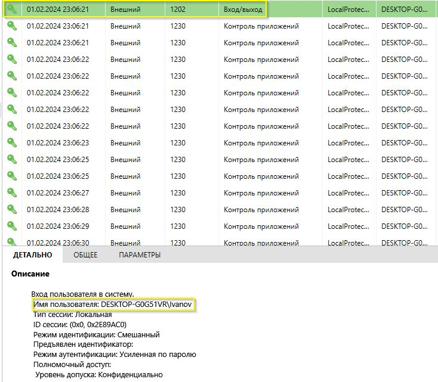
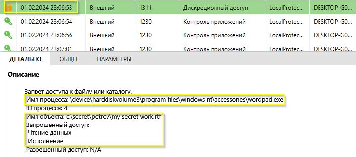
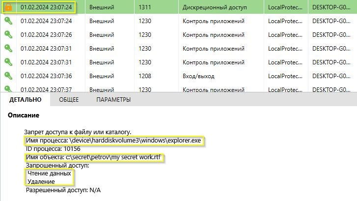
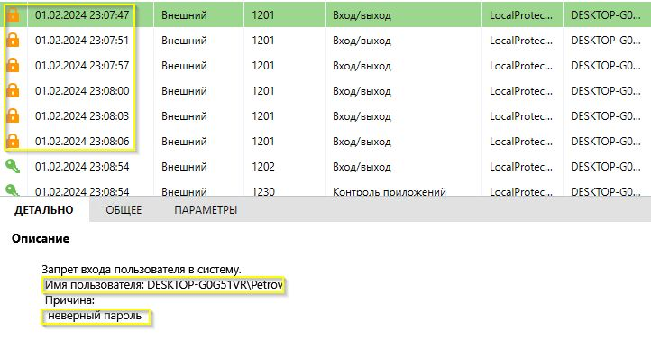
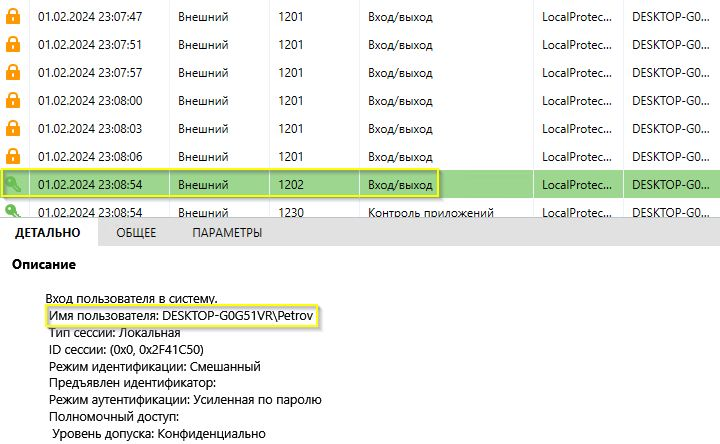
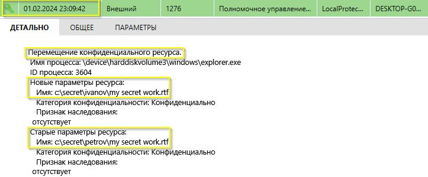

# 9.4. Домашнее задание к занятию «SIEM». - Андрей Смирнов.

## Цель задания

SIEM позволяет расследовать компьютерные инциденты и восстанавливать картину инцидента. Эти приёмы часто используются в компьютерной криминалистике. Вам предстоит восстановить картину компьютерного инцидента, используя выгруженный журнал SIEM.

В результате выполнения этого задания вы научитесь:

1. анализировать журнал SIEM,
2. восстанавливать картину компьютерного инцидента.

------

## Чек-лист готовности к домашнему заданию

1. Изучены материалы лекции «SIEM» с личном кабинете.
2. Установлена виртуальная машина Windows 10 с Secret Net Studio.
3. Загружен журнал SIEM. _Журнал доступен в личном кабинете в материалах к этому занятию_ -"Инструменты и дополнительные материалы, которые пригодятся для выполнения домашнего задания".

------

## Инструменты и дополнительные материалы, которые пригодятся для выполнения задания

1. Виртуальная машина Windows 10 с Secret Net Studio (из [задания «СЗИ от несанкционированного доступа»](https://github.com/netology-code/ibszi-homeworks/tree/main/02)).

------

## Инструкция к заданию

### Описание задачи

Вы работаете специалистом по ИБ в научно-исследовательском институте.

К руководству НИИ обратился научный сотрудник Петров и пожаловался, что старший научный сотрудник Иванов похитил у него рационализаторское предложение. Рационализаторское предложение было готово к распечатке и хранилось в папке на компьютере Петрова - `C:\Secret\Petrov`. 

Иванов всё отрицает и говорит, что это рационализаторское предложение сделал он сам на своём компьютере в своей папке - `C:\Secret\Ivanov`.

В ходе предварительного расследования установлено, что Иванов мог украсть файл 1 февраля 2024 года, когда Петров не вышел на работу по причине болезни. Иванов и Петров работают в одном кабинете, других сотрудников в этом кабинете нет. Иванов и Петров работают за одним компьютером под личными учётными записями `Petrov` и `Ivanov`. 

По камерам наблюдения установлено, что 1 февраля 2024 года в кабинете находился только Иванов. Никто из других сотрудников в этот день в кабинет не заходил. Также Петров рассказал, что примерно месяц назад сообщил Иванову пароль от своей учётной записи. Тогда ему срочно понадобилось распечатать отчёт, который находился в папке Петрова. Иванов подтвердил, что Петров когда-то говорил пароль, но заявил, что давно забыл его.

Руководство поставило вам задачу разобраться в ситуации, проанализировав журнал SIEM компьютера.

  
 Подсказка, как открыть журнал

  

### Задание

Проанализируйте журнал SIEM и восстановите картину инцидента.

Ответьте на следующие вопросы.
1. Работал ли за компьютером Иванов в день инцидента?
2. Пытался ли Иванов скопировать какие-то файлы из личной папки Петрова? Если да, то какие?
3. Пытался ли Иванов войти в учётную запись Петрова?
4. Если пытался, то удалось ли ему это сделать?
5. И главный вопрос - действительно ли Иванов украл рационализаторское предложение?

Расскажите про инцидент своими словами, приложив скриншоты, подтверждающие вашу теорию.

----

### Ответ:

1. Да, Иванов работал за компьютером. 01.02.2024 в 23:06:21 зафиксирован его вход в систему.

2. Иванов пытался открыть в редакторе wordpad и переместить в приложении explorer файл `my secret work.rtf` из папки Петрова `c:\secret\petrov\my secret work.rtf`.

3. Да, Иванов пытался войти в учётную запись Петрова. Зафиксировано сначало 6 неудачных попыток (неверный пароль) и потом 1 успешная. 

4. Да, Иванову удалось войти в систему с 7мой попытки. Скриншоты представлены в предыдущем ответе.

5. Если рационализаторское предложение Петрова хранилось в файле `c:\secret\petrov\my secret work.rtf`, то - да. В журнале зафиксирован факт перемещения данного файла в папку Иванова.

Таким образом, Иванов 01.02.2024 сначала пытался получить доступ к документу `my secret work.rtf` из папки Петрова `c:\secret\petrov\my secret work.rtf` под своей учетной записью и потерпел неудачу. Затем попытался войти под учетной записью Петрова и с 7мой попытки ему это удалось. После этого он поместил документ Петрова `c:\secret\petrov\my secret work.rtf` в свою папку, а именно в `c:\secret\ivanov\my secret work.rtf`. Все необходимые скриншоты журнала с доказательствами представлены выше, для удобства ключевые моменты выделил желтым.   

----
