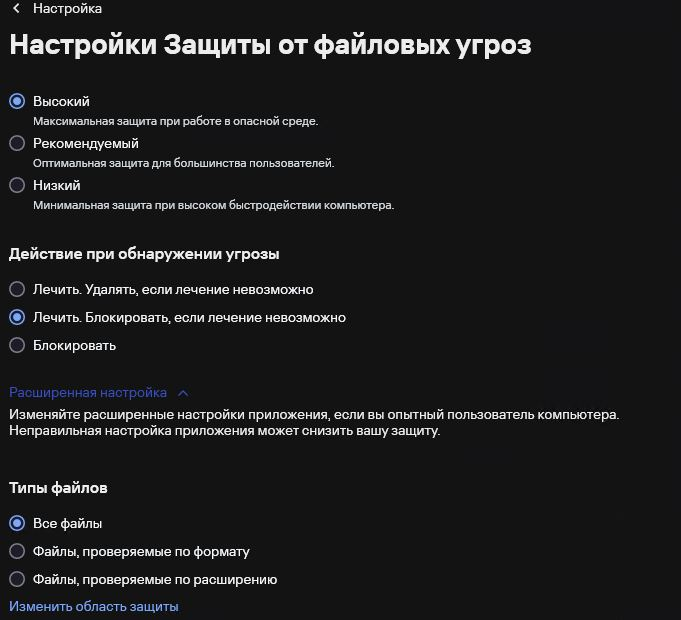
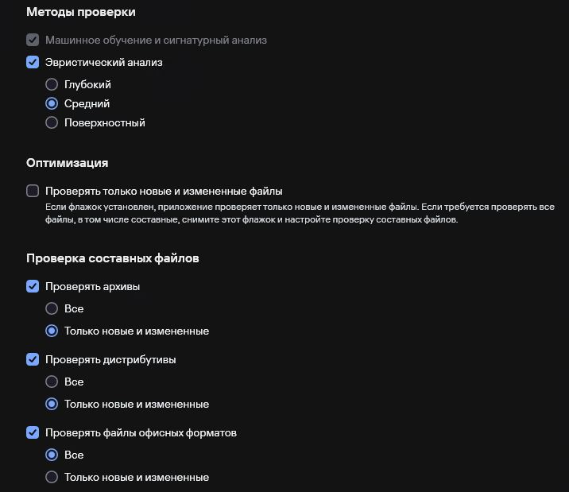
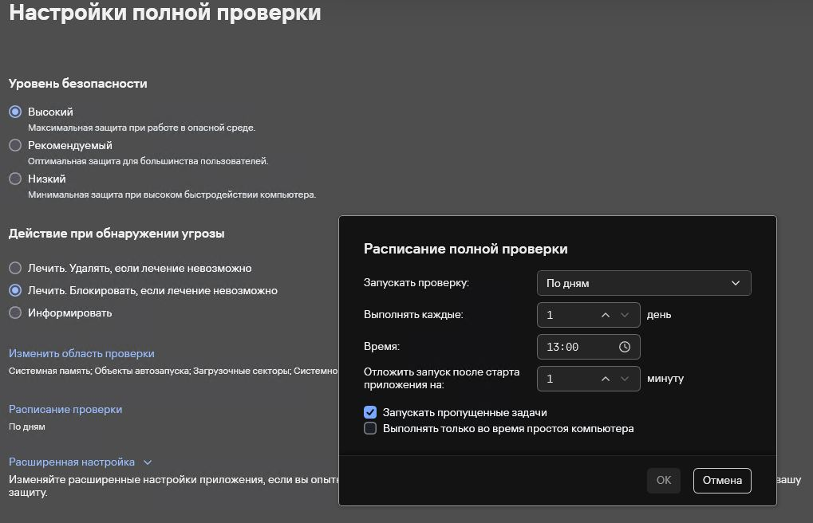
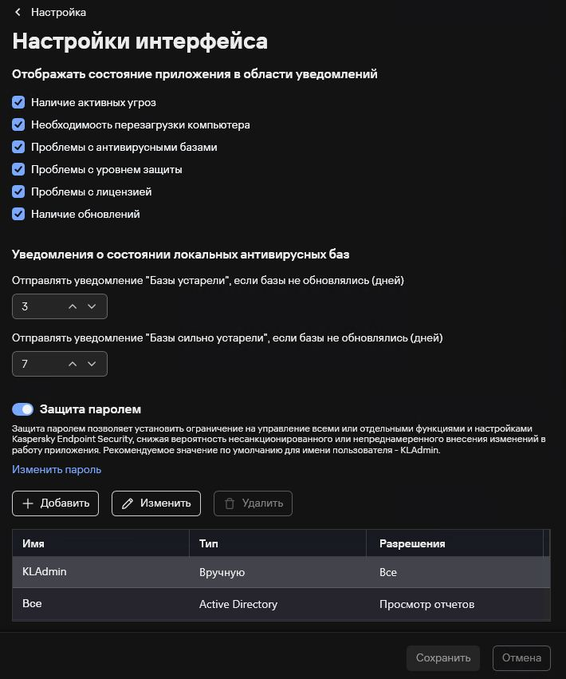

# 9.5. Домашнее задание к занятию «Средства антивирусной защиты». - Андрей Смирнов.

## Цель задания

Kaspersky Endpoint Security – средство антивирусной защиты (САВЗ). Это программное обеспечение часто используют в государственных и коммерческих организациях. При трудоустройстве на должность специалиста по ИБ работодатели оценивают опыт в настройке средств антивирусной защиты. После выполнения задания вы сможете добавить в своё резюме, что имеете практический опыт в установке и настройке средства антивирусной защиты Kaspersky.

В результате выполнения этого задания вы научитесь:

1. устанавливать САВЗ - Kaspersky Endpoint Security,
2. настраивать реакцию САВЗ на обнаруженные вредоносные программы,
3. настраивать периодичность полной проверки компьютера,
4. устанавливать пароль на доступ к настройкам.

------

## Чек-лист готовности к домашнему заданию

1. Изучены материалы лекции «Средства антивирусной защиты»
2. Установлена виртуальная машина Windows 10 (скачать образ для установки можно по [ссылке](https://softcomputers.org/download/distr-windows/download-windows-10/))

------

## Инструкция к заданию

### Описание задачи

Вы являетесь специалистом по ИБ в компании. Руководство компании приняло решение внедрить САВЗ — Kaspersky Endpoint Security. Перед вами поставлена задача по установке и настройке САВЗ.

Для того, чтобы выполнить эту задачу, вам необходимо выполнить следующие шаги.
1. Скачать и установить Kaspersky Endpoint Security.
2. Настроить реакцию САВЗ на обнаруженные вредоносные программы.
3. Установить пароль на доступ к настройкам.
4. Проверить работоспособность САВЗ с использованием тестового вируса.

### Задание 1. Установка Kaspersky Endpoint Security

1. Перейдите по [ссылке](https://www.kaspersky.ru/small-to-medium-business-security/downloads/endpoint) для скачивания.
2. Прокрутите страницу до блока «Kaspersky Endpoint Security для Windows»:

3. Нажмите «Показать версии для загрузки» и нажмите «Скачать»:

4. Запустите скачанный файл на виртуальной машине. Нажмите «Далее»:

5. Нажмите «Распаковать» и дождитесь окончания процесса:

6. Запустите файл установки `setup_kes`:

7. Не меняйте никакие параметры, просто нажимайте «Далее» и «Установить». Дождитесь окончания установки и нажмите «Готово».
8. Откройте «Пуск» и запустите Kaspersky Endpoint Security:

9. Согласитесь участвовать в KSN, нажав «Я согласен»:

----

### Ответ:

----

### Задание 2. Настройка реакции Kaspersky Endpoint Security на обнаруженные вредоносные программы

1. Перейдите в настройки программы:

2. Перейдите в настройку защиты от файловых угроз:

3. Откройте расширенные настройки:

4. Установите следующие настройки.
- Уровень безопасности - Высокий.
- Действия при обнаружении угрозы - Лечить. Блокировать, если лечение невозможно.
- Типы файлов - Все файлы.
- Эвристический анализ - Средний.
- Снимите галочку с «Проверять только новые и изменённые файлы».
- Проверять архивы - Только новые и изменённые.
- Проверять дистрибутивы - Только новые и изменённые.
- Проверять файлы офисных форматов - Все.
- Не распаковывать составные файлы большого размера - Максимальный размер файла 100 МБ.
- Распаковывать составные файлы в фоновом режиме - Минимальный размер файла 10 МБ.
- Режим проверки - При доступе и изменении.
- Технологии проверки оставьте без изменений.

5. Нажмите «Сохранить». Сделайте скриншоты выполненных настроек.

----

### Ответ:

Выполненные настройки:

----

### Задание 3. Настройка периодичности полной проверки компьютера

1. Перейдите в настройки задач:

2. Перейдите в настройки задачи полной проверки:

3. Установите следующие настройки.
- Уровень безопасности - Высокий.
- Действия при обнаружении угрозы - Лечить. Блокировать, если лечение невозможно.
- Расписание проверки - По дням, Выполнять каждые 1, Время 13:00, Запускать пропущенные задачи.

4. Нажмите «Сохранить». Сделайте скриншоты выполненных настроек.

----

### Ответ:

Выполненные настройки:

----

### Задание 4. Установка пароля на доступ к настройкам

1. Вернитесь обратно в настройки и найдите пункт «Интерфейс»:

2. Включите защиту паролем. В качестве имени пользователя используйте `KLAdmin`.
3. Нажмите «Сохранить». Сделайте скриншот, что защита паролем включена.

----

### Ответ:

Выполненные настройки:

----

### Задание 5. Проверка функционирования Kaspersky Endpoint Security
1. Перейдите по [ссылке.](https://support.kaspersky.ru/common/diagnostics/7399)
2. Создайте на рабочем столе тектовый файл и скопируйте в него текст вируса. Сохраните файл и закройте.

3. Попробуйте открыть файл. Kaspersky должен просигнализировать об угрозе.
4. Сделайте скриншот.

----

### Ответ:

Автоматом касперский сработал только после перезагрузки. Поймать всплывающее возле трэя предупреждение касперского не успел, но неудачную попытку открытия файла в блокноте прилагаю: 

----
