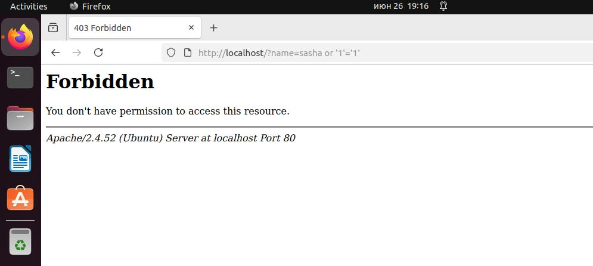

# 9.6. Домашнее задание к занятию «WAF». - Андрей Смирнов.

## Цель задания

WAF позволяет блокировать сетевые атаки на web-приложения. Вам предстоит установить и настроить программный WAF OWASP ModeSecurity.

В результате выполнения этого задания вы научитесь:

1. устанавливать WAF OWASP ModeSecurity,
2. устанавливать базовый набор правил обнаружения сетевых атак WAF OWASP ModeSecurity.

------

## Чек-лист готовности к домашнему заданию

1. Изучены материалы лекции «WAF» в личном кабинете.
2. Установлена виртуальная машина Ubuntu.

------

## Инструменты и дополнительные материалы, которые пригодятся для выполнения задания

Виртуальная машина Ubuntu (скачать можно по [ссылке](https://ubuntu.com/download/desktop)).

------

## Инструкция к заданию

### Описание задачи

Вы работаете в службе ИБ. Руководство поставило задачу установить и настроить программный WAF OWASP ModeSecurity.

### Алгоритм выполнения

1. Обновим индекс пакетов: `sudo apt update`.

2. Установим веб-сервер Apache и пакет wget: `sudo apt install apache2 wget`.

3. Установим ModeSecurity: `sudo apt install libapache2-mod-security2`.

4. Запустим ModeSecurity: `sudo a2enmod security2`.

5. Перзапустим веб-сервер для применения изменений: `sudo systemctl restart apache2`.

6. Перейдём в каталог `/etc/apache2/mods-enabled/`, после чего откроем для редактирования файл `security2.conf`:
- `cd /etc/apache2/mods-enabled/`,
- `sudo nano security2.conf`.

7. Убедимся, что файл содержит следующую строку: `IncludeOptional /etc/modsecurity/*.conf`.

Эта строка описывает, где будут храниться конфигурационные файлы Modsecurity.

8. Перейдём в директорию `/etc/modsecurity/`, после чего файл `modsecurity.conf-recommended` переименуем в `modsecurity.conf`:
- `cd /etc/modsecurity/`,
- `sudo mv modsecurity.conf-recommended modsecurity.conf`.

9. Откроем файл для редактирования: `sudo nano modsecurity.conf`.

10. В файле найдём строку `SecRuleEngine DetectionOnly` и приведем ее к виду `SecRuleEngine On` для того, чтобы WAF не только детектировал, но и блокировал атаки.

Строку `SecAuditLogParts ABDEFHIJZ` приведём к виду `SecAuditLogParts ABCEFHJKZ` (настройка логирования). Сохраним файл - `Crtl+O` и закроем - `Ctrl+X`.

11. Перезапустим веб-сервер, чтобы применить изменения: `sudo systemctl restart apache2`.

12. Перейдём в директорию `/tmp` и загрузим архив с базовым набором правил:
- `cd /tmp/`,
- `wget https://github.com/coreruleset/coreruleset/archive/refs/tags/v3.3.2.tar.gz`.

13. Разархивируем файл: `tar xvf v3.3.2.tar.gz`.

14. Для сохранения файлов CRS создадим каталог `modsecurity-crs`: `sudo mkdir /etc/apache2/modsecurity-crs/`

15. После чего переместим в него содержимое распакованного архива: `sudo mv coreruleset-3.3.2/ /etc/apache2/modsecurity-crs/`.

16. Перейдём в директорию `coreruleset-3.3.2/` и создадим там файл конфигурации CRS с использованием файла-примера:
- `cd /etc/apache2/modsecurity-crs/coreruleset-3.3.2/`,
- `sudo mv crs-setup.conf.example crs-setup.conf`.

17. Откроем для редактирования файл `security2.conf` из директории `/etc/apache2/mods-enabled/`:
- `cd /etc/apache2/mods-enabled/`,
- `sudo nano security2.conf`.

18. В файле найдём и удалим следующую строку `IncludeOptional /usr/share/modsecurity-crs/*.load`.

Вместо удалённой строки напишем:
- `IncludeOptional /etc/apache2/modsecurity-crs/coreruleset-3.3.2/crs-setup.conf`,
- `IncludeOptional /etc/apache2/modsecurity-crs/coreruleset-3.3.2/rules/*.conf`.

Сохраним файл - `Crtl+O` и закроем - `Ctrl+X`.

19. Протестируем конфигурацию веб-сервера: `sudo apache2ctl -t`,

Если всё верно, отобразится Syntax OK:

20. Для применения новых настроек перезапустим веб-сервер: `sudo systemctl restart apache2`.

21. Протестируем работу нашего веб-сервера в обычном режиме, перейдя по адресу в браузере: `http://localhost`:

22. Имитируем SQL-инъекцию: `http://localhost/?name=sasha or '1'='1'`. WAF заблокирует атаку, выдав код `403`.

В качестве ответа пришлите скриншоты работы веб-сервера в обычном режиме и при имитации SQL-инъекции.

----

### Ответ:

Завершение настроек и проверка статуса сервиса apache2:

Скриншот работы веб-сервера в обычном режиме:

Скриншот блокировки при имитации SQL-инъекции:

----